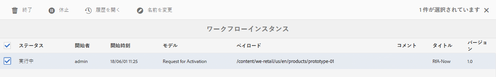
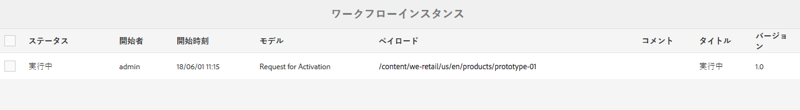
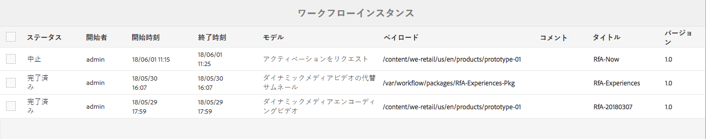
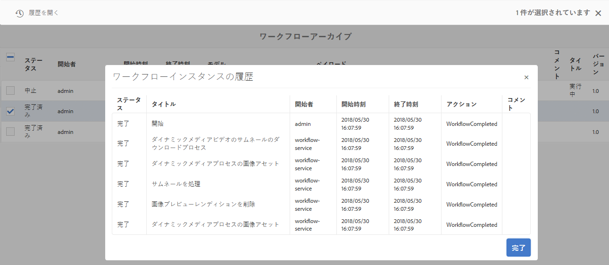
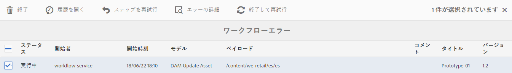

# ワークフローインスタンスの管理{#administering-workflow-instances}

ワークフローコンソールには、ワークフローインスタンスを管理し、それらが想定どおりに実行されていることを確認するための複数のツールが用意されています。

>[!NOTE]
>
>The [JMX console](/help/sites-administering/jmx-console.md#workflow-maintenance) provides additional workflow maintenance operations.

ワークフローの管理用に、次の各種コンソールが用意されています。Use the [global navigation](/help/sites-authoring/basic-handling.md#global-navigation) to open the **Tools** pane, then select **Workflow**:

* **モデル**：ワークフロー定義を管理します
* **インスタンス：**&#x200B;実行中のワークフローインスタンスを表示および管理します
* **ランチャー**：ワークフローの起動方法を確認します
* **アーカイブ**：正常に完了したワークフローの履歴を表示します
* **エラー**：エラーで終了したワークフローの履歴を表示します

## ワークフローインスタンスのステータスの監視 {#monitoring-the-status-of-workflow-instances}

1. Using Navigation select **Tools**, then **Workflow**.
1. 「**インスタンス**」を選択して現在進行中のワークフローインスタンスのリストを表示します。

   

1. 特定の項目を選択し、「**履歴を開く**」で詳細を確認します。

   

## ワークフローインスタンスの休止、再開および終了 {#suspending-resuming-and-terminating-a-workflow-instance}

1. Using Navigation select **Tools**, then **Workflow**.
1. 「**インスタンス**」を選択して現在進行中のワークフローインスタンスのリストを表示します。

   

1. 特定の項目を選択してから、適宜「**終了**」、「**休止**」、または「**再開**」を使用します。この際、確認または詳細（あるいはその両方）を求められます。

   

## アーカイブされたワークフローの表示 {#viewing-archived-workflows}

1. Using Navigation select **Tools**, then **Workflow**.
1. 「**アーカイブ**」を選択して正常に完了したワークフローインスタンスのリストを表示します。

   

   >[!NOTE]
   >
   >中止ステータスはユーザーアクションの結果として発生するので、正常終了と見なされます。例えば、次のような場合が当てはまります。
   >
   >* 「**終了**」アクションが使用された場合
   >* ワークフローの対象となるページが（強制的に）削除された場合、ワークフローは終了します

1. 特定の項目を選択し、「**履歴を開く**」で詳細を確認します。

   

## ワークフローインスタンスのエラーの修正 {#fixing-workflow-instance-failures}

ワークフローが失敗した場合、AEM の&#x200B;**エラー**&#x200B;コンソールを使用してエラーの原因を調べ、特定された原因に応じて適切なアクションを取ることができます。

* **失敗の詳細**：ウィンドウを開き、 
**失敗メッセージ**、 **ステップ** 、 **失敗スタック**。

* **履歴を開く** ワークフローの履歴の詳細を表示します。

* **ステップを再試行** スクリプトステップコンポーネントのインスタンスをもう一度実行します。発生したエラーの原因を修正した後に「ステップを再試行」コマンドを使用します。例えば、プロセスステップが実行するスクリプトのバグを修正した後にステップを再試行します。
* **終了** エラーが原因で解決できない問題がワークフローに発生した場合にワークフローを終了します。例えば、ワークフローインスタンスで無効になった環境条件（リポジトリ内の情報など）にワークフローが依存している可能性がある場合などです。
* **終了して再試行** 元のペイロード、タイトルおよび説明を使用して新しいワークフローインスタンスが開始される点を除き、「**終了**」と同様です。

エラーを調査し、その後ワークフローを再開または停止するには、次のステップに従います。

1. Using Navigation select **Tools**, then **Workflow**.
1. 「**エラー**」を選択して正常に完了しなかったワークフローインスタンスのリストを表示します。
1. 特定の項目を選択し、その後適切なアクションを選択します。

   

## ワークフローインスタンスの定期的なパージ {#regular-purging-of-workflow-instances}

ワークフローインスタンスの数を最小限に抑えるとワークフローエンジンのパフォーマンスが向上します。このため、完了したまたは実行中のワークフローインスタンスをリポジトリから定期的に削除できます。

有効期間とステータスに応じてワークフローインスタンスをパージするように **Adobe Granite のワークフローのパージ設定**&#x200B;を設定します。また、すべてのモデルまたは特定のモデルのワークフローインスタンスをパージすることもできます。

また、様々な条件を満たすワークフローインスタンスをパージするために、サービスの設定を複数作成することもできます。例えば、予想していた時間よりも大幅に実行時間の長い特定のワークフローモデルのインスタンスをパージする設定を作成します。さらに、リポジトリのサイズを最小限に抑えるために、特定の日数が経過した後に完了したワークフローをすべてパージするもう 1 つの設定を作成します。

 サービスを設定するには、[Web コンソール](/help/sites-deploying/configuring-osgi.md#osgi-configuration-with-the-web-console)を使用するか、[リポジトリに OSGi 設定を追加](/help/sites-deploying/configuring-osgi.md#osgi-configuration-in-the-repository)します。次の表では、どちらの方法でも必要になるプロパティについて説明しています。

>[!NOTE]
>
>リポジトリに設定を追加する場合のサービス PID は次のとおりです。
>
>`com.adobe.granite.workflow.purge.Scheduler`
>
>このサービスはファクトリサービスなので、`sling:OsgiConfig` ノードの名前には次のような identifier サフィックスが必要です。
>
>`com.adobe.granite.workflow.purge.Scheduler-myidentifier`

<table>
 <tbody>
  <tr>
   <th>プロパティ名（Web コンソール）</th>
   <th>OSGi のプロパティ名</th>
   <th>説明</th>
  </tr>
  <tr>
   <td>Job Name</td>
   <td>scheduledpurge.name</td>
   <td>スケジュール設定されたパージのわかりやすい名前。</td>
  </tr>
  <tr>
   <td>Workflow Status</td>
   <td>scheduledpurge.workflowStatus</td>
   <td>
パージするワークフローインスタンスのステータス。有効な値は次のとおりです。

    <ul>
     <li>COMPLETED：完了したワークフローインスタンスがパージされます。</li>
     <li>RUNNING：実行中のワークフローインスタンスがパージされます。</li>
    </ul> </td>
  </tr>
  <tr>
   <td>Models To Purge</td>
   <td>scheduledpurge.modelIds</td>
   <td>
パージするワークフローモデルの ID。The ID is the path to the model node, for example:  /conf/global/settings/workflow/models/dam/update_asset/jcr:content/model  Specify no value to purge instances of all workflow models.
 
複数のモデルを指定するには、Web コンソールの + ボタンをクリックします。 
 </td>
  </tr>
  <tr>
   <td>Workflow Age</td>
   <td>scheduledpurge.daysold</td>
   <td>パージするワークフローインスタンスの有効期間（日数）。</td>
  </tr>
 </tbody>
</table>

## インボックスの最大サイズの設定 {#setting-the-maximum-size-of-the-inbox}

You can set the maximum size of the inbox by configuring the **Adobe Granite Workflow Service**, using the [Web Console](/help/sites-deploying/configuring-osgi.md#osgi-configuration-with-the-web-console) or [add an OSGi configuration to the repository](/help/sites-deploying/configuring-osgi.md#osgi-configuration-in-the-repository). 次の表では、どちらの方法でも設定するプロパティについて説明しています。

>[!NOTE]
>
>リポジトリに設定を追加する場合のサービス PID は次のとおりです。
>
>`com.adobe.granite.workflow.core.WorkflowSessionFactory`.

| プロパティ名（Web コンソール） | OSGi のプロパティ名 |
|---|---|
| Max Inbox Query Size | granite.workflow.inboxQuerySize |

