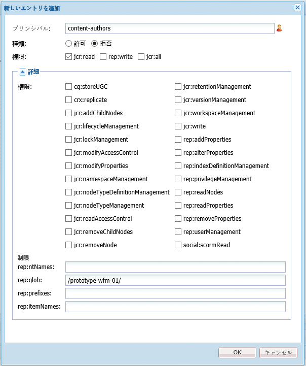
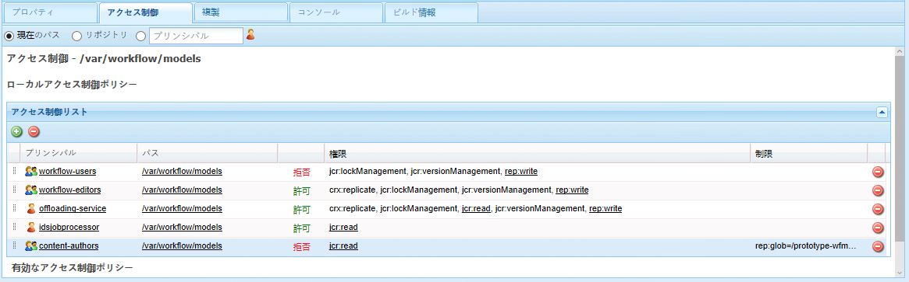
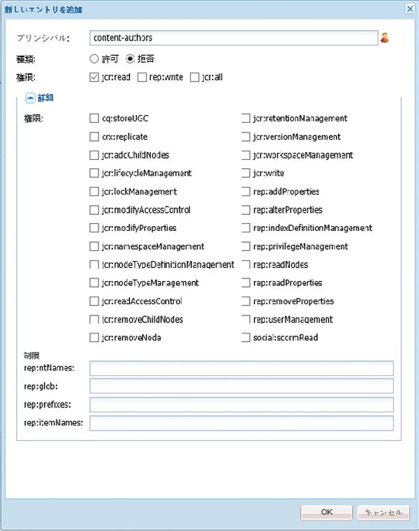
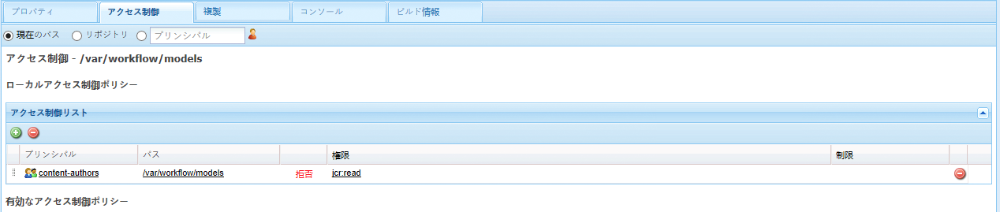

# ワークフローへのアクセスの管理{#managing-access-to-workflows}

ユーザーアカウントに応じた ACL を設定して、ワークフローの開始および参加を有効（または無効）にします。

## ワークフローに必須のユーザー権限 {#required-user-permissions-for-workflows}

次の場合に、ワークフローに対するアクションを開始できます。

* `admin` アカウントを使用している。
* アカウントがデフォルトグループ `workflow-users` に割り当てられている。

   * このグループは、ユーザーがワークフローアクションを実行するために必要なすべての権限を保持しています。
   * このグループに属するアカウントは、自分が開始したワークフローにのみアクセスできます。

* アカウントがデフォルトグループ `workflow-administrators` に割り当てられている。

   * このグループは、ユーザーがワークフローを監視および管理するために必要なすべての権限を保持しています。
   * このグループに属するアカウントは、すべてのワークフローにアクセスできます。

>[!NOTE]
>
>これらのバージョンは最小要件です。具体的なステップを実行するには、アカウントが割り当て済みの参加者または割り当て済みのグループのメンバーである必要があります。

## ワークフローへのアクセスの設定 {#configuring-access-to-workflows}

ワークフローモデルは、ユーザーがワークフローを操作する方法を制御するためのデフォルトのアクセス制御リスト（ACL）を継承します。ユーザーアクセスをワークフロー用にカスタマイズするには、リポジトリでワークフローモデルノードを含むフォルダーのアクセス制御リスト（ACL）を変更します。

* [特定のワークフローモデル用の ACL の /var/workflow/models への適用](/help/sites-administering/workflows-managing.md#apply-an-acl-for-the-specific-workflow-model-to-var-workflow-models)
* [/var/workflow/models へのサブフォルダーの作成と、それに対する ACL の適用](/help/sites-administering/workflows-managing.md#create-a-subfolder-in-var-workflow-models-and-apply-the-acl-to-that)

>[!NOTE]
>
>CRXDE Lite を使用して ACL を設定する方法については、[アクセス権限の管理](/help/sites-administering/user-group-ac-admin.md#access-right-management)を参照してください。

### 特定のワークフローモデル用の ACL の /var/workflow/models への適用 {#apply-an-acl-for-the-specific-workflow-model-to-var-workflow-models}

If the workflow model is stored within `/var/workflow/models` then you can assign a specific ACL, relevant to only that workflow, on the folder:

1. Web ブラウザーで CRXDE Lite を開きます（例：[http://localhost:4502/crx/de](http://localhost:4502/crx/de)）。
1. ノードツリーで、次のワークフローモデルフォルダーのノードを選択します。

   `/var/workflow/models`

1. 「**アクセス制御**」タブをクリックします。
1. 「**ローカルアクセス制御ポリシー**」（**アクセス制御リスト**）のテーブルで、プラスアイコンをクリックして&#x200B;**エントリを追加**&#x200B;します。
1. **新しいエントリを追加**&#x200B;ダイアログで、次のプロパティを含む新しい ACE を追加します。

   * **プリンシパル**: `content-authors`
   * **型**：`Deny`
   * **権限**: `jcr:read`
   * **rep:glob**： 特定のワークフローへの参照

   

   **アクセス制御リスト**&#x200B;テーブルには、`content-authors` ワークフローモデルに対する `prototype-wfm-01` の制限が含まれるようになりました。

   

1. 「**すべて保存**」をクリックします。

   `prototype-wfm-01` グループのメンバーが `content-authors` ワークフローを使用できなくなります。

### /var/workflow/models へのサブフォルダーの作成と、それに対する ACL の適用{#create-a-subfolder-in-var-workflow-models-and-apply-the-acl-to-that}

[開発チームは、次のフォルダーのサブフォルダーにワークフローを作成できます](/help/sites-developing/workflows-models.md#creating-a-new-workflow)。

`/var/workflow/models`

次に保存された DAM ワークフローに相当します。

`/var/workflow/models/dam/`

その後、ACL をフォルダー自体に追加できます。

1. Web ブラウザーで CRXDE Lite を開きます（例：[http://localhost:4502/crx/de](http://localhost:4502/crx/de)）。
1. ノードツリーで、ワークフローモデルフォルダーの個別のフォルダー用に、例えば次のようなノードを選択します。

   `/var/workflow/models/prototypes`

1. 「**アクセス制御**」タブをクリックします。
1. 「**ローカルアクセス制御ポリシー**」のテーブルで、プラスアイコンをクリックしてエントリを&#x200B;**追加**&#x200B;します。
1. 「**ローカルアクセス制御ポリシー**」（**アクセス制御リスト**）のテーブルで、プラスアイコンをクリックして&#x200B;**エントリを追加**&#x200B;します。
1. **新しいエントリを追加**&#x200B;ダイアログで、次のプロパティを含む新しい ACE を追加します。

   * **プリンシパル**: `content-authors`
   * **型**：`Deny`
   * **権限**: `jcr:read`

   >[!NOTE]
   >
   >[特定のワークフローモデル用の ACL の /var/workflow/models への適用](/help/sites-administering/workflows-managing.md#apply-an-acl-for-the-specific-workflow-model-to-var-workflow-models)の場合のように、rep:glob を含めて、特定のワークフローに対するアクセスを制限できます。

   

   **アクセス制御リスト**&#x200B;テーブルには、`content-authors` フォルダーに対する `prototypes` の制限が含まれるようになりました。

   

1. 「**すべて保存**」をクリックします。

   `prototypes` グループのメンバーが `content-authors` フォルダーのモデルを使用できなくなります。

