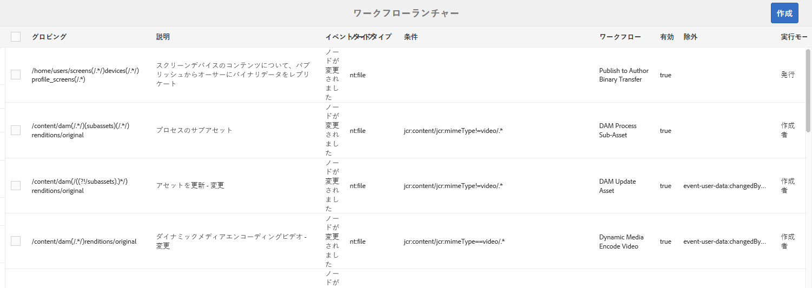
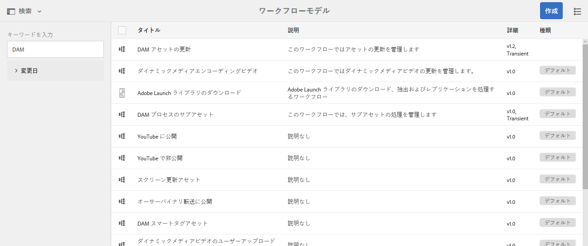
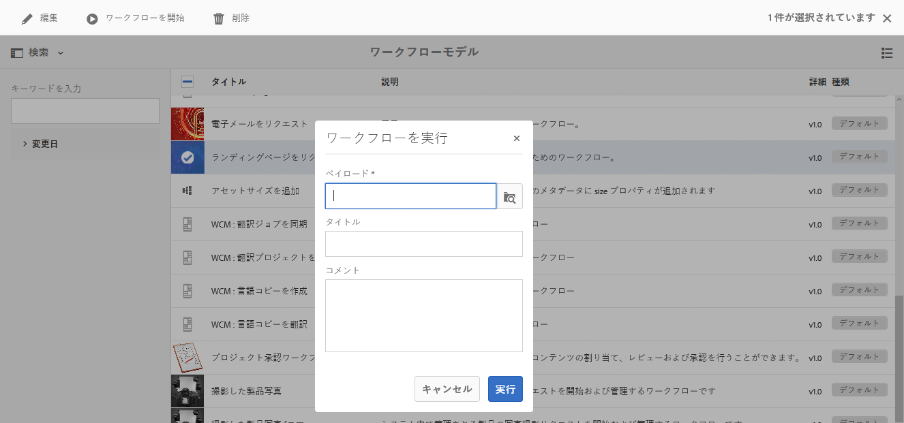
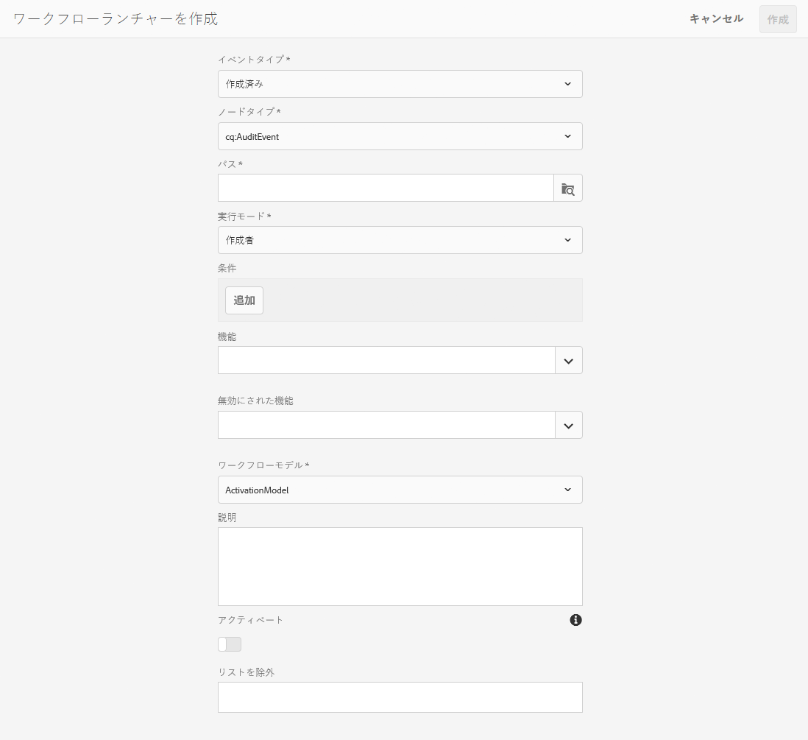

# ワークフローの開始{#starting-workflows}

ワークフローを管理しているとき、ワークフローは様々な方法で開始できます。

* 手動：

   * [ワークフローモデル](#workflow-models)から。
   * [バッチ処理](#workflow-packages-for-batch-processing)用のワークフローパッケージを使用して。

* 自動：

   * [ランチャーを使用](#workflows-launchers)してノードの変更に応答して。

>[!NOTE]
>
>作成者はその他の方法も使用できます。詳しくは、次を参照してください。
>
>* [ページへのワークフローの適用](/help/sites-authoring/workflows-applying.md)
>* [DAM アセットにワークフローを適用する方法](/help/assets/assets-workflow.md)
>* [AEM フォーム](https://helpx.adobe.com/jp/aem-forms/6-2/aem-workflows-submit-process-form.html)
>* [翻訳プロジェクト](/help/sites-administering/tc-manage.md)

>

## ワークフローモデル {#workflow-models}

ワークフローモデルコンソールにリストされている[モデルの 1 つに基づいて](/help/sites-administering/workflows.md#workflow-models-and-instances)ワークフローを開始できます。必須の情報はペイロードのみですが、タイトルやコメントも同様に追加できます。

## ワークフローランチャー {#workflows-launchers}

ワークフローランチャーはコンテンツリポジトリ内の変更を監視し、変更されたノードの場所とリソースの種類に応じて、ワークフローを起動します。

Using the **Launcher** you can:

* 特定のノードに対して既に起動されているワークフローを確認する。
* 特定のノードまたはノードの種類が変更されたときに起動するワークフローを選択する。
* 既存のワークフローとノード間の関係を削除する。

ランチャーは任意のノードに対して作成できます。ただし、特定のノードに変更した場合、ワークフローは起動されません。次のパス以下のノードに変更した場合、ワークフローは起動されません。

* `/var/workflow/instances`
* Any workflow-inbox node located anywhere in the `/home/users` branch
* `/tmp`
* `/var/audit`
* `/var/classes`
* `/var/eventing`
* `/var/linkchecker`
* `/var/mobile`
* `/var/statistics`

   * Exception: Changes to nodes below `/var/statistics/tracking` *do* cause workflows to launch.

標準インストールには、様々な定義が含まれています。それらの定義は、デジタル資産管理およびソーシャルコラボレーションのタスクに対して使用されます。

## バッチ処理用のワークフローパッケージ {#workflow-packages-for-batch-processing}

ワークフローパッケージは、処理のペイロードとしてワークフローに渡すことができるパッケージで、複数のリソースを処理できます。

ワークフローパッケージの特徴は次のとおりです。

* 一連のリソース（ページ、アセットなど）へのリンクが含まれます。
* 作成日、パッケージの作成者、簡単な説明など、パッケージの情報が保持されます。
* 特別なページテンプレートを使用して定義されます。このようなページでは、ユーザーがパッケージのリソースを指定できます。
* 複数回使用できます。
* ワークフローインスタンスの実行中にユーザーが変更できます（リソースを追加または削除できます）。

## モデルコンソールからのワークフローの開始 {#starting-a-workflow-from-the-models-console}

1. Navigate to the **Models** console using **Tools**, **Workflow**, then **Models**.
1. （コンソールの表示に従って）ワークフローを選択します。必要に応じて、検索機能（左上）を使用することもできます。

   

   >[!NOTE]
   >
   >The **[Transient](/help/sites-developing/workflows.md#transient-workflows)** indicator shows workflows for which the workflow history will not be persisted.

1. Select **Start Workflow** from the toolbar.
1. ワークフローを実行ダイアログが開き、次の内容を指定できます。

   * **ペイロード**

      これは、ページ、ノード、アセット、パッケージなどのリソースに含まれる場合があります。

   * **タイトル**

      このインスタンスを識別するのに役立つオプションのタイトルです。

   * **コメント**

      このインスタンスの詳細を示すのに役立つオプションのコメントです。
   

## ランチャー設定の作成 {#creating-a-launcher-configuration}

1. Navigate to the **Workflow Launchers** console using **Tools**, **Workflow**, then **Launchers**.
1. Select **Create**, then **Add Launcher** to open the dialog:

   

   * **イベントタイプ**

      ワークフローを起動するイベントタイプ:

      * 作成済み
      * 変更済み
      * 削除
   * **Notetype**

      ワークフローランチャーを適用するノードの種類です。

   * **パス**

      ワークフローランチャーを適用するパスです。

   * **実行モード**

      ワークフローランチャーを適用するサーバーの種類です。 Select **Author**, **Publish**, or **Author &amp; Publish**.

   * **条件**

      ノード値の条件のリスト。評価される際に、ワークフローを起動するかどうかを決定します。 例えば、次の条件では、ノードの 1 つのプロパティ名に「ユーザー」という値が含まれる場合、ワークフローが起動されます。

      name==User

   * **特長**

      有効にする機能のリスト。 ドロップダウンセレクターを使用して、必要な機能を選択します。

   * **無効にされた機能**

   無効にする機能のリスト。 ドロップダウンセレクターを使用して、必要な機能を選択します。

   * **ワークフローモデル**

      定義された条件の下のNodetypeやPathでイベントタイプが発生した場合に起動するワークフローです。

   * **説明**

      ランチャーの設定について説明し、特定するための独自のテキスト。

   * **アクティベート**

      ワークフローランチャーをアクティブにするかどうかを制御します。

      * 設定プロパティが満たされた場合にワークフローを起動するには、「**有効にする**」を選択します。
      * （設定プロパティが満たされた場合でも）ワークフローを実行しないときは、「**無効にする**」を選択します。
   * **リストを除外**

      ワークフローをトリガーする必要があるかどうかを決定する際に除外する（無視する）JCRイベントを指定します。

      このランチャープロパティは、項目をカンマで区切ったリストです。&quot;

      * `property-name` 指定したプロパティ名でトリガーされた `jcr` イベントを無視します。&quot;
      * `event-user-data:<*someValue*>` は、 `*<someValue*`API `user-data`[ (https://docs.adobe.com/content/docs/en/spec/jsr170/javadocs/jcr-2.0/javax/jcr/observation/ObservationManager.html#setUserData(java.lang.String)で `ObservationManager`]設定された>を含むイベントを無視します。

      次に例を示します。

      `jcr:lastModified,dc:modified,dc:format,jcr:lastModifiedBy,imageMap,event-user-data:changedByWorkflowProcess`

      この機能を使用して、除外する項目を追加することで、別のワークフロープロセスによってトリガーされた変更を無視できます。

      `event-user-data:changedByWorkflowProcess`

1. Select **Create**, to create the launcher and return to the console.

   該当するイベントが発生すると、ランチャーが実行されてワークフローが開始します。

## ランチャー設定の管理 {#managing-a-launcher-configuration}

After you have created your launcher configuration you can use the same console to select the instance, then **View Properties** (and edit them) or **Delete**.
