# Adobe Campaign コンポーネント{#adobe-campaign-components}

Adobe Campaign と統合しているときは、ニュースレター用とフォーム用のコンポーネントを使用できます。このドキュメントでは、両方のコンポーネントについて説明します。

>[!CAUTION]
>
>AEM電子メールコンポーネントは非推奨となりました。 コンテンツとスタイルを結合する電子メールの特性により、AEMで標準搭載された電子メールコンポーネントは、プロジェクトに必要なコンポーネントにカスタムスタイルを実装する必要があるので、顧客に対して限定的な再利用が可能になります。
>
>電子メールコンポーネントはプロジェクトレベルで実装でき、非推奨のAEM電子メールコンポーネントはその実現方法を示します。 ただし、これらの非推奨コンポーネントはプロジェクトでは使用しないでください。

## Adobe Campaign ニュースレターコンポーネント {#adobe-campaign-newsletter-components}

すべての Adobe Campaign コンポーネントは、[電子メールテンプレートのベストプラクティス](/help/sites-administering/best-practices-for-email-templates.md)で概説されているベストプラクティスに従います。また、Adobe マークアップ言語 [HTL](https://helpx.adobe.com/jp/experience-manager/htl/using/overview.html) をベースとしています。

Adobe Campaign と連携するように設定されているニュースレターまたは電子メールを開くと、「**Adobe Campaign ニュースレター**」セクションに以下のコンポーネントが表示されます。

* 見出し（Campaign）
* 画像（Campaign）
* リンク（Campaign）
* Scene7 画像テンプレート（Campaign）
* ターゲット参照（Campaign）
* テキストと画像（Campaign）
* テキストおよびパーソナライゼーション（Campaign）

これらのコンポーネントについては、以降のセクションで説明します。

コンポーネントは次のように表示されます。

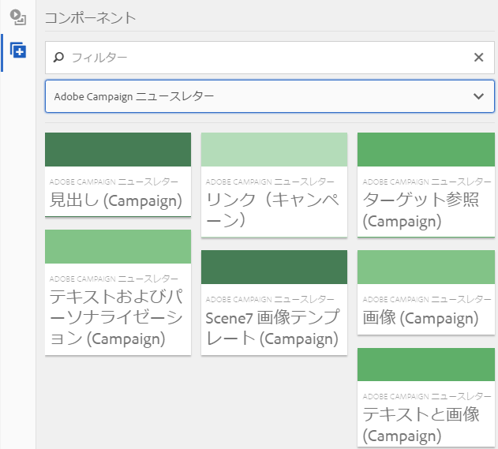

### 見出し (Campaign) {#heading-campaign}

見出しコンポーネントは、次のいずれかを表示します。

* 「**タイトル**」フィールドが空のときは、現在のページ名を表示します。
* 「**タイトル**」フィールドにテキストを指定したときは、そのテキストを表示します。

**見出し（Campaign）**&#x200B;コンポーネントを直接編集します。ページタイトルを使用する場合は空のままにします。

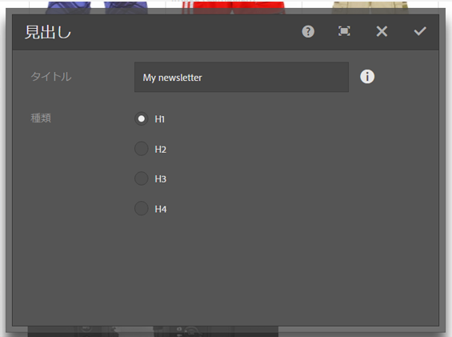

次の項目を設定できます。

* **タイトル**
ページタイトル以外の名前を使用する場合は、ここに入力します。

* **見出しレベル（1、2、3、4）** HTML の見出しサイズ 1～4 に基づいた見出しレベル。

見出し（Campaign）コンポーネントの表示例を以下に示します。

### Image (Campaign) {#image-campaign}

画像（Campaign）コンポーネントは、指定されたパラメーターに従って、画像とそれに付随するテキストを表示します。

画像をアップロードした後に、編集および操作できます（切り抜き、回転、リンク／タイトル／テキストの追加など）。

画像は、[アセットブラウザー](/help/sites-authoring/author-environment-tools.md#assetsbrowsertouchoptimizedui)から直接コンポーネントまたはコンポーネントの[設定ダイアログ](/help/sites-authoring/editing-content.md#editconfigurecopycutdeletepastetouchoptimizedui)にドラッグアンドドロップできます。設定ダイアログから画像をアップロードすることもできます。このダイアログでは、画像の定義および操作もすべて制御します。

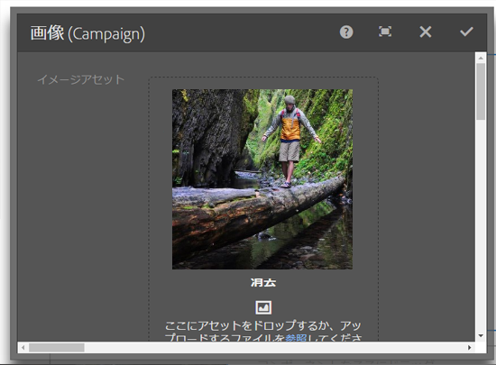

>[!NOTE]
>
>You must enter information in the **Alt Text** field, or the image cannot be saved.

After the image is uploaded (and not before) you can use [inplace editing](/help/sites-authoring/editing-content.md#editcontenttouchoptimizedui) to crop/rotate the image as required:

>[!NOTE]
>
>インプレースエディターでは、編集時に、画像の元のサイズと縦横比を使用します。高さと幅のプロパティも指定できます。プロパティで定義したサイズや縦横比の制限は、編集の変更内容を保存するときに適用されます。

>インスタンスによっては、[ページのデザイン](/help/sites-developing/designer.md)によって最小、最大の制限が課される場合もあります。これらは、プロジェクト実装時に開発されます。
>
フルスクリーン編集モードで使用できる追加オプションがいくつか用意されています（マップ、ズームなど）。

画像を読み込む際は、次の設定が可能です。

* **マップ**
画像をマップするには、「マップ」を選択します。画像マップの作成方法（長方形、多角形など）を指定し、領域が指す位置を指定します。

* **切り抜き**
「切り抜き」をクリックして画像を切り抜きます。マウスを使用して画像を切り抜きます。

* **回転**
画像を回転するには、「回転」を選択します。画像が目的の向きになるまで繰り返し使用します。

* **消去**
現在の画像を削除します。

* ズームバー（クラシックのみ）
画像のズームインおよびズームアウトをおこなうには、画像の下（「OK」および「キャンセル」ボタンの上）のスライドバーを使用します。
* **タイトル**
画像のタイトル。

* **代替テキスト**
アクセス可能なコンテンツを作成する際に使用する代替テキスト。

* **リンク先**
Web サイト内のアセットまたはその他のページへのリンクを作成します。

* **説明**
画像の説明。

* **サイズ**
画像の高さと幅を設定します。

>[!NOTE]
「**詳細**」タブの「**代替テキスト**」フィールドに情報を入力する必要があります。入力しない場合は画像を保存できず、次のエラーメッセージが表示されます。
`Validation failed. Verify the values of the marked fields.`

画像（Campaign）コンポーネントの表示例を以下に示します。

### Link (Campaign) {#link-campaign}

リンク（Campaign）コンポーネントを使用して、ニュースレターにリンクを追加できます。

以下の項目を「**表示**」、「**URL 情報**」または「**詳細**」タブで設定できます。

* **リンクキャプション**&#x200B;リンクのキャプション。ユーザーに表示されるテキストです。

* **リンクツールチップ**&#x200B;リンクの使用方法に関する追加情報を付加します。

* **LinkType**&#x200B;ドロップダウンリストで、 
**カスタムURL** 、 **アダプティブドキュメント**。 このフィールドは必須です。「カスタム URL」を選択した場合は、リンクの URL を指定できます。「アダプティブドキュメント」を選択した場合は、ドキュメントのパスを指定できます。

* **追加の URL パラメーター**&#x200B;追加の URL パラメーターがあれば追加します。「項目を追加」をクリックして、複数の項目を追加します。

>[!NOTE]
You must enter information in the **Link Type** field in the **URL Info** tab, or the component cannot save and you see the following error message:
`Validation failed. Verify the values of the marked fields.`

リンク（Campaign）コンポーネントの表示例を以下に示します。

### Scene7 画像テンプレート (Campaign) {#scene-image-template-campaign}

[Scene7画像テンプレート](https://help.adobe.com/en_US/scene7/using/WS60B68844-9054-4099-BF69-3DC998A04D3C.html) (Templates)はレイヤー化された画像ファイルで、コンテンツとプロパティを可変性のためにパラメータ化できます。 **画像テンプレート**&#x200B;コンポーネントを使用すると、ニュースレター内で Scene7 テンプレートを使用して、テンプレートパラメーターの値を変更できます。また、Adobe Campaignのメタデータ変数をパラメーター内で使用できるので、各ユーザーがパーソナライズされた方法で画像を体験できます。

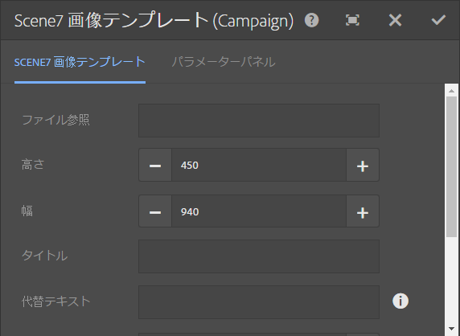

コンポーネントを設定するには、「**編集**」をクリックします。この節で説明する設定を指定できます。 This Scene7 Image template is described in detail in [Scene7 Image Template component](/help/assets/scene7.md#image-template).

さらに、パラメーターパネルに、Scene7 のテンプレート用に定義されているすべてのテンプレートパラメーターが表示されます。これらのパラメーターそれぞれに対して、値を変化させたり、変数を挿入したり、デフォルト値にリセットしたりできます。

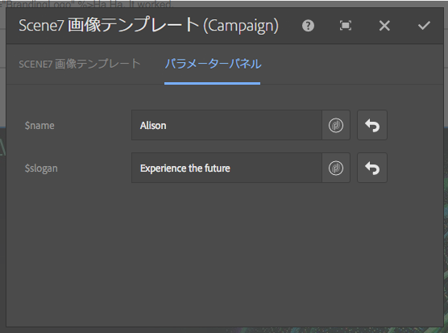

### ターゲット参照 (Campaign) {#targeted-reference-campaign}

ターゲット参照（Campaign）コンポーネントを使用して、ターゲット段落への参照を作成できます。

このコンポーネント内で、ターゲット段落に移動して選択します。

フォルダーアイコンをクリックして、参照する段落に移動します。終了したら、チェックマークをクリックします。

### テキストと画像（Campaign） {#text-image-campaign}

テキストと画像（Campaign）コンポーネントでは、テキストブロックと画像を追加します。

クリックしてこのコンポーネントを設定する際には、「テキスト」または「画像」を選択します。

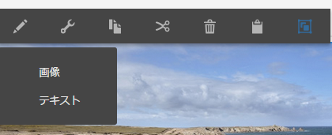

「**テキスト**」を選択すると、インラインエディターが表示されます。

「**画像**」を選択すると、画像用のインプレースエディターが表示されます。

画像の使用について詳しくは、[画像（Campaign）コンポーネント](#image-campaign)を参照してください。テキストの使用について詳しくは、[テキストおよびパーソナライゼーション（Campaign）コンポーネント](#text-personalization-campaign)を参照してください。

テキストおよびパーソナライゼーション（Campaign）コンポーネントや画像（Campaign）コンポーネントと同様に、次の項目を設定できます。

* **テキスト**
テキストを入力します。ツールバーを使用して、書式設定の変更、リストの作成およびリンクの追加をおこないます。

* **画像**
コンテンツファインダーから画像をドラッグするか、クリックして画像を参照します。必要に応じて、切り抜きや回転をおこないます。

* **画像のプロパティ**（**詳細画像プロパティ**）
次の項目を指定できます。

   * **タイトル**
ブロックのタイトル。マウスポインターを置くと表示されます。

   * **代替テキスト**
画像を表示できない場合に表示する代替テキスト。

   * **リンク先** Web サイト内のアセットまたはその他のページへのリンクを作成します。

   * **説明**
画像の説明。

   * **サイズ**
画像の高さと幅を設定します。

>[!NOTE]
「**詳細**」タブの「**代替テキスト**」フィールドは必須です。入力しない場合、コンポーネントを保存できず、次のエラーメッセージが表示されます。
`Validation failed. Verify the values of the marked fields.`

テキストと画像（Campaign）コンポーネントの表示例を以下に示します。

### テキストおよびパーソナライゼーション (Campaign) {#text-personalization-campaign}

The Text &amp; Personalization (Campaign) component lets you enter a text block using a WYSIWYG editor, with functionality provided by the [Rich Text editor](/help/sites-authoring/rich-text-editor.md). さらに、このコンポーネントでは、Adobe Campaign のコンテキストフィールドとパーソナライゼーションブロックを使用できます。[パーソナライゼーションの挿入](/help/sites-authoring/campaign.md#inserting-personalization)も参照してください。

フォントの文字、配置、リンク、リスト、インデントなど、多様なアイコンでテキストの書式を設定できます。The functionality is basically the same in [both UIs](/help/sites-authoring/editing-content.md), although the look-and-feel is different:

インプレースエディターで、テキストを追加し、ジャスティフィケーションを変更し、リンクを追加または削除し、コンテキストフィールドまたはパーソナライゼーションブロックを追加し、全画面モードに入ることができます。テキストまたはパーソナライゼーションの追加が完了したら、チェックマークを選択して変更を保存します（または「x」をクリックしてキャンセルします）。See [Inplace editing](/help/sites-authoring/editing-content.md#editcontenttouchoptimizedui) for more information.

>[!NOTE]
* 使用できるパーソナライゼーションフィールドは、ニュースレターがリンクされている Adobe Campaign テンプレートによって異なります。
* ContextHub からペルソナを選択すると、選択したプロファイルのデータでパーソナライゼーションフィールが自動的に置き換えられます。

[パーソナライゼーションの挿入](/help/sites-authoring/campaign.md#inserting-personalization)を参照してください。

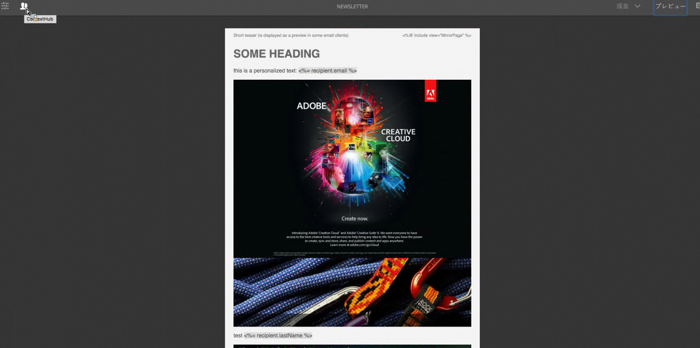

>[!NOTE]
**nms:seedMember** スキーマまたはその拡張で定義されているフィールドのみが考慮されます。**nms:seedMember** にリンクしているテーブルの属性は使用できません。

## Adobe Campaign フォームコンポーネント {#adobe-campaign-form-components}

Adobe Campaign コンポーネントを使用して、ニュースレターの購読や購読解除、ユーザープロファイルの更新といった手続きで記入するフォームを作成できます。詳細については、[Adobe Campaign フォームの作成](/help/sites-authoring/adobe-campaign-forms.md)を参照してください。

各コンポーネントフィールドを Adobe Campaign データベースフィールドにリンクできます。[コンポーネントとデータタイプ](#components-and-data-type)セクションで説明しているように、利用可能なフィールドは、格納するデータのタイプによって異なります。受信者スキーマを Adobe Campaign で拡張した場合は、データタイプが一致するコンポーネントで新しいフィールドが利用可能になります。

When you open a form that is configured to integrate with Adobe Campaign, you see the following components in the **Adobe Campaign** section:

* チェックボックス（Campaign）
* 日付フィールド（Campaign）と日付フィールド／HTML5（Campaign）
* 暗号化されたプライマリキー（Campaign）
* エラー表示（Campaign）
* 非表示の調整キー（Campaign）
* 数値フィールド（Campaign）
* オプションフィールド（Campaign）
* 購読チェックリスト（Campaign）
* テキストフィールド（Campaign）

コンポーネントは次のように表示されます。

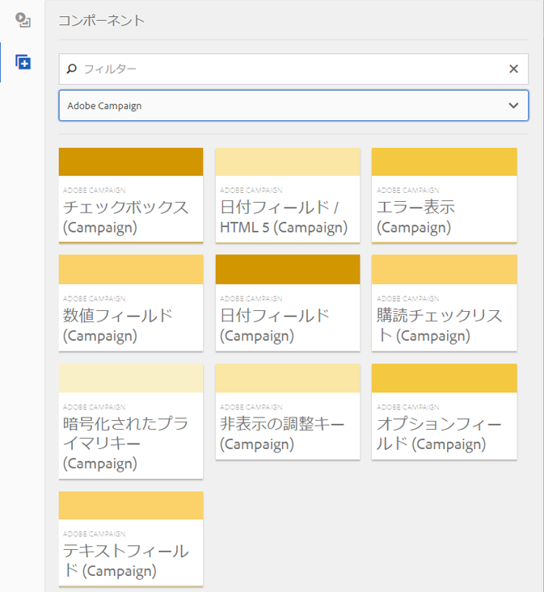

このセクションでは、各コンポーネントについて詳しく説明します。

### コンポーネントとデータタイプ {#components-and-data-type}

以下の表に、Adobe Campaign プロファイルデータの表示および変更に利用できるコンポーネントを示します。各コンポーネントを Adobe Campaign プロファイルフィールドにマップすることで、フィールドの値をフォームに表示したり、フォームが送信されたときにフィールドを更新したりできます。各種コンポーネントは、適切なデータタイプのフィールドにのみマップできます。

<table>
 <tbody>
  <tr>
   <td>
<strong>コンポーネント</strong>
 </td>
   <td>
<strong>Adobe Campaign フィールドのデータタイプ</strong>
 </td>
   <td>
<strong>フィールドの例</strong>
 </td>
  </tr>
  <tr>
   <td>
チェックボックス (Campaign)
 </td>
   <td>
ブール型
 </td>
   <td>
今後は連絡しない（どのチャネルからも）
 </td>
  </tr>
  <tr>
   <td>
日付フィールド (Campaign)
 
日付フィールド / HTML 5 (Campaign)
 </td>
   <td>
date
 </td>
   <td>
誕生日
 </td>
  </tr>
  <tr>
   <td>
数値フィールド (Campaign)
 </td>
   <td>
数値（byte、short、long、double）
 </td>
   <td>
年齢
 </td>
  </tr>
  <tr>
   <td>
オプションフィールド (Campaign)
 </td>
   <td>
値が関連付けられた byte
 </td>
   <td>
性別
 </td>
  </tr>
  <tr>
   <td>
テキストフィールド (Campaign)
 </td>
   <td>
文字列
 </td>
   <td>
電子メール
 </td>
  </tr>
 </tbody>
</table>

### 大部分のコンポーネントに共通の設定 {#settings-common-to-most-components}

Adobe Campaign コンポーネントには、ほとんどのコンポーネント（暗号化されたプライマリキーコンポーネントと非表示の調整キーコンポーネントを除く）に共通の設定があります。

大部分のコンポーネントでは、次の項目を設定できます。

#### タイトルとテキスト {#title-and-text}

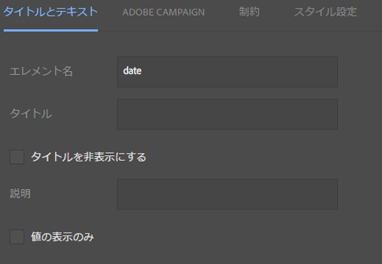

* **タイトル**&#x200B;エレメント名以外の名前を使用する場合は、ここに入力します。

* **タイトルを非表示にする**&#x200B;タイトルを表示したくない場合は、このチェックボックスをオンにします。

* **説明**&#x200B;フィールドに説明を追加して、ユーザーに詳しい情報を提供します。

* **値の表示のみ**&#x200B;値が 1 つの場合は、その値を表示するだけです。

#### Adobe Campaign {#adobe-campaign}

次の項目を設定できます。

* **マッピング**&#x200B;必要に応じて、Adobe Campaign パーソナライゼーションフィールドを選択します。

* **調整キー**&#x200B;このフィールドを調整キーの一部にする場合は、このチェックボックスをオンにします。

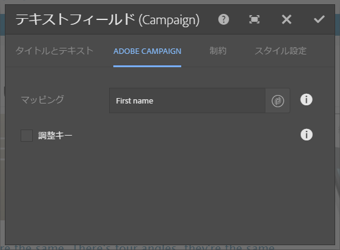

#### 制約 {#constraints}

* **必須**&#x200B;このチェックボックスをオンにすると、このコンポーネントが必須になります。つまり、ユーザーが値を入力する必要があります。
* **必須メッセージ**&#x200B;オプションで、このフィールドが必須であることを示すメッセージを追加します。

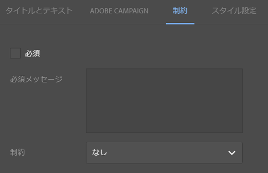

#### スタイル設定 {#styling}

* **CSS**&#x200B;このコンポーネントに使用する CSS クラスを入力します。

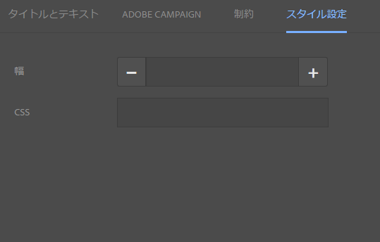

### チェックボックス (Campaign) {#checkbox-campaign}

チェックボックス（Campaign）コンポーネントを使用すると、boolean データタイプの Adobe Campaign プロファイルフィールドをユーザーに変更させることができます。例えば、チェックボックス（Campaign）コンポーネントを使用して、受信者に連絡を希望するかどうかを選択させるオプションを作成できます。

チェックボックス（Campaign）コンポーネントでは、[大部分の Adobe Campaign コンポーネントに共通の設定](#settings-common-to-most-components)を使用できます。

チェックボックス（Campaign）コンポーネントの表示例を以下に示します。

### Date Field (Campaign) and Date Field/HTML 5 (Campaign) {#date-field-campaign-and-date-field-html-campaign}

日付フィールドを使用して、受信者に日付を指定させることができます。例えば、受信者に誕生日を指定させることができます。日付の形式は、Adobe Campaign インスタンスで使用されている形式と一致します。

[大部分の Adobe Campaign コンポーネントに共通の設定](#settings-common-to-most-components)に加え、次の項目を設定できます。

* **[制約] - [制約** ]ドロップダウン： [ **なし** ]または[ **** 日付]を選択して、日付の制約を追加するか、制約を追加しないかを指定できます。 日付を選択した場合は、回答ユーザーがフィールドに入力する日付形式を使用する必要があります。

* **制約メッセージ**&#x200B;さらに、入力値の適切なフォーマットを示す制約メッセージを追加できます。
* **スタイル設定 — 幅** :+アイコンと **-****** アイコンをクリックまたはタップするか、数値を入力して、フィールドの幅を調整します。

幅が調整された日付フィールド（Campaign）コンポーネントの表示例を以下に示します。

### 暗号化されたプライマリキー (Campaign) {#encrypted-primary-key-campaign}

このコンポーネントは、Adobe Campaign プロファイルの識別子（それぞれ Adobe Campaign Standard では&#x200B;**メインリソース識別子**、Adobe Campaign 6.1 では&#x200B;**暗号化されたプライマリキー**）を含む URL パラメーター名を定義します。

Adobe Campaign プロファイルデータを表示および変更する各フォームには、暗号化されたプライマリキーコンポーネントを含める&#x200B;**必要があります**。

暗号化されたプライマリキー（Campaign）コンポーネントでは、次の項目を設定できます。

* **タイトルとテキスト - エレメント名**&#x200B;デフォルト値は encryptedPK です。フォーム上の別のエレメント名と競合する場合にのみ、エレメント名を変更する必要があります。2 つのフォームフィールドが同じエレメント名を持つことはできません。
* **Adobe Campaign - URL パラメーター** EPK 用の URL パラメーターを追加します。例えば、値 **epk** を使用できます。

暗号化されたプライマリキー（Campaign）コンポーネントの表示例を以下に示します。

### エラー表示 (Campaign) {#error-display-campaign}

このコンポーネントを使用して、バックエンドのエラーを表示できます。このコンポーネントを適切に機能させるには、フォームのエラー処理を「転送」に設定する必要があります。

エラー表示（Campaign）コンポーネントの表示例を以下に示します。

### 非表示の調整キー (Campaign) {#hidden-reconciliation-key-campaign}

非表示紐付けキー(キャンペーン)コンポーネントを使用すると、紐付けキーの一部として非表示フィールドをフォームに追加できます。

非表示の調整キー（Campaign）コンポーネントでは、次の項目を設定できます。

* **タイトルとテキスト - エレメント名**&#x200B;デフォルト値は reconcilKey です。フォーム上の別のエレメント名と競合する場合にのみ、エレメント名を変更する必要があります。2 つのフォームフィールドが同じエレメント名を持つことはできません。
* **Adobe Campaign - マッピング** Adobe Campaign パーソナライゼーションフィールドにマップします。

非表示の調整キー（Campaign）コンポーネントの表示例を以下に示します。

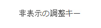

### 数値フィールド (Campaign) {#numeric-field-campaign}

数値フィールドを使用して、受信者に年齢などの数字を入力させることができます。

[大部分の Adobe Campaign コンポーネントに共通の設定](#settings-common-to-most-components)に加え、次の項目を設定できます。

* **[制約] - [制約** ]ドロップダウン： [ **なし** ]または[ **** 数値]を選択して、数値の制約を追加するか、制約なしの制約を追加することができます。 数値を選択した場合、ユーザーがフィールドに入力する答えは数値である必要があります。

* **制約メッセージ**&#x200B;さらに、入力値の適切なフォーマットを示す制約メッセージを追加できます。
* **スタイル設定 — 幅** :+アイコンと **-****** アイコンをクリックまたはタップするか、数値を入力して、フィールドの幅を調整します。

幅が設定された数値フィールド（Campaign）コンポーネントの表示例を以下に示します。

### オプションフィールド (Campaign) {#option-field-campaign}

このドロップダウンリストを使用して、受信者の性別やステータスなどのオプションを選択できます。

オプションフィールド（Campaign）コンポーネントでは、[大部分の Adobe Campaign コンポーネントに共通の設定](#settings-common-to-most-components)を使用できます。ドロップダウンリストを設定するには、Adobe Campaign のシンボルをクリックまたはタップし、Adobe Campaign パーソナライゼーションフィールドの適切なフィールドに移動して、そのフィールドを選択します。

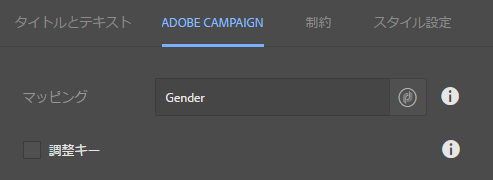

オプションフィールド（Campaign）コンポーネントの表示例を以下に示します。

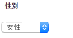

### 購読チェックリスト (Campaign) {#subscriptions-checklist-campaign}

**購読チェックリスト（Campaign）**&#x200B;コンポーネントを使用して、Adobe Campaign プロファイルに関連付けられた購読を変更できます。

このコンポーネントをフォームに追加すると、利用可能なすべての購読がチェックボックスとして表示されるので、ユーザーに目的の購読を選択させることができます。When users submit the form, this component subscribes the user to or unsubscribes the user from the selected services depending on the form action type (**Adobe Campaign: Subscribe to Services** or **Adobe Campaign: Unsubscribe from Services**).

>[!NOTE]
このコンポーネントは、ユーザーがどのサービスを購読または購読解除しているかを確認しません。

購読チェックリスト（Campaign）コンポーネントでは、[大部分の Adobe Campaign コンポーネントに共通の設定](#settings-common-to-most-components)を使用できます（このコンポーネントに利用できる Adobe Campaign 設定はありません）。

購読チェックリスト（Campaign）コンポーネントの表示例を以下に示します。

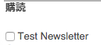

### テキストフィールド (Campaign) {#text-field-campaign}

テキストフィールド（Campaign）コンポーネントを使用すると、名、姓、住所、電子メールアドレスなど、文字列タイプのデータを入力できます。

[大部分の Adobe Campaign コンポーネントに共通の設定](#settings-common-to-most-components)に加え、次の項目を設定できます。

* **制約 — 制約** 」ドロップダウン「 **なし」、「** 電子メール **」または「**&#x200B;名前 **** （ウムラウトなし）」を選択して、電子メールアドレス、名前、制約なしの制約を追加できます。 「電子メール」を選択した場合は、このフィールドに電子メールアドレスを入力する必要があります。nameを選択する場合は、名前にする必要があります（ウムラウトは使用できません）。

* **制約メッセージ**&#x200B;さらに、入力値の適切なフォーマットを示す制約メッセージを追加できます。
* **スタイル設定 — 幅** :+アイコンと **-****** アイコンをクリックまたはタップするか、数値を入力して、フィールドの幅を調整します。

テキストフィールド（Campaign）コンポーネントの表示例を以下に示します。

