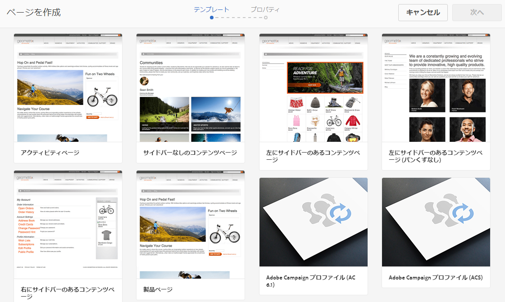
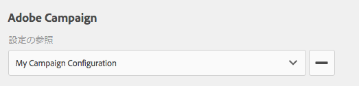
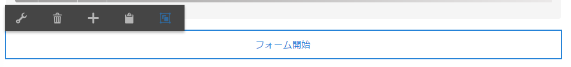
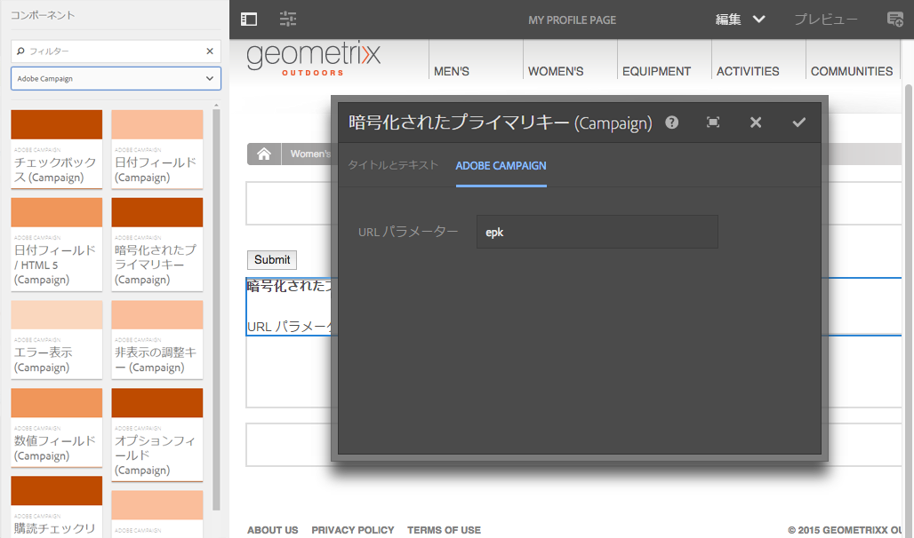
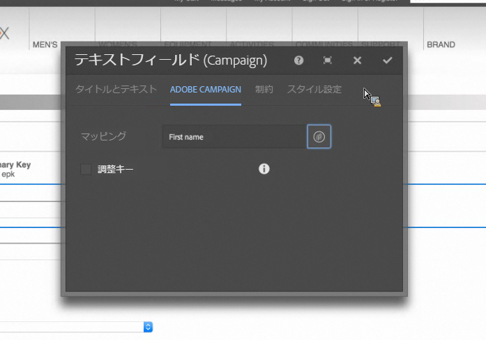

# AEM での Adobe Campaign フォームの作成 {#creating-adobe-campaign-forms-in-aem}

AEM では、Web サイト上で Adobe Campaign と連携するフォームを作成できます。特定のフィールドをフォームに挿入して、Adobe Campaign データベースにマップできます。

新しい連絡先の購読、購読解除、ユーザープロファイルデータを管理しつつ、そのデータを Adobe Campaign データベースに統合できます。

Adobe Campaign フォームを AEM で使用するには、このドキュメントで説明する以下のステップを実行する必要があります。

1. テンプレートを使用可能にします。
1. フォームを作成します。
1. フォームコンテンツを編集します。

デフォルトでは、Adobe Campaign 固有の次の 3 種類のフォームを使用できます。

* プロファイルを保存
* サービスを購読
* サービスの購読を解除

これらのフォームは、Adobe Campaign プロファイルの暗号化されたプライマリキー（EPK）を受け入れる URL パラメーターを定義します。フォームはこの URL パラメーターに基づいて、関連付けられている Adobe Campaign プロファイルのデータを更新します。

一般的な使用事例では、これらのフォームを別々に作成しますが、ニュースレターのコンテンツ内にフォームページへのパーソナライズされたリンクを組み込み、受信者がそのリンクを開いて自分のプロファイルデータを調整（購読解除、購読またはプロファイル更新）できるようにします。

フォームは、ユーザーに基づいて自動的に更新されます。詳しくは、[フォームコンテンツの編集](#editing-form-content)を参照してください。

## テンプレートを使用可能にする {#making-a-template-available}

Adobe Campaign 固有のフォームを作成するには、まず、様々なテンプレートを AEM アプリケーションで使用可能にする必要があります。

To do this, see the [Templates documentation](/help/sites-developing/templates.md#template-availability).

## フォームの作成 {#creating-a-form}

まず、オーサーインスタンスおよびパブリッシュインスタンスと Adobe Campaign の間の接続が有効なことを確認します。[Adobe Campaign Standard との統合](/help/sites-administering/campaignstandard.md)または [Adobe Campaign Classic との統合](/help/sites-administering/campaignonpremise.md)を参照してください。

>[!NOTE]
>
>Adobe Campaign Classic または Adobe Campaign Standard を使用する場合は、ページの **jcr:content** ノードの **acMapping** プロパティがそれぞれ **mapRecipient** または **profile** に設定されていることを確認してください。

1. AEM の「サイト」で、新しいページを作成する場所に移動します。
1. Create a page and select **Adobe Campaign Classic Profile** or **Adobe Campaign Standard Profile** and click **Next**.

   

   >[!NOTE]
   >
   >If the desired template is not available, see [Template Availability](/help/sites-developing/templates.md#template-availability).

1. 「**名前**」フィールドにページ名を追加します。ページ名は有効な JCR 名である必要があります。
1. 「**タイトル**」フィールドにタイトルを入力し、「**作成**」をクリックします。
1. ページを開き、「**プロパティを開く**」を選択し、「クラウドサービス」で Adobe Campaign 設定を追加し、チェックマークを選択して変更内容を保存します。

   

1. ページ上の&#x200B;**フォーム開始**&#x200B;コンポーネントで、フォームのタイプ（**購読、購読解除**&#x200B;または&#x200B;**プロファイルを保存**）を選択します。選択できるタイプはフォームごとに 1 つだけです。You can now [edit the form&#39;s content](#editing-form-content).

## フォームコンテンツの編集 {#editing-form-content}

Adobe Campaign 専用のフォームには、固有のコンポーネントがあります。これらのコンポーネントでは、フォームの各フィールドを Adobe Campaign データベースのフィールドにリンクすることができます。

>[!NOTE]
>
>If the desired template is not available, see [Making a template available](/help/sites-authoring/adobe-campaign.md).

このセクションでは、Adobe Campaign へのリンクのみを取り上げます。For more information on a more general overview of how to use forms in Adobe Experience Manager, see [Editmode components](/help/sites-authoring/default-components-foundation.md).

1. 「**プロパティを開く**」を選択し、「クラウドサービス」で Adobe Campaign 設定を追加し、チェックマークを選択して変更内容を保存します。

   

1. On the page, in the **Form Start** component, click the Configuration icon.

   

1. Click the **Advanced** tab and select the type of form it is - **Subscribe, Unsubscribe,** or **Save Profile** and click **OK.**&#x200B;選択できるタイプはフォームごとに 1 つだけです。

   * **Adobe Campaign：プロファイルを保存**：Adobe Campaign で受信者を作成または更新できます（デフォルト値）。
   * **Adobe Campaign：サービスを購読**：Adobe Campaign で受信者の購読を管理できます。
   * **Adobe Campaign：サービスの購読を解除**：Adobe Campaign で受信者の購読をキャンセルできます。

1. 各フォームには 1 つの&#x200B;**暗号化されたプライマリキー**&#x200B;が必要です。このコンポーネントは、Adobe Campaign プロファイルの暗号化されたプライマリキーを受け入れるために使用する URL パラメーターを定義します。「コンポーネント」で、「Adobe Campaign」を選択して、これらのコンポーネントのみを表示します。
1. Drag the component **Encrypted Primary Key** to the form (anywhere) and click or tap the **Configuration** icon. 「**Adobe Campaign**」タブで、URL パラメーターの名前を指定します。チェックマークをクリックまたはタップして、変更内容を保存します。

   このフォームへのリンクを生成するときは、この URL パラメーターを使用し、Adobe Campaign プロファイルの暗号化されたプライマリキーを割り当てる必要があります。暗号化されたプライマリキーは、適切に URL（パーセント）エンコードする必要があります。

   

1. 必要に応じて、このフォームにテキストフィールド、日付フィールド、チェックボックスフィールド、オプションフィールドなどのコンポーネントを追加します。各コンポーネントの詳細については、[Adobe Campaign フォームコンポーネント](/help/sites-authoring/adobe-campaign-components.md)を参照してください。
1. 設定アイコンをクリックして、コンポーネントを開きます。For example, in **Text Field (Campaign)** component, change the title and text.

   「**Adobe Campaign**」をクリックして、フォームフィールドを Adobe Campaign のメタデータ変数にマップします。フォームを送信すると、マップされているフィールドが Adobe Campaign で更新されます。変数ピッカーには、タイプが一致するフィールドのみが表示されます（例：テキストフィールドの場合は文字列変数）。

   

   >[!NOTE]
   >
   >You can add/remove fields that are displayed in the recipient table by following the instructions here: [https://blogs.adobe.com/experiencedelivers/experience-management/aem-campaign-integration/](https://blogs.adobe.com/experiencedelivers/experience-management/aem-campaign-integration/)

1. 「**ページを公開**」をクリックします。ページがサイト上でアクティベートされます。AEM のパブリッシュインスタンスに移動すると、ページを見ることができます。[フォームをテスト](#testing-a-form)することもできます。

   >[!CAUTION]
   >
   >クラウドサービスの匿名ユーザーにパブリッシュインスタンス上でフォームを使用させるには、読み取り権限を付与する必要があります。ただし、匿名ユーザーに読み取り権限を付与するとセキュリティリスクが生じるので、このリスクを低減するために、Dispatcher を設定するなどの対策を必ず講じてください。

## フォームのテスト {#testing-a-form}

フォームを作成してフォームのコンテンツを編集したら、そのフォームが想定どおりに機能することを手動でテストできます。

>[!NOTE]
>
>You must have an **Encryted Primary Key** component on each form. 「コンポーネント」で、「Adobe Campaign」を選択して、これらのコンポーネントのみを表示します。
>
>この手順では暗号化されたプライマリキー（EPK）の番号を手動で入力しますが、実際には、ニュースレター内にこのページへの（購読解除、購読またはプロファイル更新をおこなうための）リンクが表示されます。EPK はユーザーに基づいて自動的に更新されます。
>
>To create that link, you use the variable **Main resource identifier**(Adobe Campaign Standard) or **Encrypted identifier** (Adobe Campaign Classic) (for example, in a **Text &amp; Personalization (Campaign)** component), which links to the epk in Adobe Campaign.

そのためには、Adobe Campaign プロファイルの EPK を手動で取得して、URL に付加する必要があります。

1. Adobe Campaign プロファイルの暗号化されたプライマリキー（EPK）を取得するには：

   * In Adobe Campaign Standard - Navigate to **Profiles and Audiences** > **Profiles**, which lists the existing profiles. Make sure the table displays the **Main Resource Identifier** field in a column (This can be configured by clicking/tapping **Configure list**). 目的のプロファイルのメインリソース識別子をコピーします。
   * In Adobe Campaign Classic, go to **Profiles and Targets** >  **Recipients**, which lists the existing profiles. Make sure the table displays the **Encrypted identifier** field in a column (This can be configured by right-clicking on an entry and selecting **Configure list...**). 目的のプロファイルの暗号化された識別子をコピーします。

1. In AEM, open the form page on the publish instance and append the EPK from step 1 as a URL parameter: use the same name that you previously defined in the EPK component when authoring the form (for example: `?epk=...`)
1. これで、フォームを使用して、リンクされている Adobe Campaign プロファイルに関連付けられたデータと購読を変更できるようになりました。一部のフィールドを変更してフォームを送信したら、Adobe Campaign で適切なデータが更新されていることを確認できます。

フォームが検証されると、Adobe Campaign データベースのデータが更新されます。
