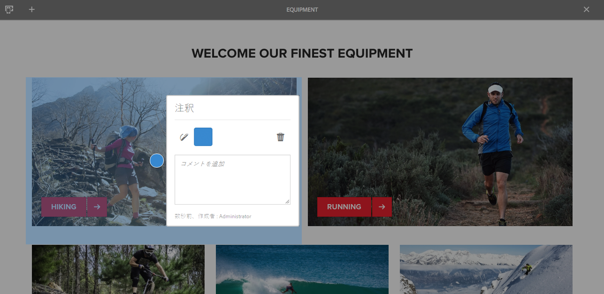
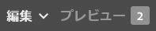

# ページ編集時の注釈{#annotations-when-editing-a-page}

Web サイトのページにコンテンツを追加すると、実際に公開する前に議論の対象となることが多くあります。このために、レイアウトなどではなく、コンテンツに直接関係するコンポーネントの多くに注釈を追加することができます。

注釈によりページ上に色付きのマーカーまたは付箋紙が配置されます。注釈を使用すれば、そのユーザー（または他のユーザー）がコメントや質問を他の作成者またはレビュー担当者に残すことができます。

>[!NOTE]
>
>個々のコンポーネントの種類の定義によって、そのコンポーネントのインスタンスに注釈を追加できるかどうかが決まります。

>[!NOTE]
>
>クラシック UI で作成された注釈は、タッチ対応 UI に表示されます。ただし、スケッチは、UI 固有で、それを作成した UI でのみ表示されます。

>[!CAUTION]
>
>リソース（段落など）を削除すると、そのリソースに添付されていた注釈およびスケッチが、ページ全体での位置に関係なく、すべて削除されます。

>[!NOTE]
>
>必要に応じて、注釈が追加、更新または削除されたときに通知を送信するワークフローを開発することもできます。

## 注釈 {#annotations}

注釈の作成と表示には、特別な[モード](/help/sites-authoring/author-environment-tools.md#page-modes)が使用されます。

>[!NOTE]
>
>ページでフィードバックを提供するために、[コメント](/help/sites-authoring/basic-handling.md#timeline)も使用できます。

>[!NOTE]
>
>様々なリソースに注釈を付けることができます。
>
>* [アセット](/help/assets/manage-assets.md#annotating)
>* [ビデオアセットへの注釈の追加](/help/assets/managing-video-assets.md#annotate-video-assets)

>

### コンポーネントへの注釈の追加 {#annotating-a-component}

注釈モードでは、コンテンツに対する注釈の作成、編集、移動または削除をおこなうことができます。

1. 注釈モードは、ページの編集中にツールバー（右上）のアイコンを使用して開始できます。

   

   既存の注釈を表示できるようになりました。

   >[!NOTE]
   >
   >注釈モードを終了するには、上部のツールバーの右側にある注釈アイコン（x 記号）をタップまたはクリックします。

1. 注釈の追加を開始するには、注釈を追加アイコン（ツールバーの左側にあるプラス記号）をクリックまたはタップします。

   >[!NOTE]
   >
   >注釈の追加を終了して表示に戻るには、上部のツールバーの左側にあるキャンセルアイコン（白い円で囲まれた x 記号）をタップまたはクリックします。

1. 注釈を追加するために必要なコンポーネント（注釈を追加できるコンポーネントは青いボーダーで強調表示されます）をクリックまたはタップして、ダイアログを開きます。

   

   このダイアログで適切なフィールドやアイコンを使用し、次の操作を実行できます。

   * 注釈テキストを入力します。
   * スケッチ（線と図形）を作成して、コンポーネントの特定の領域を強調表示します。

      スケッチの作成中は、カーソルが十字型に変わります。複数の異なる線を描くことができます。スケッチ線は注釈と同じ色で、矢印、円、楕円のいずれかにすることができます。
   

   * 色を選択または変更します。

   

   * 注釈を削除します。

   

1. ダイアログの外側をクリックまたはタップして、注釈ダイアログを閉じることができます。注釈の一部の表示（最初の単語）とスケッチが一緒に表示されます。

   

1. 特定の注釈の編集が完了した後は、次の操作を実行できます。

   * テキストマーカーをクリックまたはタップして注釈を開きます。注釈が開いたら、テキスト全体を表示して、注釈に変更を加えたり、削除したりすることができます。

      * スケッチは、注釈と別に削除することはできません。
   * テキストマーカーの位置を変更します。
   * スケッチの線をクリックまたはタップしてそのスケッチを選択し、必要な位置までドラッグします。
   * コンポーネントの移動またはコピー

      * 関連する注釈およびスケッチも移動またはコピーされます。段落に対する位置は変わりません。

1. 注釈モードを終了し、使用していたモードに戻るには、上部のツールバーの右側にある注釈アイコン（x 記号）をタップまたはクリックします。

>[!NOTE]
>
>別のユーザーによってロックされているページには、注釈を追加できません。

### 注釈インジケーター {#annotation-indicator}

注釈は編集モードでは表示されませんが、ツールバーの右上にあるバッジに、現在のページに存在する注釈の数が示されます。このバッジは、デフォルトの注釈アイコンに代わるものですが、注釈モードと切り替えるクイックリンクとしても動作します。

