# オーサリング - 環境とツール{#authoring-the-environment-and-tools}

AEM のオーサリング環境は、コンテンツを編成および編集するための様々なメカニズムを提供しています。提供されるツールには、様々なコンソールおよびページエディターからアクセスします。

## サイトの管理 {#managing-your-site}

**サイト**&#x200B;コンソールでは、ヘッダーバー、ツールバー、アクションアイコン（選択されたリソースに対して適用）、パンくず、選択時のセカンダリレール（例：タイムラインや参照）を使用して Web サイト内を移動および管理できます。

例えば、列表示では次のようになります。

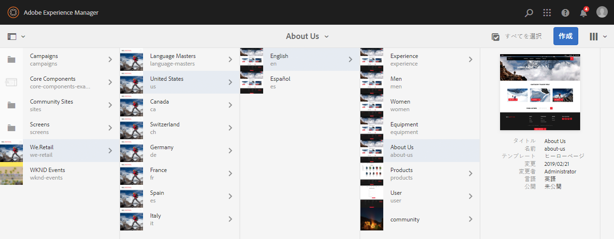

## ページのコンテンツの編集 {#editing-page-content}

ページはページエディターで編集できます。次に例を示します。

`https://localhost:4502/editor.html/content/we-retail/us/en/equipment.html`

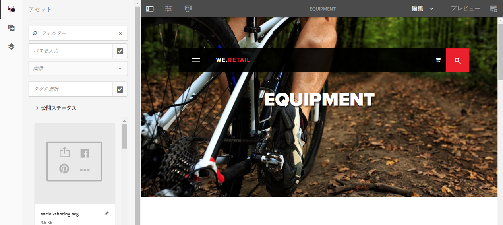

>[!NOTE]
>
>編集対象のページを初めて開くと、機能を紹介する一連のスライドが表示されます。
>
>必要がない場合は、このツアーをスキップすることができます。このツアーは、**ページ情報**&#x200B;メニューからいつでも表示できます。

## ヘルプへのアクセス {#accessing-help}

ページの編集中、**ヘルプ**&#x200B;には次の場所からアクセスできます。

* [**ページ情報**](/help/sites-authoring/editing-page-properties.md#page-properties)&#x200B;セレクター。これにより、（エディターに初めてアクセスしたときに表示される）紹介用のスライドが表示されます。
* 特定のコンポーネントの[設定](/help/sites-authoring/editing-content.md#edit-configure-copy-cut-delete-paste)ダイアログ（ダイアログツールバーの？アイコンを使用）。これにより、コンテキスト依存のヘルプが表示されます。

その他の[ヘルプ関連リソースは、コンソールから表示できます](/help/sites-authoring/basic-handling.md#accessing-help)。

## コンポーネントブラウザー {#components-browser}

コンポーネントブラウザーには、現在のページで使用可能なすべてのコンポーネントが表示されます。これらのコンポーネントを適切な場所にドラッグして編集することで、コンテンツを追加できます。

コンポーネントブラウザーはサイドパネル内のタブです（[アセットブラウザー](/help/sites-authoring/author-environment-tools.md#assets-browser)と[コンテンツツリー](/help/sites-authoring/author-environment-tools.md#content-tree)も同じ場所にあります）。サイドパネルを開く（または閉じる）には、ツールバーの左上にある次のアイコンを使用します。

サイドパネルを開く際、パネルは（左側から）スライドして開きます（必要に応じて「**コンポーネント**」タブを選択）。開いたら、ページで使用可能なすべてのコンポーネントを閲覧することができます。

実際の外観や処理は、使用しているデバイスの種類によって異なります。

>[!NOTE]
>
>モバイルデバイスは、幅が 1,024 px 未満の場合に検出されます。これは、デスクトップの小さいウィンドウの場合にも当てはまります。

* **モバイルデバイス（iPad など）**

   コンポーネントブラウザーは、編集中のページ全体に開かれます。

   ページにコンポーネントを追加するには、目的のコンポーネントをタッチ＆ホールドし、右側に移動します。コンポーネントブラウザーが閉じてページが再表示され、このページ上でコンポーネントを配置できます。

   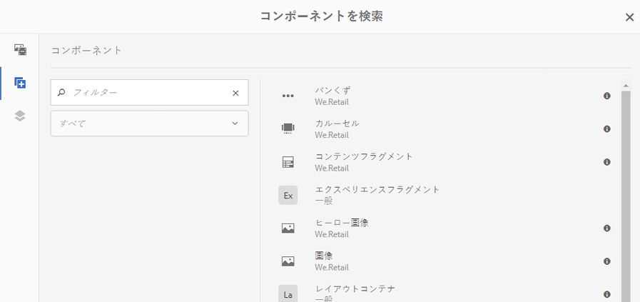

* **デスクトップデバイス**

   コンポーネントブラウザーがウィンドウの左側に開きます。

   ページにコンポーネントを追加するには、目的のコンポーネントをクリックして、必要な位置までドラッグします。

   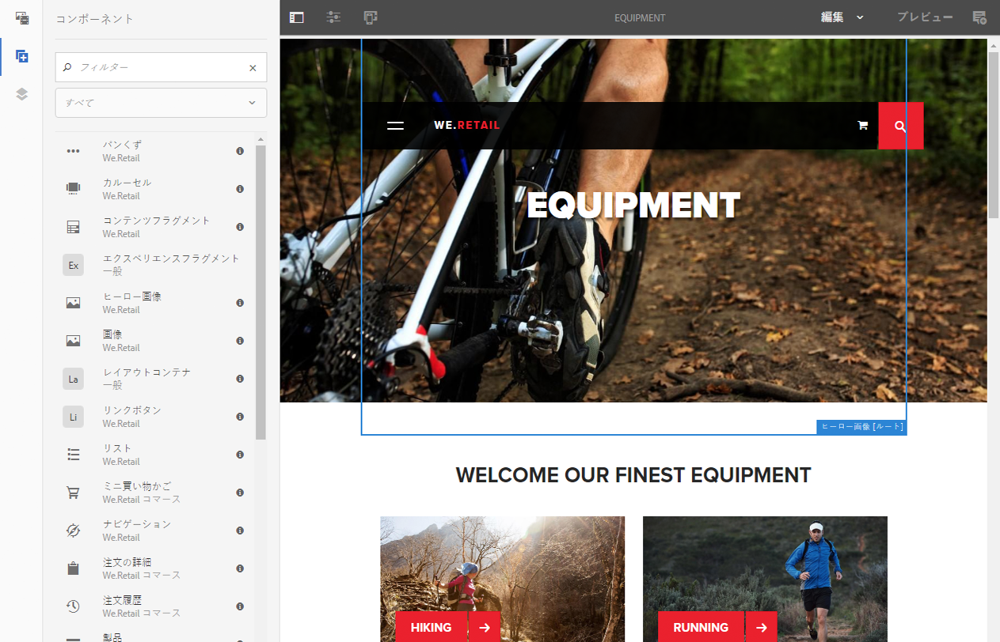

   コンポーネントは次のものによって表されます。

   * コンポーネント名
   * コンポーネントグループ（灰色）
   * アイコンまたは略語

      * 標準コンポーネントのアイコンはモノクロです。
      * 略語は常にコンポーネント名の最初の 2 文字です。

   **コンポーネント**&#x200B;ブラウザーの上部のツールバーでは、次の操作を実行できます。

   * コンポーネントを名前でフィルターします。
   * ドロップダウンから選択して特定のグループのみを表示します。

   コンポーネントについて詳しくは、**コンポーネント**&#x200B;ブラウザー内のコンポーネントの横にある情報アイコンをクリックまたはタップしてください（使用可能な場合）。例えば、**レイアウトコンテナ**&#x200B;の場合は、次のようになります。

   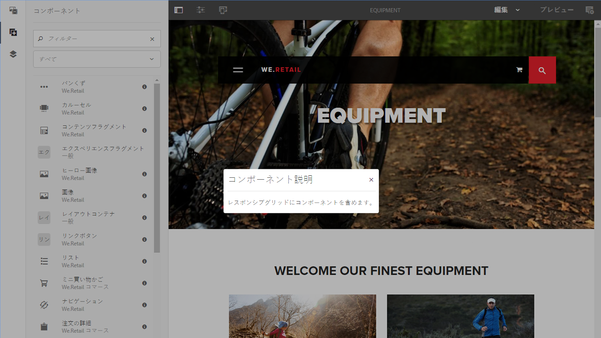

   使用可能なコンポーネントについて詳しくは、[コンポーネントコンソール](/help/sites-authoring/default-components-console.md)を参照してください。

## アセットブラウザー {#assets-browser}

アセットブラウザーには、現在のページで直接使用可能なすべての[アセット](/help/assets/home.md)が表示されます。

アセットブラウザーはサイドパネル内のタブであり、[コンポーネントブラウザー](/help/sites-authoring/author-environment-tools.md#components-browser)と[コンテンツツリー](/help/sites-authoring/author-environment-tools.md#content-tree)も同じ場所にあります。サイドパネルを開く（または閉じる）には、ツールバーの左上にある次のアイコンを使用します。

サイドパネルを開く際、パネルは（左側から）スライドして開きます。必要に応じて「**アセット**」タブを選択します。

アセットブラウザーが開くと、ページで使用可能なすべてのアセットを参照できます。必要に応じて無限スクロールを使用してリストを拡大できます。

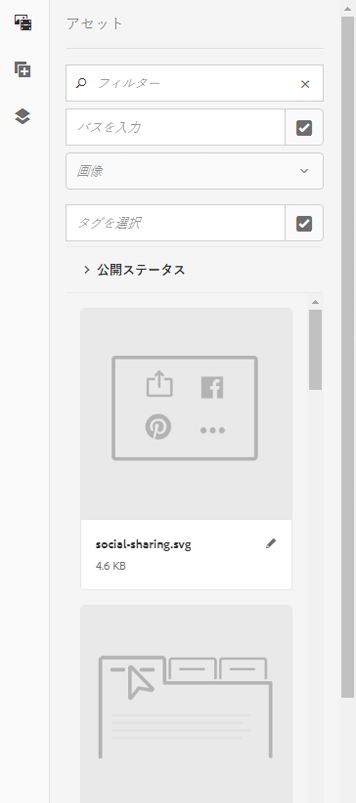

ページにアセットを追加するには、選択して必要な位置までドラッグします。次のアセットを使用できます。

* 適切な種類の既存のコンポーネント。

   * 例えば、画像タイプのアセットを画像コンポーネントにドラッグできます。

* 適切なタイプの新しいコンポーネントを作成するための段落システム内の[プレースホルダー](/help/sites-authoring/editing-content.md#component-placeholder)。

   * 例えば、画像タイプのアセットを段落システムにドラッグして画像コンポーネントを作成できます。

>[!NOTE]
>
>これは特定のタイプのアセットとコンポーネントで使用できます。詳しくは、[アセットブラウザーを使用したコンポーネントの挿入](/help/sites-authoring/editing-content.md#inserting-a-component-using-the-assets-browser)を参照してください。

アセットブラウザーの上部のツールバーでは、アセットを次の項目で検索できます。

* 名前
* パス
* アセットタイプ（画像、原稿、ドキュメント、ビデオ、ページ、段落、商品など）
* 方向（縦長、横長、正方形）やスタイル（カラー、モノクロ、グレースケール）などのアセットの特性

   * 特定のアセットタイプでのみ使用可能

実際の外観や処理は、使用しているデバイスの種類によって異なります。

>[!NOTE]
>
>モバイルデバイスは、幅が 1,024 px 未満の場合に検出されます。つまり、画面の小さいデスクトップも検出されます。

* **iPad などのモバイルデバイス**

   アセットブラウザーは、編集中のページ全体に表示されます。

   ページにアセットを追加するには、目的のアセットをタッチ＆ホールドし、右側に移動します。アセットブラウザーが閉じてページが再表示され、このページ上で目的のコンポーネントにアセットを追加できます。

   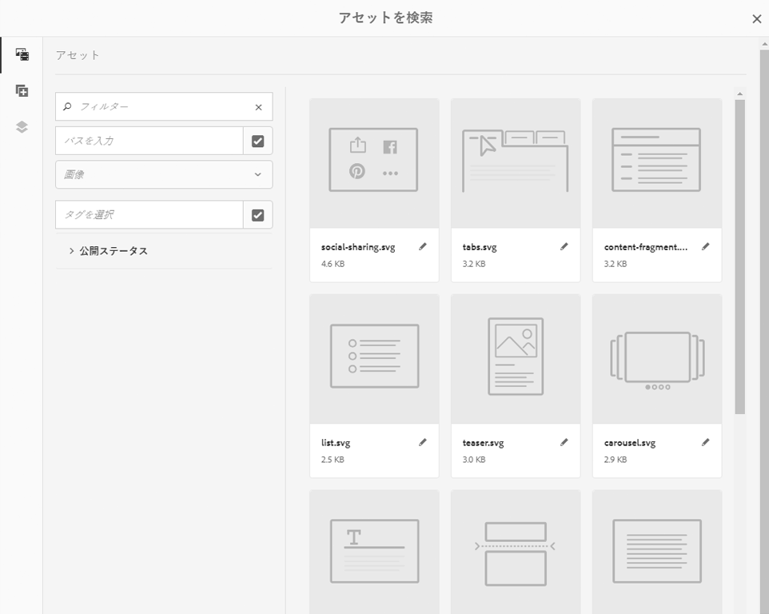

* **デスクトップデバイス**

   アセットブラウザーがウィンドウの左側に開きます。

   ページにアセットを追加するには、目的のアセットをクリックして、必要なコンポーネントまたは場所までドラッグします。

   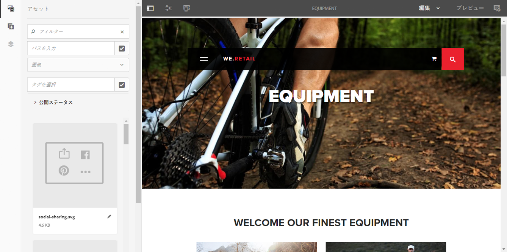

アセットをすばやく変更する必要がある場合は、アセット名の横にある編集アイコンをクリックして、アセットブラウザーから直接[アセットエディター](/help/assets/manage-assets.md)を開始できます。

## コンテンツツリー {#content-tree}

**コンテンツツリー**&#x200B;は、ページの構成を一目で確認できるように、ページのすべてのコンポーネントの概要を階層形式で表示します。

コンテンツツリーは、サイドパネル内のタブです（コンポーネントブラウザーとアセットブラウザーも同じ場所にあります）。サイドパネルを開く（または閉じる）には、ツールバーの左上にある次のアイコンを使用します。

サイドパネルを開く際、パネルは（左側から）スライドして開きます。必要に応じて「**コンテンツツリー**」タブを選択します。このタブを開くと、ページまたはテンプレートをツリービューで確認でき、コンテンツの階層的な構造を簡単に理解できます。また、複雑なページではページのコンポーネント間をジャンプしやすくなります。

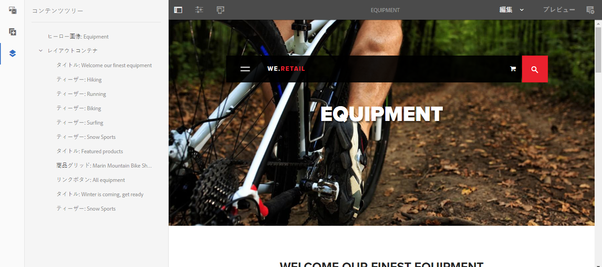

ページは同じタイプの多数のコンポーネントで簡単に構成できます。コンテンツ（コンポーネント）ツリーには、コンポーネントタイプの名前（黒色）の後に説明テキスト（灰色）が表示されます。説明テキストは、コンポーネントの共通プロパティ（タイトル、テキストなど）から取得されます。

コンポーネントタイプはユーザーの言語で表示されますが、コンポーネントの説明テキストはページの言語で表示されます。

コンポーネントの横にある山形アイコンをクリックすると、レベルを折りたたむ、または展開することができます。

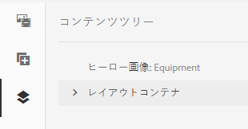

>[!NOTE]
>
>ページをモバイルデバイス（ブラウザーの幅が 1,024 px より小さい場合）で編集している場合、コンテンツツリーは表示されません。

コンポーネントをクリックすると、ページエディターでそのコンポーネントが強調表示されます。使用可能なアクションは、ページの状態によって異なります。

* 次の基本ページの例を示します。

   `https://localhost:4502/editor.html/content/we-retail/language-masters/en/equipment.html`

   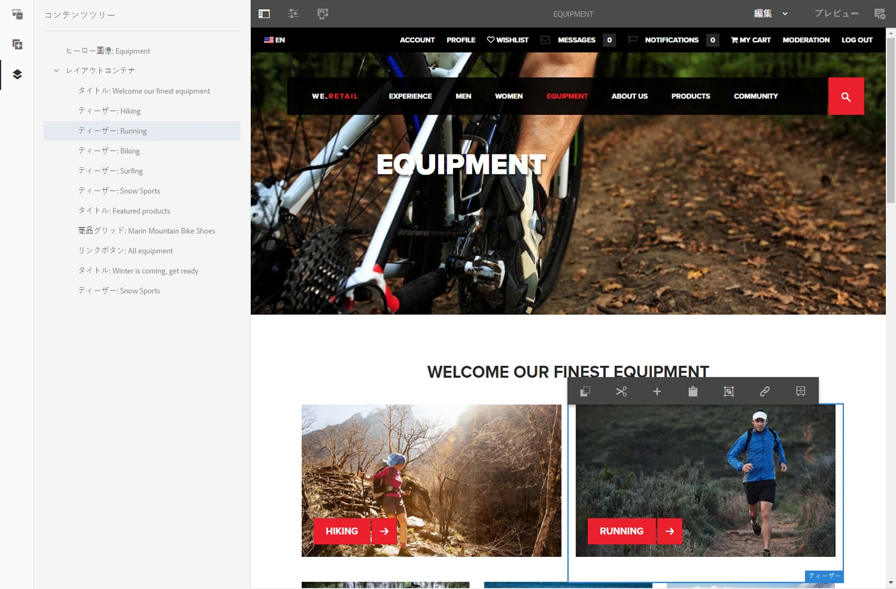

   ツリーでクリックしたコンポーネントが編集可能な場合は、スパナアイコンが名前の右側に表示されます。このアイコンをクリックすると、コンポーネントの編集ダイアログが直接開始されます。

   

* または、](/help/sites-administering/msm.md)ライブコピー[の一部を構成するページが開かれます。ここではコンポーネントが別のページから継承されます。次のページの例を示します。

   `https://localhost:4502/editor.html/content/we-retail/us/en/equipment.html`

   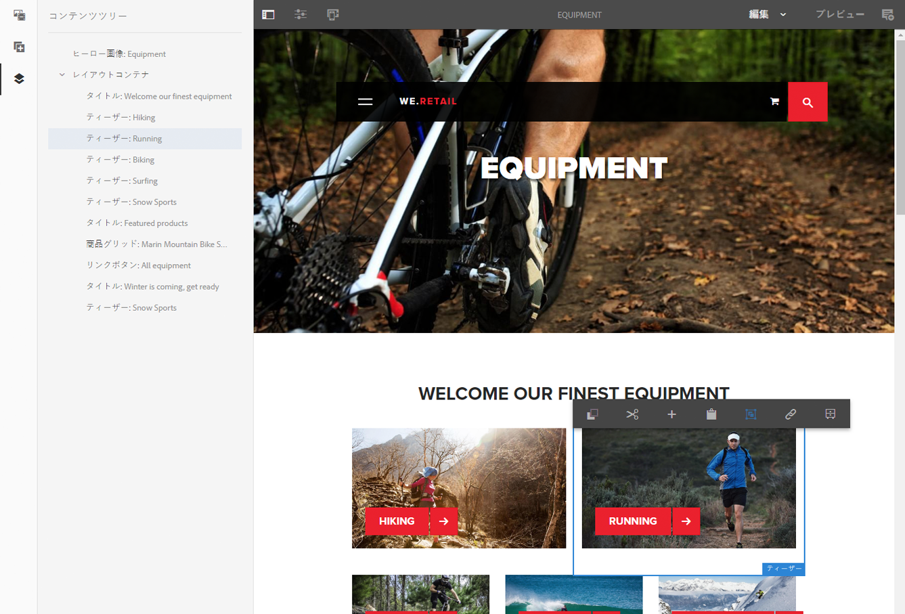

## フラグメント - 関連コンテンツブラウザー {#fragments-associated-content-browser}

ページにコンテンツフラグメントが含まれている場合、[関連コンテンツのブラウザー](/help/sites-authoring/content-fragments.md#using-associated-content)にもアクセスできます。

## 参照 {#references}

**参照**&#x200B;には、選択したページへの接続が表示されます。

* ブループリント
* ローンチ
* ライブコピー
* 言語コピー
* 被リンク
* 参照コンポーネントの使用：借りたコンテンツと貸したコンテンツ
* 商品ページへの参照（コマース／商品コンソールから）

必要なコンソールを開いたら、必要なリソースに移動し、次を使用して「**参照**」を開きます。

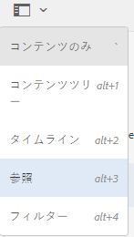

[必要なリソースを選択](/help/sites-authoring/basic-handling.md#viewing-and-selecting-resources)し、そのリソースに関連する参照タイプのリストを表示します。

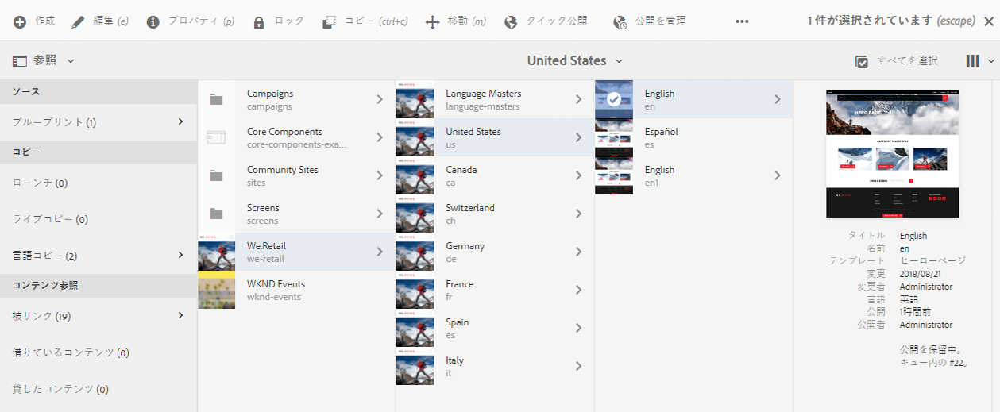

適切な参照タイプを選択すると、詳細情報が表示されます。状況によっては、次のような特定の参照の選択時にアクションを追加で実行できます。

* **被リンク**（当該ページを参照するページのリストと、特定のリンクを選択したときにそれらのページのいずれかを&#x200B;**編集**&#x200B;できる直接アクセスを提供）

* **参照**&#x200B;コンポーネントを使用した借りたコンテンツおよび貸したコンテンツのインスタンス（ここから参照元／参照先ページに移動可能）

* [商品ページへの参照](/help/sites-administering/generic.md#showing-product-references)（コマース／商品コンソールから使用可能）
* [ローンチ](/help/sites-authoring/launches.md)（関連するローンチへのアクセスを提供）
* ライブコピー（選択したリソースに基づくすべてのライブコピーのパスを表示）
* [Blueprint](/help/sites-administering/msm-best-practices.md)，詳細と様々なアクションを提供
* [言語コピー](/help/sites-administering/tc-manage.md#creating-translation-projects-using-the-references-panel)（詳細と各種アクションを提供）

例えば、壊れている参照は、参照コンポーネントで修正できます。

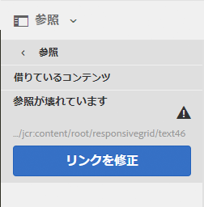

## イベント - タイムライン {#events-timeline}

該当するリソース（例：**サイト**&#x200B;コンソールからのページ、**アセット**&#x200B;コンソールからのアセット）では、[タイムラインを使用して、選択した項目に対する最近のアクティビティを表示できます](/help/sites-authoring/basic-handling.md#timeline)。

必要なコンソールを開いたら、必要なリソースに移動し、次を使用して「**タイムライン**」を開きます。

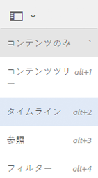

[必要なリソースを選択](/help/sites-authoring/basic-handling.md#viewing-and-selecting-resources)し、「**すべて表示**」または「**アクティビティ**」を選択すると、選択したリソースに対する最近のアクションが一覧表示されます。

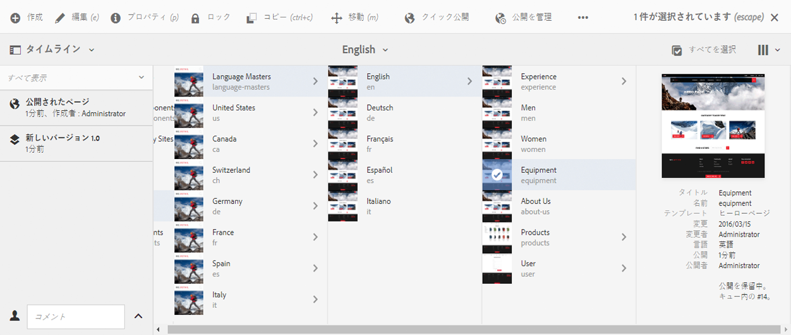

## ページ情報 {#page-information}

ページ情報（イコライザーアイコン）をクリックするとメニューが開き、最後の編集および最後の公開に関する詳細も表示されます。ページ、そのページのサイト、使用しているインスタンスの特性に応じて、使用できるオプションの数は異なります。

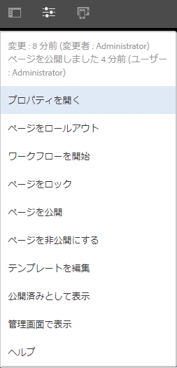

* [プロパティを開く](/help/sites-authoring/editing-page-properties.md)
* [ページをロールアウト](/help/sites-administering/msm.md#msm-from-the-ui)
* [ワークフローを開始](/help/sites-authoring/workflows-applying.md#starting-a-workflow-from-the-page-editor)
* [ページをロック](/help/sites-authoring/editing-content.md#locking-a-page)
* [ページを公開](/help/sites-authoring/publishing-pages.md#main-pars-title-10)
* [ページを非公開にする](/help/sites-authoring/publishing-pages.md#main-pars-title-5)
* [テンプレートを編集](/help/sites-authoring/templates.md)（ページが[編集可能なテンプレート](/help/sites-authoring/templates.md#editable-and-static-templates)に基づいている場合）

* [公開済みとして表示](/help/sites-authoring/editing-content.md#view-as-published)
* [管理画面で表示](/help/sites-authoring/basic-handling.md#viewing-and-selecting-resources)
* [ヘルプ](/help/sites-authoring/basic-handling.md#accessing-help)

例えば、該当する場合、**ページ情報**&#x200B;には次のオプションもあります。

* [ローンチを昇格](/help/sites-authoring/launches-promoting.md)（ページがローンチの場合）
* [このオプションが管理者によって](/help/sites-authoring/select-ui.md#switching-to-classic-ui-when-editing-a-page)[有効にされている場合は、クラシックUIで開く](/help/sites-administering/enable-classic-ui-editor.md)

該当する場合、**ページ情報**&#x200B;から分析や推奨を確認することもできます。

## ページモード {#page-modes}

ページの編集時には様々なモードがあり、異なるアクションをおこなうことができます。

* [編集](/help/sites-authoring/editing-content.md) - ページコンテンツの編集時に使用するモード。
* [レイアウト](/help/sites-authoring/responsive-layout.md) - デバイスに応じたレスポンシブレイアウトを作成および編集できます（ページがレイアウトコンテナに基づいている場合）

* [基礎モード](/help/sites-authoring/scaffolding.md) - 同じ構造を共有しながらコンテンツが異なるページを大量に作成する場合に役立ちます。
* [開発者](/help/sites-developing/developer-mode.md) - 様々なアクションを実行できます（権限が必要です）。このアクションには、ページやそのコンポーネントの技術的な詳細の検査が含まれます。

* [デザイン](/help/sites-authoring/default-components-designmode.md) - ページで使用するコンポーネントを有効／無効にしたり、コンポーネントのデザインを設定したりできます（ページが[静的テンプレート](/help/sites-authoring/templates.md#editable-and-static-templates)に基づいている場合）。

* [ターゲット設定](/help/sites-authoring/content-targeting-touch.md) - すべてのチャネルにわたるターゲット設定と測定を通じてコンテンツの関連性を高めます。
* [アクティビティマップ](/help/sites-authoring/page-analytics-using.md#analyticsvisiblefromthepageeditor) - ページの分析データを表示します。

* [タイムワープ](/help/sites-authoring/working-with-page-versions.md#timewarp) - 特定の時点のページの状態を表示できます。
* [ライブコピーステータス](/help/sites-authoring/editing-content.md#live-copy-status) - ライブコピーのステータスの簡単な概要および継承される（または継承されない）コンポーネントを示します。
* [プレビュー](/help/sites-authoring/editing-content.md#previewing-pages) - パブリッシュ環境とまったく同じ形式でページを表示する、またはコンテンツ内のリンクを使用して移動するために使用します。

* [注釈](/help/sites-authoring/annotations.md) - ページで注釈の追加または表示をおこなう場合に使用するモード。

これらのモードには右上のアイコンを使用してアクセスできます。実際のアイコンは、現在利用中のモードに合わせて変化します。

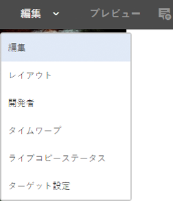

>[!NOTE]
>
>* ページの特性によっては、一部のモードを使用できないことがあります。
>* 一部のモードにアクセスするには、適切な権限または特権が必要です。
>* 開発者モードは、スペースの制約により、モバイルデバイスでは利用できません。
>* [キーボードショートカット](/help/sites-authoring/page-authoring-keyboard-shortcuts.md)（`Ctrl-Shift-M`）で、**プレビュー**&#x200B;と、現在選択されているモード（**編集モード**、**レイアウトモード**&#x200B;など）を切り替えることができます。

>

## パスの選択 {#path-selection}

オーサリング時に、別のリソースを選択する必要が生じる場合がよくあります（別のページまたはリソースへのリンクを定義する場合、画像を選択する場合など）。簡単にパスを選択するために、[パスフィールド](/help/sites-authoring/author-environment-tools.md#path-fields)にはオートコンプリート機能があり、[パスブラウザー](/help/sites-authoring/author-environment-tools.md#path-browser)には強力な選択機能があります。

### パスフィールド {#path-fields}

説明のためにここで使用する例は、画像コンポーネントです。コンポーネントの使用および編集について詳しくは、[ページオーサリング用コンポーネント](/help/sites-authoring/default-components.md)を参照してください。

パスフィールドには、オートコンプリート機能とルックアヘッド機能があり、リソースを見つけやすくなりました。

パスフィールドで「**選択ダイアログを開く**」ボタンをクリックすると、[パスブラウザー](/help/sites-authoring/author-environment-tools.md#path-browser)ダイアログが開き、より詳細な選択オプションが表示されます。

または、パスフィールドで入力を開始すると、入力した内容と一致するパスが表示されます。

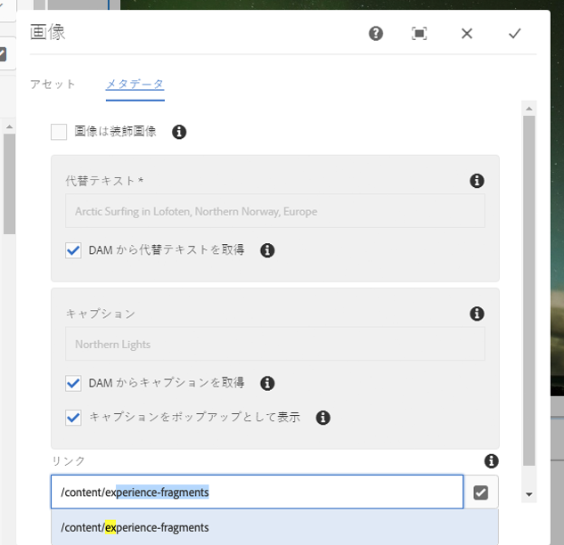

### パスブラウザー {#path-browser}

パスブラウザーは、サイトコンソールの[列表示](/help/sites-authoring/basic-handling.md#column-view)のように整理されており、リソースをより詳細に選択できます。

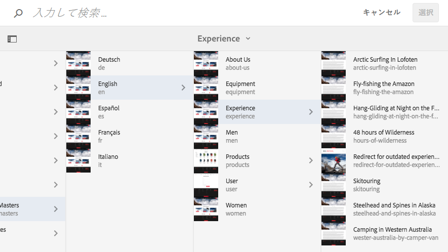

* リソースを選択すると、ダイアログの右上にある「**選択**」ボタンがアクティブになります。クリックまたはタップして選択内容を確認するか、「**キャンセル**」をクリックして中止します。
* コンテキストで複数のリソースを選択できる場合、リソースを選択すると「**選択**」ボタンがアクティブ化され、選択したリソースの数がウィンドウの右上に表示されます。すべての選択を解除するには、数字の横にある **X** をクリックします。
* ツリー内を移動すると、ダイアログ上部のパンくずリストに現在の位置が反映されます。これらのパンくずリストを使用すると、リソース階層内ですばやくジャンプすることもできます。
* ダイアログの上部にある検索フィールドはいつでも使用できます。検索をクリアするには、検索フィールドの **X** をクリックします。
* 検索を絞り込むには、フィルターオプションを表示して、特定のパスに基づいて結果をフィルターできます。

   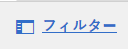

## キーボードショートカット {#keyboard-shortcuts}

様々な[キーボードショートカット](/help/sites-authoring/page-authoring-keyboard-shortcuts.md)を利用できます。
