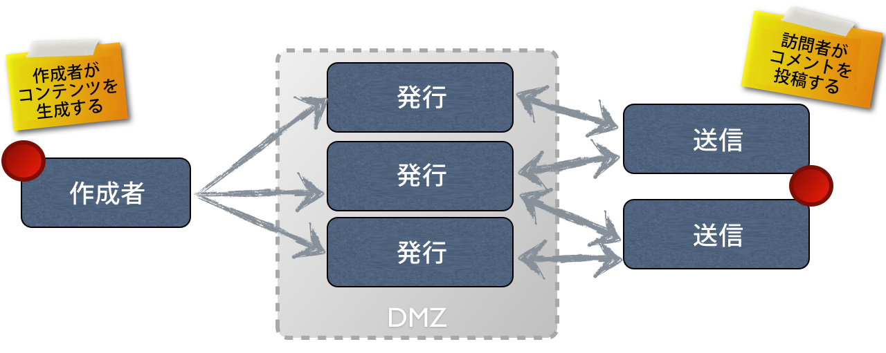

# オーサリング{#authoring}

## Concept of Authoring (and Publishing) {#concept-of-authoring-and-publishing}

AEM には次の 2 種類の環境があります。

* オーサー
* パブリッシュ

これらの環境が相互に影響することで、コンテンツが Web サイト上に公開され、訪問者が閲覧できるようになります。

オーサー環境は、コンテンツを作成および更新し、実際にコンテンツを公開する前にレビューするためのメカニズムを提供します。

* 作成者は、コンテンツを作成およびレビューします（ページ、アセット、パブリケーションなどの様々な種類のコンテンツがあります）。
* このコンテンツが、ある時点で Web サイトに公開されます。

オーサー環境では、AEM の機能は 2 種類の UI により利用できます。パブリッシュ環境では、ユーザーに公開するインターフェイスの全体的なルックアンドフィールをデザインします。

### オーサー環境 {#author-environment}

作成者は、**オーサー環境**&#x200B;と呼ばれる環境で作業します。この環境では、便利なグラフィカルユーザーインターフェイス（GUI または UI）を使用して、コンテンツを作成できます。この環境は通常、完全に保護された企業のファイアウォールの内側に配備されるので、作成者は、適切なアクセス権限が割り当てられたアカウントを使用してログインする必要があります。

>[!NOTE]
>
>コンテンツの作成、編集または公開のための適切なアクセス権限を持つアカウントが必要です。

使用しているインスタンスや、個人のアクセス権限の設定に合わせて、コンテンツに対して次をはじめとする多くのタスクを実行できます。

* ページに対して新しいコンテンツの生成や既存のコンテンツの編集をおこないます。
* あらかじめ定義されたテンプレートを使用して、新しいコンテンツページを作成します。
* アセットやコレクションを作成、編集および管理します。
* パブリケーションを作成、編集および管理します。
* キャンペーンや関連リソースを開発します。
* コミュニティサイトを開発および管理します。
* コンテンツページ、アセットなどを移動、コピーまたは削除します。
* ページ、アセットなどを公開（または非公開に）します。

さらに、コンテンツの管理に役立つ次のような管理タスクがあります。

* 変更の管理方法を制御するワークフロー（パブリケーション前でのレビューの適用など）
* 個々のタスクを調整するプロジェクト

>[!NOTE]
>
>また、AEM は、大部分のタスクについてオーサー環境から[管理](/help/sites-administering/home.md)されます。

#### パブリッシュ環境 {#publish-environment}

When ready, the AEM site&#39;s content is published to the **publish environment**. これで、対象となるオーディエンスは、設計したインターフェイスのルックアンドフィールどおりに Web サイトのページを利用できます。

通常、パブリッシュ環境は保護解除された領域（DMZ）内に配置されます。つまり、インターネットで使用できますが、内部ネットワークの完全保護下にはありません。

AEM サイトが[コミュニティサイト](/help/communities/overview.md)の場合、または [Communities コンポーネント](/help/communities/author-communities.md)を含む場合、サインインしたサイト訪問者（メンバー）は、Communities の機能を利用できます。例えば、フォーラムに投稿したり、コメントを投稿したり、他のメンバーに従ったりできます。 メンバーには、新しいページ（コミュニティグループ）の作成、ブログ記事の作成、他のメンバーの投稿のモデレートなど、通常は作成者環境に限定されるアクティビティを実行する権限を与えられます。

>[!NOTE]
>
>用語が一部重複して使用されている場合があります。この状況は次の用語で発生しています。
>
>* **公開／非公開**
   >  環境でコンテンツを公開する（または非公開にする）アクションに対して主に使用される用語です。
   >
   >
* **アクティブ化／非アクティブ化**
   >  公開／非公開と同義です。
   >
   >
* **レプリケート／レプリケーション**
   >  環境間のデータの移動（ページコンテンツ、ファイル、コード、ユーザーコメントなど）を示すために使用される技術用語は次のとおりです。（例：ユーザーコメントを公開または逆複製する場合）。
>

#### Dispatcher {#dispatcher}

Web サイトの訪問者に対するパフォーマンスを最適化するには、**[Dispatcher](https://helpx.adobe.com/experience-manager/dispatcher/user-guide.html) を使用してロードバランシングとキャッシングを実装します。**
