# 基本操作{#basic-handling}

>[!NOTE]
>
>* このページには、AEM オーサー環境を使用する際の基本操作の概要をまとめています。これは&#x200B;**サイト**&#x200B;コンソールを基礎として使用します。
   >
   >
* 一部の機能はすべてのコンソールでは使用できず、一部のコンソールにしかない機能もあります。個別のコンソールや関連する機能に関する具体的な情報については、他のページで詳しく取り上げます。
>* AEM 全体で（特に、[コンソールを使用する](/help/sites-authoring/keyboard-shortcuts.md)場合と[ページを編集する](/help/sites-authoring/page-authoring-keyboard-shortcuts.md)場合に）、キーボードショートカットを利用できます。
>

## 概要 {#getting-started}

### タッチ対応 UI {#a-touch-enabled-ui}

AEM のユーザーインターフェイスは、タッチ操作に対応しています。タッチ対応インターフェイスを使用すると、タップ、長押し、スワイプなどのタッチジェスチャーを使用して、ソフトウェアを操作できます。この操作は、従来のデスクトップインターフェイスでクリック、ダブルクリック、右クリックおよびマウスオーバーなどのマウスアクションを使用して操作するのとは大きく異なります。

AEM UI はタッチ対応なので、タッチデバイス（モバイルやタブレットなど）上のタッチジェスチャと、従来のデスクトップデバイス上のマウスアクションを使用できます。

### 最初の手順 {#first-steps}

ログインするとすぐに、[ナビゲーションパネル](#navigation-panel)が表示されます。いずれかのオプションを選択すると、対応するコンソールが開きます。

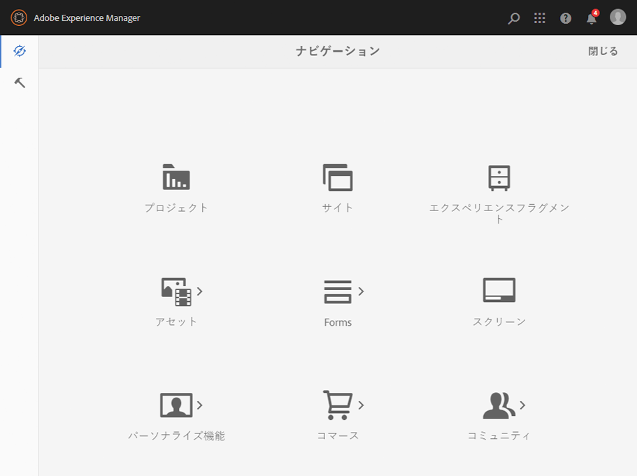

>[!NOTE]
>
>AEM の基本的な使用方法を適切に理解できるように、このドキュメントでは&#x200B;**サイト**&#x200B;コンソールに基づいて説明します。
>
>「**サイト**」をクリックまたはタップして開始します。

### 製品ナビゲーション {#product-navigation}

ユーザーが最初にコンソールにアクセスするといつでも、製品ナビゲーションチュートリアルが開始されます。ここで時間を割いて、ひととおりクリックまたはタップし、AEM の基本操作の概要を把握してください。

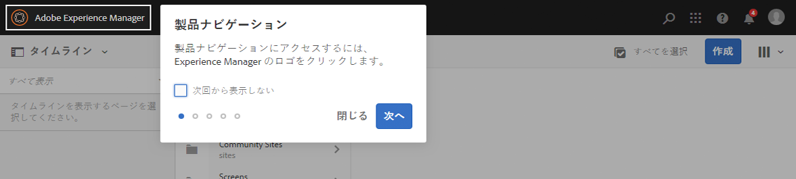

「**次へ**」をクリックまたはタップして、概要の次のページに進みます。「**閉じる**」をクリックまたはタップするか、概要ダイアログの外側をクリックまたはタップして閉じます。

すべてのスライドを表示するか「**次回から表示しない**」オプションをオンにする場合を除き、概要は、次回コンソールにアクセスすると再び開始します。

## グローバルナビゲーション {#global-navigation}

グローバルナビゲーションパネルを使用してコンソール間を移動できます。これは、画面の左上にある Adobe Experience Manager リンクをクリックまたはタップすると、全画面表示のドロップダウンとしてトリガーされます。

「**閉じる**」をクリックまたはタップすると、グローバルナビゲーションパネルが閉じて、前の場所に戻ることができます。

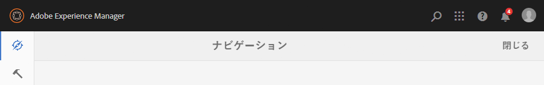

>[!NOTE]
>
>最初にログインすると、**ナビゲーション**&#x200B;パネルが表示されます。

グローバルナビゲーションには、2 つのパネルがあり、画面の左余白にアイコンで表示されます。

* **[ナビゲーション](/help/sites-authoring/basic-handling.md#navigation-panel)**- コンパスと、
* **[ツール](/help/sites-authoring/basic-handling.md#tools-panel)**- ハンマーで表される

次に、これらのパネルで使用できるオプションについて説明します。

### ナビゲーションパネル {#navigation-panel}

ナビゲーションパネルからAEMコンソールにアクセスできます。

コンソールやコンテンツ間を移動すると、ブラウザータブのタイトルが更新され、場所が反映されます。

>[!NOTE]
>
>タブのタイトルは、 [AEM 6.5 Service Pack 5](https://helpx.adobe.com/experience-manager/update-releases-roadmap.html) 以降の場所を反映しています。

ナビゲーションでは、次のコンソールを使用できます。

<table>
 <tbody>
  <tr>
   <td><strong>コンソール</strong></td>
   <td><strong>目的</strong></td>
  </tr>
  <tr>
   <td>Assets  </td>
   <td>これらのコンソールでは、画像、ビデオ、ドキュメント、オーディオファイルなどのデジタルアセットを読み込んで、それらの<a href="/help/assets/home.md">デジタルアセットを管理</a>できます。これにより、これらのアセットは、同じ AEM インスタンス上で実行されているすべての Web サイトで使用できます。 </td>
  </tr>
  <tr>
   <td>コミュニティ</td>
   <td>このコンソールを使用すると、<a href="/help/communities/overview.md#engagement-community">エンゲージメント</a>と<a href="/help/communities/overview.md#enablement-community">イネーブルメント</a>のために<a href="/help/communities/sites-console.md">コミュニティサイト</a>を作成および管理できます。</td>
  </tr>
  <tr>
   <td>コマース</td>
   <td><a href="/help/sites-administering/ecommerce.md">コマース</a>サイトに関連する製品、製品カタログおよび注文を管理できます。</td>
  </tr>
  <tr>
   <td>エクスペリエンスフラグメント</td>
   <td><a href="/help/sites-authoring/experience-fragments.md">エクスペリエンスフラグメント</a>は、チャネル間で再利用でき、バリエーションのあるスタンドアロンエクスペリエンスです。エクスペリエンスやエクスペリエンスの一部を繰り返しコピー＆ペーストする手間を省きます。</td>
  </tr>
  <tr>
   <td>フォーム</td>
   <td>このコンソールを使用すると、<a href="/help/forms/home.md">フォームとドキュメント</a>を作成、管理、処理できます。</td>
  </tr>
  <tr>
   <td>パーソナライズ機能</td>
   <td>このコンソールには、<a href="/help/sites-authoring/personalization.md">ターゲットとなるコンテンツをオーサリングして、パーソナライズされたエクスペリエンスを提供するためのツールのフレームワーク</a>が用意されています。</td>
  </tr>
  <tr>
   <td>プロジェクト</td>
   <td><a href="/help/sites-authoring/touch-ui-managing-projects.md">プロジェクトコンソールは、プロジェクトへのダイレクトアクセスを提供</a>します。プロジェクトは仮想ダッシュボードです。この仮想ダッシュボードを使用すれば、チームを結成して、そのチームがリソース、ワークフローおよびタスクにアクセスできるので、チームメンバーが共通の目標に向かって作業できるようになります。  </td>
  </tr>
  <tr>
   <td>スクリーン</td>
   <td><a href="https://docs.adobe.com/content/help/ja-JP/experience-manager-screens/user-guide/authoring/setting-up-projects/creating-a-screens-project.html">スクリーン</a>では、あらゆる場所、あらゆるサイズの対顧客画面をすべて管理できます。</td>
  </tr>
  <tr>
   <td>サイト</td>
   <td>サイトコンソールでは、AEM インスタンス上で実行される <a href="/help/sites-authoring/page-authoring.md">Web サイトを作成、参照および管理</a>できます。これらのコンソールを通じて、Web サイトページの作成、編集、コピー、移動および削除や、ワークフローの開始、ページの公開をおこなうことができます。  </td>
  </tr>
 </tbody>
</table>

### ツールパネル {#tools-panel}

ツールパネルのサイドパネルの各オプションには、様々なサブメニューが含まれています。[ツールコンソール](/help/sites-administering/tools-consoles.md)を使用すると、Web サイト、デジタルアセットおよびコンテンツリポジトリのその他の要素の管理に役立つ、数多くの専用ツールおよびコンソールにアクセスできます。

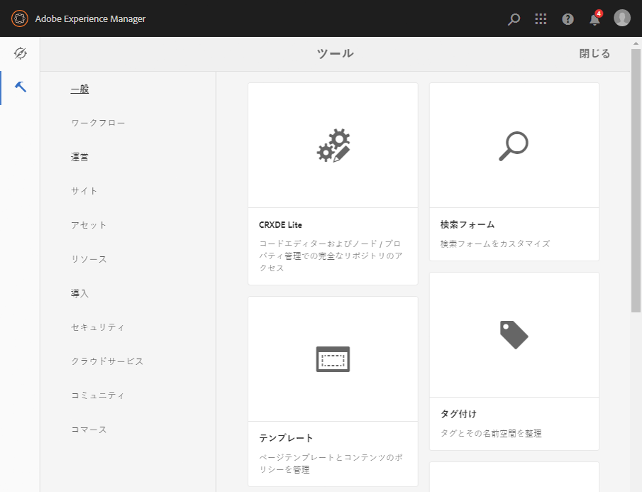

## ヘッダー {#the-header}

ヘッダーは、画面の上部に常に表示されます。ヘッダーのほとんどのオプションはシステムのどこにいても同じですが、一部はコンテキスト固有です。

* [グローバルナビゲーション](#navigatingconsolesandtools)

   コンソール間を移動するには、**Adobe Experience Manager** リンクを選択します。

   

* [検索](/help/sites-authoring/search.md)

   

   [ショートカットキー](/help/sites-authoring/keyboard-shortcuts.md) `/`（スラッシュ）を使用して、任意のコンソールから検索を呼び出すこともできます。

* [ソリューション](https://www.adobe.com/jp/experience-cloud.html)

   

* [ヘルプ](#accessinghelptouchoptimizedui)

   

* [通知](/help/sites-authoring/inbox.md)

   

   このアイコンには、現在割り当てられている未完了の通知の数を示すバッジがつきます。

   >[!NOTE]
   >
   >標準の AEM では、管理者ユーザーグループに割り当てられた管理タスクが事前に読み込まれます。詳しくは、[インボックス - 標準の管理タスク](/help/sites-authoring/inbox.md#out-of-the-box-administrative-tasks)を参照してください。

* [ユーザープロパティ](/help/sites-authoring/user-properties.md)

   

* [パネルセレクター](/help/sites-authoring/basic-handling.md#rail-selector)

   

   現在のコンソールに応じて表示されるオプションです。例えば、**サイト**&#x200B;ではコンテンツのみ（デフォルト）、タイムライン、参照またはサイドパネルのフィルターを選択できます。

   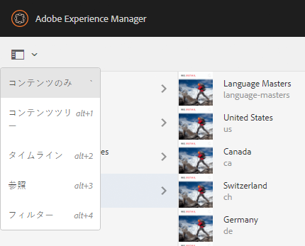

* パンくずリスト

   

   パネルの中央に位置し、常に現在選択している項目の説明を表示するパンくずリストを使用すると、特定のコンソール内を移動できます。サイトコンソールでは、Web サイトのレベル間を移動できます。

   パンくずリストのテキストをクリックするだけで、現在選択している項目の階層のレベルをリストするドロップダウンが表示されます。エントリをクリックすると、その場所にジャンプします。

   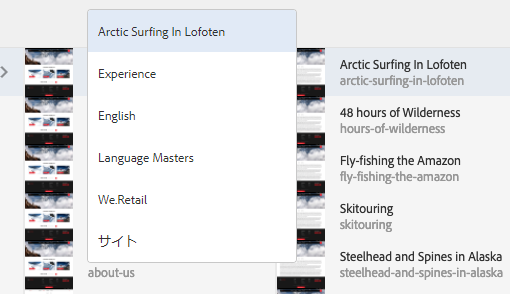

* 分析期間の選択

   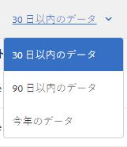

   これは、リスト表示でのみ使用できます。See [list view](#list-view) for more information.

* 「**作成**」ボタン

   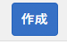

   クリックすると、コンソール／コンテキストに適したオプションが表示されます。

* [表示](/help/sites-authoring/basic-handling.md#viewingandselectingyourresourcescardlistcolumn)

   表示アイコンは AEM ツールバーの右端にあります。このアイコンは、そのときの表示に応じて随時変化します。例えば、デフォルト表示では、次のように&#x200B;**列表示**&#x200B;が表示されます。

   

   列表示、カード表示、リスト表示を切り替えることができます。リスト表示では、表示設定も表示されます。

   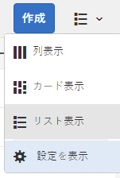

* キーボードナビゲーション

   Webサイト内を移動するには、キーボードのみを使用します。 これは、 **Tabキー(または** Opt + Tab **)の標準的なブラウザ機能を使用して、フォーカス可能なページ上の要素間を移動し**&#x200B;ます **。

   **サイトコンソールには** 、「メインコンテンツに **スキップ**」オプションが追加されています。 これは、ヘッダーオプションを *タブで移動すると表示され* 、（製品）ツールバーの標準要素をスキップしてメインコンテンツに直接移動できるので、ナビゲーションの速度が速くなります。

   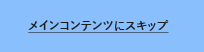

   >[!NOTE]
   >
   >「 **メインコンテンツに** スキップ [」は、](https://helpx.adobe.com/experience-manager/update-releases-roadmap.html) AEM 6.5 Service Pack 5以降で利用できます。

## ヘルプへのアクセス {#accessing-help}

様々なヘルプリソースを使用できます。

* **コンソールツールバー**

   「**ヘルプ**」アイコンにより、現在の場所に応じた適切なリソースが開きます。

   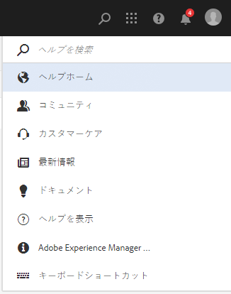

* **ナビゲーション**

   初めてシステムを操作する際に、[AEM の操作を紹介するスライドが表示されます](/help/sites-authoring/basic-handling.md#product-navigation)。

* **ページエディター**

   ページを初めて編集する場合は、ページエディターについて説明する一連のスライドが表示されます。

   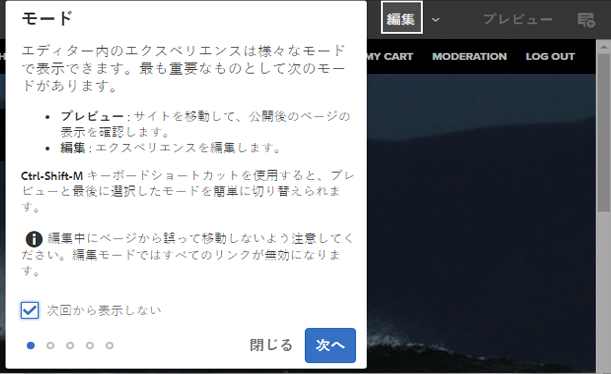

   コンソールに最初にアクセスしたときの[製品ナビゲーションの概要](/help/sites-authoring/basic-handling.md#product-navigation)と同様に、この概要をナビゲートします。

   このスライドをもう一度表示するには、[**ページ情報&#x200B;**メニューの「**&#x200B;ヘルプ&#x200B;**](/help/sites-authoring/author-environment-tools.md#accessing-help)」を選択します。

* **ツールコンソール**

   **ツール**&#x200B;コンソールから外部&#x200B;**リソース**&#x200B;にアクセスすることもできます。

   * **文書** Web Experience Management のドキュメントを表示します。

   * **開発者向けリソース**&#x200B;開発者向けリソースおよびダウンロードです。
   >[!NOTE]
   >
   >コンソールでは、ホットキー `?`（疑問符）を使用して、いつでもショートカットキーの概要を確認できます。
   >
   >すべてのキーボードショートカットの概要については、次のドキュメントを参照してください。
   >
   >    * [ページ編集時のキーボードショートカット](/help/sites-authoring/page-authoring-keyboard-shortcuts.md)
   >    * [コンソールのキーボードショートカット](/help/sites-authoring/keyboard-shortcuts.md)

## アクションツールバー {#actions-toolbar}

リソース（ページやアセットなど）を選択するたびに、様々なアクションがアイコンで示され、ツールバーに説明テキストが表示されます。これらのアクションは、次によって決まります。

* 現在のコンソール.
* 現在のコンテキスト.
* [選択モード](#navigatingandselectionmode)であるかどうか

ツールバーで使用できるアクションは、選択した特定の項目に対して取ることのできるアクションを反映して変化します。

[リソースを選択する](/help/sites-authoring/basic-handling.md#viewing-and-selecting-resources)方法は、表示によって異なります。

一部のウィンドウではスペースが制限されるので、使用可能なスペースよりもツールバーのほうが長くなることがよくあります。この場合は、追加のオプションが表示されます。省略記号（三点リーダーまたは「**...**」）をクリックまたはタップすると、その他のすべてのアクションを含むドロップダウンセレクターが開きます。例えば、**サイト**&#x200B;コンソールでページを選択すると、次のように表示されます。

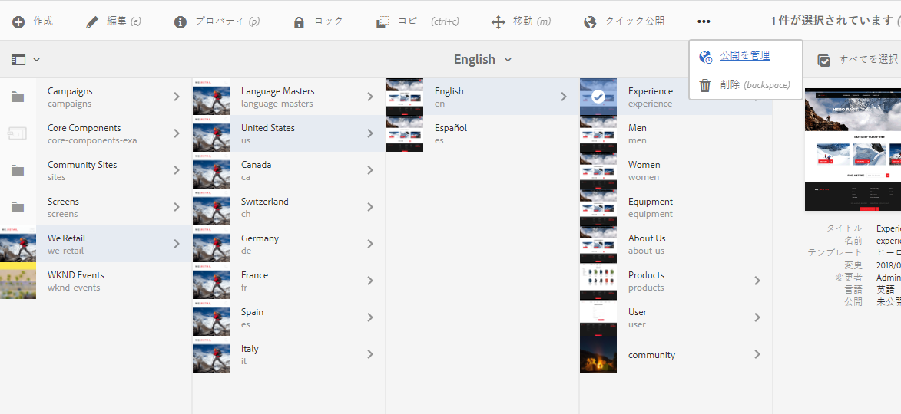

>[!NOTE]
>
>利用可能な個々のアイコンについては、それぞれのコンソール、機能、シナリオに関連するページで説明しています。

## クイックアクション {#quick-actions}

[カード表示](#cardviewquickactions)では、特定のアクションがクイックアクションアイコンとして使用できます。クイックアクションアイコンはツールバーにも表示されます。クイックアクションのアイコンは、一度に 1 つの項目に対してのみ利用できます。このアイコンを使用すると、事前に選択する必要がありません。

クイックアクションは、リソースカードをマウスオーバー（デスクトップデバイスの場合）したときに表示されます。使用できるクイックアクションは、コンソールおよびコンテキストによって異なります。例えば、**サイト**&#x200B;コンソールのページのクイックアクションを次に示します。

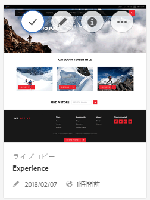

## リソースの表示と選択 {#viewing-and-selecting-resources}

概念上、表示、ナビゲーションおよび選択はすべての表示で同じ操作ですが、使用している表示によって処理がわずかに異なります。

使用可能な任意の表示方法で、リソースを表示、ナビゲーションおよび（追加のアクションをおこなうために）選択できます。表示を選択するには、右上のアイコンを使用します。

* [列表示](#column-view)
* [カード表示](#card-view)

* [リスト表示](#list-view)

>[!NOTE]
>
>デフォルトでは、AEM Assets は、UI のどの表示でもアセットの元のレンディションをサムネールとして表示しません。管理者の場合、オーバーレイを使用して AEM Assets で元のレンディションをサムネールとして表示するように設定できます。

### リソースの選択 {#selecting-resources}

特定のリソースの選択方法は、表示とデバイスの組み合わせによって異なります。

<table>
 <tbody>
  <tr>
   <td> </td>
   <td>選択</td>
   <td>選択解除</td>
  </tr>
  <tr>
   <td>列表示  </td>
   <td>
    <ul>
     <li>デスクトップ： サムネールをクリックする</li>
     <li>モバイルデバイス： サムネールをタップする</li>
    </ul> </td>
   <td>
    <ul>
     <li>デスクトップ： サムネールをクリックする</li>
     <li>モバイルデバイス： サムネールをタップする</li>
    </ul> </td>
  </tr>
  <tr>
   <td>カード表示  </td>
   <td>
    <ul>
     <li>Desktop:  Mouseover, then use the checkmark quick action</li>
     <li>モバイルデバイス： カードをタップ＆ホールドする</li>
    </ul> </td>
   <td>
    <ul>
     <li>Desktop:  Click the card</li>
     <li>Mobile device:  Tap the card</li>
    </ul> </td>
  </tr>
  <tr>
   <td>リスト表示</td>
   <td>
    <ul>
     <li>デスクトップ： サムネールをクリックする</li>
     <li>モバイルデバイス： サムネールをタップする</li>
    </ul> </td>
   <td>
    <ul>
     <li>デスクトップ： サムネールをクリックする</li>
     <li>モバイルデバイス： サムネールをタップする</li>
    </ul> </td>
  </tr>
 </tbody>
</table>

#### すべてを選択 {#select-all}

コンソールの右上隅にある「**すべてを選択**」オプションをクリックすると、あらゆる表示のすべての項目を選択できます。

* **カード表示**&#x200B;では、すべてのカードが選択されます。
* **リスト表示**&#x200B;では、リスト内のすべての項目が選択されます。
* **列表示**&#x200B;では、一番左の列にあるすべての項目が選択されます。

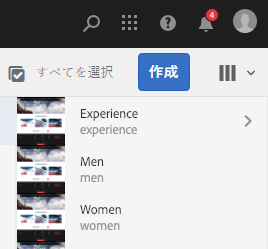

#### すべて選択解除 {#deselecting-all}

どのような場合でも、項目を選択すると、選択された項目の数がツールバーの右上に表示されます。

すべての項目の選択を解除して選択モードを終了するには、次のいずれかをおこないます。

* カウントの横にある **X** をクリックまたはタップする

* **エスケープ**&#x200B;を使用する

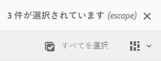

デスクトップデバイスを使用している場合、すべての表示で、キーボードの Esc キーを押すことですべての項目を選択解除できます。

#### 選択の例 {#selecting-example}

1. 例えば、カード表示では次のようになります。

   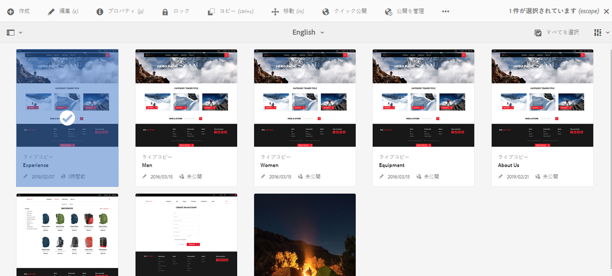

1. リソースを選択すると、上部のヘッダーの上に[アクションツールバー](#actionstoolbar)が重なって表示され、選択したリソースで現在適用可能なアクションにアクセスできます。

   選択モードを終了するには、右上の「**X**」を選択するか、**Esc** キーを使用します。

### 列表示 {#column-view}

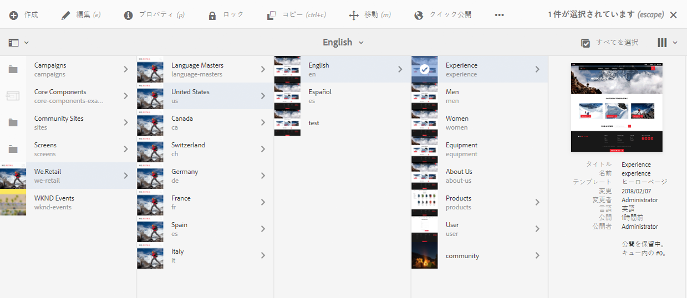

列表示を使用すると、一連のカスケード表示された列によってコンテンツツリーをビジュアルにナビゲーションできます。この表示では、Web サイトのツリー構造を目で見て確認しながら移動できます。

一番左の列のリソースを選択すると、右側の列に子リソースが表示されます。右側の列のリソースを選択すると、さらに右側の列に子リソースが表示されます。

* リソース名かリソース名の右にある山形記号をタップまたはクリックすることで、ツリーを上下に移動できます。

   * リソース名と山形記号は、タップまたはクリックするとハイライト表示されます。
   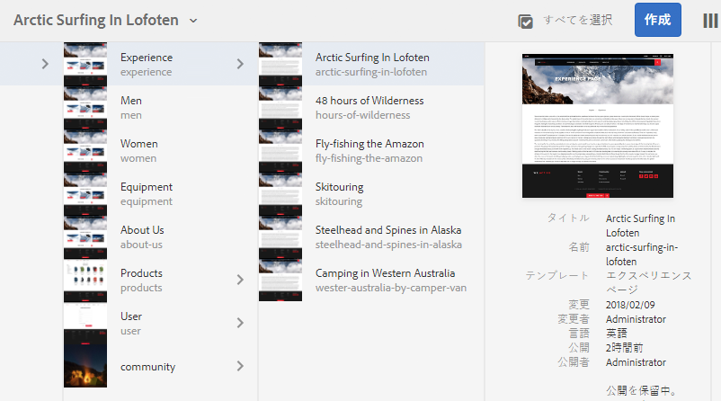

   * クリック／タップしたリソースの子は、クリック／タップしたリソースの右側の列に表示されます。
   * 子を持たないリソース名をタップまたはクリックすると、その詳細が最後の列に表示されます。

* サムネールをタップまたはクリックして、リソースを選択します。

   * 選択すると、チェックマークがサムネールにオーバーレイ表示され、リソース名もハイライト表示されます。
   * 選択されたリソースの詳細が最後の列に表示されます。
   * アクションツールバーが使用可能になります。
   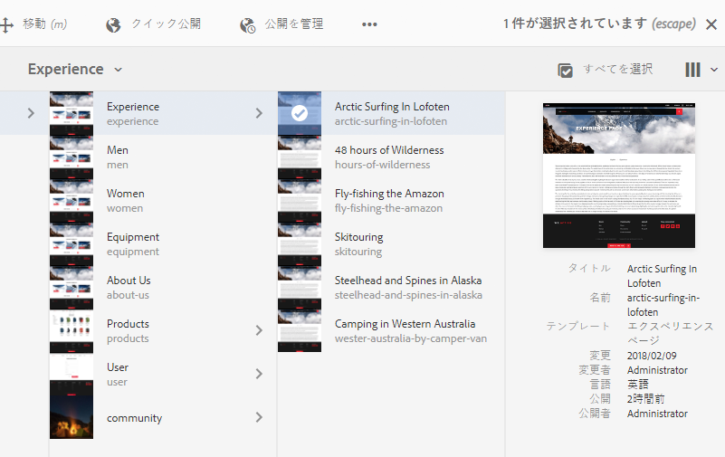

   列表示でページが選択されると、選択したページが次の詳細と共に最後の列に表示されます。

   * ページタイトル
   * ページ名（ページの URL の一部）
   * ページがベースにするテンプレート
   * 変更の詳細
   * ページの言語
   * 公開の詳細

### カード表示 {#card-view}

* カード表示では、現在のレベルの各項目の情報カードを表示します。次のような情報が提供されます。

   * ページの内容を視覚的に表現したもの.
   * ページのタイトル.
   * 重要な日付（最終編集日、最終公開日など）。
   * ページがロックされているかどうか、非表示になっているかどうか、またはライブコピーの一部であるかどうか.
   * 適切な場合、ワークフローの一部としてアクションを実行する必要があるタイミング。

      * 必要なアクションを示すマーカーは、[インボックス](/help/sites-authoring/inbox.md)のエントリに関連している場合があります。

* また、この表示では、選択などの[クイックアクション](#quick-actions)や編集などの共通アクションも使用できます。

   

* カードを（クイックアクションを回避するために慎重に）タップまたはクリックしてツリーの下に移動したり、[ヘッダーのパンくずリスト](/help/sites-authoring/basic-handling.md#the-header)を使用して再び上に移動したりできます。

### リスト表示 {#list-view}

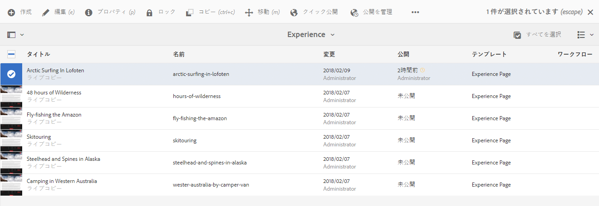

* リスト表示では、現在のレベルの各リソースの情報が表示されます。
* リソース名をタップまたはクリックしてツリーの下に移動したり、[ヘッダーのパンくずリスト](/help/sites-authoring/basic-handling.md#the-header)を使用して上に戻ったりできます。

* リストですべての項目を簡単に選択するには、リストの左上にあるチェックボックスを使用します。

   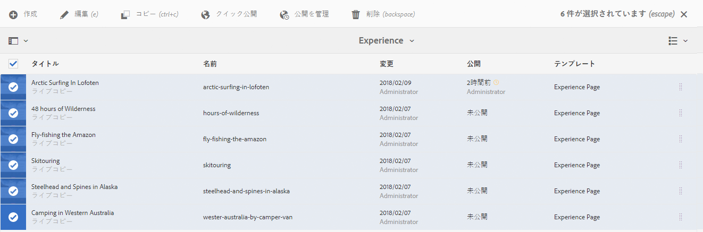

   * リストのすべての項目が選択されると、このチェックボックスがオンになります。

      * すべてを選択解除するには、チェックボックスをクリックまたはタップします。
   * 一部の項目のみが選択された場合、マイナス記号が表示されます。

      * すべてを選択するには、チェックボックスをクリックまたはタップします。
      * すべてを選択解除するには、再度チェックボックスをクリックまたはタップします。

* 表示ボタンの下にある「**設定を表示**」オプションを使用して、表示する列を選択します。次の列を表示できます。

   * **名前** - ページ名。ページの URL の一部で、言語にかかわらず変更されないので、多言語オーサリング環境で便利です
   * **変更** - 最終変更日および最終変更者
   * **公開** - 公開ステータス
   * **テンプレート** - ページがベースにしているテンプレート
   * **ワークフロー** - 現在ページに適用されているワークフローマウスオーバーしたりタイムラインを開いたりすると、詳細情報が表示されます。

   * **ページ分析**
   * **個別訪問者数**
   * **ページ滞在時間**
   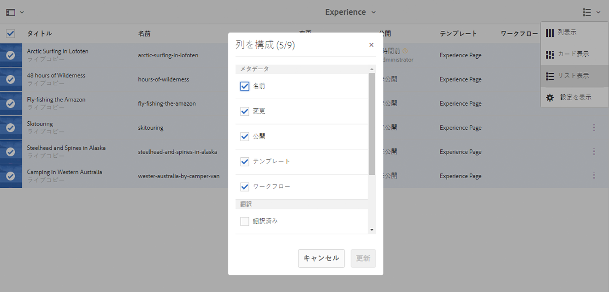

   デフォルトでは、ページの URL の一部を構成する「**名前**」列が表示されます。場合によっては、作成者は、異なる言語のページにアクセスする必要があることがあり、ページの名前（通常は変更なし）を確認することは、作成者がページの言語を知らない場合に非常に役立ちます。

* リストの各項目の右端にある縦の点線マークを使用して項目の順序を変更します。

   >[!NOTE]
   >
   >順序を変更できるのは、`jcr:primaryType` 値が `sling:OrderedFolder` である順序付きフォルダーの内部のみです。

   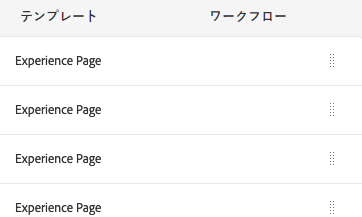

   縦の選択バーをクリックまたはタップして、項目をリストの新しい位置にドラッグします。

   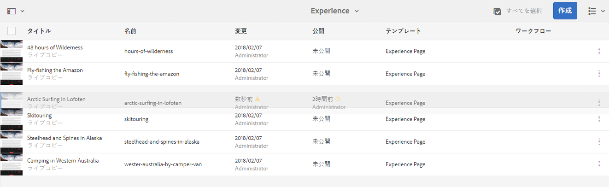

* **設定を表示**&#x200B;ダイアログを使用して適切な列を表示することで、分析データを表示できます。

   ヘッダーの右側にあるフィルターオプションを使用して、過去 30 日、90 日または 365 日の分析データをフィルターできます。

   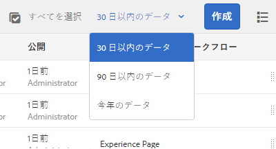

## パネルセレクター {#rail-selector}

**パネルセレクター**&#x200B;は、ウィンドウの左上にあり、現在のコンソールに応じてオプションを表示します。

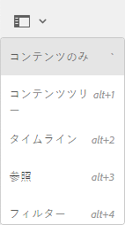

例えば、サイトでは、コンテンツのみ（デフォルト）、コンテンツツリー、タイムライン、参照またはフィルターのサイドパネルを選択できます。

コンテンツのみが選択されている場合は、パネルアイコンのみが表示されます。他のオプションが選択されている場合は、パネルアイコンの隣にオプション名が表示されます。

>[!NOTE]
>
>[キーボードショートカット](/help/sites-authoring/keyboard-shortcuts.md)を使用してパネル表示オプションをすばやく切り替えることができます。

### コンテンツツリー {#content-tree}

コンテンツツリーを使用して、サイドパネル内でサイト階層をすばやく移動したり、現在のフォルダーのページに関する多くの情報を表示したりできます。

コンテンツツリーサイドパネルをリスト表示またはカード表示と共に使用すると、ユーザーはプロジェクトの階層構造を簡単に確認したり、コンテンツツリーサイドパネルを使用して、コンテンツ構造を簡単に移動したり、リスト表示で詳細なページ情報を表示したりできます。

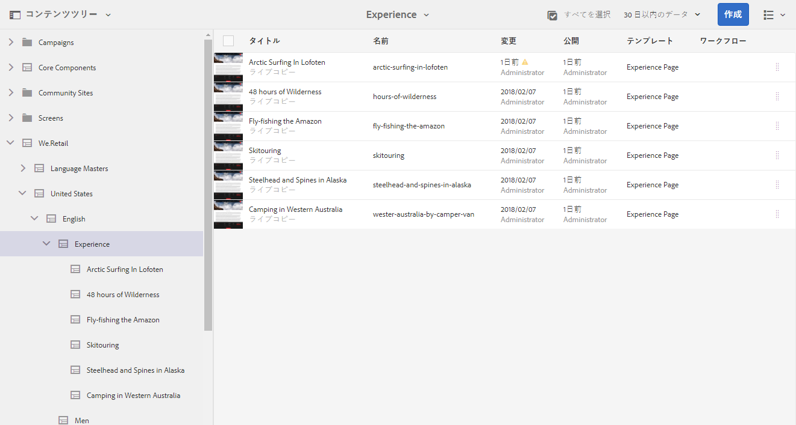

>[!NOTE]
>
>階層表示でエントリを選択すると、矢印キーを使用して階層をすばやく移動できます。
>
>詳しくは、[キーボードショートカット](/help/sites-authoring/keyboard-shortcuts.md)を参照してください。

### タイムライン {#timeline}

タイムラインを使用して、選択したリソースで発生したイベントを表示または開始することができます。「タイムライン」列を開くには、パネルセレクターを使用します。

「タイムライン」列では、次の操作を実行できます。

* [選択した項目に関連する様々なイベントを表示します。](#timelineviewevents)

   * ドロップダウンリストからイベントタイプを選択できます。

      * [コメント](#timelineaddingandviewingcomments)
      * 注釈
      * アクティビティ
      * [ローンチ](/help/sites-authoring/launches.md)
      * [バージョン](/help/sites-authoring/working-with-page-versions.md)
      * [ワークフロー](/help/sites-authoring/workflows-applying.md)

         * 履歴情報が保存されないので、[一時的なワークフロー](/help/sites-developing/workflows.md#transient-workflows)は除きます
      * すべて表示

* [選択した項目に関するコメントを追加または表示します。](#timelineaddingandviewingcomments)イベントのリストの下部に「**コメント**」ボックスが表示されます。コメントを入力して Enter キーを押すと、コメントが登録されます。コメントは「**コメント**」または「**すべて表示**」を選択すると表示されます。

* 特定のコンソールには追加機能が用意されています。例えば、サイトコンソールでは次のアクションを実行できます。

   * [バージョンの保存](/help/sites-authoring/working-with-page-versions.md#creatinganewversiontouchoptimizedui)。
   * [ワークフローを開始](/help/sites-authoring/workflows-applying.md#startingaworkflowfromtherail).

これらのオプションには、「**コメント**」フィールドの横にある山形記号からアクセスできます。

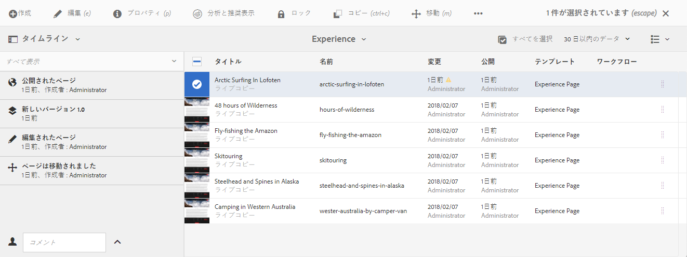

### 参照 {#references}

**参照**&#x200B;には、選択したリソースへの関係が表示されます。例えば、**サイト**&#x200B;コンソールでは、ページの[参照](/help/sites-authoring/author-environment-tools.md#showingpagereferences)には次が表示されます。

* [ローンチ](/help/sites-authoring/launches.md#launches-in-references-sites-console)
* [ライブコピー](/help/sites-administering/msm-livecopy-overview.md#openingthelivecopyoverviewfromreferences)
* [言語コピー](/help/sites-administering/tc-prep.md#seeing-the-status-of-language-roots)
* コンテンツ参照：

   * 他のページから選択ページへのリンク
   * 参照コンポーネントで選択したページから借りたコンテンツや、選択したページに貸したコンテンツ

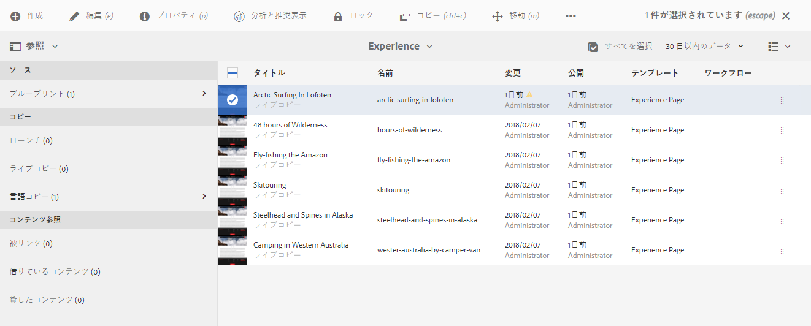

### フィルター {#filter}

これを使用すると、適切な場所フィルターが既に設定された状態で[検索](/help/sites-authoring/search.md)と同じようにパネルが開き、表示したいコンテンツをさらにフィルタリングできます。

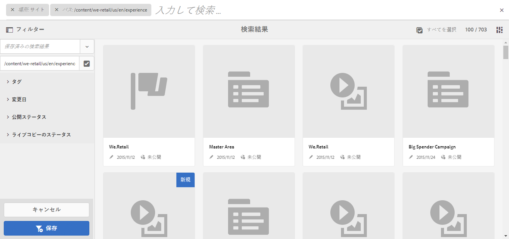

