# Adobe Campaign Classic および Adobe Campaign Standard の使用{#working-with-adobe-campaign-classic-and-adobe-campaign-standard}

AEM で電子メールコンテンツを作成して、Adobe Campaign の電子メールで処理することができます。これを実行するには、次の手順に従う必要があります。

1. AEM で、Adobe Campaign 固有のテンプレートから新しいニュースレターを作成します。
1. コンテンツを編集する前に、すべての機能にアクセスするために [Adobe Campaign サービス](#selecting-the-adobe-campaign-cloud-service-and-template)を選択します。
1. コンテンツを編集します。
1. コンテンツを検証します。

これで、コンテンツを Adobe Campaign での配信と同期できるようになります。詳細な手順についてはこのドキュメントで説明します。

[AEM での Adobe Campaign フォームの作成](/help/sites-authoring/adobe-campaign-forms.md)も参照してください。

>[!NOTE]
>
>この機能を使用するには、AEM を [Adobe Campaign](/help/sites-administering/campaignonpremise.md) または [Adobe Campaign Standard](/help/sites-administering/campaignstandard.md) と連携するように設定する必要があります。

## Adobe Campaign を使用した電子メールコンテンツの送信 {#sending-email-content-via-adobe-campaign}

AEM と Adobe Campaign を設定すると、電子メール配信コンテンツを AEM 内で直接作成した後に、それを Adobe Campaign 内で処理できます。

AEMでAdobe Campaignコンテンツを作成する場合、Adobe Campaignサービスにリンクしてからコンテンツを編集し、すべての機能にアクセスする必要があります。

次の 2 つのケースが考えられます。

* コンテンツを Adobe Campaign からの配信と同期する場合。この場合は、AEM コンテンツを配信に使用できます。
* （Adobe Campaign Classic のみ）コンテンツを Adobe Campaign に直接送信する場合。この場合は、Adobe Campaign が新しい電子メール配信を自動的に生成します。このモードには制限事項があります。

詳細な手順についてはこのドキュメントで説明します。

### 新しい電子メールコンテンツの作成 {#creating-new-email-content}

>[!NOTE]
>
>When adding email templates, be sure to add them under **/content/campaigns** to make them available.

#### 新しい電子メールコンテンツの作成 {#creating-new-email-content-1}

1. In AEM select **Sites** then **Campaigns**, then browse to where your email campaigns are managed. In the following example, the path is **Sites** > **Campaigns** > **Geometrixx Outdoors** > **Email Campaigns**.

   >[!NOTE]
   >
   >[電子メールのサンプルは、Geometrixx でのみ使用できます](/help/sites-developing/we-retail.md)。パッケージ共有からサンプルGeometrixxコンテンツをダウンロードしてください。

   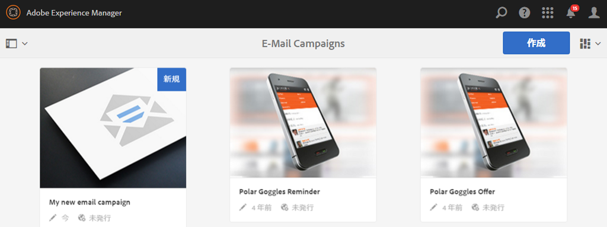

1. 「**作成**」、「**ページを作成**」の順に選択します。
1. 接続している Adobe Campaign に固有の使用可能なテンプレートのいずれかを選択して、「**次へ**」をクリックします。デフォルトでは、次の 3 つのテンプレートが使用可能です。

   * **Adobe Campaign Classic電子メール**:配信用にAdobe Campaign Classicにコンテンツを送信する前に、事前定義済みのテンプレート（2列）にコンテンツを追加できます。
   * **Adobe Campaign Standard電子メール**:配信用にAdobe Campaign Standardにコンテンツを送信する前に、事前定義済みのテンプレート（2列）にコンテンツを追加できます。

1. Fill in the **Title** and optionally the **Description** and click **Create**. 電子メールの編集中に上書きしない限り、タイトルはニュースレターまたは電子メールの件名として使用されます。

### Adobe Campaign クラウドサービスおよびテンプレートの選択 {#selecting-the-adobe-campaign-cloud-service-and-template}

Adobe Campaign と統合するには、Adobe Campaign クラウドサービスをページに追加する必要があります。これにより、パーソナライズ機能や他の Adobe Campaign 情報にアクセスできるようになります。

さらに、Adobe Campaign テンプレートを選択し、件名を変更したり、HTML 表示を使用しない受信者向けのプレーンテキストのコンテンツを追加したりすることが必要な場合もあります。

クラウドサービスは、「**サイト**」タブから選択することも、電子メール／ニュースレターの作成後にその中から選択することもできます。

通常は、「**サイト**」タブからクラウドサービスを選択することを推奨します。電子メールまたはニュースレターからクラウドサービスを選択するには、ちょっとした回避策が必要になります。

**サイト**&#x200B;ページから：

1. AEM で、電子メールページを選択し、「**プロパティを表示**」をクリックします。

   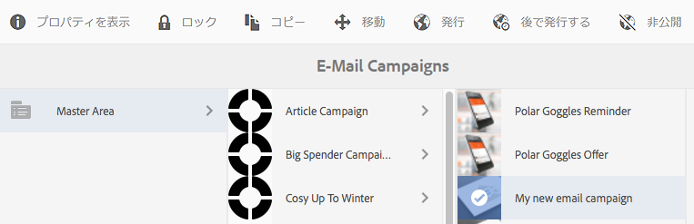

1. Select **Edit** and then the **Cloud services** tab and scroll down to the bottom and click the + sign to add a configuration and then select **Adobe Campaign**.

   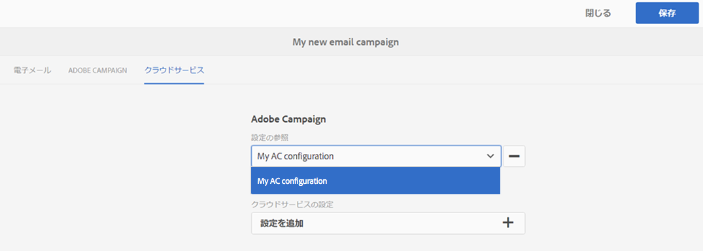

1. 使用している Adobe Campaign インスタンスに一致する設定をドロップダウンリストから選択し、「**保存**」をクリックして確認します。
1. 電子メールが適用されたテンプレートを表示するには、「**Adobe Campaign**」タブをクリックします。 別のテンプレートを選択したい場合は、編集時に電子メール内からテンプレートにアクセスできます。

   If you would like to apply a specific email delivery template (from Adobe Campaign), other than the default mail template, in **Properties**, select the **Adobe Campaign** tab. 関連する Adobe Campaign インスタンス内での電子メール配信テンプレートの内部名を入力します。

   どのテンプレートを選択するかによって、どのパーソナライゼーションフィールドを Adobe Campaign から利用できるかが決まります。

   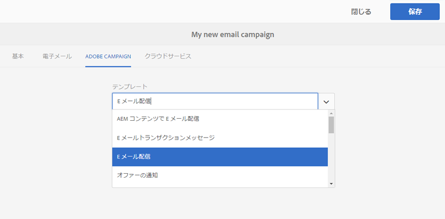

オーサリング時のニュースレター／電子メール内から選択する場合は、レイアウトの問題によって、「**ページのプロパティ**」で Adobe Campaign クラウドサービス設定を選択できないことがあります。その場合は、以下に説明する回避策を使用できます。

1. AEM で、電子メールページを選択し、「**編集**」をクリックします。「**プロパティを開く**」をクリックします。

   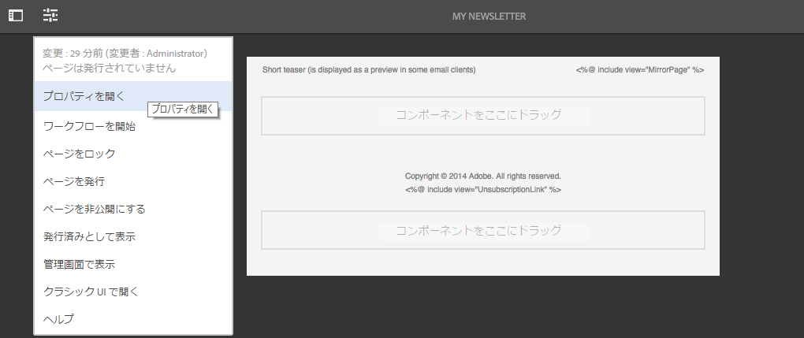

1. Select **Cloud services** and click **+** to add a configuration. 表示される任意の設定を選択します（どれでもかまいません）。「**+**」記号をクリックまたはタップして、別の設定を追加してから、「**Adobe Campaign**」を選択します。

   >[!NOTE]
   >
   >または、「**サイト**」タブで「**プロパティを表示**」を選択して、クラウドサービスを選択することができます。

1. Adobe Campaignインスタンスに一致する設定をドロップダウンリストから選択し、Adobe Campaign用ではない最初に作成した設定を削除して、チェックマークをクリックして確定します。
1. 前述の手順のステップ 4 を続行して、テンプレートを選択し、プレーンテキストを追加します。

### 電子メールコンテンツの編集 {#editing-email-content}

電子メールコンテンツを編集するには：

1. 電子メールを開くと、デフォルトで編集モードに入ります。

   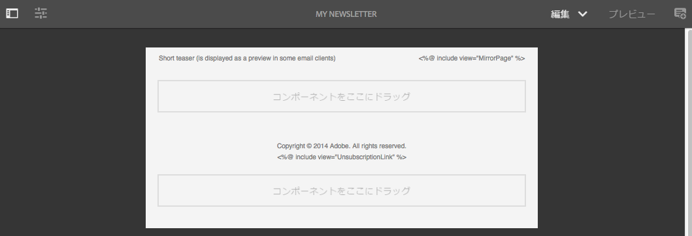

1. If you would like to change the subject of the email or add plain text for those users who will not view the email in HTML, select **Email** and add a subject and text. ページアイコンを選択すると、プレーンテキストのバージョンが HTML から自動生成されます。終了したらチェックマークをクリックします。

   Adobe Campaign のパーソナライゼーションフィールドを使用して、ニュースレターをパーソナライズできます。パーソナライゼーションフィールドを追加するには、Adobe Campaign のロゴが表示されているボタンをクリックして、パーソナライゼーションフィールドピッカーを開きます。このニュースレターで使用可能なフィールドがすべて表示され、その中から選択することができます。

   >[!NOTE]
   >
   >エディター内で「プロパティ」のパーソナライゼーションフィールドがグレー表示になっている場合は、設定を見直してください。

   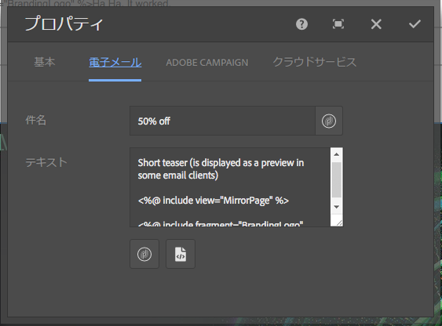

1. Open the components panel on left side of screen and select **Adobe Campaign Newsletter** from the drop-down menu to find those components.

   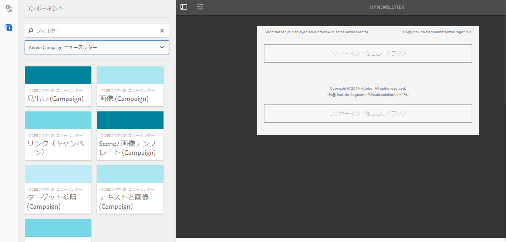

1. コンポーネントをページ上に直接ドラッグし、コンポーネントに応じて編集します。例えば、**テキストおよびパーソナライゼーション（Campaign）**&#x200B;コンポーネントをドラッグして、パーソナライズしたテキストを追加することができます。

   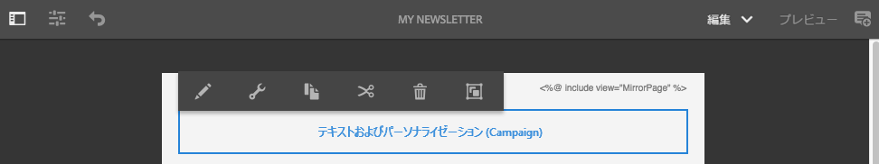

   See [Adobe Campaign Components](/help/sites-authoring/adobe-campaign-components.md) for a detailed description of each component.

   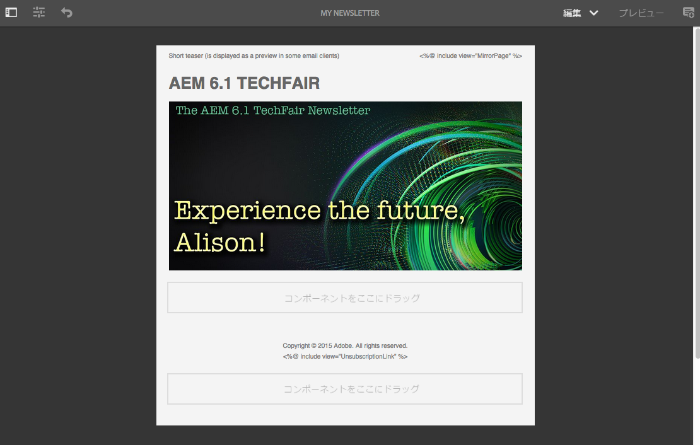

### パーソナライゼーションの挿入 {#inserting-personalization}

コンテンツを編集するとき、次のものを挿入できます。

* Adobe Campaign コンテキストフィールド。これらは、受信者のデータ(名、姓、ターゲットディメンションのデータなど)に応じてテキスト内に挿入できるフィールドです。
* Adobe Campaign パーソナライゼーションブロック。これらは、ブランドロゴやミラーページへのリンクなど、受信者のデータとは関係のない事前定義済みコンテンツのブロックです。

Adobe Campaign コンテンツの詳細については、[Adobe Campaign コンポーネント](/help/sites-authoring/adobe-campaign-components.md)を参照してください。

>[!NOTE]
>
>* Adobe Campaign の「**プロファイル**」ターゲティングディメンションのフィールドのみが考慮されます。
>* When viewing Properties from **Sites**, you do not have access to the Adobe Campaign context fields. これらのフィールドには編集時に電子メール内から直接アクセスできます。

>

パーソナライゼーションを挿入する方法

1. Insert a new **Newsletter** > **Text &amp; Personalization (Campaign)** component by dragging it onto the page.

   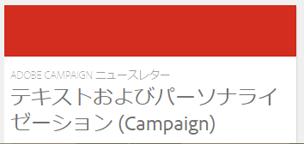

1. 鉛筆アイコンをクリックして、コンポーネントを開きます。インプレースエディターが開きます。

   

   >[!NOTE]
   >
   >**Adobe Campaign Standard の場合：**
   >
   >* 使用可能なコンテキストフィールドは、Adobe Campaign の「**プロファイル**」ターゲティングディメンションに対応しています。
   >* See [Linking an AEM page to an Adobe Campaign email](#linking-an-aem-page-to-an-adobe-campaign-email-adobe-campaign-standard).

   >
   >**Adobe Campaign Classic の場合：**
   >
   >* Available context fields are dynamically recovered from the Adobe Campaign **nms:seedMember** schema. ターゲット拡張データは、コンテンツと同期される配信を含むワークフローから動的に復元されます(See the [Synchronizing content created in AEM with a delivery from Adobe Campaign](#synchronizing-content-created-in-aem-with-a-delivery-from-adobe-campaign-classic) section).
      >
      >
   * To add or hide personalization elements, see [Managing personalization fields and blocks](/help/sites-administering/campaignonpremise.md#managing-personalization-fields-and-blocks).
   >* **重要**：シードテーブルのフィールドはすべて、受信者テーブル（または対応する連絡先テーブル）にも存在する必要があります。

1. テキストを手入力して挿入します。Adobe Campaign コンポーネントをクリックして選択し、コンテキストフィールドまたはパーソナライゼーションブロックを挿入します。完了したら、チェックマークを選択します。

   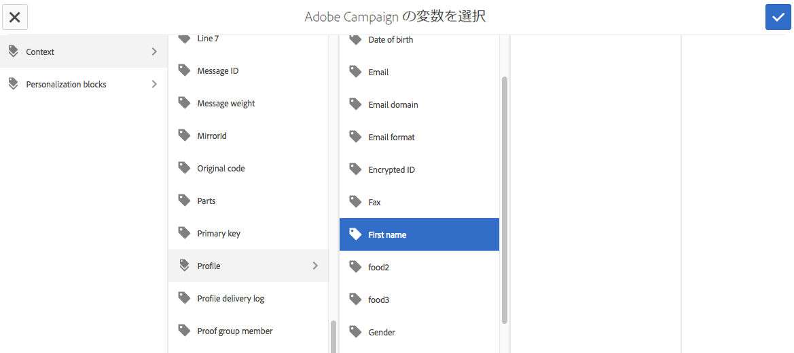

   コンテキストフィールドまたはパーソナライゼーションブロックを挿入したら、ニュースレターをプレビューして、フィールドをテストできます。See [Previewing a Newsletter](#previewing-a-newsletter).

### ニュースレターのプレビュー {#previewing-a-newsletter}

パーソナライゼーションと同様に、ニュースレターもプレビューすることができます。

1. ニュースレターを開いた状態で、AEM の右上隅の「**プレビュー**」をクリックします。AEMは、ユーザーがニュースレターを受け取ったときの外観を表示します。

   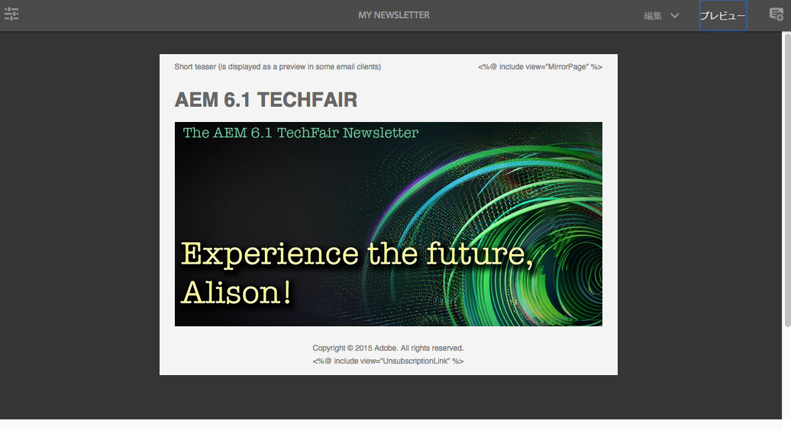

   >[!NOTE]
   >
   >Adobe Campaign Standard でサンプルテンプレートを使用している場合は、配信時にコンテンツを読み込むと、初期コンテンツ（**&quot;&lt;%@ include view=&quot;MirrorPage&quot; %>&quot;** および **&quot;&lt;%@ include view=&quot;UnsubscriptionLink&quot; %>&quot;**）を表示する 2 つのパーソナライゼーションブロックがエラーをスローします。パーソナライゼーションブロックピッカーを使用して、対応するブロックを選択することによって、このエラーを解決できます。

1. パーソナライゼーションをプレビューするには、ツールバーの対応するアイコンをクリックまたはタップして、ContextHub を開きます。現在、パーソナライゼーションフィールドのタグは、選択したペルソナのシードデータで置き換えられています。ContextHub でペルソナを切り替えると変数がどのように変化するかを確認してください。

   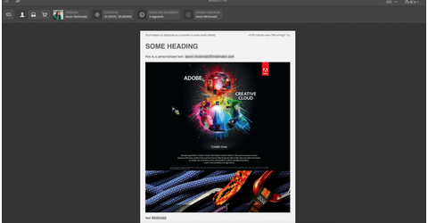

1. 現在選択しているペルソナに関連付けられた、Adobe Campaign のシードデータを表示できます。表示するには、ContextHub バーの Adobe Campaign モジュールをクリックまたはタップします。ダイアログボックスが開き、現在のプロファイルのシードデータがすべて表示されます。再度別のペルソナに切り替えると、データが変化します。

   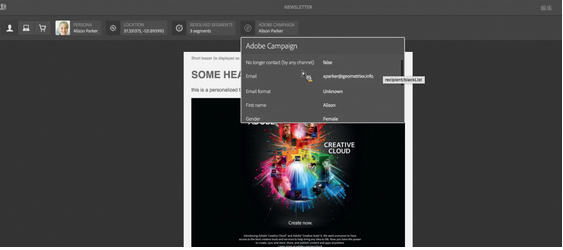

### AEM でのコンテンツの承認 {#approving-content-in-aem}

コンテンツの作成が完了したら、承認プロセスを開始できます。Go to the **Workflow** tab of the toolbox and select the **Approve for Adobe Campaign** workflow.

この既製のワークフローには、改訂して承認または改訂して拒否という 2 つのステップがあります。このワークフローを拡張して、より複雑なプロセスに適合させることができます。

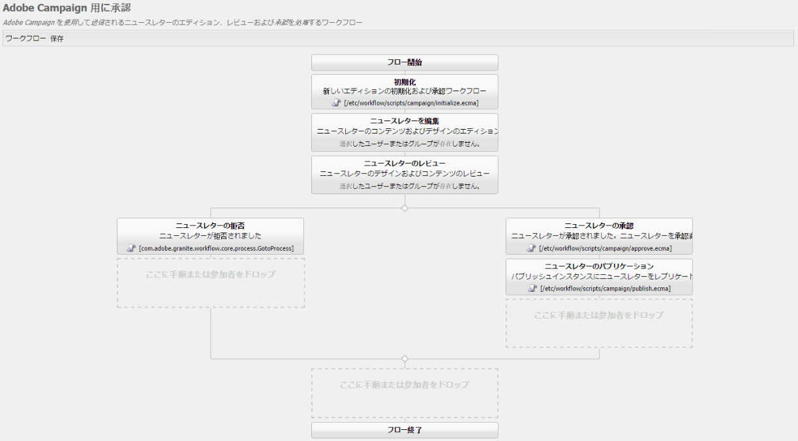

To approve content for Adobe Campaign, apply the workflow by selecting **Workflow** and selecting **Approve for Adobe Campaign** and click **Start Workflow**. 手順に従って、コンテンツを承認します。 ワークフローの最後のステップで、「**承認**」の代わりに「**拒否**」を選択して、コンテンツを拒否することもできます。

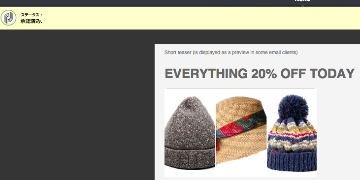

コンテンツを承認すると、承認済みとして Adobe Campaign に表示されます。すると、電子メールを送信できるようになります。

Adobe Campaign Standard の場合：

Adobe Campaign Classic の場合：

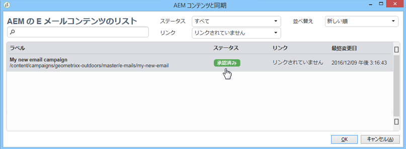

>[!NOTE]
未承認のコンテンツは、Adobe Campaign の配信と同期できますが、配信を実行することはできません。Adobe Campaign の配信を使用して送信できるのは、承認済みのコンテンツだけです。

## AEM と Adobe Campaign Standard および Adobe Campaign Classic のリンク {#linking-aem-with-adobe-campaign-standard-and-adobe-campaign-classic}

AEM と Adobe Campaign をどのようにリンクまたは同期させるかは、使用しているのがサブスクリプションベースの Adobe Campaign Standard か、オンプレミスベースの Adobe Campaign Classic かによって異なります。

使用している Adobe Campaign ソリューションに応じた手順は、以下のセクションを参照してください。

* [Adobe Campaign 電子メールへの AEM ページのリンク（Adobe Campaign Standard）](#linking-an-aem-page-to-an-adobe-campaign-email-adobe-campaign-standard)
* [AEM で作成されたコンテンツと Adobe Campaign Classic の配信の同期](#synchronizing-content-created-in-aem-with-a-delivery-from-adobe-campaign-classic)

### Linking an AEM page to an Adobe Campaign email (Adobe Campaign Standard) {#linking-an-aem-page-to-an-adobe-campaign-email-adobe-campaign-standard}

Adobe Campaign Standard では、次のものを使用して、AEM で作成されたコンテンツを復元し、リンクできます。

* 電子メール
* 電子メールテンプレート

これにより、コンテンツを配信することができます。ページ上に表示されるコードによって、ニュースレターが単一の配信にリンクされているかどうかがわかります。

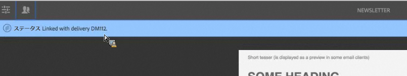

>[!NOTE]
ニュースレターが複数の配信にリンクされている場合は、リンクされている配信の数です（ただし、すべてのIDが表示されるわけではありません）。

AEM で作成されたページと Adobe Campaign の電子メールをリンクするには：

1. AEM 固有の電子メールテンプレートをベースとして新しい電子メールを作成します。Refer to [Creating emails in Adobe Campaign Standard](https://helpx.adobe.com/jp/campaign/standard/channels/using/creating-an-email.html) for more information.

   

1. 配信ダッシュボードから&#x200B;**コンテンツ**&#x200B;ブロックを開きます。

   

1. Select **Link with an Adobe Experience Manager content** in the toolbar to access the list of contents available in AEM.

   >[!NOTE]
   If the **Link with an Adobe Experience Manager** option does not appear in the action bar, check that the **Content editing mode** is correctly configured set to **Adobe Experience Manager** in the email properties.

   

1. 電子メールで使用したいコンテンツを選択します。

   このリストでは、次のものを指定します。

   * AEM でのコンテンツのラベル。
   * AEM でのコンテンツの承認ステータス。コンテンツが承認されていない場合、コンテンツを同期することはできますが、配信を送信する前に承認する必要があります。ただし、プルーフの送信やプレビューテストなど、特定の操作は実行できます。
   * コンテンツの最終変更日。
   * 既に配信にリンクされているすべてのコンテンツ。

   >[!NOTE]
   デフォルトでは、既に配信と同期されているコンテンツは表示されません。ただし、表示および使用することはできます。例えば、コンテンツを複数の配信のテンプレートとして使用する場合などです。

   電子メールを AEM コンテンツにリンクすると、そのコンテンツを Adobe Campaign で編集することはできなくなります。

1. 電子メールのその他のパラメーター（オーディエンス、実行スケジュールなど）をダッシュボードから指定します。
1. 電子メールの配信を実行します。配信の分析時に、最新バージョンの AEM コンテンツが取得されます。

   >[!NOTE]
   電子メールにリンクされている間にコンテンツが AEM で更新されると、分析時に Adobe Campaign で自動的に更新されます。コンテンツアクションバーの「**Adobe Experience Manager コンテンツを更新**」を使用して、同期を手動で実行することもできます。
   コンテンツアクションバーの「**Adobe Experience Manager コンテンツとのリンクを削除**」を使用して、電子メールと AEM コンテンツのリンクをキャンセルできます。このボタンは、コンテンツが既に配信とリンクされている場合にのみ表示されます。別のコンテンツを配信とリンクするには、現在のコンテンツリンクを削除してからでなければ新しいリンクを確立できません。
   リンクを削除すると、ローカルコンテンツが保持され、Adobe Campaign で編集できるようになります。コンテンツを変更後に再度リンクする場合は、すべての変更が失われます。

### AEM で作成されたコンテンツと Adobe Campaign Classic の配信の同期 {#synchronizing-content-created-in-aem-with-a-delivery-from-adobe-campaign-classic}

Adobe Campaign では、次のものを使用して、AEM で作成されたコンテンツを復元し、同期できます。

* キャンペーン配信
* キャンペーンワークフローの配信アクティビティ
* 定期的配信
* 連続配信
* Message Center 配信
* 配信テンプレート

AEM では、ニュースレターが単一の配信にリンクされている場合は、配信コードがページ上に表示されます。

>[!NOTE]
ニュースレターが複数の配信にリンクされている場合は、リンクされている配信の数です（ただし、すべてのIDが表示されるわけではありません）。

>[!NOTE]
ワークフローステップ「**Adobe Campaign に公開**」は、AEM 6.1 で廃止されます。このステップは、Adobe Campaign との AEM 6.0 統合の一部でしたが、必要ではなくなりました。

AEM で作成されたコンテンツと Adobe Campaign の配信を同期するには：

1. Create a delivery or add a delivery activity to a campaign workflow by selecting the **Email delivery with AEM content (mailAEMContent)** delivery template.

   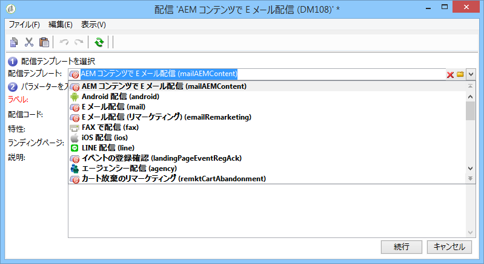

1. Select **Synchronize** in the toolbar to access the list of contents available in AEM.

   >[!NOTE]
   If the **Synchronize** option does not appear in the delivery&#39;s toolbar, check that the **Content editing mode** field is correctly configured in **AEM** by selecting **Properties** > **Advanced**.

   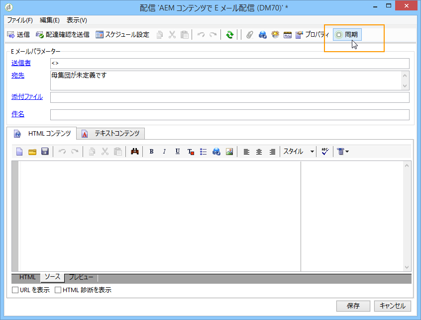

1. 配信と同期させたいコンテンツを選択します。

   このリストでは、次のものを指定します。

   * AEM でのコンテンツのラベル。
   * AEM でのコンテンツの承認ステータス。コンテンツが承認されていない場合、コンテンツを同期することはできますが、配信を送信する前に承認する必要があります。ただし、BAT の送信やプレビューテストなど、特定の操作は実行できます。
   * コンテンツの最終変更日。
   * 既に配信にリンクされているすべてのコンテンツ。

   >[!NOTE]
   デフォルトでは、既に配信と同期されているコンテンツは表示されません。ただし、表示および使用することはできます。例えば、コンテンツを複数の配信のテンプレートとして使用する場合などです。

   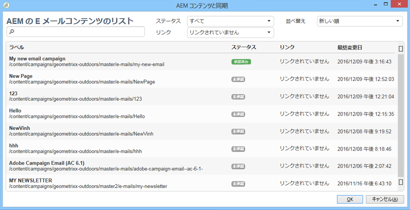

1. 配信のその他のパラメーター（ターゲットなど）を指定します。
1. 必要に応じて、Adobe Campaign で配信承認プロセスを開始します。Adobe Campaign で設定された承認（予算、ターゲットなど）に加え、AEM でのコンテンツの承認が必要です。Adobe Campaign でのコンテンツの承認は、コンテンツが AEM で既に承認されている場合にのみ可能です。
1. 配信を実行します。配信の分析時に、最新バージョンの AEM コンテンツが復元されます。

   >[!NOTE]
   * 配信とコンテンツが同期されると、Adobe Campaign の配信コンテンツは読み取り専用になります。コンテンツだけでなく、電子メールの件名も変更できなくなります。
   * Adobe Campaign の配信にリンクされている間に AEM でコンテンツが更新された場合は、配信の分析時に配信内のコンテンツが自動的に更新されます。The synchronization can also be executed manually using the **Refresh content now** button.
   * You can cancel synchronization between a delivery and AEM content using the **Desynchronize** button. このボタンは、コンテンツが既に配信と同期されている場合にのみ表示されます。別のコンテンツを配信と同期するには、現在のコンテンツ同期をキャンセルしてからでなければ新しいリンクを確立できません。
   * 同期解除された場合は、ローカルコンテンツが保持され、Adobe Campaign で編集できるようになります。コンテンツを変更後に再同期する場合は、すべての変更が失われます。
   * 定期的配信と連続配信の場合は、配信が実行されるたびに AEM コンテンツとの同期が停止されます。

