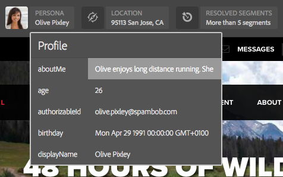

# ContextHub データを使用したページのプレビュー{#previewing-pages-using-contexthub-data}

この [ContextHub](/help/sites-developing/contexthub.md) ツールバーは、ContextHub ストアのデータを表示し、ストアデータを変更できます。 ContextHub ツールバーは、ContextHub ストア内のデータによって決定されるコンテンツをプレビューする場合に役立ちます。

ツールバーは、1 つ以上の UI モジュールを含む一連の UI モードで構成されます。

* UI モードは、ツールバーの左側に表示されるアイコンです。 アイコンをクリックまたはタップすると、その中に含まれている UI モジュールがツールバーに表示されます。
* UI モジュールは、1 つ以上の ContextHub ストアのデータを表示します。 また、一部の UI モジュールでは、ストアデータを操作することもできます。

ContextHub によって、いくつかの UI モードと UI モジュールがインストールされます。管理者が [設定済みの ContextHub](/help/sites-developing/ch-configuring.md) を使用して、異なるものを表示できます。

## ContextHub ツールバーの表示 {#revealing-the-contexthub-toolbar}

ContextHub ツールバーは、プレビューモードで使用できます。 このツールバーは、オーサーインスタンス上で、管理者が有効にしている場合にのみ使用できます。

1. 編集用にページを開いた状態で、ツールバーの「プレビュー」をクリックまたはタップします。

   

1. ツールバーを表示するには、ContextHub アイコンをクリックまたはタップします。

   

## UI モジュールの機能 {#ui-module-features}

各 UI モジュールは異なる機能セットを提供しますが、次のタイプの機能が一般的です。 UI モジュールは拡張可能なので、開発者は必要に応じて他の機能を実装できます。

### ツールバーの内容 {#toolbar-content}

UI モジュールは、1 つ以上の ContextHub ストアのデータをツールバーに表示できます。UI モジュールは、アイコンとタイトルで識別されます。

### ポップアップコンテンツ {#popup-content}

一部の UI モジュールは、クリックまたはタップされるとポップアップオーバーレイを表示します。 一般的に、ポップアップには、ツールバーに表示されている以外の追加情報が含まれています。

### ポップアップフォーム {#popup-forms}

モジュールのポップアップオーバーレイには、ContextHub ストア内のデータを変更できるフォーム要素を含めることができます。 ページのコンテンツがストアデータによって決まる場合は、フォームを使用して、ページコンテンツの変更を観察できます。

### 全画面表示モード {#fullscreen-mode}

ポップアップオーバーレイには、クリックまたはタップするとポップアップコンテンツを拡張してブラウザーウィンドウまたは画面全体に表示するアイコンを含めることができます。

