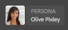

# ContextHub データを使用したページのプレビュー {#previewing-pages-using-contexthub-data}

[ContextHub](/help/sites-developing/contexthub.md) ツールバーには、ContextHub ストアのデータが表示され、このツールバーを使用してストアデータを変更することができます。ContextHub ツールバーは、ContextHub ストア内のデータによって決定されるコンテンツのプレビューに役立ちます。

このツールバーは、1 つ以上の UI モジュールを含む一連の UI モードで構成されます。

* UI モードは、ツールバーの左側に表示されるアイコンです。アイコンをクリックまたはタップすると、そのモードに含まれる UI モジュールがツールバーに表示されます。
* UI モジュールは、1 つ以上の ContextHub ストアのデータを表示します。一部の UI モジュールでは、ストアデータを操作することもできます。

ContextHub によって、いくつかの UI モードと UI モジュールがインストールされます。管理者によって、異なる UI モードと UI モジュールを表示するように [ContextHub が設定されている](/help/sites-developing/ch-configuring.md)場合もあります。

## ContextHub ツールバーの表示 {#revealing-the-contexthub-toolbar}

ContextHub ツールバーはプレビューモードで使用できます。このツールバーは、オーサーインスタンス上で、管理者が有効にしている場合にのみ使用できます。

1. 編集用にページを開いた状態で、ツールバーの「プレビュー」をクリックまたはタップします。

   

1. ツールバーを表示するには、ContextHub アイコンをクリックまたはタップします。

   

## UI モジュールの機能 {#ui-module-features}

提供する機能セットは UI モジュールごとに異なりますが、以下のタイプの機能は共通です。UI モジュールは拡張可能なので、開発者は必要に応じて他の機能を実装できます。

### ツールバーコンテンツ {#toolbar-content}

UI モジュールは、1 つ以上の ContextHub ストアのデータをツールバーに表示できます。UI モジュールは、アイコンとタイトルで識別されます。

### ポップアップコンテンツ {#popup-content}

一部の UI モジュールは、クリックまたはタップされるとポップアップオーバーレイを表示します。一般的に、ポップアップには、ツールバーに表示されている以外の追加情報が含まれています。

### ポップアップフォーム {#popup-forms}

モジュールのポップアップオーバーレイには、ContextHub ストア内のデータを変更するためのフォーム要素を含めることができます。ページコンテンツがストアデータによって決定される場合は、このフォームを使用してページコンテンツの変更を監視できます。

### 全画面表示モード {#fullscreen-mode}

ポップアップオーバーレイには、クリックまたはタップするとポップアップコンテンツを拡張してブラウザーウィンドウまたは画面全体に表示するアイコンを含めることができます。

