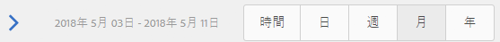

# ページパフォーマンスの分析{#analyzing-page-performance}

[コンテンツインサイト](/help/sites-authoring/content-insights.md)ページを開き、作成しているページのパフォーマンスを分析しますレポート期間を設定して分析を絞り込みます。

## ページの「分析と推奨表示」を開く {#opening-analytics-and-recommendations-for-a-page}

次の手順を使用して、ページの「分析と推奨表示」を表示します。

1. 分析するページに移動します。
1. ツールバーで、「**分析と推奨表示**」をクリックまたはタップします。

   >[!NOTE]
   >
   >ページの「分析と推奨表示」は、AEM で [Adobe Analytics との統合](/help/sites-administering/adobeanalytics-connect.md)を設定している場合にのみ表示されます。

   

### レポート期間の変更 {#changing-the-reporting-period}

分析レポートの、時間に関連する次の側面を変更します。

* レポートを作成する期間。
* データの精度。

レポートの時間に関連する側面を変更するツールは、コンテンツインサイトページの上部に表示されます。

#### レポート期間の変更 {#changing-the-reporting-period-1}

コンテンツインサイトページのレポート期間を変更して、特定の期間に絞り込んでページアクティビティを分析します。レポート期間を変更すると、レポートは自動的に更新されます。タイムフレームの影になっている部分は、レポート期間を表します。タイムフレームの日付は、左から右に向かって増加します。

コンテンツインサイトページのレポート期間を変更するには：

1. ページの上部にタイムフレームが表示されない場合は、タイムフレームを切り替えアイコンをクリックまたはタップします。

   

1. レポート期間の開始日を変更するには、影になっている部分の左側に表示される円を目的の開始日にドラッグします。

   影になっている部分の左側が表示されていない場合は、スクロールバーを使用して表示を合わせます。

1. レポート期間の終了日を変更するには、影になっている部分の右側に表示される円を目的の終了日にドラッグします。

#### レポート期間の精度の変更 {#changing-the-granularity-of-the-reporting-period}

レポートの各データポイントの期間の時間数を変更します。例えば、精度に「週次」が選択されている場合、表示レポートの各データポイントは 1 週のビュー数を表します。

精度は、表示レポートやページでアクションが実行された平均時間（分）レポートなど、時間に対してデータをプロットするレポートに影響します。また、精度はタイムフレームの尺度にも影響します。

1. 精度コントロールが表示されない場合は、精度を切り替えアイコンをクリックまたはタップします。

   

1. 目的の精度をクリックまたはタップします。選択すると、レポートが自動的に更新され、精度が反映されます。

### SEO の推奨のためのタスクの割り当て {#assigning-tasks-for-seo-recommendations}

SEO の推奨レポートを使用して、検索エンジンでのページの視認性を向上させるタスクを作成します。チェックマークが付いていないレポートの各推奨について、必要な作業を実行するようにユーザーに割り当てるタスクを作成できます。

SEO の推奨のステータスは、まだ完了していないタスクがいつ作成されたかを示します。

作成されると、タスクがユーザーのタスクリストに表示されます。タスクについて詳しくは、タスクの [操作を参照してください](/help/sites-authoring/task-content.md)。

次の手順を使用して、SEO の推奨のタスクを作成します。

1. SEO の推奨の情報アイコンをクリックまたはタップします。

   

1. 情報アイコンの横に表示される円で囲まれた三角形のアイコンをクリックします。

   

1. 表示されるフォームフィールドに入力し、「作成」をタップします。

   * プロジェクト：タスクを作成するプロジェクトを選択します。
   * 名前：タスクを識別する名前。デフォルトの名前は、SEO の推奨のタイトルです。
   * 割り当て先：タスクに割り当てられるユーザーを選択します。リストをフィルタリングするには、ユーザーの名前の最初の部分を入力します。
   * 説明：タスクの完了に必要なアクティビティの説明。デフォルトの説明は、SEO の推奨を伴う情報です。
   * タスクの優先度：タスクの優先度。
   * 期限：タスクを完了する必要がある日付。

   **注意 :**&#x200B;作成されるタスクには、SEO の推奨が適用されるページへのパスも含まれます。

1. 「完了」をクリックまたはタップして、「タスクを作成しました」のメッセージを閉じます。

