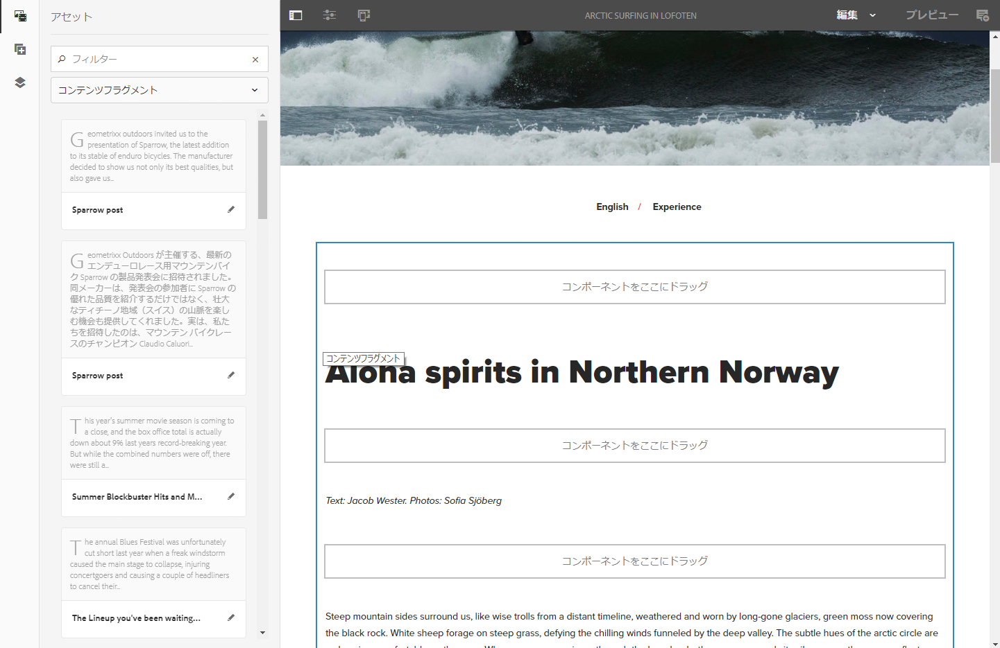
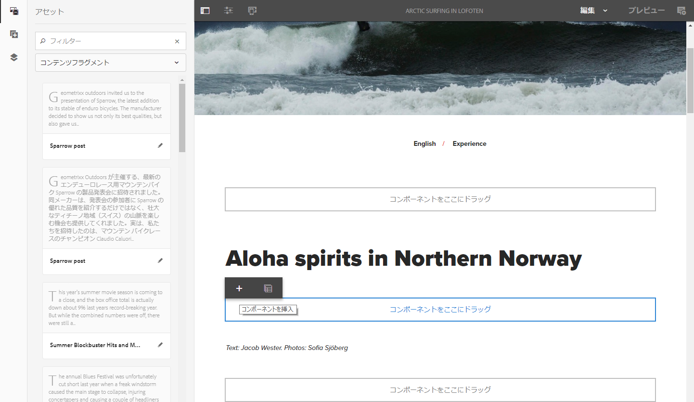
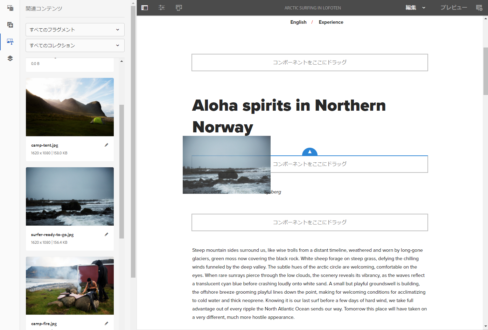

# コンテンツフラグメントを使用したページのオーサリング {#page-authoring-with-content-fragments}

Adobe Experience Manager（AEM）のコンテンツフラグメントは、[ページに依存しないアセットとして作成および管理](/help/assets/content-fragments/content-fragments.md)されます。

チャネルに特化しないコンテンツを、チャネル固有のバリエーションと共に作成できます。 その後、コンテンツページをオーサリングする際に、これらのフラグメントとそれらのバリエーションを使用できます。

更新された JSON エクスポーターと共に構造化コンテンツフラグメントを使用して、AEM コンテンツをコンテンツサービス経由で AEM ページ以外のチャネルに配信することもできます。

>[!NOTE]
>
>**コンテンツフラグメント**&#x200B;と&#x200B;**[エクスペリエンスフラグメント](/help/sites-authoring/experience-fragments.md)**&#x200B;は、AEM 内の異なる機能です。
>
>* **コンテンツフラグメント** は、編集コンテンツ、主にテキストおよび関連する画像です。 これらは、デザインやレイアウトを含まない純粋なコンテンツです。
>* **エクスペリエンスフラグメント**&#x200B;は完全にレイアウトされたコンテンツであり、web ページのフラグメントです。
>
>エクスペリエンスフラグメントには、コンテンツフラグメントの形式でコンテンツを含めることができますが、その逆はできません。

>[!CAUTION]
>
>このページは、 [コンテンツフラグメントの操作](/help/assets/content-fragments/content-fragments.md) （および関連ページ）を参照してください。基本的な用語と概念を、フラグメントの作成と管理と共に紹介しています。

コンテンツフラグメントは、次のことを可能にします。

* **マーケティングとキャンペーン戦略**

   * 一元的に管理されるコンテンツフラグメントを使用してコンテンツをレビューします。

* **クリエイティブプロフェッショナル**

   * コンテンツフラグメントに関連付けられたコレクションを介したクリエイティブアセットのトラッキング。

* **コピーライター**

   * AEM コンテンツフラグメントエディターに書き込みます。
   * コンテンツのバリエーションを作成できます。
   * 関連するコンテンツをコンテンツフラグメントに関連付けることができます。
   * バージョン管理／ワークフローを使用できます。
   * コンテンツフラグメントを共有できます。
   * 翻訳を一元的に管理できます。

* **プロデューサーおよびジャーニー管理者**

   * AEM でのオーサリングで事前定義済みのフラグメントとバリエーションから選択します。
   * コピーライターおよびクリエイターが一元管理されたフラグメントとアセットで更新することで、フラグメントと関連コンテンツを常に最新の状態に保つことができます。
   * 適切にキュレーションされた関連メディアコンテンツと連携できます。
   * その場でアドホックコンテンツのバリエーションを作成しながら、それらのバリエーションをフラグメントで一元的に管理できます。

## ページへのコンテンツフラグメントの追加 {#adding-a-content-fragment-to-your-page}

1. 編集するページを開きます。

1. **コンテンツフラグメント**&#x200B;コンポーネントを、**コンポーネント**&#x200B;ブラウザーまたは「**新規コンポーネントを挿入**」のいずれかから開きます。

1. 次のいずれかを実行できます。

   * **Assets** ブラウザーを開いて、**コンテンツフラグメント**&#x200B;をフィルタリングします（デフォルトは画像）。次に、必要なフラグメントをコンポーネントインスタンスにドラッグします。

   * コンテンツフラグメントコンポーネントを選択し、ツールバーから「**設定**」を選択します。ダイアログで、選択ダイアログボックスを開き、必要なを参照して選択できます **コンテンツフラグメント**.

   >[!NOTE]
   >
   >特定のコンテンツフラグメントをページに直接ドラッグすることもできます。これにより、関連するコンポーネント（コンテンツフラグメント）が自動的に作成されます。

1. 最初に、 **メイン** 要素および **マスター** （バリエーション）が表示されます。 必要に応じて、[他のエレメントやバリエーションを選択](#selecting-the-element-or-variation)できます。

   

   >[!NOTE]
   >
   >その他の編集機能について詳しくは、次を参照してください。
   >
   >
   >
   >    * [レスポンシブレイアウト](/help/sites-authoring/responsive-layout.md)
   >    * [ページのコンテンツの編集](/help/sites-authoring/editing-content.md)
   >
   >

### 要素またはバリエーションの選択 {#selecting-the-element-or-variation}

フラグメントの **設定** ダイアログボックスを使用して、現在のページで使用するフラグメントを設定できます。 ダイアログは、使用するコンポーネントに応じて異なります。

適切な設定ダイアログボックスで、次のような使用可能なパラメータを選択できます。

* **コンテンツフラグメント**

  使用するフラグメントを指定します。

* **ディスプレイモード**：

   * **単一のテキスト要素**

   * **複数の要素**

* **要素**

   * デフォルト **メイン** は常に使用可能です。
   * フラグメントが適切なテンプレートを使用して作成されている場合は、選択を使用できます。

  >[!NOTE]
  >
  >使用できるエレメントは、使用するテンプレートによって異なります。

* **バリエーション**

   * デフォルト **マスター** は常に使用可能です。
   * フラグメントのバリエーションが作成されている場合は、選択を使用できます。

* **段落**：含める段落の範囲を指定します。

   * **すべて**
   * **範囲**：例えば、`1`、`3-5`、`9-*` のように指定します。

      * **見出しを独自の段落として処理**

* **見出しを独自の段落として処理**

### フラグメントエディターへのクイック接続 {#quick-connection-to-fragment-editor}

コンポーネントツールバーの&#x200B;**編集**&#x200B;アイコンを使用して、フラグメントのソースを開いて（アセットを）編集できます。これにより、 [コンテンツフラグメントの編集と管理](/help/assets/content-fragments/content-fragments.md).

>[!CAUTION]
>
>これまでと同様に、フラグメントソースの編集は、そのコンテンツフラグメントを参照するすべてのページに影響を与える可能性があります。

### 中間コンテンツの追加 {#adding-in-between-content}

特定のコンテンツフラグメントがページに追加されると、フラグメントの各 HTML 段落の間（および上と下）に「**コンポーネントをここにドラッグ**」プレースホルダーが存在します。

これにより、コンテンツをさらに追加できます [中間（中間コンテンツ）](/help/assets/content-fragments/content-fragments.md#in-between-content-when-page-authoring-with-content-fragments) （使用可能な任意のポイントで）フラグメントコンテンツを更新する場合、ルートフラグメントを変更する必要はありません。

中間コンテンツの場合は、次のことができます。

* [コンポーネントブラウザー](/help/sites-authoring/author-environment-tools.md#components-browser)からコンポーネントを追加します。
* [Assets ブラウザー](/help/sites-authoring/author-environment-tools.md#assets-browser)からアセットを追加する。
* [関連コンテンツ](#using-associated-content)を中間コンテンツのソースとして使用する。

>[!CAUTION]
>
>中間コンテンツは、ページコンテンツです。中間コンテンツはコンテンツフラグメントに保存されません。

>[!NOTE]
>
>また、[フラグメント自体にビジュアルアセット（画像）を挿入](/help/assets/content-fragments/content-fragments-variations.md#inserting-assets-into-your-fragment)できます。
>
>コンテンツフラグメント自体に挿入したビジュアルアセットは、フラグメント内の前の段落に添付されます。つまり、ビジュアルアセットと前の段落の間に中間コンテンツを配置することはできません。

>[!CAUTION]
>
>ページ上のコンテンツフラグメントに中間コンテンツを追加した後、基になるコンテンツフラグメントの構造（コンテンツフラグメントエディター内）を変更すると、誤った結果や予期しない結果が生じる可能性があります。
>
>この場合、中間コンテンツは次のように保持されます。
>
>* 中間コンポーネントは、フラグメントフロー内のコンポーネントのシーケンス内で絶対的な位置を持ちます。フラグメント内の段落のコンテンツが変更されても、この位置は変更されません。
>
>  中間段落は隣に位置する（フラグメント）段落とコンテキスト関係を持たないので、これにより、相対位置が変更したかのように見せることができます。
>* 2 つの段落構造が競合する場合を除きます。競合する場合、中間コンテンツは（内部的には存在していますが）表示されません。
>

### 関連コンテンツの使用 {#using-associated-content}

次の条件を満たしている場合： [関連コンテンツ](/help/assets/content-fragments/content-fragments-assoc-content.md) と [コンテンツフラグメント](/help/assets/content-fragments/content-fragments.md)の場合、これらのアセットは（フラグメントをコンテンツページに配置した後に）サイドパネルから使用できます。 関連コンテンツは、事実上、[中間コンテンツ](#adding-in-between-content)用のコンテンツの特別なソースです。

>[!NOTE]
>
>[ビジュアルアセット（画像など）](/help/assets/content-fragments/content-fragments.md#fragments-with-visual-assets)をフラグメントやページに追加するには、様々な方法があります。

>[!NOTE]
>
>1 つのページに複数のコンテンツフラグメントがある場合、 **関連コンテンツ** 「 」タブには、すべてのフラグメントに適したアセットが表示されます。

コンテンツが関連付けられたフラグメントをページに追加すると、新しいタブ (**関連コンテンツ**) がサイドパネルに開きます。

ここから、アセットを必要な場所（既存のコンポーネントまたは適切なコンポーネントが作成される必要のある位置）にドラッグできます。

### フラグメントに挿入されたアセット {#assets-inserted-into-the-fragment}

アセット（画像など）がフラグメント自体に挿入されている場合、ページエディターでこれらのアセットを編集するためのオプションは制限されます。 <!-- Removed link as it was a 404 on helpx -->

例えば、画像の場合、次のことができます。

* 画像の切り抜き、回転、反転。
* タイトルまたは代替テキストを追加します。
* サイズを指定します。
* レイアウトを設定することもできます。

移動、コピー、削除などの他の変更は、フラグメントエディターで行う必要があります。

### 公開 {#publishing}

フラグメントを公開済みの Web ページで使用するには、フラグメントを公開する必要があります。

* フラグメントは、[フラグメントを Assets コンソールで作成](/help/assets/content-fragments/content-fragments.md#publishingandreferencingafragment)した後に公開できます。
* 次の場合、 *非公開のフラグメント* が公開されるページで使用されている場合は、フラグメントも今すぐ公開できます。
