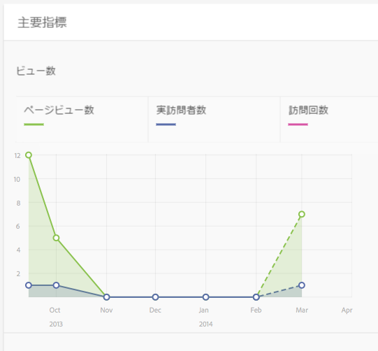
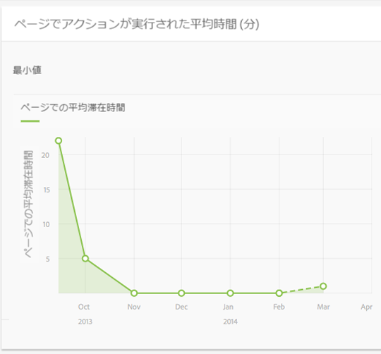
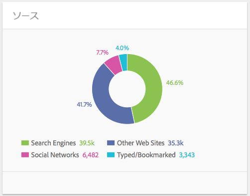
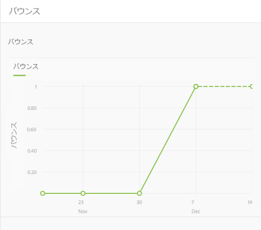

# コンテンツインサイト{#content-insight}

コンテンツインサイトは、web 分析や SEO の推奨を活用してページパフォーマンスに関する情報を提供します。コンテンツインサイトを使用して、ページをどのように変更するか判断を下し、以前に加えた変更によってパフォーマンスがどのように変わったかを確認できます。作成するすべてのページについて、コンテンツインサイトを開いてページを分析できます。

コンテンツインサイトページのレイアウトは、使用しているデバイスの画面サイズや向きに合わせて変化します。

## レポートデータ

コンテンツインサイトページには、Adobe SiteCatalyst、Adobe Target、Adobe Social、BrightEdge のデータを使用するレポートが用意されています。

* SiteCatalyst：次の指標のレポートを確認できます。

   * ページビュー
   * ページでの平均滞在時間
   * ソース

* Target：オファーが含まれるページのキャンペーンアクティビティに関するレポートを確認できます。
* BrightEdge：検索エンジンでのページの視認性を向上させるページの機能に関するレポートと、実装が推奨される機能を確認できます。

[ページの「分析とレコメンデーション表示」を開く](/help/sites-authoring/ci-analyze.md#opening-analytics-and-recommendations-for-a-page)を参照してください。

## レポート期間

レポートには、ユーザーが指定した期間のデータが表示されます。レポート期間を調整すると、レポートのデータが指定した期間の内容に更新されます。ページのバージョンが変更された時間は、視覚的なキューで確認できます。これにより、各バージョンのパフォーマンスを比較できます。

>[!NOTE]
>
>コンテンツインサイトダッシュボードのタイムラインは `GMT` にあります。

レポートデータの精度も指定できます。例えば、日次、週次、月次、年次のデータを確認できます。

[レポート期間の変更](/help/sites-authoring/ci-analyze.md#changing-the-reporting-period)を参照してください。

>[!NOTE]
>
>コンテンツインサイトのレポートを使用するには、管理者が AEM と SiteCatalyst、Target および BrightEdge を統合する必要があります。[SightCatalyst との統合](/help/sites-administering/adobeanalytics.md)、[Adobe Target との統合](/help/sites-administering/target.md)および [BrightEdge との統合](/help/sites-administering/brightedge.md)を参照してください。

## 表示レポート {#the-views-report}

表示レポートには、ページのトラフィックを評価する次の機能が備わっています。

* 指定のレポート期間におけるページビューの合計数。
* レポート期間全体にわたるビュー数を示すグラフ。

   * 合計ビュー数。
   * ユニーク訪問者数。

## ページでアクションが実行された平均レポート {#the-page-average-engaged-report}

ページでアクションが実行された平均レポートには、ページの効果を評価する次の機能が備わっています。

* レポート期間全体においてページが開かれている平均時間。
* 指定のレポート期間におけるページビューの平均時間のグラフ。

## ソースレポート {#the-sources-report}

ソースレポートは、ユーザーがどのようにしてページに到達したかを示します。例えば、検索エンジンからの場合や、既知の URL を使用する場合などがあります。

## バウンスレポート {#the-bounces-report}

バウンスレポートには、選択したレポート期間にページで発生したバウンスの数を示すグラフが含まれます。

## キャンペーンアクティビティレポート {#the-campaign-activity-report}

アクティブなページの各キャンペーンについて、*キャンペーン名*&#x200B;アクティビティという名前のレポートが表示されます。このレポートは、オファーが提供されている各セグメントのページインプレッション数とコンバージョン数を示します。

## SEO の推奨レポート {#the-seo-recommendations-report}

SEO の推奨レポートには、ページの BrightEdge 分析の結果が含まれます。このレポートはページ機能のチェックリストで、検索エンジンでのファインダビリティを最大化するための機能のうち、ページにどの機能が含まれていて、どの機能が含まれていないかを示します。

このレポートを使用すると、ページのファインダビリティを向上させるタスクを作成できます。Recommendations は、レコメンデーションを実装するためのタスクが作成されたことを示します。[SEO のレコメンデーションのためのタスクの割り当て](/help/sites-authoring/ci-analyze.md#assigning-tasks-for-seo-recommendations)を参照してください。

