# ターゲットモードを使用したターゲットコンテンツのオーサリング{#authoring-targeted-content-using-targeting-mode}

AEM のターゲットモードを使用してターゲットコンテンツをオーサリングします。ターゲットモードとターゲットコンポーネントには、エクスペリエンス用のコンテンツを作成するためのツールが用意されています。次のことができます。

* ページ上にあるターゲットコンテンツを容易に認識すべてのターゲットコンテンツのボーダーを点線で表示
* エクスペリエンスを表示するブランドとアクティビティを選択
* アクティビティのエクスペリエンスを追加または削除
* A/B テストを実行し、勝者を採用（Adobe Target のみ）
* 作成またはライブラリから選択したオファーをエクスペリエンスに追加
* 目標を設定し、パフォーマンスを監視
* 訪問者のエクスペリエンスをシミュレート
* ターゲットコンポーネントの設定をカスタマイズ

AEM または Adobe Target をターゲティングエンジンとして使用できます（Adobe Target を使用するには有効な Adobe Target アカウントが必要です）。Adobe Target を使用する場合は、まず統合を設定する必要があります。[Adobe Target との統合手順](/help/sites-administering/target.md)を参照してください。

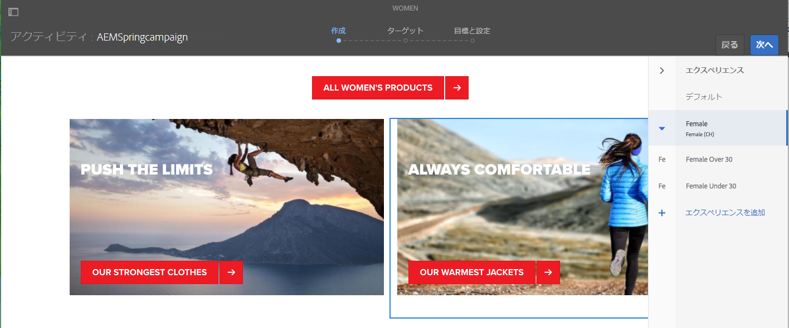

ターゲットモードに表示されるアクティビティとエクスペリエンスは、[アクティビティコンソール](/help/sites-authoring/activitylib.md)を反映しています。

* ターゲットモードを使用してアクティビティとエクスペリエンスに加えた変更は、アクティビティコンソールに反映されます。
* アクティビティコンソールで加えた変更は、ターゲットモードに反映されます。

>[!NOTE]
>
>Adobe Target でキャンペーンを作成すると、`thirdPartyId` というプロパティが各キャンペーンに割り当てられます。Adobe Target でキャンペーンを削除しても、thirdPartyId は削除されません。`thirdPartyId` を異なるタイプ（AB、XT）のキャンペーンに再利用することはできません。また、手動で削除することはできません。この問題を回避するには、各キャンペーンに一意の名前を付けてください。そうすれば、キャンペーン名を異なるキャンペーンタイプで再利用できなくなります。
>
>同じキャンペーンタイプで同じ名前を使用する場合は、既存のキャンペーンが上書きされます。
>
>同期中に、「リクエストは失敗しました。`thirdPartyId` は既に存在します」というエラーが表示された場合は、キャンペーン名を変更して再度同期してください。

>[!NOTE]
>
>ターゲティングをおこなうとき、ブランディングとアクティビティの組み合わせは、チャネルレベルではなくユーザーレベルで保持されます。

## ターゲットモードへの切り替え {#switching-to-targeting-mode}

ターゲットモードに切り替えて、ターゲットコンテンツをオーサリングするためのツールにアクセスします。

ターゲットモードに切り替えるには：

1. ターゲットコンテンツを作成するページを開きます。
1. ページ上部のツールバーで、モードのドロップダウンメニューをクリックまたはタップして、使用可能なモードタイプを表示します。

   

1. 「**ターゲット設定**」をクリックまたはタップします。ページの上部に「ターゲット設定」オプションが表示されます。

   

## ターゲットモードを使用したアクティビティの追加 {#adding-an-activity-using-targeting-mode}

ターゲットモードを使用して、ブランドにアクティビティを追加します。追加したアクティビティには、デフォルトのエクスペリエンスが含まれています。アクティビティを追加した後、アクティビティのコンテンツターゲット設定プロセスを開始します。

ターゲティングエンジン（AEM または Adobe Target）を選択し、アクティビティタイプ（「エクスペリエンスターゲット設定」または「A/B テスト」）を選択して、AEM から Adobe Target アクティビティを作成し、管理することもできます。

さらに、すべての Adobe Target アクティビティの目標と指標を管理し、Adobe Target オーディエンスを管理できます。Adobe Target アクティビティのレポート機能（A/B テストでの勝者の採用を含む）も使用できます。

アクティビティを追加すると、そのアクティビティが[アクティビティコンソール](/help/sites-authoring/activitylib.md)に表示されます。

アクティビティを追加するには：

1. **ブランド**&#x200B;ドロップダウンメニューを使用して、アクティビティを作成するブランドを選択します。

   >[!NOTE]
   >
   >[アクティビティコンソールを使用してブランドを作成する](/help/sites-authoring/activitylib.md#creating-a-brand-using-the-activities-console)ことをお勧めします。
   >
   >
   >他の方法でブランドを作成する場合は、ノード `/campaigns/<brand>/master` が存在することを確認してください。ノードがなければ、アクティビティを作成しようとするとエラーが発生します。

1. **アクティビティ**&#x200B;ドロップダウンメニューの横の「+」をクリックまたはタップします。
1. アクティビティ名を入力します。

   >[!NOTE]
   >
   >新しいアクティビティを作成し、Adobe Target クラウド設定をページまたはその親ページのいずれかに添付すると、Adobe Target がエンジンとして自動的に推測されます。

1. **ターゲティングエンジン**&#x200B;ドロップダウンメニューで、ターゲティングエンジンを選択します。

   * 「**ContextHub AEM**」を選択した場合は、残りのフィールドが灰色表示になり、使用できなくなります。「**作成**」をクリックまたはタップします。

   * 「**Adobe Target**」を選択した場合は、設定（デフォルトでは、[アカウントを設定](/help/sites-administering/opt-in.md)するときに指定した設定）とアクティビティタイプを選択できます。

   * AEM または Adobe Campaign 統合を使用していて、ターゲットコンテンツ（ニュースレター）を送信する場合は、「**Adobe Campaign**」を選択します。詳しくは、[ と Adobe Campaign の統合](/help/sites-administering/campaign.md)を参照してください。

1. アクティビティメニューで、「**エクスペリエンスターゲット設定**」または「**A/B テスト**」を選択します。

   * エクスペリエンスターゲット設定 - Adobe Target アクティビティを AEM から管理します。
   * A/B テスト - Adobe Target の A/B テストアクティビティを AEM から作成および管理します。

## ターゲット設定プロセス：作成、ターゲット、目標と設定 {#the-targeting-process-create-target-and-goals-settings}

ターゲットモードを使用して、アクティビティのいくつかの要素を設定できます。次の 3 ステップのプロセスを使用して、ブランドアクティビティ用のターゲットコンテンツを作成します。

1. [作成](#create-authoring-the-experiences)：エクスペリエンスを追加または削除し、エクスペリエンスごとにオファーを追加します。
1. [ターゲット](#diagramtargetconfiguringtheaudiences)：各エクスペリエンスのターゲットとなるオーディエンスを指定します。特定のオーディエンスをターゲットにすることができ、A/B テストを使用する場合は、どのエクスペリエンスに何％のトラフィックを割り当てるかを指定できます。
1. [目標と設定](#settingsgoalssettingsconfiguringtheactivityandsettinggoals)：アクティビティをスケジュールし、優先度を設定します。成功指標の目標を設定することもできます。

次の手順を使用して、アクティビティのコンテンツターゲット設定プロセスを開始します。

>[!NOTE]
>
>ターゲット設定プロセスを使用するには、ターゲットアクティビティ作成者ユーザーグループのメンバーである必要があります。

アクティビティを追加するには：

1. **ブランド**&#x200B;ドロップダウンメニューで、作業するアクティビティを含むブランドを選択します。
1. **アクティビティ**&#x200B;ドロップダウンメニューで、ターゲットコンテンツを作成するアクティビティを選択します。
1. ターゲット設定プロセスの手順を示すコントロールを表示するには、「**ターゲット設定を開始**」をクリックまたはタップします。

   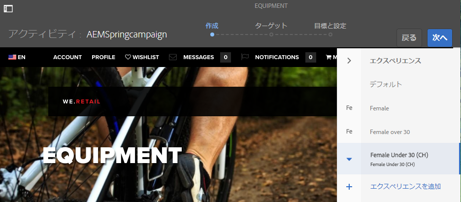

   >[!NOTE]
   >
   >作業するアクティビティを変更するには、「**戻る**」をクリックまたはタップします。

## 作成：エクスペリエンスのオーサリング {#create-authoring-the-experiences}

コンテンツターゲット設定の作成ステップでは、エクスペリエンスを作成します。このステップでは、アクティビティのエクスペリエンスを作成または削除したり、各エクスペリエンスにオファーを追加したりできます。

### ターゲットモードでのエクスペリエンスのオファーの表示 {#seeing-experience-offers-in-targeting-mode}

[ターゲット設定プロセスを開始](/help/sites-authoring/content-targeting-touch.md#the-targeting-process-create-target-and-goals-settings)した後、エクスペリエンスを選択して、そのエクスペリエンスに提供されているオファーを表示します。エクスペリエンスを選択すると、ページ上のターゲットコンポーネントが変更されて、そのエクスペリエンスのオファーが表示されます。

>[!CAUTION]
>
>オーサーインスタンスで既にターゲティングされているコンポーネントのターゲティングを無効にする場合は、注意してください。パブリッシュインスタンスからも、それぞれのアクティビティが自動的に削除されます。

>[!NOTE]
>
>オファーはターゲットコンポーネントのコンテンツです。

エクスペリエンスはオーディエンスウィンドウに表示されます。次の例では、エクスペリエンスに、**デフォルト**、**女性**、**30 歳以上の女性**、**30 歳未満の女性**&#x200B;が含まれます。ここで表示されているのは、ターゲット設定された&#x200B;**画像**&#x200B;コンポーネントのデフォルトオファーです。

別のエクスペリエンスを選択すると、そのエクスペリエンス用のオファーが画像コンポーネントに表示されます。

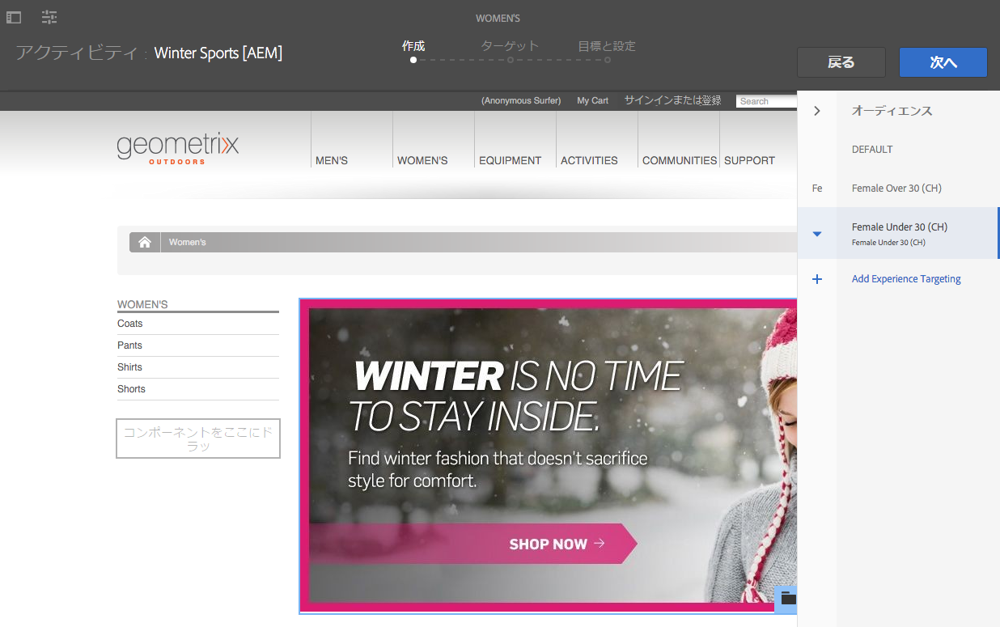

エクスペリエンスを選択したときに、そのエクスペリエンス用のオファーがターゲットコンポーネントに含まれていない場合は、「**オファーを追加**」というテキストが半透明のデフォルトオファーの上に重ねて表示されます。エクスペリエンス用のオファーが作成されていない場合は、そのエクスペリエンスにマッピングされているセグメント向けの&#x200B;**デフォルト**&#x200B;オファーが表示されます。

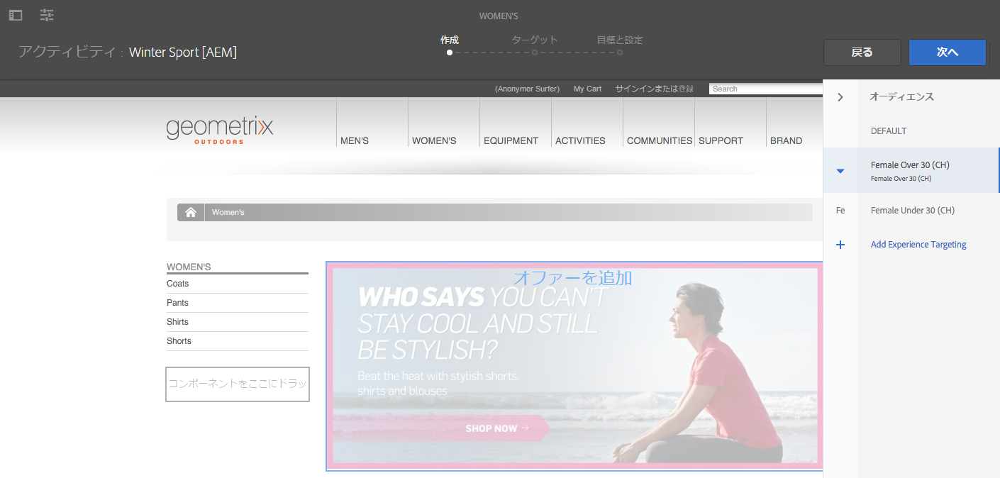

訪問者プロパティがエクスペリエンスにマッピングされているどのセグメントとも一致しない場合は、デフォルトエクスペリエンスが表示されます。[ターゲットモードを使用したエクスペリエンスの追加](#adding-and-removing-experiences-using-targeting-mode)を参照してください。

### カスタムオファーとライブラリオファー {#custom-offers-and-library-offers}

[ページ上で作成](/help/sites-authoring/content-targeting-touch.md#adding-a-custom-offer)され、単一のエクスペリエンスに使用されるオファーのことを「カスタムオファー」と呼びます。カスタムオファーのコンテンツには、次の画像が重ねて表示されます。

[オファーライブラリから追加](/help/sites-authoring/content-targeting-touch.md#adding-an-offer-from-an-offer-library)されたオファーには、次の画像が重ねて表示されます。

カスタムオファーを再利用することにした場合は、オファーライブラリに保存できます。コンテンツを特定のエクスペリエンス用に編集したい場合は、ライブラリオファーをカスタムオファーに変換することもできます。編集後、そのオファーを再度ライブラリに保存できます。

### ターゲットモードを使用したエクスペリエンスの追加と削除 {#adding-and-removing-experiences-using-targeting-mode}

[ターゲット設定プロセス](/help/sites-authoring/content-targeting-touch.md#the-targeting-process-create-target-and-goals-settings)の作成ステップを使用して、エクスペリエンスを追加および削除できます。さらに、エクスペリエンスを複製して、名前を変更することもできます。

#### ターゲットモードを使用したエクスペリエンスの追加 {#adding-experiences-using-targeting-mode}

エクスペリエンスを追加するには：

1. エクスペリエンスを追加するには、**オーディエンス**&#x200B;ウィンドウで既存のエクスペリエンスの下に表示される「**+** エクスペリエンスターゲット設定を追加」をクリックまたはタップします&#x200B;**。**
1. オーディエンスを選択します。デフォルトでは、オーディエンス名はエクスペリエンス名になります。必要に応じて、別の名前を入力できます。「**OK**」をクリックまたはタップします。

#### ターゲットモードを使用したエクスペリエンスの削除 {#removing-experiences-using-targeting-mode}

エクスペリエンスを削除するには：

1. エクスペリエンス名の横の矢印をクリックまたはタップします。

   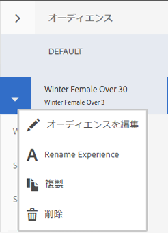

1. 「**削除**」をクリックします。

#### ターゲットモードを使用したエクスペリエンス名の変更 {#renaming-experiences-using-targeting-mode}

ターゲットモードを使用してエクスペリエンス名を変更するには：

1. エクスペリエンス名の横の矢印をクリックまたはタップします。
1. 「**エクスペリエンス名を変更**」をクリックし、新しい名前を入力します。
1. 画面上のそれ以外の場所をクリックまたはタップして、変更を保存します。

#### ターゲットモードを使用したオーディエンスの編集 {#editing-audiences-using-targeting-mode}

ターゲットモードを使用してオーディエンスを編集するには：

1. エクスペリエンス名の横の矢印をクリックまたはタップします。
1. 「**オーディエンスを編集**」をクリックし、新しいオーディエンスを選択します。
1. 「**OK**」をクリックします。

#### ターゲットモードを使用したエクスペリエンスの複製 {#duplicating-experiences-using-targeting-mode}

ターゲットモードを使用してエクスペリエンスをコピーするには：

1. エクスペリエンス名の横の矢印をクリックまたはタップします。
1. 「**複製**」をクリックして、オーディエンスを選択します。
1. 必要に応じてエクスペリエンス名を変更し、「**OK**」をクリックします。

### ターゲットモードを使用したオファーの作成 {#creating-offers-using-targeting-mode}

エクスペリエンス用のオファーを作成するには、コンポーネントのターゲット設定をおこないます。ターゲット設定されたコンポーネントは、エクスペリエンス用のオファーとして使用されるコンテンツを提供します。

* [既存のコンポーネントをターゲット設定](/help/sites-authoring/content-targeting-touch.md#creating-a-default-offer-by-targeting-an-existing-component)（コンポーネントのコンテンツが、デフォルトエクスペリエンス用のオファーになります）
* [ターゲットコンポーネントを追加](/help/sites-authoring/content-targeting-touch.md#creating-an-offer-by-adding-a-target-component)（その後、このコンポーネントにコンテンツを追加します）

コンポーネントのターゲット設定をしたら、各エクスペリエンス用のオファーを追加します。

* [カスタムオファーを追加](/help/sites-authoring/content-targeting-touch.md#adding-a-custom-offer)
* [ライブラリからオファーを追加](/help/sites-authoring/content-targeting-touch.md#adding-an-offer-from-an-offer-library)

オファーに関する作業では、以下の機能を利用できます。

* [カスタムオファーをオファーライブラリに追加](/help/sites-authoring/content-targeting-touch.md#adding-a-custom-offer-to-a-library)
* [ライブラリオファーをカスタムオファーに変換](/help/sites-authoring/content-targeting-touch.md#converting-a-library-offer-to-a-custom-library)
* [ライブラリオファーを開いてコンテンツを編集](/help/sites-authoring/content-targeting-touch.md#editing-a-library-offer)

#### 既存のコンポーネントをターゲット設定してデフォルトオファーを作成 {#creating-a-default-offer-by-targeting-an-existing-component}

ページ上のコンポーネントをアクティビティのデフォルトエクスペリエンス用のオファーとして使用するには、そのコンポーネントをターゲット設定します。ターゲット設定すると、そのコンポーネントがターゲットコンポーネントに包含され、そのコンテンツがデフォルトエクスペリエンス用のオファーになります。

コンポーネントをターゲット設定すると、そのオファーではターゲット設定したコンポーネントだけが使用できるようになります。コンポーネントをオファーから削除したり、他のコンポーネントをオファーに追加したりすることはできません。

[ターゲット設定プロセスを開始](/help/sites-authoring/content-targeting-touch.md#the-targeting-process-create-target-and-goals-settings)した後に、以下の手順を実行します。

1. ターゲット設定するコンポーネントをクリックまたはタップします。次の例のように、コンポーネント用のツールバーが表示されます。

   

1. Target アイコンをクリックまたはタップします。

   

   このコンポーネントのコンテンツが、デフォルトエクスペリエンス用のオファーになります。コンポーネントをターゲット設定すると、各エクスペリエンスについてデフォルトノードが置き換えられます。これは、特定のオーサリングエクスペリエンスで、正しいコンテンツノードを編集するために必要です。このようなデフォルト以外のエクスペリエンスに対して、[カスタムオファーを追加](/help/sites-authoring/content-targeting-touch.md#adding-a-custom-offer)するか、[ライブラリオファーを追加](/help/sites-authoring/content-targeting-touch.md#adding-an-offer-from-an-offer-library)します。

#### ターゲットコンポーネントを追加してオファーを作成 {#creating-an-offer-by-adding-a-target-component}

ターゲットコンポーネントを追加して、デフォルトエクスペリエンスのオファーを作成します。ターゲットコンポーネントは他のコンポーネントのコンテナであり、この中に配置されるコンポーネントがターゲットになります。ターゲットコンポーネントを使用すると、複数のコンポーネントを追加して 1 つのオファーを作成することができます。また、エクスペリエンスごとに異なるコンポーネントを使用して、異なるオファーを作成することもできます。

このコンポーネントのカスタマイズについては、[ターゲットコンポーネントオプションの設定](/help/sites-authoring/content-targeting-touch.md#configuring-target-component-options)を参照してください。

>[!NOTE]
>
>[オファーコンソール](/help/sites-authoring/offerlib.md)を使用して作成するオファーにも、複数のコンポーネントを含めることができます。このようなオファーはオファーライブラリに所属し、複数のエクスペリエンスに使用できます。

ターゲットコンポーネントはコンテナなので、他のコンポーネントのドロップ先として表示されます。

ターゲットモードでは、ターゲットコンポーネントには青いボーダーと、ターゲット設定可能であることを示すターゲットドロップのメッセージが表示されます。

編集モードでは、Target コンポーネントには的アイコンが表示されます。

Target コンポーネントにドラッグされたコンポーネントは、ターゲットコンポーネントになります。

ターゲットコンポーネントに追加されたコンポーネントは、特定のエクスペリエンス用のコンテンツを提供することになります。このエクスペリエンスを関連付けるには、コンポーネントを追加する前にエクスペリエンスを選択します。

ターゲットコンポーネントは、編集モードまたはターゲットモードでページに追加できます。ターゲットコンポーネントにコンポーネントを追加できるのは、ターゲットモードのときだけです。ターゲットコンポーネントは、パーソナライゼーションコンポーネントグループに所属します。

ターゲットコンテンツを編集する場合は、「**ターゲット設定を開始**」をクリックまたはタップする必要があります。

1. オファーを表示するページにターゲットコンポーネントをドラッグします。
1. デフォルトでは、場所 ID は設定されていません。場所を設定するには、設定の歯車アイコンをクリックまたはタップします。

   >[!NOTE]
   >
   >管理者の方針により、場所を明示的に設定するよう定められている場合があります。
   >
   >
   >管理者は、この設定を必須にするかどうかを **で決定できます。https://&lt;host>:&lt;port>/system/console/configMgr/com.day.cq.personalization.impl.servlets.TargetingConfigurationServlet**
   >ユーザーに場所の入力を求めるには、「場所を強制」チェックボックスをオンにします。

1. オファーを作成するエクスペリエンスを選択します。
1. オファーを作成します。

   * デフォルトエクスペリエンスの場合は、コンポーネントをターゲットドロップ領域にドラッグし、通常どおりにコンポーネントのプロパティを編集して、オファーのコンテンツを作成します。
   * デフォルト以外のエクスペリエンスの場合は、[カスタムオファーを追加](#adding-a-custom-offer)するか、[ライブラリオファーを追加](/help/sites-authoring/content-targeting-touch.md#adding-an-offer-from-an-offer-library)します。

#### カスタムオファーの追加 {#adding-a-custom-offer}

ターゲットコンポーネントのコンテンツをターゲットモードで作成して、オファーを作成します。カスタムオファーを作成したら、単一エクスペリエンス用のオファーとして使用します。

オファーを他のエクスペリエンスにも使用できるようにする場合は、カスタムオファーを作成して、[ライブラリに追加](/help/sites-authoring/content-targeting-touch.md#adding-a-custom-offer-to-a-library)できます。オファーコンソールを使用して再利用可能なオファーを作成する方法については、[オファーをオファーライブラリに追加](/help/sites-authoring/offerlib.md#add-an-offer-to-an-offer-library)を参照してください。

1. オファーを追加するエクスペリエンスを選択します。
1. コンポーネントメニューを表示するには、オファーを追加するターゲットコンポーネントをクリックまたはタップします。

   

1. 「+」アイコンをクリックまたはタップします。

   デフォルトオファーのコンテンツが現在のエクスペリエンスのオファーとして使用されます。

1. オファーをクリックまたはタップしてオファーメニューを表示し、編集アイコンをクリックまたはタップします。

   

1. コンポーネントのコンテンツを編集します。

#### オファーライブラリからのオファーの追加 {#adding-an-offer-from-an-offer-library}

[オファーライブラリ](/help/sites-authoring/offerlib.md)からエクスペリエンスにオファーを追加します。現在ターゲット設定しているブランドのライブラリから、任意のオファーを追加できます。

ライブラリオファーをデフォルトエクスペリエンスに追加することはできません。

1. オファーを追加するエクスペリエンスを選択します。
1. コンポーネントメニューを表示するには、オファーを追加するターゲットコンポーネントをクリックまたはタップします。

   

1. フォルダーアイコンをクリックまたはタップします。

   

1. ライブラリからオファーを選択し、チェックマークアイコンをクリックまたはタップします。

   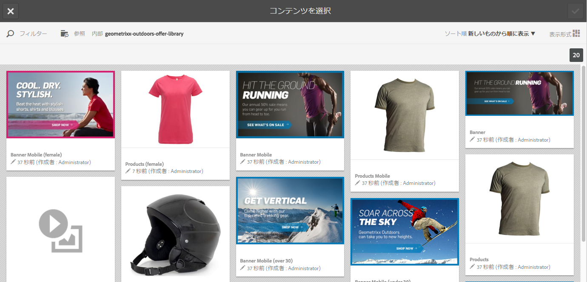

   オファーピッカーを使用して、オファーを参照またはフィルタリングできます。参照またはフィルタリング時に、オファーを並べ替えて、オファーの表示方法を変更することもできます。右上の数字は、現在のライブラリで使用可能なオファーの数を示します。

   * 別のフォルダーに移動するには、「**参照**」をクリックまたはタップします。ナビゲーションウィンドウが開いたら、矢印をクリックしてフォルダーにドリルダウンします。ナビゲーションウィンドウを閉じるには、「**参照**」を再度クリックまたはタップします。

   

   * キーワードまたはタグでオファーをフィルタリングするには、「**フィルター**」をクリックまたはタップします。キーワードを入力し、ドロップダウンメニューからタグを選択します。フィルタリングウィンドウを閉じるには、「**フィルター**」を再度クリックまたはタップします。

   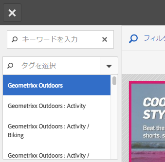

   * オファーの並べ替え方法を変更するには、「**新しいものから順に表示**」の横の矢印をクリックまたはタップします。オファーは新しい順または古い順に並べることができます。

   

   オファーをタイル形式またはリスト形式で表示するには、「**表示形式**」の横のアイコンをクリックまたはタップします。

   

#### カスタムオファーをライブラリに追加 {#adding-a-custom-offer-to-a-library}

カスタムオファーを複数のエクスペリエンス用のオファーとして再利用する場合は、[オファーライブラリ](/help/sites-authoring/offerlib.md)に追加します。現在ターゲット設定しているブランドのライブラリにオファーを追加できます。

オファーコンソールを使用して再利用可能なオファーを作成する方法については、[オファーをオファーライブラリに追加](/help/sites-authoring/offerlib.md#add-an-offer-to-an-offer-library)を参照してください。

1. カスタムオファーを表示するエクスペリエンスを選択します。
1. カスタムオファーをクリックまたはタップしてオファーメニューを表示し、**オファーをオファーライブラリに保存**&#x200B;アイコンをクリックまたはタップします。

   

1. オファー名を入力し、オファーを追加するライブラリを選択して、チェックマークアイコンをクリックまたはタップします。

#### ライブラリオファーからカスタムライブラリへの変換 {#converting-a-library-offer-to-a-custom-library}

他のエクスペリエンスで表示するオファーはそのままにして、現在のエクスペリエンス用のオファーだけを変更したい場合は、ライブラリオファーをカスタムオファーに変換します。

1. ライブラリオファーを表示するエクスペリエンスを選択します。
1. ライブラリオファーをクリックまたはタップしてオファーメニューを表示し、インラインオファーに変換アイコンをクリックまたはタップします。

   

#### ライブラリオファーの編集 {#editing-a-library-offer}

オファーを編集するには、ターゲットモードでエクスペリエンスからライブラリオファーを開きます。ここで加えた変更は、そのオファーを使用しているすべてのエクスペリエンスに反映されます。

1. ライブラリオファーを表示するエクスペリエンスを選択します。
1. ライブラリオファーをローカルまたはカスタムオファーに変換します。[ライブラリオファーからカスタムライブラリへの変換](#converting-a-library-offer-to-a-custom-library)を参照してください。
1. オファーのコンテンツを編集します。

1. ライブラリに再度保存します。[カスタムオファーをライブラリに追加](#adding-a-custom-offer-to-a-library)を参照してください。

## ターゲット設定：オーディエンスの設定 {#target-configuring-the-audiences}

[ターゲット設定プロセス](/help/sites-authoring/content-targeting-touch.md#the-targeting-process-create-target-and-goals-settings)のターゲットステップでは、作成ステップで使用したエクスペリエンスとオーディエンスをマッピングします。ターゲットページには、各エクスペリエンスのターゲットとなるオーディエンスが表示されます。各エクスペリエンスのオーディエンスを指定または変更できます。Adobe Target を使用する場合は、A/B テストを作成して、オーディエンスの一定割合のトラフィックを特定のエクスペリエンスにターゲット設定することもできます。

### AEM ターゲティングまたは Adobe Target（エクスペリエンスターゲティング）を使用する場合  ... {#if-you-are-using-aem-targeting-or-adobe-target-experience-targeting}

マッピング図の左側にオーディエンス、右側にエクスペリエンスが表示されます。

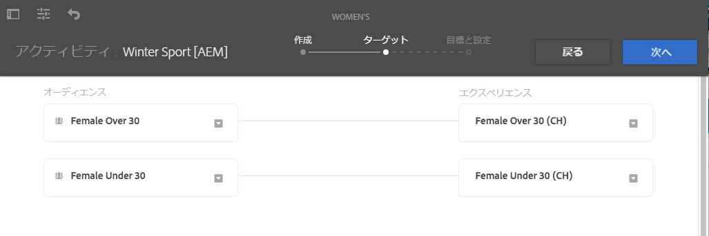

セグメントに基づいてオーディエンスを定義します。使用できるセグメントは、ページのクラウド設定によって決まります。ページが Adobe Target クラウド設定と関連付けられていない場合は、AEM セグメントをオーディエンスの定義に使用できます。ページが Adobe Target クラウド設定と関連付けられている場合は、Target セグメントを使用します。

ターゲティングエンジンについては、[ターゲティングエンジン](/help/sites-authoring/personalization.md#targeting-engine)を参照してください。

1 つのオーディエンスを複数のエクスペリエンスで使用しないでください。既に別のエクスペリエンスにマッピングされているオーディエンスにエクスペリエンスをマッピングすると、そのエクスペリエンスの横に警告シンボルが表示されます。

### エクスペリエンスとオーディエンスの関連付け（AEM または Adobe Target） {#associating-experiences-with-audiences-aem-or-adobe-target}

AEM ターゲティング（または Adobe Target エクスペリエンスターゲット設定）を使用する場合は、以下の手順を使用してエクスペリエンスとオーディエンスを関連付けます。

1. エクスペリエンスにマッピングされているオーディエンスボックスの横のドロップダウン矢印をクリックまたはタップします。
1. （オプション）「**編集**」をクリックまたはタップし、キーワードを入力して目的のセグメントを検索します。
1. オーディエンスのリストからオーディエンスを選択し、「**OK**」をクリックまたはタップします。

### A/B テストを使用する場合（Adobe Target）... {#if-you-are-using-a-b-testing-adobe-target}

A/B テストアクティビティがある場合は、オーディエンスが左側に、各エクスペリエンスを表示する割合が中央に、エクスペリエンスが右側に表示されます。

合計が 100％になるように割合を変更できます。A/B テストでは、1 つのオーディエンスを複数のエクスペリエンスで使用できます。

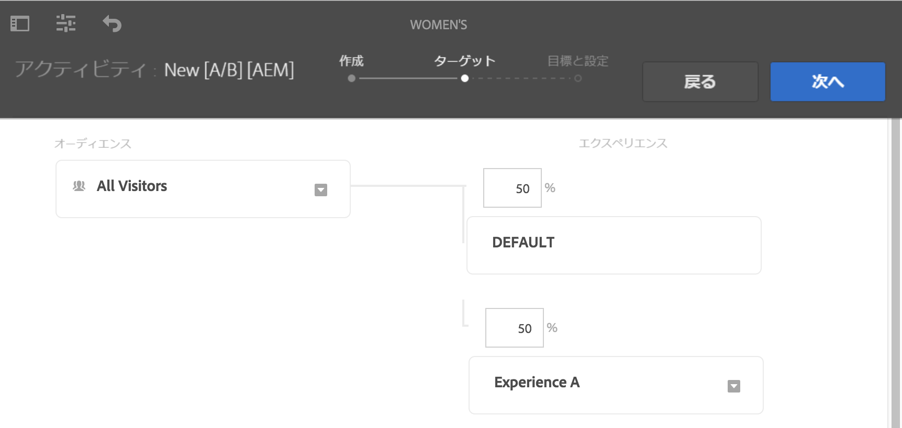

### A/B テストを使用したオーディエンスとトラフィックの割合の関連付け {#associating-audiences-and-traffic-percentages-with-a-b-testing}

1. エクスペリエンスにマッピングされているオーディエンスの横のドロップダウンボックスをクリックまたはタップします。
1. （オプション）「**編集**」をクリックし、キーワードを入力して目的のセグメントを検索します。
1. 「**OK**」をクリックまたはタップします。
1. パーセント単位で入力し、オーディエンスのトラフィックを各エクスペリエンスにどのようにルーティングするかを設定します。合計が 100 になるようにしてください。
1. （オプション）エクスペリエンス名の横のドロップダウンメニューをクリックして、エクスペリエンス名を編集します。

## 目標と設定：アクティビティの設定と目標の設定 {#goals-settings-configuring-the-activity-and-setting-goals}

[ターゲット設定プロセス](/help/sites-authoring/content-targeting-touch.md#the-targeting-process-create-target-and-goals-settings)の目標と設定ステップでは、ブランドアクティビティの動作を設定します。アクティビティの優先度や、開始と終了のタイミングを指定します。さらに、目標も追跡します。アクティビティに関して何を測定するかを具体的に決定できます。

目標指標は、ターゲティングエンジンに Adobe Target を使用する場合にのみ利用できます。1 つ以上の目標指標を定義する必要があります。Adobe Analytics を設定済みで、A4T Analytics クラウド設定がある場合は、レポートソースを Adobe Target にするか Adobe Analytics にするかを選択できます。

目標指標は、公開済みのキャンペーンに対してのみ測定されます。

AEM をターゲティングエンジンとして使用する場合：

Adobe Target をターゲティングエンジンとして使用する場合：

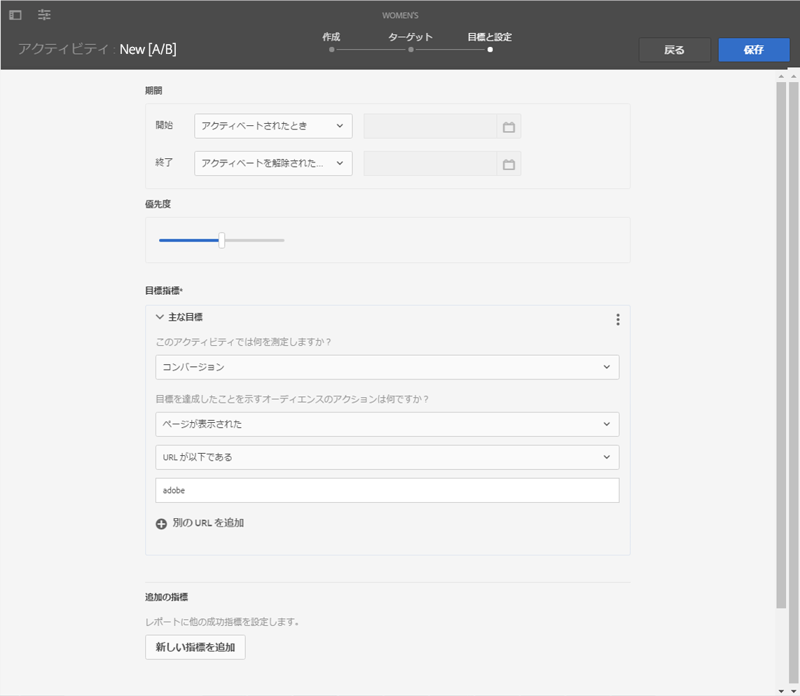

Adobe Target をターゲティングエンジンとして使用し、アカウントに対して A4T Analytics を設定済みの場合は、**レポートソース**&#x200B;ドロップダウンメニューが追加で表示されます。

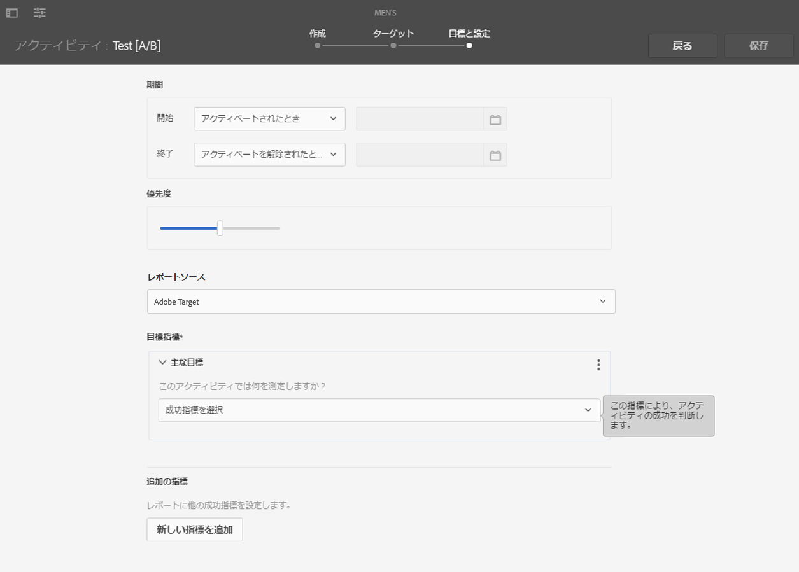

以下の成功指標が利用可能です（公開専用）。

<table>
 <tbody>
  <tr>
   <td><strong>コンバージョン</strong></td>
   <td>
テスト対象エクスペリエンスのどこかをクリックした訪問者の割合。コンバージョンは訪問者ごとに 1 回としてカウントすることも、訪問者がコンバージョンを達成するたびにカウントすることもできます。コンバージョン指標は次のいずれかに設定します。：

    <ul>
     <li><strong>ページの表示</strong> - 「<strong>URL が以下である</strong>」を選択して 1 つ以上の URL を定義するか、「<strong>URL に以下を含む</strong>」を選択してパスまたはキーワードを追加することによって、オーディエンスが表示したページを定義できます。</li>
     <li><strong>mbox が表示された</strong> - mbox 名を入力して、オーディエンスが表示した mbox を定義できます。「<strong>Mbox を追加</strong>」をクリックして、複数の mbox を入力できます。</li>
    </ul> </td>
  </tr>
  <tr>
   <td><strong>売上高</strong></td>
   <td>
訪問によって生成された売上高。次の売上高指標から選択できます。

    <ul>
     <li>訪問者あたりの売上高 （RPV）</li>
     <li>平均注文額 （AOV）</li>
     <li>合計販売額 </li>
     <li>注文回数</li>
    </ul> 
これらのオプションでは、mbox が表示されたかどうかで、目標に到達したかどうかを判断します。1 つまたは複数の mbox を定義できます。
 </td>
  </tr>
  <tr>
   <td><strong>エンゲージメント</strong></td>
   <td>
次の 3 種類のエンゲージメントを測定できます。：

    <ul>
     <li>ページ表示</li>
     <li>カスタムスコア</li>
     <li>サイト滞在時間</li>
    </ul> </td>
  </tr>
 </tbody>
</table>

さらに、詳細設定で成功指標のカウント方法を決定できます。インプレッションごとや訪問者ごとに指標をカウントする、アクティビティにユーザーを保持するか、ユーザーの再入場を許可しないかを選択する、などのオプションがあります。

ユーザーが目標指標に達した&#x200B;**後**&#x200B;の動作について指定するには、詳細設定を使用します。次の表に、利用可能なオプションを示します。

<table>
 <tbody>
  <tr>
   <td><strong>ユーザーがこの目標指標に達した後...</strong></td>
   <td><strong>次の動作を選択...</strong></td>
  </tr>
  <tr>
   <td><strong>カウントを増分、アクティビティでユーザーを保持</strong></td>
   <td>カウントの増分方法を指定します。
    <ul>
     <li>参加者ごとに 1 回</li>
     <li>ページの更新を除くすべてのインプレッション</li>
     <li>すべてのインプレッション</li>
    </ul> </td>
  </tr>
  <tr>
   <td><strong>カウントを増分、ユーザーをリリース、再入場を許可</strong></td>
   <td>訪問者がアクティビティに再入場した場合に表示されるエクスペリエンスを選択します。
    <ul>
     <li>同じエクスペリエンス</li>
     <li>ランダムエクスペリエンス</li>
     <li>未表示のエクスペリエンス</li>
    </ul> </td>
  </tr>
  <tr>
   <td><strong>カウントを増分、ユーザーをリリース、再入場を許可しない</strong></td>
   <td>アクティビティのコンテンツの代わりにユーザーに表示する内容を指定します。
    <ul>
     <li>トラッキングなしの同じエクスペリエンス</li>
     <li>デフォルトコンテンツまたは他のアクティビティのコンテンツ</li>
    </ul> </td>
  </tr>
 </tbody>
</table>

成功指標について詳しくは、[Adobe Target ドキュメント](https://docs.adobe.com/content/help/ja-JP/target/using/activities/success-metrics/success-metrics.translate.html)を参照してください。

### 設定の構成（AEM ターゲティング） {#configuring-settings-aem-targeting}

AEM ターゲティングを使用する場合に設定を構成するには：

1. アクティビティが開始するタイミングを指定するには、**開始**&#x200B;ドロップダウンメニューを使用して、次のいずれかの値を選択します。

   * **アクティベートされたとき**：ターゲットコンテンツを含むページがアクティベートされたときに、アクティビティが開始します。
   * **指定された日時**：特定の時間。このオプションを選択した場合は、カレンダーアイコンをクリックまたはタップし、日付を選択して、アクティビティを開始する時刻を指定します。

1. アクティビティが終了するタイミングを指定するには、**終了**&#x200B;ドロップダウンメニューを使用して、次のいずれかの値を選択します。

   * **アクティベートを解除されたとき**：ターゲットコンテンツを含むページがアクティベートを解除されたときに、アクティビティが終了します。
   * **指定された日時**：特定の時間。このオプションを選択した場合は、カレンダーアイコンをクリックまたはタップし、日付を選択して、アクティビティを終了する時刻を指定します。

1. アクティビティの優先度を指定するには、スライダーを使用して「**低**」、「**標準**」または「**高**」を選択します。

### 目標と設定の構成（Adobe Target） {#configuring-goals-settings-adobe-target}

Adobe Target を使用する場合に目標と設定を構成するには：

1. アクティビティが開始するタイミングを指定するには、**開始**&#x200B;ドロップダウンメニューを使用して、次のいずれかの値を選択します。

   * **アクティベートされたとき**：ターゲットコンテンツを含むページがアクティベートされたときに、アクティビティが開始します。
   * **指定された日時**：特定の時間。このオプションを選択した場合は、カレンダーアイコンをクリックまたはタップし、日付を選択して、アクティビティを開始する時刻を指定します。

1. アクティビティが終了するタイミングを指定するには、**終了**&#x200B;ドロップダウンメニューを使用して、次のいずれかの値を選択します。

   * **アクティベートを解除されたとき**：ターゲットコンテンツを含むページがアクティベートを解除されたときに、アクティビティが終了します。
   * **指定された日時**：特定の時間。このオプションを選択した場合は、カレンダーアイコンをクリックまたはタップし、日付を選択して、アクティビティを終了する時刻を指定します。

1. アクティビティの優先度を指定するには、スライダーを使用して「**低**」、「**標準**」または「**高**」を選択します。
1. Adobe Target アカウントを使用して Adobe Analytics を設定している場合は、**レポートソース**&#x200B;ドロップダウンメニューが表示されます。ソースとして「**Adobe Target**」または「**Adobe Analytics**」を選択します。

   「**Adobe Analytics**」を選択した場合は、会社とレポートスイートを選択します。「**Adobe Target**」を選択した場合、アクションは不要です。

   

1. 「**目標指標**」領域の「**主な目標**」で、コンバージョン、売上高、エンゲージメントなど追跡する成功指標を選択し、その指標の測定方法（または目標に達したことを示すためにオーディエンスが取るアクション）を入力します。成功指標については、前の表の目標指標の定義および [Adobe Target のドキュメント](https://docs.adobe.com/content/help/en/target/using/activities/success-metrics/success-metrics.html)を参照してください。

   右上隅の 3 つのドットをクリックし、「**名前を変更**」を選択して、目標の名前を変更できます。

   すべてのフィールドをクリアする必要がある場合は、右上隅の 3 つのドットをクリックし、「**すべてのフィールドをクリア**」を選択します。

   どの指標にも定義可能な詳細設定があります。この設定にアクセスするには、「**詳細設定**」を選択します。前の表の成功指標のカウント方法の定義と [Adobe Target のドキュメント](https://docs.adobe.com/content/help/en/target/using/activities/success-metrics/success-metrics.html)を参照してください。

   >[!NOTE]
   >1 つ以上の目標を定義する必要があります。

   

   >[!NOTE]
   >指標に不足している情報がある場合は、指標が赤い線で囲まれます。

1. 「**新しい指標を追加**」をクリックして、追加の成功指標を設定します。

   

   >[!NOTE]
   >追加の目標を削除するには、3 つのドットをクリックまたはタップし、「**削除**」をクリックまたはタップします。AEM では、1 つ以上の目標を定義する必要があります。

1. 成功指標のカウント方法をさらに詳細に制御する場合は、「**詳細設定**」をクリックまたはタップして、この設定にアクセスします。
1. 「**保存**」をクリックします。

設定後に、Adobe Target（エクスペリエンスまたは A/B テストのターゲット設定）を使用する[アクティビティのパフォーマンスを表示](/help/sites-authoring/activitylib.md#viewing-performance-and-converting-winning-experiences-a-b-test)できます。さらに、A/B テストのターゲット設定を使用して、[勝者を採用](/help/sites-authoring/activitylib.md#viewing-performance-and-converting-winning-experiences-a-b-test)することができます。

## エクスペリエンスのシミュレーション {#simulating-an-experience}

訪問者のエクスペリエンスをシミュレートし、ターゲットコンテンツのデザインに従って期待されるとおりにページコンテンツが表示されることを確認します。シミュレートの際は、様々なユーザープロファイルを読み込んで、そのユーザー向けのターゲットコンテンツを表示してみます。

訪問者のエクスペリエンスのシミュレート時に表示されるコンテンツは、次の条件によって決まります。

* ユーザーのセッションストア内のデータ（ContextHub を使用）
* [有効になっているアクティビティ](/help/sites-authoring/activitylib.md)
* [セグメントを定義するルール](/help/sites-administering/campaign-segmentation.md)
* ターゲットコンポーネント内のエクスペリエンスのコンテンツ
* [ターゲティングエンジンの設定](/help/sites-authoring/activitylib.md)

プロファイルを読み込んだときに予期せぬコンテンツがページ上に表示された場合は、このリストの各項目の設定を確認してください。

>[!NOTE]
>A/B テストを使用してシミュレートをおこなった場合は、トラフィックの割合に基づいてエクスペリエンスが表示されます。この表示制御は Adobe Target がおこないますが、作成者の予期せぬ結果になることがあります（_author アクティビティは、シミュレーション時の再評価を可能にする特定の設定と同期されます）。トラフィック設定に基づいて他のエクスペリエンスを表示するには、何回かページを更新しなければならない場合があります。

訪問者のエクスペリエンスをシミュレートするには、以下のツールを使用します。

* ターゲットモードでのシミュレーションアクティビティ：ページには、ContextHub で現在選択されているユーザー向けのオファーが表示されます。このユーザーをターゲットとするオファーを編集できます。
* プレビューモード：ContextHub を使用して、エクスペリエンスのベースとなるセグメントの条件を満たすユーザーと場所を選択します。ContextHub での選択を変更すると、ターゲットコンテンツもそれに従って変更されます。

1. プレビューモードに切り替えるには、ツールバーで「**プレビュー**」をクリックまたはタップします。
1. ツールバーで、ContextHub アイコンをクリックまたはタップします。

   

1. ContextHub を使用して、コンテキストプロパティを変更します。例えば、「ペルソナ」プロパティをクリックまたはタップして、別のユーザーを選択します。

   

   ページが切り替わり、現在のコンテキストをターゲットとするコンテンツが表示されます。

1. 表示されているオファーを編集するには、ターゲットモードに切り替えます。シミュレーションアクティビティが選択されている状態で、プレビューモードで設定したコンテキストのオファーを編集します。

## ターゲットコンポーネントオプションの設定 {#configuring-target-component-options}

Target コンポーネントをカスタマイズするには、次の 2 つの方法のどちらかでコンポーネントのオプションにアクセスします。

1. ターゲットコンポーネント内のコンポーネントをターゲット設定した後に、コンポーネント、設定アイコン（歯車アイコン）の順にクリックまたはタップします。

   

   AEM に、Target コンポーネントオプションウィンドウが表示されます。

   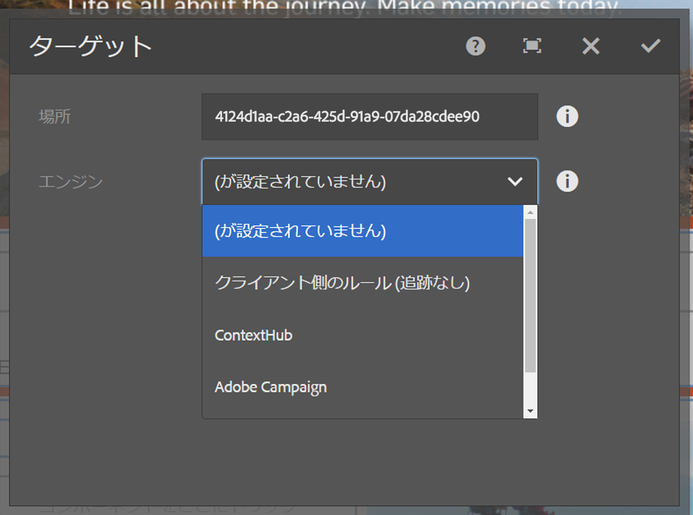

1. または、全画面表示モードでこの設定にアクセスするには、Target コンポーネントオプションウィンドウで、全画面表示アイコンをクリックまたはタップします。

   

   AEM に、Target コンポーネントオプションウィンドウが全画面表示されます。

   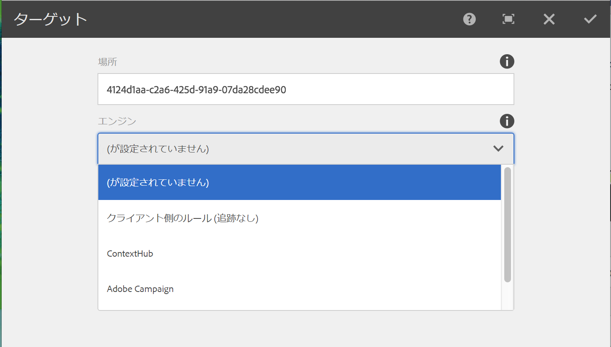

1. 下の表の説明に従って、ターゲットコンポーネントを設定します。

<table>
 <tbody>
  <tr>
   <td><strong>オプション</strong></td>
   <td><strong>説明</strong></td>
  </tr>
  <tr>
   <td><strong>場所</strong></td>
   <td>
場所は、Target コンテンツの場所を識別する文字列であり、オファーを配置するページ上の場所（または位置あるいはコンポーネント）とオファーとを関連付けるために使用されます。
 
このフィールドは汎用値です。
 
オファーをコンポーネント内に配置すると、オファーが場所 ID を記憶します。ページが実行されると、エンジンがユーザーのセグメントを評価し、その評価に基づいて、アクティブなキャンペーンから表示すべきエクスペリエンスを選択します。そして、ページ上の場所 ID を確認して、この場所 ID を持つオファーを場所に関連付けようとします。
 </td>
  </tr>
  <tr>
   <td><strong>エンジン</strong></td>
   <td>使用したいエンジンに応じて、「<strong>クライアントサイドのルール（トラッキングなし）」、「Adobe Target」、「ContextHub」</strong>、<strong>「Adobe Campaign」</strong>から選択します。</td>
  </tr>
 </tbody>
</table>

エンジンとして Adobe Target を選択した場合：

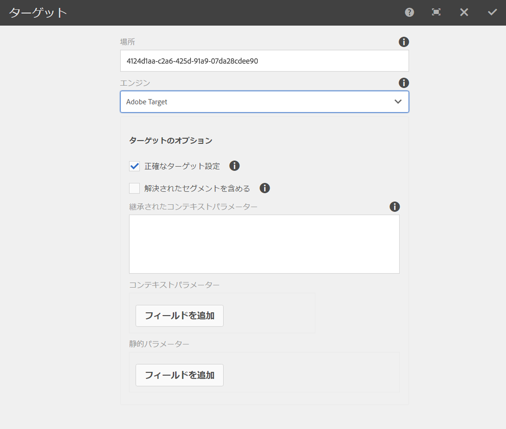

<table>
 <tbody>
  <tr>
   <td><strong>オプション</strong></td>
   <td><strong>説明</strong></td>
  </tr>
  <tr>
   <td><strong>正確なターゲット設定</strong></td>
   <td>
正確なターゲット設定を有効にすると、コンポーネントは ClientContext または ContextHub のデータが利用可能になるまで待ってから Adobe Target にリクエストを送信します。これによって、読み込み時間が長くなる場合があります。オーサリング時は、正確なターゲット設定は常に有効になっています。
 
「<strong>正確なターゲット設定</strong>」チェックボックスをオンにした場合、mbox はまず <code>mboxDefine</code> を実行し、後で <code>mboxUpdate</code> を実行するので、データが利用可能になった時点で Ajax リクエストが送信されます。
 
「<strong>正確なターゲット設定</strong>」チェックボックスをオフにした場合、mbox は <code>mboxCreate</code> を実行するので、直ちに同期リクエストが行われます（この場合、必ずしもすべてのコンテクストデータがまだ利用可能になっていないことがあります）。
 
<strong>注意：</strong>特定のコンポーネントで「正確なターゲット設定」を有効または無効にしても、グローバル設定には影響しません。コンポーネントで「正確なターゲット設定」を有効にすれば、その設定が常にグローバル設定よりも優先されます。
 </td>
  </tr>
  <tr>
   <td><strong>解決されたセグメントを含める</strong></td>
   <td>
このチェックボックスをオンにすると、mbox 呼び出しで解決されたすべてのセグメントと、ページおよびフレームワークで設定されたすべてのパラメーターが含められます。
 
この機能は、XML API を使用して AEM セグメントを同期している状況でのみ有効になります。Adobe Target が扱っていないセグメント（スクリプトセグメントなど）が AEM にある場合は、このオプションを使用して、AEM でセグメントを解決し、セグメントがアクティブな Adobe Target に情報を送信できます。
 </td>
  </tr>
  <tr>
   <td><strong>継承されたコンテキストパラメーター</strong></td>
   <td>選択したページに関連付けられている、Adobe Target フレームワークから継承されたコンテキストパラメーターがあれば、一覧表示します。</td>
  </tr>
  <tr>
   <td><strong>コンテキストパラメーター</strong></td>
   <td>追加のコンテクストパラメーター（Target フレームワークで使用可能なものと同じ）を設定するには、「<strong>フィールドを追加</strong>」をクリックまたはタップします。コンポーネントに追加されたコンテクストパラメーターは、そのコンポーネントに<i>のみ</i>適用されます。フレームワークに直接コンテクストパラメーターを追加した場合とは異なり、他のコンポーネントには適用されません。</td>
  </tr>
  <tr>
   <td><strong>静的パラメーター</strong></td>
   <td>追加の静的パラメーター（Target フレームワークで使用可能なものと同じ）を設定するには、「<strong>フィールドを追加</strong>」をクリックまたはタップします。コンポーネントに追加された静的パラメーターは、そのコンポーネントに<i>のみ</i>適用されます。フレームワークに直接静的パラメーターを追加した場合とは異なり、他のコンポーネントには適用されません。静的パラメーターは、コンテキスト（ContextHub または ClientContext）からは得られません。</td>
  </tr>
 </tbody>
</table>

>[!NOTE]
>コンポーネントを選択してターゲット設定可能にすると、AEM はそのコンポーネントの置き換えと Adobe Target コンポーネントの挿入もおこないます（Adobe Target コンポーネントは、ページに手動で追加できるだけでなく、既存コンポーネントをターゲット設定する場合にも使用できます）。

ClientContext（クライアント側）をエンジンとして選択した場合：

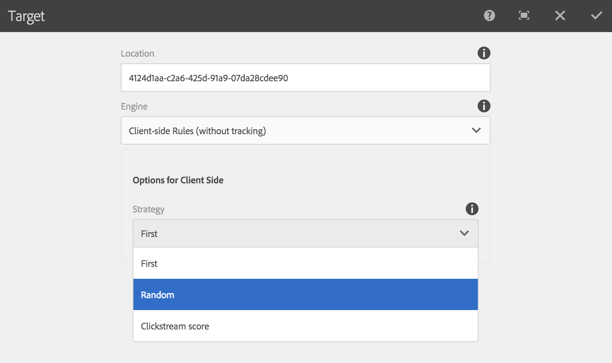

<table>
 <tbody>
  <tr>
   <td><strong>オプション</strong></td>
   <td><strong>説明</strong></td>
  </tr>
  <tr>
   <td><strong>クライアントサイドのオプション - 戦略</strong></td>
   <td>
次のいずれかを選択します。

    <ul>
     <li><strong>第 1</strong>：キャンペーンのリストの並び順で 1 番上のエクスペリエンスが使用されます。</li>
     <li><strong>ランダム</strong>：任意のエクスペリエンスが使用されます。</li>
     <li><strong>Clickstream のスコア</strong>：ClientContext で追跡されるタグおよび関連タグのヒットが使用されます。ティーザーページに定義されている複数のタグのヒット率が比較されます。</li>
    </ul> </td>
  </tr>
 </tbody>
</table>

AEM と Adobe Campaign を統合している場合は、**Adobe Campaign** をエンジンとして選択します。詳しくは、[AEM と Adobe Campaign の統合](/help/sites-administering/campaign.md)を参照してください。

ターゲット設定に ContextHub を使用する場合は、**ContextHub** をエンジンとして選択します。詳しくは、[ContextHub の設定](/help/sites-developing/ch-configuring.md)を参照してください。
