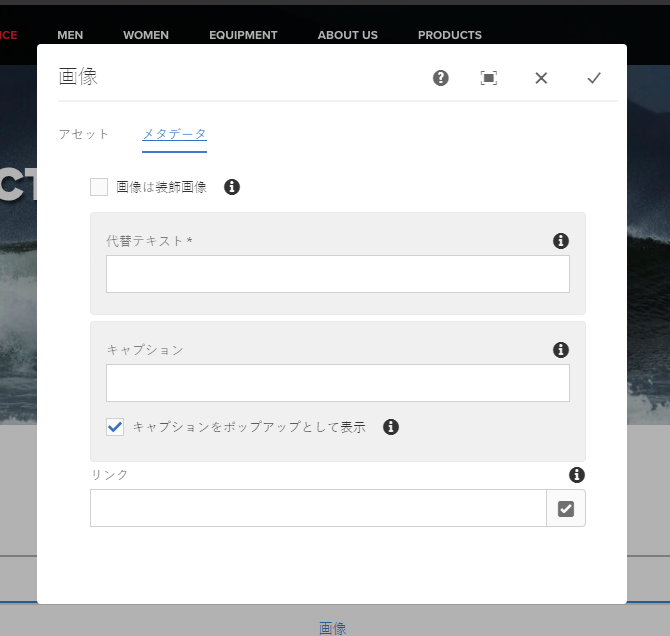
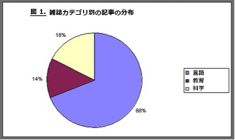
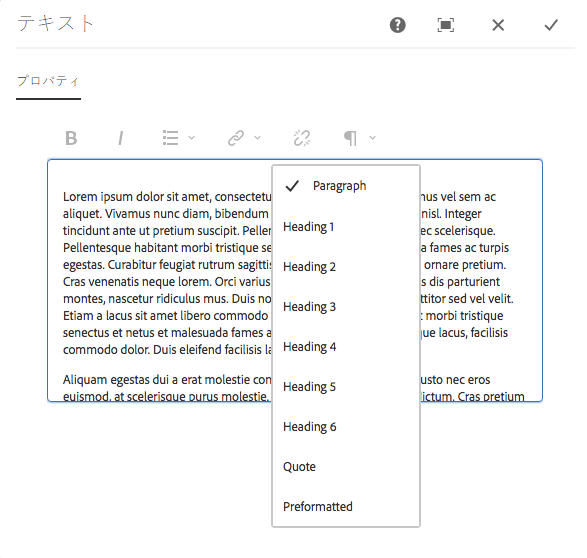
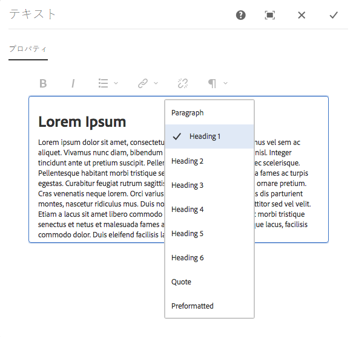
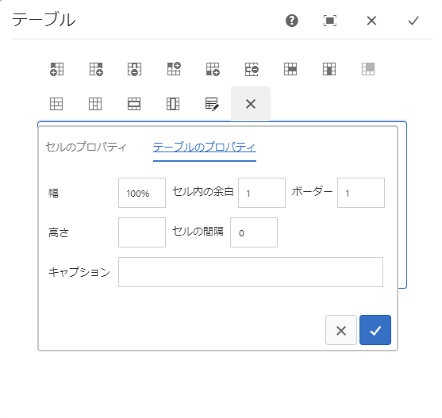
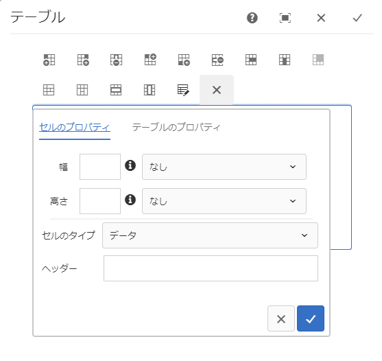
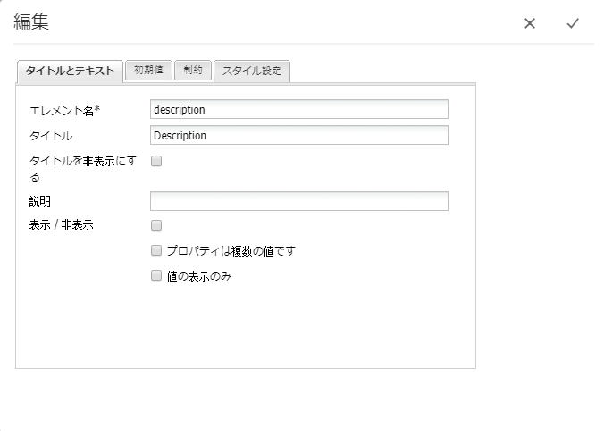
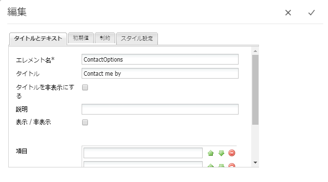

# アクセス可能なコンテンツ（WCAG 2.0 適合）の作成{#creating-accessible-content-wcag-conformance}

WCAG 2.0 は、障碍のあるユーザーが Web コンテンツにアクセスして利用できるようにするための、テクノロジーから独立した一連のガイドラインおよび達成基準で構成されます。

>[!NOTE]
>
>関連トピック:
>
>* [WCAG 2.0 のクイックガイド](/help/managing/qg-wcag.md)
>* [アクセス可能なコンテンツを生成するためのリッチテキストエディターの設定](/help/sites-administering/rte-accessible-content.md)
>


WCAG 2.0 は 3 つの適合レベル（レベル A（最低）、レベル AA、レベル AAA（最高））に分けられます。各レベルの簡単な定義を次に示します。

* **レベル A：**&#x200B;基本的かつ最低限のレベルのアクセシビリティが確保されているサイトです。このレベルに達するには、レベル A の達成基準をすべて満たしている必要があります。
* **** レベルAA:これは、サイトのアクセシビリティが向上し、ほとんどの状況でほとんどのテクノロジーを使用するほとんどの人がサイトにアクセスできるようにするための理想的なレベルのアクセシビリティです。このレベルを満たすために、すべてのレベルAとレベルAAの成功基準が満たされます。
* **レベル AAA：**&#x200B;極めて高いレベルのアクセシビリティが確保されているサイトです。このレベルに達するには、レベル A、レベル AA、レベル AAA の達成基準をすべて満たしている必要があります。

サイトを作成する際は、サイトの全体的なレベルを特定する必要があります。

次の節では、[WCAG 2.0 のガイドライン](https://www.w3.org/TR/WCAG20/#guidelines)および[適合レベル](https://www.w3.org/TR/UNDERSTANDING-WCAG20/conformance.html) A と AA の関連する達成基準を示します。

>[!NOTE]
>
>特定のタイプのコンテンツでは、レベル AAA のすべての達成基準を満たすことができないので、このレベルの適合を一般的なポリシーの要件とすることはお勧めしません。

>[!NOTE]
>
>このドキュメントでは、次の表記を使用しています。
>
>* [WCAG 2.0 のガイドライン](https://www.w3.org/TR/WCAG20/#guidelines)用の省略名。
>* WCAG の Web サイトとの相互参照を目的として [WCAG 2.0 のガイドライン](https://www.w3.org/TR/WCAG20/#guidelines)で使用されている番号。
>


## 原則 1：知覚可能 {#principle-perceivable}

[原則 1: 知覚可能 - 情報およびユーザーインターフェイスコンポーネントは、ユーザーが知覚できる方法でユーザーに提示可能でなければならない。](https://www.w3.org/TR/WCAG20/#perceivable)

### 代替テキスト（1.1） {#text-alternatives}

[ガイドライン 1.1 代替テキスト：すべてのテキスト以外のコンテンツには、拡大印刷、点字、音声、シンボル、平易な言葉などのユーザーが必要とする形式に変換できるように、代替テキストを提供すること。](https://www.w3.org/TR/WCAG20/#text-equiv)

### テキスト以外のコンテンツ（1.1.1） {#non-text-content}

* 達成基準 1.1.1
* レベル A
* テキスト以外のコンテンツ：ユーザーに提示されるすべてのテキスト以外のコンテンツには、同等の目的を果たす代替テキストが提供されます。ただし、次の場合は除きます。

#### Purpose - Non-text Content (1.1.1) {#purpose-non-text-content}

Web ページ上の情報はテキスト以外の様々な形式（写真、ビデオ、アニメーション、チャート、グラフなど）で指定できます。視覚に障碍のあるユーザーは、テキスト以外のコンテンツを見ることができませんが、スクリーンリーダーによる読み上げや、触覚で感知可能な点字表示デバイスを使用すれば、テキストコンテンツにアクセスできます。そのため、グラフィカルな形式にコンテンツの代替テキストを指定することにより、グラフィカルなコンテンツを見ることができないユーザーも、そのコンテンツが提供するものと同等の情報にアクセスできます。

もう 1 つのメリットとして、代替テキストを使用すると、検索エンジンのテクノロジーによってテキスト以外のコンテンツのインデックスを作成できます。

#### 達成方法 - テキスト以外のコンテンツ（1.1.1） {#how-to-meet-non-text-content}

静的なグラフィックの場合、そのグラフィックと同等の代替テキストを指定することが基本的な要件です。そのためには、「**代替テキスト**」フィールドを使用します。

>[!NOTE]
>
>カルーセルやスライドショーなど、あらかじめ用意されている一部のコンポーネントには **、画像に代替テキ****** ストの説明を追加する手段が用意されていません。 AEMインスタンスにこれらのバージョンを実装する場合、作成者がコンテンツに追加できるように、開発チームは属性をサポートするようにこれらのコンポーネントを設定する必要があります(詳しくは、 `alt` Adding Support for Additional HTML Elements and Attributes [](/help/sites-administering/rte-accessible-content.md#adding-support-for-additional-html-elements-and-attributes))。

「**代替テキスト**」フィールドは、**画像**&#x200B;コンポーネントダイアログの「**メタデータ**」タブに表示されます。



AEM では、デフォルトで入力される「**代替テキスト**」フィールドが必要です。画像が単なる装飾用で代替テキストが無意味な場合は、「**画像は装飾画像**」オプションをチェックできます。

#### 適切な代替テキストの作成 {#creating-good-text-alternatives}

テキスト以外のコンテンツには様々な形式があるので、代替テキストの値は、Web ページにおけるグラフィックの役割に応じて異なります。従う必要のある一般的な手法を次に示します。

* 代替テキストは、簡潔でありながら、テキスト以外のコンテンツによって提供されている情報の要点を明確にとらえる必要があります。
* 過剰に長い説明（100 文字超など）は避けてください。代替テキストに詳細を追加する必要がある場合は、次のようにします。

   * 代替テキストで短い説明を提示する
   * 同じページの別の場所、または別の Web ページに長い説明を表示し、画像をリンクにするか、画像の横にテキストリンクを配置することで、この別の説明にリンクを設定する

* 代替テキストでは、同じページ上のすぐ近くにテキスト形式で提示されているコンテンツをレプリケートしないでください。多くの画像は、ページのテキストで既に取り上げられている項目の説明なので、詳細な代替テキストが既に存在している場合があります。
* テキスト以外のコンテンツが別のページまたはドキュメントへのリンクであり、同じリンクを形成しているテキストが他にない場合、画像の代替テキストは、画像を説明するものではなく、リンク先を示すものにする必要があります。
* テキスト以外のコンテンツがボタン要素に含まれていて、同じボタンを形成するテキストがない場合、画像の代替テキストは、画像を説明するものではなく、ボタンの機能を示すものにする必要があります。
* 画像に空の（ヌルの）代替テキストを割り当てるのは、その画像に代替テキストがない場合（例えば、純粋に装飾的なグラフィックの場合）、またはページテキストに同等のテキストが既に存在する場合に限り、問題ありません。

[W3C ドラフト：「HTML5: Techniques for providing useful text alternatives」](https://dev.w3.org/html5/alt-techniques/)には、様々なタイプの画像に適切な代替テキストプロビジョンの詳細と例が記載されています。

代替テキストを必要とするテキスト以外のコンテンツには、以下のようなタイプがあります。

* Illustrative photos:
These are images of people, objects or places. Think about the role of the photo in the page; an appropriate text equivalent is likely to be *Photo of[object ]*, but may be dependent on the surrounding text.
* アイコン：
特定の情報を伝える小さい絵文字です。ページおよびサイト全体で一貫して使用する必要があります。1 つのページまたはサイト上の同じアイコンにはすべて、短く簡潔な同じ代替テキストを含める必要があります。ただし、そうすることにより、隣接するテキストと不要な重複が発生する場合を除きます。
* Charts and graphs:
These typically represent numerical data. So one option for providing a text alternative might be to include a brief summary of the main trends shown in the chart or graphic. If necessary, also provide a more detailed description in text using the **Description** field in the **Advanced** image properties tab. Additionally, you could provide the source data in tabular form elsewhere in the page or site.

   

   このチャート例に代替テキストを提供するには、画像自体に簡略化した `alt` テキストを追加して、画像の後に完全な代替テキストを入力します。

   ```xml
   <p></p>
   <p> Figure 1. Distribution of Articles by Journal Category.
   Pie chart: Language=68%, Education=14% and Science=18%.</p>
   ```

   >[!NOTE]
   >
   >上記のスニペットは、順序を説明するためだけに使用されています。**画像**&#x200B;コンポーネントを、上記で使用している `img src` 参照の代わりに使用することをお勧めします。

   [達成方法 - テキスト以外のコンテンツ（1.1.1）](#how-to-meet-non-text-content)に示すように、AEM では、画像の設定ダイアログの「**代替テキスト**」フィールドと「**説明**」フィールドを組み合わせてこの処理をおこなうことができます。

* Maps, diagrams, flowcharts:
For graphics providing spatial data (for example. to support describing relationships between objects or a process), ensure that the key message is provided in text format. For maps, providing a full text equivalent is likely to be impractical, but if the map is provided as a way of helping people find their way to a particular location, then the map image’s alternative text can briefly indicate *Map of X*, then provide directions to that location in text elsewhere in the page or through the **Description** field in the **Advanced** tab of the **Image** component.
* CAPTCHA：CAPTCHA は、*Completely Automated Public Turing test to tell Computers and Humans Apart*（コンピューターと人間を区別するための、完全に自動化された公開チューリングテスト）の略です。Web ページで人間と不正ソフトウェアを区別するために使用されるセキュリティチェックですが、アクセシビリティの障害となる可能性があります。これらの画像をユーザーが見て説明することにより、セキュリティテストに合格します。この画像の代替テキストを提供することは明らかに不可能なので、代わりに代替のグラフィック以外のソリューションを検討する必要があります。W3C では、いくつかの提案をおこなっています。例えば、以下の方法にはそれぞれメリットとデメリットがあるとされています。

   * 論理パズル
   * 画像の代わりに音声出力を使用
   * アカウントおよびスパムフィルターの使用制限

* 背景画像：これらは、HTMLではなく、CSS（カスケーディングスタイルシート）を使用して行います。つまり、代替テキスト値を指定できないことを意味します。したがって、背景画像は重要なテキスト情報を提供しないでください。提供する場合は、ページのテキストにもこの情報を提供する必要があります。ただし、画像が表示できない場合は、代替の背景を表示することが重要です。

   >[!NOTE]
   >
   >背景と手前のテキストの間には適度なコントラストが必要です。これについて詳しくは、[コントラスト（最低限）（1.4.3）](#contrast-minimum)を参照してください。

#### 詳細情報 - テキスト以外のコンテンツ（1.1.1） {#more-information-non-text-content}

* [達成基準 1.1.1 について](https://www.w3.org/TR/UNDERSTANDING-WCAG20/text-equiv-all.html)
* [達成基準 1.1.1 の達成方法](https://www.w3.org/WAI/WCAG20/quickref/#text-equiv)
* [W3C：HTML5：有効な代替テキストを提供するためのテクニック（ドラフト）](https://dev.w3.org/html5/alt-techniques/)
* [W3C：CAPTCHA の説明と代替機能](https://www.w3.org/TR/turingtest/)

### 時間依存メディア（1.2） {#time-based-media}

[ガイドライン 1.2 時間依存メディア：時間依存メディアには代替コンテンツを提供すること。](https://www.w3.org/TR/WCAG20/#text-equiv)

ここでは、時間依存&#x200B;**&#x200B;の Web コンテンツについて扱います。これには、ユーザーが再生可能なコンテンツ（映像、音声、アニメーションなど）や、収録済みのコンテンツ、ライブストリームなどが含まれます。

### 音声のみおよび映像のみ（収録済み）（1.2.1） {#audio-only-and-video-only-pre-recorded}

* 達成基準 1.2.1
* レベル A
* 音声のみおよび映像のみ（収録済み）：事前に収録済みの音声のみおよび映像のみのメディアには、以下が該当します。ただし、音声または映像がテキストの代替であり、その旨の明確なラベルが付けられている場合を除きます。

   * 収録済みの音声のみ：時間依存メディアの代替コンテンツが提供されており、収録済みの音声のみのコンテンツと同等の情報を提示している。
   * 収録済みの映像のみ：時間依存メディアの代替コンテンツまたは音声トラックが提供されており、収録済みの映像のみのコンテンツと同等の情報を提示している。

#### 目的 - 音声のみおよび映像のみ（収録済み）（1.2.1） {#purpose-audio-only-and-video-only-pre-recorded}

次のようなユーザーに、アクセシビリティの問題が発生します。

* 音声がまったくない場合や、映像またはアニメーションの内容が音声で十分に伝えられていない場合は、視覚障碍のあるユーザー
* 音声を聞くことのできない、聴覚障碍のあるユーザー
* 音声を聞くことはできるが、内容を理解できないユーザー（理解できない言語が使用されている場合など）。

映像または音声は、Adobe Flash など特定のメディア形式のコンテンツ再生をサポートしていないブラウザーやデバイスを使用しているユーザーも使用できない場合があります。

この情報を別の形式（テキストや、音声なしの映像に音声を付けるなど）で提供すると、元のコンテンツにアクセスできないユーザーがアクセス可能になります。

#### 達成方法 - 音声のみおよび映像のみ（収録済み）（1.2.1） {#how-to-meet-audio-only-and-video-only-pre-recorded}

* 映像なしの収録済み音声コンテンツ（ポッドキャストなど）の場合：

   * 音声コンテンツの字幕のリンクをコンテンツの直前または直後に提示します。字幕は、話の内容と、話されていない重要な内容のすべてに相当するテキストを含む HTML ページとし、話者を明記し、状況説明、声の表情、その他の重要な音声の説明を含める必要があります。

* 音声なしのアニメーションまたは収録済み映像コンテンツの場合：

   * 映像で提供されている情報に相当するテキスト説明のリンクをコンテンツの直前または直後に提示します。
   * または、MP3 など一般的に使用されている音声形式で、相当する音声解説のリンクを提示します。

>[!NOTE]
>
>音声または映像のコンテンツが、Web ページ上に既に存在する別の形式のコンテンツの代替として提供されている場合は、上記の要件に従う必要はありません。例えば、テキストによる手順説明を解説している映像の場合は、テキストによる手順説明が既に映像の代替の役割を果たしているので、映像の代替を指定する必要はありません。

マルチメディア、具体的には Flash コンテンツを AEM Web ページに挿入することは、画像の挿入と類似しています。ただし、マルチメディアコンテンツには静止画像より多くの機能が含まれているので、マルチメディアの再生方法を制御するために、様々な設定やオプションがあります。

>[!NOTE]
>
>情報コンテンツを含むマルチメディアを使用する場合は、代替オプションへのリンクも作成する必要があります。例えば、テキスト内容を含めるには、HTMLページを作成して内容を表示し、オーディオコンテンツの横または下にリンクを追加します。

#### More Information - Audio-only and Video-only (Pre-recorded) (1.2.1) {#more-information-audio-only-and-video-only-pre-recorded}

* [達成基準 1.2.1 について](https://www.w3.org/TR/UNDERSTANDING-WCAG20/media-equiv-av-only-alt.html)
* [達成基準 1.2.1 の達成方法](https://www.w3.org/WAI/WCAG20/quickref/#media-equiv)

### キャプション（収録済み）（1.2.2） {#captions-pre-recorded}

* 達成基準 1.2.2
* レベル A
* キャプション（収録済み）：同期されたメディアに含まれるすべての収録済み音声コンテンツに対してキャプションが提供されます。ただし、そのメディアがテキストの代替メディアであり、その旨の明確なラベルが付けられている場合を除きます。

#### 目的 - キャプション（収録済み）（1.2.2） {#purpose-captions-pre-recorded}

聴覚障碍のあるユーザーは、音声コンテンツにアクセスできないか、アクセスが非常に困難になります。キャプションは、音声で話されている内容と話されていない内容に相当するテキストであり、映像再生中に適時画面に表示されます。これにより、音声を聞くことのできないユーザーが内容を理解できます。

>[!NOTE]
>
>映像やアニメーションと同じページに適切なテキストまたはテキスト以外でそれに相当するもの（同等の情報を直接提供するもの）がある場合は、キャプションは不要です。

#### 達成方法 - キャプション（収録済み）（1.2.2） {#how-to-meet-captions-pre-recorded}

キャプションは、次のいずれかの状態に設定できます。

* オープン：映像再生時に常に表示
* クローズド：* *キャプションはユーザーがオンまたはオフに切り替えることができます。

可能な場合は、クローズドキャプションを使用して、キャプションの表示、非表示をユーザーが選択できるようにしてください。

クローズドキャプションの場合は、適切な形式（[SMIL](https://www.w3.org/AudioVideo/) など）の同期キャプションファイルを映像ファイルと共に作成して提供する必要があります（この方法の詳細は、このガイドの範囲外ですが、[詳細情報 - キャプション（収録済み）（1.2.2）](#more-information-captions-pre-recorded)に、いくつかのチュートリアルへのリンクを提示しています）。映像にキャプションを設定できることをユーザーに知らせる注意書きを必ず提示してください。

オープンキャプションを使用する必要がある場合は、映像トラック内にテキストを埋め込みます。これをおこなうには、映像にタイトルをオーバーレイできるビデオ編集アプリケーションを使用します。

#### 詳細情報 - キャプション（収録済み）（1.2.2） {#more-information-captions-pre-recorded}

* [達成基準 1.2.2 について](https://www.w3.org/TR/UNDERSTANDING-WCAG20/media-equiv-captions.html)：
* [達成基準 1.2.2 の達成方法](https://www.w3.org/WAI/WCAG20/quickref/#media-equiv)
* [W3C：Synchronized Multimedia](https://www.w3.org/AudioVideo/)
* [Captions, Transcripts, and Audio Descriptions（WebAIM）](https://webaim.org/techniques/captions/)

### 音声解説または代替メディア（収録済み）（1.2.3） {#audio-description-or-media-alternative-pre-recorded}

* 達成基準 1.2.3
* レベル A
* 音声解説または代替メディア（収録済み）：収録済みの映像コンテンツの時間依存メディアまたは音声解説の代わりとなるものが、同期されたメディアに対して提供されている。ただし、そのメディアがテキストの代替メディアであり、その旨の明確なラベルが付けられている場合を除きます。

#### 目的 - 音声解説または代替メディア（収録済み）（1.2.3） {#purpose-audio-description-or-media-alternative-pre-recorded}

映像やアニメーションの情報が視覚的にのみ提供されている場合や、内容を視覚的に理解するのに十分な情報が音声で提供されていない場合は、視覚障碍のあるユーザーにアクセシビリティの問題が発生します。

#### 達成方法 - 音声解説または代替メディア（収録済み）（1.2.3） {#how-to-meet-audio-description-or-media-alternative-pre-recorded}

この達成基準を満たすために採用できる方法は 2 つあり、どちらを使用してもかまいません。

1. 映像コンテンツに音声解説を追加します。これをおこなうには、次の 3 つのうちいずれかの方法を使用します。

   * 既存の対話の休止部分で、既存の音声トラックでは提示されていないシーンの変化に関する情報を提供します。
   * 元の音声を含み、さらにシーンの変化に関する追加の音声情報も含む新しい追加のオプション音声トラックを提供します。

      * これにより、ユーザーは既存の音声トラック（**&#x200B;音声解説を含まない）と新しい音声トラック（**&#x200B;音声解説を含む）を切り替えることができます。

      * これにより、追加の説明が不要なユーザーの混乱を防ぐことができます。
   * 音声解説を拡張できるように、2 つ目のバージョンの映像コンテンツを作成します。これにより、適切な時点で音声と映像を一時的に休止して既存の対話の合間に詳細な音声解説を提供することに関連する困難な作業を軽減できます。その結果、アクションが再開される前に、より長い音声解説を指定できます。前の例と同様に、追加の説明が不要なユーザーの混乱を防ぐために、この方法はオプションの追加音声トラックとして提供することをお勧めします。


1. 映像またはアニメーションの音声および視覚要素をテキストで適切に表現した字幕を提供します。適宜、誰が話しているかや、状況の説明、声の表情を含めてください。長さによって、字幕は映像やアニメーションと同じページに配置するか、別のページに配置できます。後者を選んだ場合は、映像またはアニメーションのすぐ近くに字幕へのリンクを提示してください。

音声解説付きの映像の詳細な作成方法は、このガイドの範囲外です。映像および音声解説の作成には長時間を要する可能性がありますが、他のアドビ製品が役に立つ場合があります。If you create content in Adobe Flash Professional, you should also create a script to prompt the user to download the appropriate plug-in, and provide a text alternative through the `<noscript>` element.

#### More Information - Audio Description or Media Alternative (Pre-Recorded) (1.2.3) {#more-information-audio-description-or-media-alternative-pre-recorded}

* [達成基準 1.2.3 について](https://www.w3.org/TR/UNDERSTANDING-WCAG20/media-equiv-audio-desc.html)：
* [達成基準 1.2.3 の達成方法](https://www.w3.org/WAI/WCAG20/quickref/#qr-media-equiv-audio-desc)
* [Adobe Encore CS5](https://www.adobe.com/products/premiere/encore/)

### キャプション（ライブ）（1.2.4）  {#captions-live}

* 達成基準 1.2.4
* レベル AA
* キャプション（ライブ）：同期されたメディアに含まれるすべてのライブ音声コンテンツに対してキャプションが提供されている。

#### 目的 - キャプション（ライブ）（1.2.4） {#purpose-captions-live}

This success criterion is identical to [Captions (Pre-Recorded)](#captionsprerecorded) in that it addresses accessibility barriers experienced by people who are deaf or hearing-impaired, except that this success criterion deals with live presentations such as webcasts.

#### How to Meet - Captions (Live) (1.2.4) {#how-to-meet-captions-live}

Follow the guidance provided for [Captions (Pre-Recorded)](#captionsprerecorded) above. However, due to the live nature of the media, caption provision has to be created as quickly as possible and in response to what is happening. Therefore, you should consider using real time captioning or speech-to-text tools.

詳細な手順説明はこのドキュメントの範囲外ですが、次のリソースで役に立つ情報が提供されています。

* [WebAIM：Real Time Captioning](https://www.webaim.org/techniques/captions/realtime.php)
* [AccessIT （University of Washington）：Can captions be generated automatically using speech recognition?](https://www.washington.edu/accessit/articles?1209)

#### 詳細情報 - キャプション（ライブ）（1.2.4） {#more-information-captions-live}

* [達成基準 1.2.4 について](https://www.w3.org/TR/UNDERSTANDING-WCAG20/media-equiv-real-time-captions.html)
* [達成基準 1.2.4 の達成方法](https://www.w3.org/WAI/WCAG20/quickref/#qr-media-equiv-real-time-captions)

### 音声解説（収録済み）（1.2.5）  {#audio-description-pre-recorded}

* 達成基準 1.2.5
* レベル AA
* 音声解説（収録済み）：同期されたメディアに含まれるすべての収録済み映像コンテンツに対して音声解説が提供されている。

#### 目的 - 音声解説（収録済み）（1.2.5） {#purpose-audio-description-pre-recorded}

この達成基準は、[音声解説または代替メディア（収録済み）](#audiodescriptionormediaalternativeprerecorded)と同じです。ただし作成者は、レベル AA に準拠するために、より詳細な音声解説を提供する必要があります。

#### 達成方法 - 音声解説（収録済み）（1.2.5） {#how-to-meet-audio-description-pre-recorded}

[音声解説または代替メディア（収録済み）](#audiodescriptionormediaalternativeprerecorded)のガイダンスに従ってください。

#### 詳細情報 - 音声解説（収録済み）（1.2.5） {#more-information-audio-description-pre-recorded}

* [達成基準 1.2.5 について](https://www.w3.org/TR/UNDERSTANDING-WCAG20/media-equiv-audio-desc-only.html)
* [達成基準 1.2.5 の達成方法](https://www.w3.org/WAI/WCAG20/quickref/#qr-media-equiv-audio-desc-only)

### 適応可能（1.3） {#adaptable}

[ガイドライン 1.3 適応可能：情報および構造を損なうことなく、様々な方法（例えば、よりシンプルなレイアウト）で提供できるようにコンテンツを制作している。](https://www.w3.org/TR/WCAG20/#content-structure-separation)

このガイドラインは、次のようなユーザーのサポートに必要な要件に対応しています。

* *標準*2次元、複数列、色付きWebページレイアウトで作成者が提示した情報にアクセスできない場合があります。

* 音声のみ、または大きいテキストや高いコントラストなど、代替の視覚表示を使用する可能性のあるユーザー

### 情報および関係性（1.3.1）  {#info-and-relationships}

* 達成基準 1.3.1
* レベル A
* 情報および関係性：プレゼンテーションを通して伝えられる情報、構造および関係性を、プログラムによって特定できる、またはテキスト形式で利用できる。

#### 目的 - 情報および関係性（1.3.1） {#purpose-info-and-relationships}

障碍のあるユーザーが使用している多くの支援テクノロジーは、コンテンツを効果的に表示または出力するために、構造情報に依存しています。この構造情報は、ページの見出し、テーブルの行や列の見出し、リストタイプの形式を取ります。例えば、スクリーンリーダーを使用すると、ページ内で見出しから見出しへ移動できる場合があります。ただし、ページコンテンツに元となる HTML がなく、視覚的スタイル設定による構造を持っているだけに見える場合は、支援テクノロジーで使用できる構造情報はなく、閲覧を簡単にするサポート機能が制限されます。

この達成基準の目的は、ブラウザーおよび支援テクノロジーが情報にアクセスし、情報を利用できるようにするために、構造情報が HTML を使用して提供されていることを確認することです。

#### 達成方法 - 情報および関係性（1.3.1） {#how-to-meet-info-and-relationships}

AEM では、適切な HTML 要素を使用することにより、Web ページを簡単に構築できます。RTE（テキストコンポーネント）でページコンテンツを開き、**段落書式**&#x200B;メニュー（段落記号）を使用して、適切な構造要素（段落、見出しなど）を指定します。

次の図は、段落テキストとしてスタイルが設定されているテキストを示しています。



Web ページに適切な構造が指定されていることを確認するには、次の方法があります。

* **見出しを使用：**

   As long as you have the accessibility features of the RTE enabled (see [AEM and Accessibility](#adobeexperiencemanagerandaccessibility)), AEM offers 3 levels of page heading. You can use these to identify sections and subsections of content. Heading 1 is the highest level of heading, Heading 3 the lowest. The system administrator can configure the system to allow the use of more heading levels.

   次の図は、様々なタイプの見出しの例を示しています。

   

* **強調テキスト**：

   &lt;strong> 要素または &lt;em> 要素を使用して強調を示します。段落内のテキストをハイライト表示するために見出しを使用しないでください。

   * 強調するテキストをハイライト表示します。
   * Click on the **B** icon (for &lt;strong>) or the **I** icon (for &lt;em>) shown within the **Properties** panel (make sure that HTML is selected).
   >[!NOTE]
   >
   >AEM の標準的なインストールに含まれる RTE は、次のように設定されています。
   >
   >    * &lt;strong> の代わりに &lt;b> を使用
   * &lt;em> の代わりに &lt;i> を使用
   それぞれ実質的には同じですが、好ましいのは、意味的に正しい HTML である &lt;strong> と &lt;em> です。開発チームがプロジェクトインスタンスを作成する際に、&lt;b> と &lt;i> ではなく &lt;strong> と &lt;em> を使用するように RTE を設定できます。

* **リストを使用**：HTML を使用して、3 つの異なるタイプのリストを指定できます。

   * The `<ul>` element is used for *unordered* lists (bulleted) lists. Individual list items are identified using the `<li>` element.
RTE では、**箇条書きリスト**&#x200B;アイコンを使用します。

   * The `<ol>` element is used for *numbered* lists*. *Individual list items are identified using the `<li>` element.
RTE では、「**番号付きリスト**」アイコンを使用します。
   既存のコンテンツを特定のリストタイプに変更する場合は、該当するテキストをハイライト表示して、適切なリストタイプを選択します。前述した段落テキストの入力方法を示す例と同様に、適切なリスト要素が HTML に自動的に追加されます。

   フルスクリーンモードでは、個別の&#x200B;**箇条書きリスト**&#x200B;および&#x200B;**番号付きリスト**&#x200B;アイコンが表示されます。フルスクリーンモード以外の場合、1 つの&#x200B;**リスト**&#x200B;アイコンから 2 つのオプションを使用できます。

   

   >[!NOTE]
   `<dl>` はRTEでサポートされていません。

* **テーブルを使用**：

   データのテーブルは、HTML のテーブル要素を使用して識別する必要があります。

   * one `<table>` element
   * a `<tr>` element for each row of the table
   * a `<th>` element for each row and column heading
   * a `<td>` element for every data cell
   >[!NOTE]
   In the classic UI, tables should be realized with the **Table** component.

   さらに、アクセス可能なテーブルでは、次の要素および属性も使用します。

   * この要 `<caption>` 素は、テーブルの表示可能なキャプションを提供するために使用されます。 初期設定では、キャプションはテーブルの上に中央配置で表示されますが、CSSを使用して適切に配置できます。 キャプションはプログラム的にテーブルに関連付けられるので、コンテンツの紹介に役立ちます。
   * この要 `<summary>` 素は、目が見えるユーザーが見える内容の概要を示すことで、目が見えないユーザーがテーブル内に表示される情報をより簡単に理解できるよう支援します。 これは、複雑なテーブルレイアウトまたは非従来のテーブルレイアウトを使用する場合に特に便利です（この属性はブラウザーに表示されず、支援テクノロジーに対してのみ読み取られます）。
   * 要素 `scope` の属性は、セ `<th>` ルが特定の行のヘッダーを表すか、特定の列のヘッダーを表すかを示すために使用されます。 同様の方法は、複雑なテーブルでheaderとidの属性を使用し、データセルを1つ以上のヘッダーに関連付けることができます。
   >[!NOTE]
   By default, these elements and attributes are not directly available, though it is possible for the system administrator to add support for these values in the **Table properties** dialog box (see [Adding Support for Additional HTML Elements and Attributes](/help/sites-administering/rte-accessible-content.md#adding-support-for-additional-html-elements-and-attributes)).

   **テーブル**&#x200B;を追加するときは、**テーブルのプロパティ**&#x200B;を設定できます。次のボタンを使用します。

   

   「**テーブルのプロパティ**」タブを選択できる&#x200B;**テーブル**&#x200B;ダイアログを開くには、次のようにします。

   * 適切な&#x200B;**キャプション**&#x200B;を定義します。
   * 理想としては、「**幅**」、「**高さ**」、「**ボーダー**」、「**セル内の余白**」、「**セルの間隔**」のデフォルト値をすべて削除します。これらのプロパティはグローバルスタイルシートで設定できるからです。
   

   次に、**セルのプロパティ**&#x200B;を使用して、セルがデータセルかヘッダーセルかを選択できます。

   

* **複雑なデータテーブル**:

   In some cases, where there are complex tables with two or more levels of headers, then the basic Table Properties may not be enough to provide all the structural information necessary. For these kinds of complex tables, direct relationships need to be created between the headers and their related cells using the **header** and **id** attributes. For example, in the table below headers and ids are matched to make a programmatic association for assistive technology users.

   >[!NOTE]
   id 属性は、標準のインストールでは使用できません。RTE で HTML ルールとシリアライザーを設定することによって有効にできます。

   >[!NOTE]
   In classic UI, tables should be realized with the **Table** component.

   ```xml
   <table>
      <tr>
        <th rowspan="2" id="h">Homework</th>
        <th colspan="3" id="e">Exams</th>
        <th colspan="3" id="p">Projects</th>
      </tr>
      <tr>
        <th id="e1" headers="e">1</th>
        <th id="e2" headers="e">2</th>
        <th id="ef" headers="e">Final</th>
        <th id="p1" headers="p">1</th>
        <th id="p2" headers="p">2</th>
        <th id="pf" headers="p">Final</th>
      </tr>
      <tr>
       <td headers="h">15%</td>
       <td headers="e e1">15%</td>
       <td headers="e e2">15%</td>
       <td headers="e ef">20%</td>
       <td headers="p p1">10%</td>
       <td headers="p p2">10%</td>
       <td headers="p pf">15%</td>
      </tr>
     </table>
   ```

   AEM でこれを実現するには、ソース編集モードを使用してマークアップを直接追加する必要があります。

   >[!NOTE]
   この機能は、標準インストールでは、すぐには使用できません。RTE、HTML ルールおよびシリアライザーを設定する必要があります。

#### More information - Info and Relationships (1.3.1) {#more-information-info-and-relationships}

* [達成基準 1.3.1 について](https://www.w3.org/TR/UNDERSTANDING-WCAG20/content-structure-separation-programmatic.html)
* [達成基準 1.3.1 の達成方法](https://www.w3.org/WAI/WCAG20/quickref/#qr-content-structure-separation-programmatic)

### 感覚的な特徴（1.3.3）  {#sensory-characteristics}

* 達成基準 1.3.3
* レベル A
* 感覚的な特徴：コンテンツを理解および操作するために提供されている指示が、形状、サイズ、視覚的な場所、方向、音声など、コンポーネントの感覚的な特徴のみに依存していない。

#### 目的 - 感覚的な特徴（1.3.3） {#purpose-sensory-characteristics}

デザイナーは多くの場合、情報を提示するときに、色、形状、テキストのスタイル、コンテンツの絶対位置または相対位置など、視覚的なデザイン特性に注目します。情報を伝えるうえで、これらは非常に強力なデザイン技術ですが、視覚障碍のあるユーザーは、位置や色、形状などの属性を視覚的に識別する必要のある情報にはアクセスできない場合があります。

同様に、話し手が男性か女性かなど、異なる音声を区別する必要のある情報を音声コンテンツの代替テキストに反映しないと、聴覚障碍のあるユーザーにアクセシビリティの問題が発生します。

>[!NOTE]
色の代替に関連する要件について詳しくは、[色の使用](#use-of-color)を参照してください。

#### 達成方法 - 感覚的な特徴（1.3.3） {#how-to-meet-sensory-characteristics}

ページコンテンツの視覚的な特徴に依存する情報が、代替形式でも提示されていることを確認してください。

* 視覚的な位置に依存して情報を提供しないでください。例えば、追加情報にアクセスするためにページの右側にあるメニューをユーザーに示す場合は、「右側のメニュー」**&#x200B;とは言わずに、見出しを使用するなどしてメニューに名前を付けて、テキストではその名前で説明します。
* 情報を伝える唯一の方法として、テキストのスタイル設定（太字や斜体など）に依存しないでください。

>[!NOTE]
視覚的でないコンテキストで意味を持つことが理解される場合は、説明的な用語を使用してかまいません。例えば、「上記」**&#x200B;や「下記」**&#x200B;という表現を使用することは、通常は許容されます。それぞれ、コンテンツの特定の項目の前後にあるコンテンツを示すからです。これは、コンテンツを声に出して読み上げる場合でも意味をなします。

#### More information - Sensory Characteristics (1.3.3) {#more-information-sensory-characteristics}

* [達成基準 1.3.3 について](https://www.w3.org/TR/UNDERSTANDING-WCAG20/content-structure-separation-understanding.html)
* [達成基準 1.3.3 の達成方法](https://www.w3.org/WAI/WCAG20/quickref/#qr-content-structure-separation-understanding)

### 判別可能（1.4） {#distinguishable}

[ガイドライン 1.4 判別可能：コンテンツを、利用者にとって見やすく、聞きやすいものにします。これには、前景と背景を区別することも含む。](https://www.w3.org/TR/WCAG20/#visual-audio-contrast)

### 色の使用（1.4.1）  {#use-of-color}

* 達成基準 1.4.1
* レベル A
* 色の使用：色が、情報を伝達したり、アクションを示したり、応答を促したり、視覚的要素を区別したりするための唯一の視覚的方法として使用されていない。

>[!NOTE]
この達成基準では、色覚を具体的に扱います。その他の知覚については、[適応可能（1.3）](#adaptable)で、色やその他の視覚的表現のコーディングを含めて説明しています。

#### 目的 - 色の使用（1.4.1） {#purpose-use-of-color}

色は、Web ページの美しさを強調するうえで間違いなく効果的な方法であり、情報を伝達するうえでも便利です。ただし、全盲から色覚異常まで、様々な視覚障碍があり、特定の色を区別できない人もいます。このため、情報を提供するうえで、色分けは信頼性の低い方法となります。

例えば、赤と緑の色覚異常のある人は、緑の影と赤の影を区別できません。両方の色が第三の色（茶色など）に見える場合があり、その場合は赤、緑、茶色を区別できません。

また、テキストのみのブラウザーやモノクロの表示デバイスを使用している場合や、ページの白黒印刷を見る場合も、色を知覚できません。

#### 達成方法 - 色の使用（1.4.1） {#how-to-meet-use-of-color}

色を使用して情報を伝達する場合は、色を見なくても情報が利用できることを確認してください。

例えば、色によって提供されている情報を、テキストでも明示的に提供します。以下の図は、色とテキストの両方で公演の空席情報を伝える場合を示しています。

<table>
 <tbody>
  <tr>
   <td><p><strong>パフォーマンス</strong></p> </td>
   <td><p><strong>利用可能場所</strong></p> </td>
  </tr>
  <tr>
   <td><p><sup>3 月 16 日（火）</sup></p> </td>
   <td><p>空席あり</p> </td>
  </tr>
  <tr>
   <td><p>3 月 17 日（水）</p> </td>
   <td><p>空席あり</p> </td>
  </tr>
  <tr>
   <td><p><sup>3 月 18 日（木）</sup></p> </td>
   <td><p>完売</p> </td>
  </tr>
 </tbody>
</table>

情報を提供するためのキューとして色を使用する場合は、追加の視覚的キューを提供する必要があります。例えば、スタイル（太字、斜体など）やフォントの変更などです。これは、低視力の人や色覚異常のある人が情報を識別する際に役立ちます。ただし、ページをまったく見ることのできない人には役に立たないので、全般的に依存することはできません。

#### 詳細情報 - 色の使用（1.4.1） {#more-information-use-of-color}

* [達成基準 1.4.1 について](https://www.w3.org/TR/2008/NOTE-WCAG20-TECHS-20081211/working-examples/G183/link-contrast.html)
* [達成基準 1.4.1 の達成方法](https://www.w3.org/TR/2008/NOTE-WCAG20-TECHS-20081211/working-examples/G183/link-contrast.html)
* [3:1 のコントラスト比を満たすためのガイダンス（「Web に安全な」色のリストを含む）](https://www.w3.org/TR/2008/NOTE-WCAG20-TECHS-20081211/working-examples/G183/link-contrast.html)

### コントラスト（最低限）（1.4.3） {#contrast-minimum}

* 達成基準 1.4.3
* レベル AA
* コントラスト（最低限）：テキストおよびテキストの画像を視覚的に表現したものが、4.5:1 以上のコントラスト比を持つ。ただし、次の場合を除く。

   * 大きいテキスト：大型のテキストおよび大型のテキストの画像の最低コントラスト比は 3:1 です。
   * 付随的：テキストまたはテキストの画像が、非アクティブなユーザーインターフェイスコンポーネントの一部である場合、純粋な装飾である場合、誰にも表示されない場合、他の重要な視覚コンテンツが含まれている写真の一部である場合は、コントラストの要件はありません。
   * ロゴタイプ：ロゴまたはブランド名の一部であるテキストには、最低コントラストの要件はありません。

#### 目的 - コントラスト（最低限）（1.4.3） {#purpose-contrast-minimum}

特定の視覚障碍のあるユーザーは、特定の低コントラストの色のペアを区別できない場合があります。次のいずれかの場合に、このようなユーザーにアクセシビリティの問題が発生することがあります。

* テキストと背景色のコントラストが不十分な場合。
* テキストの色分け（リンクテキストとリンク以外のテキストなど）が、情報を区別するうえで重要な場合。

>[!NOTE]
純粋に装飾目的で使用されるテキストは、この達成基準から除外されます。

#### 達成方法 - コントラスト（最低限）（1.4.3） {#how-to-meet-contrast-minimum}

テキストと背景色のコントラストが十分であることを確認します。コントラスト比は、問題のテキストのサイズとスタイルによって異なります。

* テキストのサイズが 18 ポイント（太字の場合は 14 ポイント）未満の場合、テキストまたはテキストの画像と背景の間のコントラスト比は 4.5:1 以上である必要があります。
* テキストのサイズが 18 ポイント（太字の場合は 14 ポイント）以上の場合、コントラスト比は 3:1 である必要があります。
* 背景が模様入りの場合は、テキスト周辺の背景に陰影を付けて、4.5:1 または 3:1 の比率を維持する必要があります。

コントラスト比を確認するには、[Paciello Group の Color Contrast Analyser](https://www.paciellogroup.com/resources/contrast-analyser.html) や [WebAIM の Color Contrast Checker](https://www.webaim.org/resources/contrastchecker/) などの色コントラストツールを使用してください。これらのツールを使用すると、色のペアを確認し、コントラストの問題を報告できます。

また、ページの外観の指定にそれほど関心がない場合は、背景や前面のテキストの色を指定しないことを選択できます。その場合、テキストや背景の色はユーザーのブラウザーによって決まるので、コントラストの確認は不要です。

推奨されるコントラストレベルを満たすことができない場合は、代替の、同等のページ（色のコントラストに関する問題がないページ）へのリンクを提供するか、ユーザーが自身の要件に合わせてページの配色のコントラストを調整できるようにする必要があります。

#### 詳細情報 - コントラスト（最低限）（1.4.3） {#more-information-contrast-minimum}

* [達成基準 1.4.3 について](https://www.w3.org/TR/UNDERSTANDING-WCAG20/visual-audio-contrast-contrast.html)
* [達成基準 1.4.3 の達成方法](https://www.w3.org/WAI/WCAG20/quickref/#qr-visual-audio-contrast-contrast)

### 文字画像（1.4.5） {#images-of-text}

* 達成基準 1.4.5
* レベル AA
* 文字画像：使用しているテクノロジーで視覚的表現を実現できる場合に、文字画像ではなくテキストを使用して情報を伝達している。ただし、次の場合を除く。

   * カスタマイズ可能：テキストの画像を、ユーザーの要件に合わせて視覚的にカスタマイズできる場合
   * 必須：テキストの特定の表現が、伝達する情報にとって不可欠な場合

>[!NOTE]
ロゴタイプ（ロゴまたはブランド名の一部であるテキスト）は必須と見なされます。

#### 目的 - 文字画像（1.4.5） {#purpose-images-of-text}

文字画像は、多くの場合、ロゴタイプなど特定のスタイルのテキストが好まれる場合や、テキストが別のソース（紙のドキュメントのスキャンなど）から生成された場合に使用されます。ただし、HTML で表現され、CSS を使用してスタイル設定されているテキストと比較して、文字画像は柔軟性に欠けており、視覚障碍のあるユーザーや読解が困難なユーザーにとって必要となるサイズや外観の変更ができません。

#### 達成方法 - 文字画像（1.4.5） {#how-to-meet-images-of-text}

文字画像を使用する必要がある場合は、CSS を使用して、文字画像を同等の HTML テキストに置き換え、テキストをカスタマイズ可能にします。これをおこなう方法の例は、「[C30：CSS を用いて、テキストを画像化された文字に置き換え、変換するユーザーインターフェイスコントロールを提供する](https://www.w3.org/TR/2008/NOTE-WCAG20-TECHS-20081211/C30)」を参照してください。

#### 詳細情報 - 文字画像（1.4.5） {#more-information-images-of-text}

* [達成基準 1.4.5 について](https://www.w3.org/TR/UNDERSTANDING-WCAG20/visual-audio-contrast-text-presentation.html)
* [達成基準 1.4.5 の達成方法](https://www.w3.org/WAI/WCAG20/quickref/#qr-visual-audio-contrast-text-presentation)

## 原則 2：操作可能 {#principle-operable}

[原則 2：操作可能 - ユーザーインターフェイスコンポーネントおよびナビゲーションは操作可能でなければならない。](https://www.w3.org/TR/WCAG20/#operable)

### 一時停止、停止、非表示（2.2.2）  {#pause-stop-hide}

* 達成基準 2.2.2
* レベル A
* 一時停止、停止、非表示：情報の移動、点滅、スクロールまたは自動更新について、以下が該当する。

   * 移動、点滅、スクロール：情報の移動、点滅またはスクロールのうち、（a）自動的に開始し、（b） 5 秒以上継続し、（c）他のコンテンツと並列で提示されるものに関しては、移動、点滅またはスクロールが必須のアクティビティの一部である場合を除き、ユーザーが情報を一時停止、停止または非表示にするメカニズムがある。
   * 自動更新：情報の自動更新のうち、（a）自動的に開始し、（b）他のコンテンツと並列で提示されるものに関しては、自動更新が必須のアクティビティの一部である場合を除き、ユーザーが情報を一時停止、停止または非表示にするか、更新の頻度を制御するメカニズムがある。

注意点は次のとおりです。

1. コンテンツの明滅や閃光に関連する要件については、[発作の防止：発作を引き起こすようなコンテンツを設計しないこと（2.3）](#donotdesigncontentinawaythatisknowntocauseseizures23)を参照してください。
1. この達成基準を満たさないコンテンツがある場合は、ユーザーがページ全体を使用できない場合があるので、Web ページ上のすべてのコンテンツ（他の達成基準を満たすために使用されているかどうかにかかわらず）が、この達成基準を満たす必要があります。[「Conformance Requirements」の「5. Non-Interference」](https://www.w3.org/TR/WCAG20/#cc5)を参照してください。
1. ソフトウェアによって定期的に更新されるコンテンツや、ユーザーエージェントにストリーミングされるコンテンツでは、一時停止してから再開されるまでの間に生成または受信された情報を保持したり停止したりする必要はありません。これは技術的に不可能な場合があり、多くの場合に誤解を招く可能性があるからです。
1. プリロード段階または同様の状況の一環として発生するアニメーションがある場合に、すべてのユーザーに対してその段階中はインタラクションが発生できず、進捗を示さないことによってユーザーが混乱したり、コンテンツがフリーズまたは破損していると考える可能性がある場合は、そのアニメーションを必須と見なすことができます。

#### 目的 - 一時停止、停止、非表示（2.2.2） {#purpose-pause-stop-hide}

動くコンテンツがあると、一部のユーザーは、気が散ったり、ページの他の部分に集中しにくくなると感じる場合があります。また、そのようなコンテンツは、動くテキストを目で追うことが困難なユーザーにとって読みにくい場合もあります。

#### 達成方法 - 一時停止、停止、非表示（2.2.2） {#how-to-meet-pause-stop-hide}

移動、閃光、点滅の性質を持つコンテンツを含む Web ページを作成する際には、コンテンツの性質に応じて、次のうち 1 つ以上の提案事項を適用できます。

* ユーザーの読む時間を十分にするために、コンテンツのスクロールを一時停止する方法を提供します。例えば、ニュースティッカ―や自動更新テキストなどです。
* 点滅するコンテンツが、5 秒後に点滅を停止するようにします。
* 適切なテクノロジーを使用して、ブラウザーによって無効にできる点滅コンテンツを表示します。例えば、GIF（Graphics Interchange Format）ファイルや APNG（Animated Portable Network Graphics）ファイルなどです。
* ユーザーがページ上の点滅コンテンツをすべて無効にできるように、Web ページにフォーム制御を提供します。
* 上記の方法が不可能な場合は、すべてのコンテンツを含み、点滅のないページへのリンクを提供します。

#### 詳細情報 - 一時停止、停止、非表示（2.2.2） {#more-information-pause-stop-hide}

* [達成基準 2.2.2 について](https://www.w3.org/TR/UNDERSTANDING-WCAG20/time-limits-pause.html)
* [達成基準 2.2.2 の達成方法](https://www.w3.org/WAI/WCAG20/quickref/#qr-time-limits-pause)

### 発作の防止（2.3） {#seizures}

[ガイドライン 2.3 発作の防止：発作を引き起こすようなコンテンツを設計しないこと。](https://www.w3.org/TR/WCAG20/#seizure)

### 3 回の閃光、またはしきい値以下（2.3.1） {#three-flashes-or-below-threshold}

* 達成基準 2.3.1
* レベル A
* 3 回の閃光、またはしきい値以下： Web ページには、1 秒間の閃光回数が 3 回を超えるものが含まれていない。または、閃光が一般閃光しきい値および赤色閃光しきい値を下回っている。

>[!NOTE]
この達成基準を満たさないコンテンツがある場合は、ユーザーがページ全体を使用できない場合があるので、Web ページ上のすべてのコンテンツ（他の達成基準を満たすために使用されているかどうかにかかわらず）が、この達成基準を満たす必要があります。[「Conformance Requirements」の「5. Non-Interference」](https://www.w3.org/TR/WCAG20/#cc5)を参照してください。

#### Purpose - Three Flashes or Below Threshold (2.3.1) {#purpose-three-flashes-or-below-threshold}

場合によっては、コンテンツが放つ閃光によって光過敏性発作が発生する可能性があります。この達成基準を満たすと、そのようなユーザーが閃光を放つコンテンツの心配をせずにすべてのコンテンツにアクセスし、体験できます。

#### 達成方法 - 3 回の閃光、またはしきい値以下（2.3.1） {#how-to-meet-three-flashes-or-below-threshold}

次の技法が適用されていることを確認する必要があります。

* コンポーネントの 1 秒間の閃光回数が 3 回以下であることを確認します。
* If the above condition cannot be met, then display flashing content within a *small safe area* in pixels on the screen. This area is calculated using a complex formula, covered in [G176: Keeping the flashing area small enough](https://www.w3.org/TR/2008/NOTE-WCAG20-TECHS-20081211/G176), so this technique should only be followed if flashing content is *absolutely* necessary.

#### More Information - Three Flashes or Below Threshold (2.3.1) {#more-information-three-flashes-or-below-threshold}

* [達成基準 2.3.1 について](https://www.w3.org/TR/UNDERSTANDING-WCAG20/seizure-does-not-violate.html)
* [達成基準 2.3.1 の達成方法](https://www.w3.org/WAI/WCAG20/quickref/#seizure)

### ページタイトル（2.4.2）  {#page-titled}

* 達成基準 2.4.2
* レベル A
* ページタイトル： Web ページが、トピックまたは目的を説明するタイトルを持つ。

#### 目的 - ページタイトル（2.4.2） {#purpose-page-titled}

この達成基準を満たすと、特定の障碍があるかどうかにかかわらず誰でも、ページ全体を読まずに Web ページの内容を短時間で識別できます。これは、ブラウザーのタブで複数の Web ページを開いている場合に特に便利です。ページタイトルがタブに表示されるので、簡単に見つけることができるからです。

#### 達成方法 - ページタイトル（2.4.2） {#how-to-meet-page-titled}

AEM で新しい HTML ページを作成する際に、ページタイトルを指定できます。ページの内容を適切に説明するタイトルを付けて、コンテンツが実際にニーズに合っているかどうかをサイト訪問者が識別できるようにしてください。

You can also edit the page title when editing a page, which is accessible by **Page Information** - **Properties.**

#### More Information - Page Titled (2.4.2) {#more-information-page-titled}

* [達成基準 2.4.2 について](https://www.w3.org/TR/UNDERSTANDING-WCAG20/navigation-mechanisms-title.html)
* [達成基準 2.4.2 の達成方法](https://www.w3.org/WAI/WCAG20/quickref/#qr-navigation-mechanisms-title)

### リンクの目的（コンテキスト内）（2.4.4）  {#link-purpose-in-context}

* 達成基準 2.4.4
* レベル A
* リンクの目的（コンテキスト内）：各リンクの目的が、リンクテキストのみから、またはリンクテキストとプログラムで特定したリンクコンテキストから特定できる。ただし、リンクの目的が一般的にユーザーにとってあいまいな場合を除く。

#### 目的 - リンクの目的（コンテキスト内）（2.4.4） {#purpose-link-purpose-in-context}

障碍に関係なく、すべてのユーザーにとって、適切なリンクテキストによってリンクの目的を明確に示すことは重要です。これによってユーザーは、実際にリンクをたどるかどうかを判断します。目の見えるユーザーにとって、ページ上に複数のリンクがある場合（特に、テキストが多いページの場合）、意味のあるリンクテキストは、ターゲットページの機能をより明確に示すので、非常に便利です。一方で、支援テクノロジーのユーザーは、1 つのページにすべてのリンクのリストを生成できるので、コンテキストからリンクテキストをより簡単に理解できます。

#### 達成方法 - リンクの目的（コンテキスト内）（2.4.4） {#how-to-meet-link-purpose-in-context}

何よりも、リンクの目的がリンクのテキスト内で明確に説明されていることを確認してください。

* 悪い例：

   * テキスト： 2010 年秋の夜間クラスについて詳しくは、ここをクリックしてください。
   * 理由：リンク先が不明瞭で、あいまいに示されています。

* 良い例：

   * テキスト：2010年秋の夜間講習会 — 詳細。
   * 理由：テキストとリンク要素の位置をわずかに調整することにより、リンクテキストを改善できます。

Links should be phrased consistently across pages, especially for navigation bars. For example, if a link to a specific page is named **Publications** on one page, use that text on other pages to ensure consistency.

ただし、執筆の時点では、タイトルの使用に関連した問題がいくつかあります。

* タイトル属性内に含まれるテキストは、通常はマウスユーザーにツールチップのポップアップとして表示されるだけで、キーボードを使用したアクセスはできません。
* スクリーンリーダーでタイトル属性を読み上げることができますが、この機能はデフォルトでは有効になっていない場合があり、タイトル属性が存在することにユーザーが気づかない可能性があります。
* タイトルテキストの外観の変更が難しいので、ユーザーによっては読むことが困難または不可能な場合があります。

タイトル属性を使用してリンクにコンテキストを追加することはできますが、制限事項に注意し、また、適切なリンクテキストの代替としては使用しないでください。

Where the link is made up of an image, make sure that the alternative text for the image describes the destination of the link. For example, if an image of a bookshelf is set as a link to a person’s publications, the alternative text should read **John Smith’s publications** and not **Bookshelf**.

また、画像要素に加えて、リンクの目的を説明するテキストがリンクアンカーに含まれている（画像と並んでテキストが表示されている）場合は、空の alt 属性を使用して画像を表します。

```xml
<a href="publications.html">

John Smith’s publications
</a>
```

>[!NOTE]
上記のスニペットは図です。**画像**&#x200B;コンポーネントを使用することをお勧めします。

追加のコンテキストを必要とせずにリンクの目的を識別するリンクテキストを提供することが望ましいものの、これが常に可能とは限らないことがわかっています。Context free links can be used in the following cases, HTML examples of which can be found in [How to Meet Success Criterion 2.4.4](https://www.w3.org/WAI/WCAG20/quickref/#qr-navigation-mechanisms-refs).

* リンクテキストが、密接に関連するリンクのリストの一部であり、リンクを含むリスト項目で十分なコンテンツが提供されている場合。
* Where the purpose of a link can be clearly identified from the *preceding* (not the following) paragraph text.
* リンクがデータテーブル内に含まれているので、関連する見出しから目的を明確に識別できる場合。
* リンクのリストが一連の見出し内に含まれており、見出し自体で適切なコンテキストが提供される場合。
* リンクのリストがネストされたリンク内に含まれており、ネストされたリンクの上の親リスト項目で適切なコンテキストが提供される場合。

1 つのページ上に複数のリンクがある場合（各リンクで提供される指示が複雑だが必要な詳細である場合）は、まったく同じコンテンツを表示し、リンクテキストはそれほど詳細ではない代替バージョンの Web ページを提供することが妥当と言えます。

Alternatively, scripts can be used so that a minimal amount of text is provided within the link itself, but on activating an appropriate control positioned towards the top of the page, the link text is *expanded* into further detail. A similar approach is to use CSS to *hide* the full link from sighted users, but still output it in full to screen reader users. This falls outside the scope of this document, but more information on how this can be achieved can be found in the [More Information - Link Purpose (In Context) (2.4.4)](#more-information-link-purpose-in-context) section.

#### More Information - Link Purpose (In Context) (2.4.4) {#more-information-link-purpose-in-context}

* [達成基準 2.4.4 について](https://www.w3.org/TR/UNDERSTANDING-WCAG20/navigation-mechanisms-refs.html)
* [達成基準 2.4.4 の達成方法](https://www.w3.org/WAI/WCAG20/quickref/#qr-navigation-mechanisms-refs)
* [C7: Using CSS to hide a portion of the link text](https://www.w3.org/TR/2008/NOTE-WCAG20-TECHS-20081211/C7)

## 原則 3：理解可能 {#principle-understandable}

[原則 3：理解可能 - 情報およびユーザーインターフェイスの操作は理解可能でなければならない。](https://www.w3.org/TR/WCAG20/#understandable)

### テキストのコンテンツを読みやすく理解可能にする（3.1） {#make-text-content-readable-and-understandable}

[ガイドライン 3.1 読みやすさ：テキストのコンテンツを読みやすく理解可能にすること。](https://www.w3.org/TR/WCAG20/#meaning)

### ページの言語（3.1.1） {#language-of-page}

* 達成基準 3.1.1
* レベル A
* ページの言語：各 Web ページのデフォルトの自然言語がどの言語であるか、プログラムによる特定ができる。

#### 目的 - ページの言語（3.1.1） {#purpose-language-of-page}

この達成基準の目的は、テキストおよびその他の言語コンテンツが正確にレンダリングされることを確認することです。スクリーンリーダーユーザーにとっては、これによってコンテンツが正しく発音され、一方で視覚的なブラウザーでは特定の言語セットが正確に表示されます。

#### 達成方法 - ページの言語（3.1.1） {#how-to-meet-language-of-page}

To meet this success criterion, the default language of a web page can be identified using the `lang` attribute within the `<html>` element at the top of the page. 次に例を示します。

* If a page is written in British English, the `<html>` element should read:
   `<html lang = “en-gb”>`

* 一方、米国英語としてレンダリングされるページは、次の標準を採用する必要があります。
   `<html lang = “en-us”>`

**AEMでは、ページの作成時にページのデフォルト言語が設定されますが、ページの編集時にも変更される場合があります。これには、** Sidekick **-** Page **（サイドキック）タブの「** Page Properties（ページのプロパティ）」からアクセスできます。- 「詳 **細** 」タブ

#### More Information - Language of Page (3.1.1) {#more-information-language-of-page}

* [達成基準 3.1.1 について](https://www.w3.org/TR/UNDERSTANDING-WCAG20/meaning-doc-lang-id.html)
* [達成基準 3.1.1 の達成方法](https://www.w3.org/WAI/WCAG20/quickref/#qr-meaning-doc-lang-id)
* コードは ISO 639-1 に基づいています。各言語の詳細なコードリストについては、[W3 Schools サイト](https://www.w3schools.com/tags/ref_language_codes.asp)を参照してください。

### 一部分の言語（3.1.2）  {#language-of-parts}

* 達成基準 3.1.2
* レベル AA
* 一部分の言語：コンテンツの一節ごと、フレーズごとの人間言語はプログラムによって決定できます。ただし、固有名詞、技術用語、不明な言語の単語、周囲のテキストに特有の表現の一部となっている単語やフレーズなどを除きます。

#### 目的 - 一部分の言語（3.1.2） {#purpose-language-of-parts}

この達成基準の目的は、[ページの言語](#languageofpage)の達成基準と類似していますが、引用や一般的でない外来語が使用されている場合など、単一のページに複数言語のコンテンツが含まれる Web ページに適用される点が異なります。

この達成基準を適用するページでは、以下のことが可能です。

* 点字切り替えソフトウェアで、アクセント記号付きの文字を挿入。
* スクリーンリーダーで、デフォルト言語にない単語を正確に発音。
* Google 翻訳などの翻訳ツールを使用して、コンテンツを別の言語に翻訳。

#### 達成方法 - 一部分の言語（3.1.2） {#how-to-meet-language-of-parts}

`lang` 属性を使用して、コンテンツの言語の変更を識別できます。例えば、ドイツ語（ISO 639-1 コード “de”）の引用は、次のように表示できます。

```xml
<blockquote cite = "John F. Kennedy" lang = "de">
     <p>Ich bin ein Berliner</p>
 </blockquote>
```

>[!NOTE]
blockquote は、標準のインスタンスではサポートされていません。この機能をサポートするためのカスタムコンポーネントを開発できます。

同様に、`span` 要素を次のように使用した場合は、一般的でない外来語やフレーズをブラウザーで正しくレンダリングできます。

```xml
<p>The only French phrase I know is <span lang = “fr”>je ne sais quoi</code>.</p>
```

>[!NOTE]
様々な言語の名前や都市名を含める場合や、デフォルトの言語で一般的になった外来語やフレーズ（英語の *schadenfreude* など）を使用する場合は、この達成基準に従う必要はありません。

span要素を適切な言語で追加するには、RTEのソース編集モードでHTMLマークアップを手動で編集し、上記のように読み上げます。 または、シ `lang` ステム管理者が属性をRTEに含めることもできます(「追加のHTML要素と属性 [のサポートの追加」を参照](/help/sites-administering/rte-accessible-content.md#adding-support-for-additional-html-elements-and-attributes))。

#### More Information - Language of Parts (3.1.2) {#more-information-language-of-parts}

* [達成基準 3.1.2 について](https://www.w3.org/TR/UNDERSTANDING-WCAG20/meaning-other-lang-id.htm)
* [達成基準 3.1.2 の達成方法](https://www.w3.org/WAI/WCAG20/quickref/#qr-meaning-other-lang-id)

### ユーザーによるミスの回避および修正の支援（3.3） {#help-users-avoid-and-correct-mistakes}

[ガイドライン 3.3 入力支援：利用者の間違いを防ぎ、修正を支援すること。](https://www.w3.org/TR/WCAG20/#minimize-error)

### ラベルまたは説明（3.3.2） {#labels-or-instructions}

* 達成基準 3.3.2
* レベル A
* ラベルまたは説明：コンテンツにユーザー入力が必要な場合に、ラベルまたは説明が提供されている。

#### 目的 - ラベルまたは説明（3.3.2） {#purpose-labels-or-instructions}

フォームへの入力を支援する説明を提供することは、インターフェイスを使いやすくするための基本です。これをおこなうことは、視覚や認知の障碍のあるユーザーに特に役立ちます。この説明がないと、フォームのレイアウトや、フォームの特定のフィールドで提供されているデータの種類を理解することが困難になるからです。

AEM では、「**テキストフィールド**」のようなフォームコンポーネントをページに追加すると、デフォルトのラベルがページに追加されます。このデフォルトのタイトルはコンポーネントのタイプによって異なります。そのフィールドの編集ダイアログの「**タイトルとテキスト**」タブに、独自のタイトルを追加できます。各フォームコンポーネントに関連付けられているデータをユーザーが理解できるようなラベルを指定することが重要です。



この「**タイトル**」フィールドは、支援テクノロジーで使用できるラベルを提供するので、フィールド要素用に使用する必要があります。フィールドの横のテキストにラベルを書き込むだけでは不十分です。

For some form components it is also possible to visually hide labels using the **Hide Title** checkbox. Labels hidden in this way are still available to assistive technology, but not displayed on the screen. While this can be a good approach in some situations it is usually best to include a visual label wherever possible, as some users may be looking at a very small section of the screen (one field at a time) and need the labels to identify the field correctly.

#### 画像ボタン {#image-buttons}

画像ボタンが使用されている場合（**画像ボタン**&#x200B;コンポーネントなど）、編集ダイアログの「**タイトルとテキスト**」タブの「**タイトル**」フィールドには、ラベルではなく、画像の代替テキストが実際に表示されます。以下の例では、`Submit` というテキストを持つ画像に、`Submit` という代替テキストが、編集ダイアログの「**タイトル**」フィールドを使用して追加されています。


#### フォームフィールドのグループ {#groups-of-form-fields}

**ラジオグループ**&#x200B;など、関連するコントロールのグループがある場合は、個々のコントロールだけでなく、グループにもタイトルが必要な場合があります。AEM で一連のラジオボタンを追加する際には、「**タイトル**」フィールドでこのグループタイトルを指定し、個々のタイトルはラジオボタン（「**項目**」）を作成する際に指定します。



ただし、グループタイトルとラジオボタン自体との間には、プログラム的な関連付けはありません。テンプレートエディターでは、必要な `fieldset` タグと `legend` タグでタイトルを囲んで、この関連付けを作成する必要があります。この処理は、ページのソースコードを編集することによってのみ可能です。また、システム管理者がこれらの要素のサポートを追加して、**フィールドのプロパティ**&#x200B;ダイアログに表示させることもできます（[追加の HTML 要素および属性のサポートの追加](/help/sites-administering/rte-accessible-content.md#adding-support-for-additional-html-elements-and-attributes)を参照）。

#### フォームに関するその他の考慮事項 {#additional-considerations-for-forms}

データを特定の形式で入力する必要がある場合は、ラベルテキストでそのことを明確に示します。例えば、日付を `DD-MM-YYYY` という形式で入力する場合は、ラベルの一部としてこのことを具体的に示します。つまり、スクリーンリーダーユーザーがフィールドに遭遇したとき、形式に関する追加情報も含めて、ラベルが自動的に読み上げられるということです。

フォームフィールドの入力が必須の場合は、ラベルの一部として「必須」という語を使用して、これを明確にします。 フィールドが必須の場合はアスタリスクが追加されますが、ラベル自体(編集ダイアログの「タイトル `required`**** 」フィールド)にはアスタリスクを含めるのが最適です。


ラベルの配置も、適切なフィールドを見つけるうえで役立つので、重要です。このことは、複雑なフォームの場合に特に重要です。次の規則に従います。

* チェックボックスまたはラジオボタン：ラベルをフィールドのすぐ右に配置します。
* その他すべてのフォームコンポーネント（テキストボックス、コンボボックスなど）：ラベルをフィールドのすぐ上またはすぐ左に配置します。

機能がごく限られている簡単なフォームでは、「`Submit`」ボタンに適切にラベルを付けると、隣のフィールド（「`Search`」など）のラベルとしての役割を果たすことができます。これは、ラベルテキストのスペースを見つけることが困難な可能性のある場合に便利です。

#### 詳細情報 - ラベルまたは説明（3.3.2） {#more-information-labels-or-instructions}

* [達成基準 3.3.2 について](https://www.w3.org/TR/UNDERSTANDING-WCAG20/minimize-error-cues.html)
* [達成基準 3.3.2 の達成方法](https://www.w3.org/WAI/WCAG20/quickref/#qr-minimize-error-cues)

