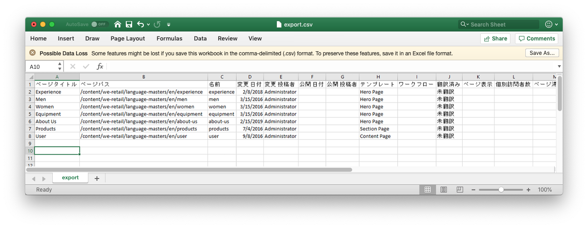
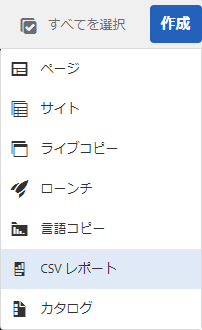
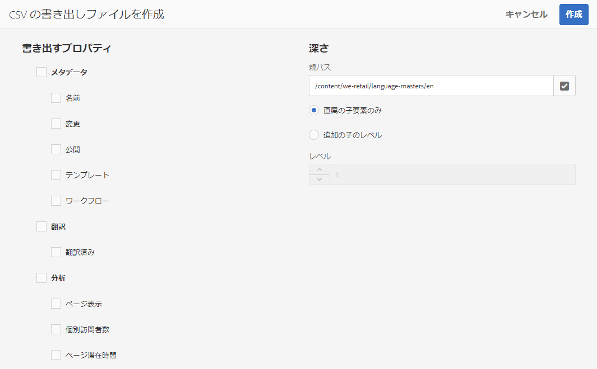

# CSV ファイルへの書き出し{#export-to-csv}

**CSV レポートの作成**&#x200B;では、ページの情報をローカルシステムの CSV ファイルに書き出すことができます。

* ダウンロードしたファイルの名前は `export.csv` になります。
* コンテンツは、選択するプロパティによって異なります。
* 書き出しのパスと深さを定義できます。

>[!NOTE]
>
>ブラウザーのダウンロード機能（およびデフォルトのダウンロード先）が使用されます。

**CSV の書き出しファイルを作成**&#x200B;ウィザードでは、次の要素を選択できます。

* 書き出すプロパティ
   * メタデータ
      * 名前
      * 変更済み
      * 公開済み
      * テンプレート
      * ワークフロー
   * 翻訳
      * 翻訳済み
   * 分析
      * ページ表示
      * 個別訪問者数
      * ページ滞在時間
* 深さ
   * 親パス
   * 直属の子要素のみ
   * 追加の子のレベル
   * レベル

生成された `export.csv` ファイルは、Excel（または互換性のあるその他のアプリケーション）で開くことができます。

The create **CSV Report** option is available when browsing the **Sites** console (in List view): it is an option of the **Create** drop down menu:

CSV の書き出しファイルを作成するには、次の手順を実行します。

1. **サイト**&#x200B;コンソールを開き、必要に応じて必要な場所まで移動します。
1. ツールバーの「**作成**」をクリックし、「**CSV レポート**」を選択してウィザードを開きます。

   

1. 書き出す必要があるプロパティを選択します。
1. 「**作成**」を選択します。
