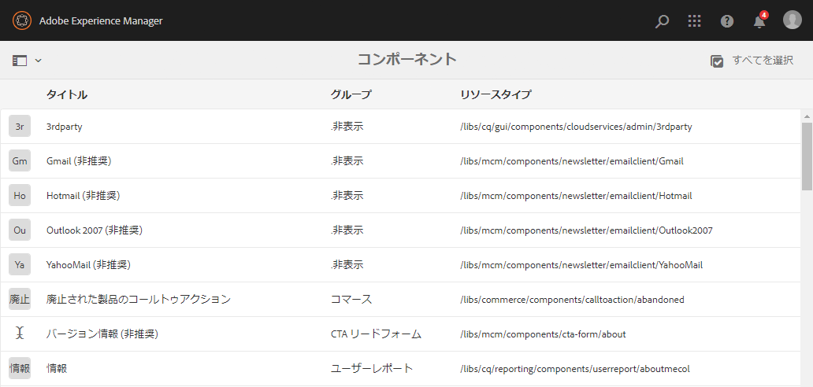
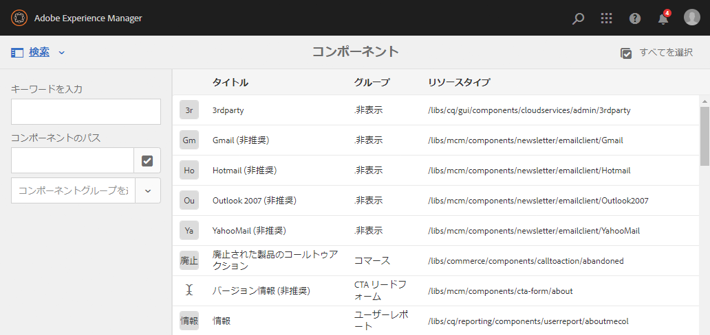
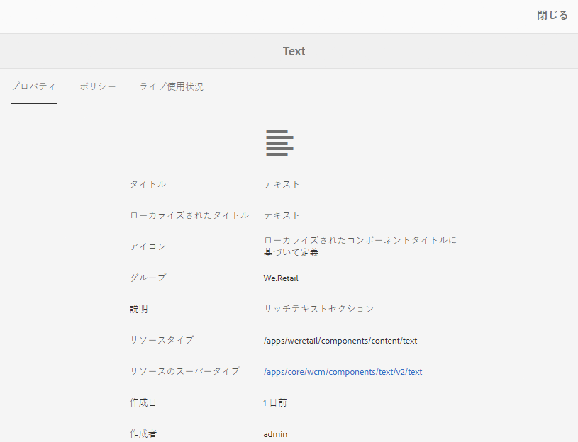
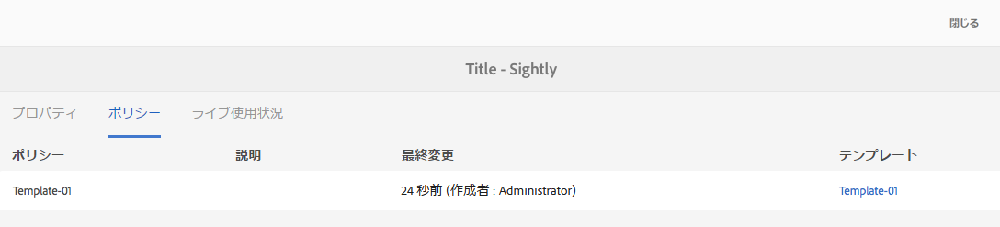
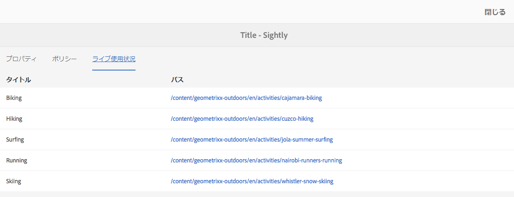
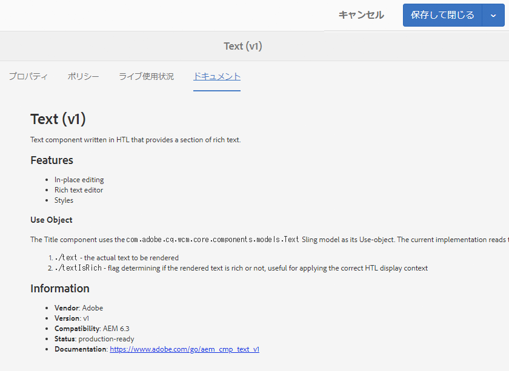

# コンポーネントコンソール{#components-console}

コンポーネントコンソールを使用すると、インスタンスに定義されたすべてのコンポーネントを参照し、各コンポーネントの主な情報を確認できます。

**ツール**／**一般**／**コンポーネント**&#x200B;からアクセスできます。コンソールでは、カード表示およびリスト表示を使用できます。コンポーネントのツリー構造がないので、列表示は使用できません。

>[!NOTE]
>
>コンポーネントコンソールには、システムのすべてのコンポーネントが表示されます。[コンポーネントブラウザー](/help/sites-authoring/author-environment-tools.md#components-browser)には、作成者が使用できるコンポーネントが表示され、ピリオド（`.`）で始まるすべてのコンポーネントグループは非表示になります。

## 検索 {#searching}

**コンテンツのみ**&#x200B;アイコン（左上）を使用して&#x200B;**検索**&#x200B;パネルを開き、コンポーネントを検索およびフィルタリングできます。

### コンポーネントの詳細 {#component-details}

特定のコンポーネントの詳細を表示するには、必要なリソースをタップまたはクリックします。次の 3 つのタブが表示されます。

* **プロパティ**

   

   「プロパティ」タブでは、次のことができます。

   * コンポーネントの一般的なプロパティの表示。
   * コンポーネントの[アイコンまたは省略形の定義方法](/help/sites-developing/components-basics.md#component-icon-in-touch-ui)の表示。

      * アイコンのソースをクリックすると、そのコンポーネントが表示されます。
   * コンポーネントの&#x200B;**リソースタイプ**&#x200B;および&#x200B;**リソースのスーパータイプ**（定義されている場合）の表示。

      * リソースのスーパータイプをクリックすると、そのコンポーネントが表示されます。
   >[!NOTE]
   >
   >`/apps` は実行時には編集できないので、コンポーネントコンソールは読み取り専用です。

* **ポリシー**

   

* **ライブ使用状況**

   

   >[!CAUTION]
   >
   >この表示で収集される情報の性質から、照合および表示には時間がかかることがあります。

* **ドキュメント**

   開発者が[コンポーネント用ドキュメント](/help/sites-developing/developing-components.md#documenting-your-component)を提供している場合、「**ドキュメント**」タブに表示されます。利用できるドキュメントがない場合は、「**ドキュメント**」タブは表示されません。

   

