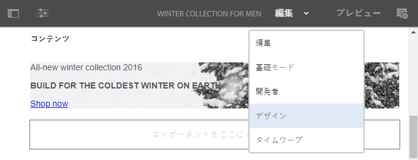
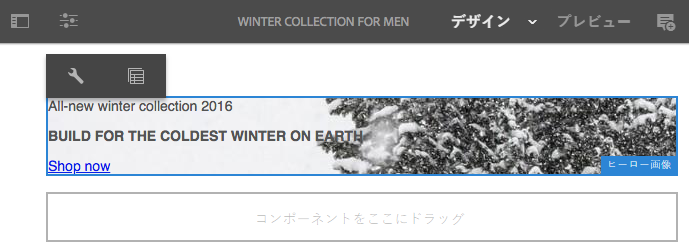
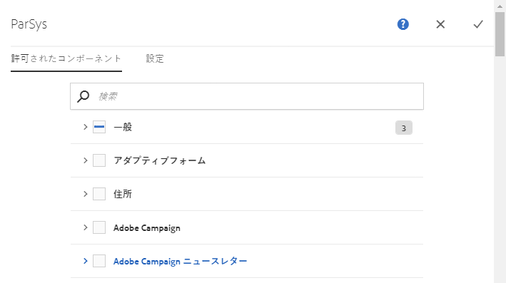
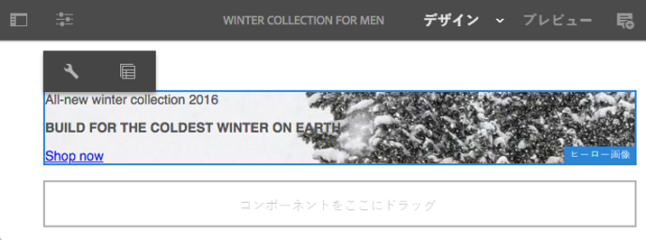
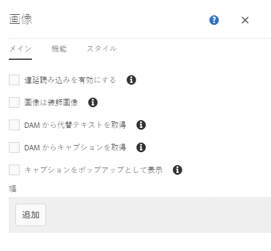
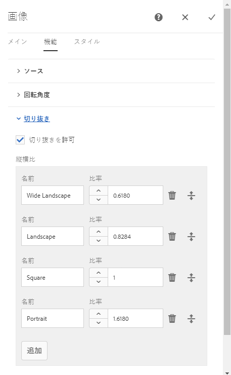

# デザインモードでのコンポーネントの設定{#configuring-components-in-design-mode}

AEM インスタンスを標準インストールすると、各種のコンポーネントをコンポーネントブラウザーですぐに使用できます。

In addition to these, various other components are also available. You can use Design mode to [enable/disable such components](#enable-disable-components). When enabled and located on your page you can then use Design mode to [configure aspects of the component design](#configuring-the-design-of-a-component) by editing the attribute parameters.

>[!NOTE]
>
>これらのコンポーネントを編集する際は慎重におこなう必要があります。デザイン設定は、多くの場合 Web サイト全体のデザインの重要な一部であり、適切な権限および経験を持つユーザー（管理者または開発者など）のみが変更する必要があります。詳しくは、[コンポーネントの開発](/help/sites-developing/components.md)を参照してください。

>[!NOTE]
>
>デザインモードは静的テンプレートでのみ使用できます。編集可能なテンプレートで作成されたテンプレートは、[テンプレートエディター](/help/sites-authoring/templates.md)を使用して編集する必要があります。

>[!NOTE]
>
>Design mode is only available for design configurations stored as content under ( `/etc`).
>
>Starting in AEM 6.4, it is recommended to store designs as configuration data under `/apps` to support continuous deployment scenarios. Designs stored under `/apps` are not editable at runtime and the Design mode will not be available to non-admin users for such templates.

これには、ページの段落システムで許可されたコンポーネントの追加または削除が関係しています。段落システム（`parsys`）は、他のすべての段落コンポーネントを含む複合コンポーネントです。段落システムを使用すると、他のすべての段落コンポーネントを含んでいるので、作成者は、様々なタイプのコンポーネントをページに追加できます。それぞれの段落タイプはコンポーネントとして表されます。

例えば、商品ページのコンテンツに次の項目を保持する段落システムを含めることができます。

* 商品の画像（画像またはテキスト画像の段落として）
* 商品の説明（テキスト段落として）
* 技術データを含むテーブル（テーブル段落として）
* ユーザー入力フォーム（フォーム開始、フォーム要素、フォーム終了の段落として）

>[!NOTE]
>
>[ について詳しくは、](/help/sites-developing/components.md)コンポーネントの開発[および](/help/sites-developing/dev-guidelines-bestpractices.md#guidelines-for-using-templates-and-components)テンプレートとコンポーネントの使用に関するガイドライン`parsys`を参照してください。

>[!CAUTION]
>
>静的テンプレートのデザインを定義する方法としては、ここで説明しているような、デザインモードを使用したデザイン編集をお勧めします。
>
>例えば、CRX DE でデザインを変更することはベストプラクティスではなく、そのようなデザインのアプリケーションは、意図した動作とは異なることがあります。詳しくは、開発者向けドキュメントの[ページテンプレート - 静的](/help/sites-developing/page-templates-static.md#how-template-designs-are-applied)を参照してください。

## コンポーネントの有効化/無効化 {#enable-disable-components}

コンポーネントを有効化または無効化するには、次の手順をおこないます。

1. **デザイン**&#x200B;モードを選択します。

   

1. コンポーネントをタップまたはクリックします。選択すると、コンポーネントに青い枠線が表示されます。

   

1. Click or tap the **Parent** icon.

   

   これで、現在のコンポーネントを格納する段落システムが選択されます。

1. 段落システムの&#x200B;**設定**&#x200B;アイコンが親のアクションバーに表示されます。

   

   このアイコンを選択してダイアログを表示します。

1. このダイアログを使用して、現在のページの編集時にコンポーネントブラウザーで利用できるコンポーネントを定義します。

   

   このダイアログにはタブが 2 つあります。

   * 許可されたコンポーネント
   * 設定

   **許可されたコンポーネント**

   On the **Allowed Components** tab, you define which components are available for the parsys.

   * コンポーネントは、コンポーネントグループ別にグループ化されています。それらのグループは、展開したり折りたたんだりできます。
   * グループ名にチェックマークを付けることでグループ全体を選択でき、またチェックマークを外すことですべて選択解除できます。
   * マイナス記号はグループの中のすべてではなく少なくとも 1 つが選択されることを示します。
   * 名前でコンポーネントをフィルターするために、検索を使用できます。
   * コンポーネントグループ名の右側に示されるカウントは、フィルターに関係なく、そのグループで選択されているコンポーネントの総数を表します。

   ページコンポーネントごとに設定を定義します。子ページで同じテンプレートまたは（通常は整列された）ページコンポーネントを使用すると、対応する段落システムに同じ設定が適用されます。

   >[!NOTE]
   >
   >アダプティブフォームコンポーネントは、アダプティブフォームコンテナ内で動作してフォームエコシステムを活用するように設計されています。このため、これらのコンポーネントはアダプティブフォームエディターでのみ使用する必要があり、サイトページエディターでは機能しません。

   **設定**

   「**設定**」タブでは、追加のオプションを定義できます（各コンポーネントへのアンカーの描画、各コンテナのセル内の余白の定義など）。

1. 「**完了**」を選択して設定を保存します。

## コンポーネントのデザインの設定 {#configuring-the-design-of-a-component}

1. **デザイン**&#x200B;モードを選択します。

   

1. 青いボーダー付きのコンポーネントをタップまたはクリックします。この例では、ヒーロー画像コンポーネントを選択します。

   

1. ダイアログを開くには、**設定**&#x200B;アイコンを使用します。

   

   [設計]ダイアログで、使用可能な設計パラメータに従ってコンポーネントを設定できます。

   

   ダイアログには次の 3 つのタブがあります。

   * メイン
   * 機能
   * スタイル

   **プロパティ**

   「**プロパティ**」タブを使用すると、コンポーネントの重要なデザインパラメーターを設定できます。画像コンポーネントの例では、画像の許可される最大サイズと最小サイズを定義できます。

   **特長**

   「**機能**」タブを使用すると、コンポーネントの追加の機能を有効または無効にできます。例えば、画像コンポーネントの場合は、画像の向き、使用可能な切り抜きオプション、および画像をアップロードできるかどうかを定義できます。

   **スタイル**

   「**スタイル**」タブを使用すると、CSS クラスおよびスタイルを定義して、コンポーネントで使用できます。

   

   「**追加**」ボタンを使用すると、追加のエントリを複数エントリのダイアログリストに追加できます。

   

   「** Delete **」アイコンを使用して、複数入力のダイアログリストからエントリを削除します。

   

   複数エントリのダイアログリストのエントリの順序を並べ替えるには、**移動**&#x200B;アイコンを使用します。

   

1. ダイアログを保存して閉じるには、**完了**&#x200B;アイコンをクリックまたはタップします。

