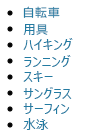
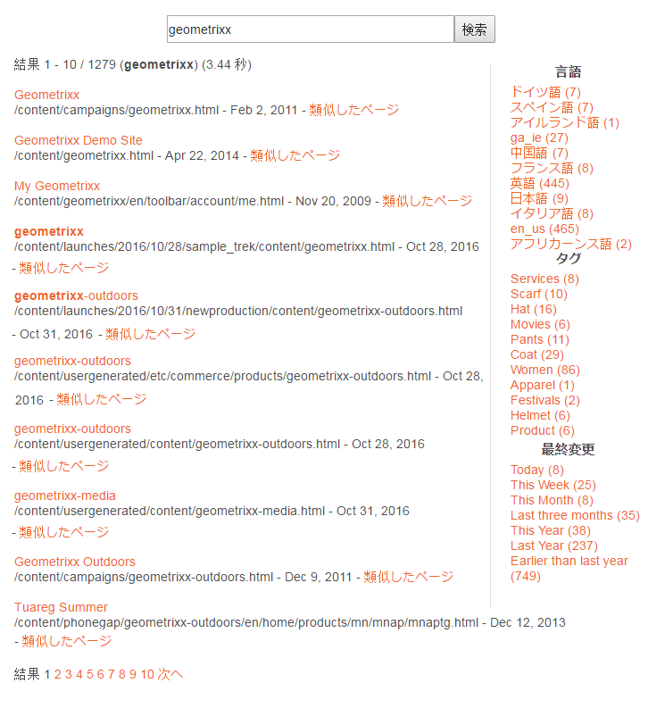
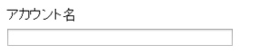
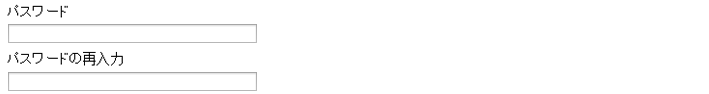

# 基盤コンポーネント {#foundation-components}

>[!CAUTION]
>
>Most Foundation Components are now deprecated with AEM 6.5. See the [release notes](/help/release-notes/deprecated-removed-features.md) for further information.
>
>より新しく拡張性が高い[コアコンポーネント](https://docs.adobe.com/content/help/ja-JP/experience-manager-core-components/using/introduction.html)を AEM プロジェクトで利用することをお勧めします。These are part of the [We.Retail sample content](/help/sites-developing/we-retail.md) and can also be [installed separately and used for development](https://docs.adobe.com/content/help/jp/experience-manager-core-components/using/get-started/using.html) by your administrator.
>
>AEM Modenize Tools Suite [](https://opensource.adobe.com/aem-modernize-tools/) （最新化ツールスイート）を使用して、Foundationコンポーネントベースのサイトをリファクタリングし、コアコンポーネントを使用することができます。

基盤コンポーネントは、標準の Web ページ用のコンテンツを作成するためのものです。AEM の標準のインストールでそのまま使用できるコンポーネントのサブセットを形成します。

Some are immediately available through component browser, various others are also available by using [design mode](/help/sites-authoring/default-components-designmode.md) (if the page is based on a static template) or by [editing the template](/help/sites-authoring/templates.md) (if the page is based on an editable template).

基盤コンポーネントの使用はサポートされていますが、基盤コンポーネントはほぼ廃止され、より拡張性と柔軟性の高いコアコンポーネントに置き換わりました。

>[!NOTE]
>
>ここでは、標準の AEM インストールでそのまま使用できるコンポーネントについてのみ説明します。
>
>インスタンスによっては、要件に合わせて明示的に開発されたカスタマイズコンポーネントが存在する場合があります。これらは、ここで説明するいくつかのコンポーネントと同じ名前の場合があります。

コンポーネントは、[ページの編集](/help/sites-authoring/editing-content.md)時にページエディターのサイドパネルの「**コンポーネント**」タブで使用できます。

コンポーネントを選択してページ上の必要な場所にドラッグできます。その後、次の機能を使用して編集できます。

* [プロパティの設定](/help/sites-authoring/editing-page-properties.md)
* [コンテンツの編集](/help/sites-authoring/editing-content.md)

* [コンテンツの編集 - 全画面表示モード](/help/sites-authoring/editing-content.md#edit-content-full-screen-mode)

コンポーネントは、コンポーネントグループ（次のグループを含む）と呼ばれる様々なカテゴリに従って並べ替えられます。

* [一般](#general)：テキスト、画像、テーブル、グラフなどの基本コンポーネントが含まれます。
* [列](#columns)：コンテンツのレイアウトを構成するために必要なコンポーネントを含みます。
* [フォーム](#formgroup)：フォームの作成に必要なすべてのコンポーネントを含みます。

## 一般 {#general}

一般コンポーネントは、コンテンツの作成に使用する基本的なコンポーネントです。

### アカウント項目 {#account-item}

>[!CAUTION]
>
>この基盤コンポーネントは廃止されました。代わりに、[コアコンポーネント](https://docs.adobe.com/content/help/ja-JP/experience-manager-core-components/using/introduction.html)を利用することをお勧めします。

タイトルと説明を含むリンクを定義できます。


### アダプティブ画像 {#adaptive-image}

>[!CAUTION]
>
>この基盤コンポーネントは廃止されました。代わりに、[画像コアコンポーネント](https://docs.adobe.com/content/help/ja-JP/experience-manager-core-components/using/components/image.html)を利用することをお勧めします。

アダプティブ画像基盤コンポーネントは、Web ページを開いたウィンドウに合うようにサイズが調整される画像を生成します。このコンポーネントを使用するには、ファイルシステムと DAM のいずれかから画像リソースを指定します。Web ページが開くと、Web ブラウザーにより、現在のウィンドウに適したサイズに調整された画像のコピーがダウンロードされます。

次の特徴により、ウィンドウのサイズを決定できます。

* デバイス画面：モバイルデバイスは通常、Web ページを画面全体に展開して表示します。
* Web ブラウザーのウィンドウサイズ：ラップトップおよびデスクトップコンピューターのユーザーは Web ブラウザーのウィンドウサイズを変更できます。

例えば、このコンポーネントは、Web ページが携帯電話で開かれた場合には小さな画像を生成し、タブレットで開かれた場合には中程度のサイズの画像を生成します。ラップトップでは、最大化された Web ブラウザーでページが開かれた場合に、大きな画像を配信します。Web ブラウザーが画面の一部に合わせてサイズ変更された場合には、小さな画像を配信して表示を更新することで、このサイズ変更に適応します。

#### サポートされる画像の形式 {#supported-image-formats}

アダプティブ画像コンポーネントでは、次のファイル名の拡張子を持つ画像ファイルを使用できます。

* .jpg
* .jpeg
* .png
* .gif **

>[!CAUTION]
>
>アダプティブレンディション用のアニメーション GIF ファイルは AEM ではサポートされていません。

#### 画像のサイズと画質 {#images-sizes-and-quality}

以下の表に、特定の表示域の幅に対する、生成される画像の幅を示します。生成される画像の高さは、同じ縦横比を維持して計算され、画像のエッジ内に空白は挿入されません。空白の挿入を避けるために、切り抜きを使用できます。

JPEG 画像の場合は、表示域のサイズも JPEG の画質に影響します。次の JPEG 画質になる可能性があります。

* 低（0.42）
* 中（0.82）
* 高（1.00）

| **表示域の幅の範囲（ピクセル単位）** | **画像の幅（ピクセル単位）** | **JPEG 画質** | **ターゲットのデバイスタイプ** |
|---|---|---|---|
| 幅 = 319 以下 | 320 | 低 |  |
| 幅 = 320 | 320 | 中 | 携帯電話（縦置き） |
| 幅 = 321 ～ 480 | 480 | 中 | 携帯電話（横置き） |
| 幅 = 481 ～ 768 | 476 | 高 | タブレット（縦置き） |
| 幅 = 769 ～ 1024 | 620 | 高 | タブレット（横置き） |
| 幅 = 1025 以上 | 100 ％（オリジナルサイズ） | 高 | デスクトップ |

#### プロパティ {#properties}

ダイアログを使用すると、アダプティブ画像コンポーネントのインスタンスのプロパティを編集できます。プロパティの多くは、基本となる画像コンポーネントと共通しています。プロパティは次の 2 つのタブに表示されます。

* **画像**

   * **画像**
コンテンツファインダーから画像をドラッグするか、クリックして画像を読み込む参照ウィンドウを開くことができます。画像を読み込んだ後は、画像の切り抜き、回転または削除をおこなうことができます。画像のズームインおよびズームアウトをおこなうには、画像の下（「OK」および「キャンセル」ボタンの上）のスライドバーを使用します。

   * **切り抜き**
画像を切り抜きます。ボーダーをドラッグすると、画像が切り抜かれます。

   * **回転**
画像が目的の向きになるまで「回転」を繰り返しクリックします。

   * **消去**
現在の画像を削除します。

* **アドバンス**

   * **タイトル**
アダプティブ画像コンポーネントではこのプロパティは使用しません。

   * **代替テキスト**
画像に使用する代替テキストです。

   * **リンク先**
アダプティブ画像コンポーネントではこのプロパティは使用しません。

   * **説明**
アダプティブ画像コンポーネントではこのプロパティは使用しません。

#### アダプティブ画像コンポーネントの拡張 {#extending-the-adaptive-image-component}

アダプティブ画像コンポーネントのカスタマイズについて詳しくは、[アダプティブ画像コンポーネントについて](/help/sites-developing/responsive.md#using-adaptive-images)を参照してください。

### カルーセル {#carousel}

>[!CAUTION]
>
>この基盤コンポーネントは廃止されました。代わりに、[カルーセルコアコンポーネント](https://docs.adobe.com/content/help/jp/experience-manager-core-components/using/components/carousel.html)を利用することをお勧めします。

カルーセルコンポーネントを使用すると、個々のページに関連付けられている画像を次のように表示できます。

* 一度に 1 つずつ
* 短時間
* 指定した順序で
* 指定した遅延時間で

クリックできるコントロールを使用して、ユーザーの操作に応じてリアルタイムで表示されるページを周期的に繰り返すこともできます。現在表示されているページ画像をクリックすると、そのページに移動します。つまり、カルーセルは、ナビゲーションコントロールとして機能します。

#### プロパティ {#properties-1}

次の 2 つのタブに表示されます。

* **カルーセル**&#x200B;ここでは、カルーセルの動作方法を指定します。

   * 再生速度
次のスライドが表示されるまでの時間（ミリ秒単位）。
   * 遷移時間
2 つのスライド間の遷移にかかる時間（ミリ秒単位）。
   * コントロールのスタイル
プルダウンメニューから、「前へ / 次へボタン」、「上部右スイッチ」など、様々なオプションを選択可能。

* **リスト**

   カルーセルにページを含める方法を指定します。

   * **リストを選択**&#x200B;ページリストの構築には、後述の「子ページ」、「固定リスト」、「検索」、「詳細検索」など、いくつかの方法があります。どの方法を選択しても、リストに含めるページには、ページに関連する画像がそれぞれ 1 つずつ必要です。この画像が、カルーセルに表示されます。ページの「ページプロパティ」にそのページの画像がない場合、画像をページに関連付けてから開始します。そうしないと、カルーセルでは空（またはほとんど空）のページが表示されます。[ページプロパティの編集](/help/sites-authoring/editing-page-properties.md)を参照してください。選択する項目に応じて、新しいパネルが表示されます。

      * **子ページのオプション**

         * **親ページ**
手動で、またはセレクターを使用して、パスを指定します。現在のページを親として使用するには、空のままにします。
      * **固定リストのオプション**

         * **ページ**&#x200B;ページのリストを選択します。 エントリ `+` を追加する場合に使用し、順序を調整するには上/下ボタンを使用します。
      * **検索のオプション**

         * **開始**
手動で、またはセレクターを使用して、開始パスを入力します。

         * **検索クエリ**
プレーンテキストの検索クエリを入力できます。
      * **詳細検索のオプション**

         * **QueryBuilder 述語の表記**
「QueryBuilder 述語の表記」を使用して検索クエリを入力できます。例えば、「fulltext=Marketing」と入力すると、コンテンツに「Marketing」が含まれるすべてのページがカルーセルに表示されます。
クエリ式とその他の例の詳細は、[QueryBuilder API](/help/sites-developing/querybuilder-api.md) を参照してください。
   * **[**&#x200B;並べ替え `jcr:title`]ドロップダウンメニューから[ `jcr:created`選択]、[ `cq:lastModified`]、[ `cq:template` ]、[]を選択します。

   * **制限**
カルーセルで使用する項目の最大数。これはオプションです。


>[!NOTE]
>
>AEM DAM にあるデジタルアセットを表示する Adobe Experience Manager のカスタムカルーセルコンポーネントを作成できます。詳しくは、[Adobe Experience Manager のカスタムカルーセルコンポーネントの作成](https://helpx.adobe.com/experience-manager/using/custom-carousel-components.html)を参照してください。

### グラフ {#chart}

>[!CAUTION]
>
>この基盤コンポーネントは廃止されました。代わりに、[コアコンポーネント](https://docs.adobe.com/content/help/ja-JP/experience-manager-core-components/using/introduction.html)を利用することをお勧めします。

グラフコンポーネントを使用すると、棒グラフ、折れ線ブラフまたは円グラフを追加できます。AEM では、指定したデータからグラフが作成されます。データは、「データ」タブに直接入力するか、スプレッドシートをコピーして貼り付けます。

* **データ**

   * **チャートデータ**&#x200B;グラフデータを入力するには、CSV（Comma Separated Values）形式を使用します。CSV 形式では、フィールドの区切り文字としてコンマ（「,」）を使用します。

* **アドバンス**

   * **チャートのタイプ**「円グラフ」、「折れ線グラフ」および「棒グラフ」から選択します。

   * **代替テキスト**
グラフの代わりに表示する代替テキスト。

   * **幅**
グラフの幅（ピクセル単位）。

   * **高さ**
グラフの高さ（ピクセル単位）。

以下は、グラフデータの例と、結果の棒グラフを示しています。

 

>[!NOTE]
>
>AEM JCR にあるデータを表示する AEM チャートコントロールを作成できます。詳しくは、[Adobe Experience Manager データのグラフでの表示](https://helpx.adobe.com/experience-manager/using/displaying-experience-manager-data-chart.html)を参照してください。

### コンテンツフラグメント {#content-fragment}

>[!CAUTION]
>
>この基盤コンポーネントは廃止されました。代わりに、[コンテンツフラグメントコアコンポーネント](https://docs.adobe.com/content/help/ja-JP/experience-manager-core-components/using/components/content-fragment-component.html)を利用することをお勧めします。

[コンテンツフラグメント](/help/sites-authoring/content-fragments.md)は、ページから独立したアセットとして作成および管理されます。その後、コンテンツページをオーサリングする際に、これらのフラグメントとそれらのバリエーションを使用できます。

### デザインインポーター {#design-importer}

>[!CAUTION]
>
>この基盤コンポーネントは廃止されました。代わりに、[コアコンポーネント](https://docs.adobe.com/content/help/ja-JP/experience-manager-core-components/using/introduction.html)を利用することをお勧めします。

デザインパッケージを含む zip ファイルをアップロードできます。

### ダウンロード {#download}

>[!CAUTION]
>
>この基盤コンポーネントは廃止されました。代わりに、[コアコンポーネント](https://docs.adobe.com/content/help/ja-JP/experience-manager-core-components/using/introduction.html)を利用することをお勧めします。

ダウンロードコンポーネントで、特定のファイルをダウンロードするための、選択した Web ページ上のリンクが作成されます。コンテンツファインダーからアセットをドラッグするか、ファイルをアップロードできます。

* **ダウンロード**

   * **説明**
ダウンロードリンクに対して表示される短い説明。

   * **ファイル**
生成される Web ページでダウンロードできるようにするファイル。コンテンツファインダーからアセットをドラッグするか、領域をクリックして、ダウンロードできるようにするファイルをアップロードします。

次に、Geometrixx でのダウンロードコンポーネントの例を示します。


### 外部 Web アプリケーション {#external}

>[!CAUTION]
>
>この基盤コンポーネントは廃止されました。代わりに、[コアコンポーネント](https://docs.adobe.com/content/help/ja-JP/experience-manager-core-components/using/introduction.html)を利用することをお勧めします。

外部アプリケーション統合コンポーネント（**External**）によって、iframe を使用して外部アプリケーションを AEM ページに埋め込むことができます。

* **外部 Web アプリケーション**

   * **ターゲットアプリケーション**&#x200B;統合するWebアプリケーションのURLを指定します。 例：

      ```
      https://en.wikipedia.org/wiki/Main_Page
      ```

   * **パスパラメーター**
パラメーターをアプリケーションに渡す必要がある場合は、チェックボックスをオンにします。

   * **幅と高さ**iframeのサイズを定義

外部アプリケーションは AEM ページの段落システムに統合されます。例えば、`https://en.wikipedia.org/wiki/Main_Page` の対象アプリケーションを使用している場合は、次のようになります。


>[!NOTE]
>
>使用事例によっては、その他のオプションが外部アプリケーションの統合で有効になります（例：[ポートレットの統合](/help/sites-administering/aem-as-portal.md)）。

### Flash {#flash}

>[!CAUTION]
>
>この基盤コンポーネントは廃止されました。代わりに、[コアコンポーネント](https://docs.adobe.com/content/help/ja-JP/experience-manager-core-components/using/introduction.html)を利用することをお勧めします。

Flash コンポーネントを使用すると、Flash ムービーをロードできます。コンテンツファインダーからコンポーネントに Flash アセットをドラッグするか、ダイアログを使用できます。

* **Flash**

   * **Flash ムービー**

      Flash ムービーファイル。コンテンツファインダーからアセットをドラッグするか、クリックして参照ウィンドウを開きます。

   * **サイズ**

      ムービーを保持する表示領域の寸法（ピクセル単位）。

* **代替イメージ**

   表示する代替画像。

* **アドバンス**

   * **コンテキストメニュー**

      コンテキストメニューを表示するか非表示にするかを示します。

   * **ウィンドウモード**

      不透明、透明、枠付きウィンドウなど、ウィンドウの表示方法。

   * **背景色**

      提示される色見本から選択した背景色。

   * **最低バージョン**

      ムービーの実行に必要な Adobe Flash Player の最低バージョン。デフォルトは 9.0.0 です。

   * **属性**

      必要なその他の属性。

### 画像 {#image}

>[!CAUTION]
>
>この基盤コンポーネントは廃止されました。代わりに、[画像コアコンポーネント](https://docs.adobe.com/content/help/ja-JP/experience-manager-core-components/using/components/image.html)を利用することをお勧めします。

画像コンポーネントによって、指定したパラメーターに従って、画像とそれに付随するテキストが表示されます。

画像をアップロードした後に、編集および操作できます（切り抜き、回転、リンク／タイトル／テキストの追加など）。

画像は、[アセットブラウザー](/help/sites-authoring/author-environment-tools.md#assets-browser)から直接コンポーネントまたはコンポーネントの[設定ダイアログ](/help/sites-authoring/editing-content.md#component-edit-dialog)にドラッグアンドドロップできます。設定ダイアログから画像をアップロードすることもできます。このダイアログでは、画像の定義および操作もすべて制御します。


画像がアップロードされて初めて、[インプレース編集](/help/sites-authoring/editing-content.md#edit-content)を使用して、必要に応じて画像の切り抜きや回転が可能になります。


>[!NOTE]
>
>インプレースエディターでは、編集時に、画像の元のサイズと縦横比を使用します。高さと幅のプロパティも指定できます。プロパティで定義したサイズや縦横比の制限は、編集の変更内容を保存するときに適用されます。

>インスタンスによっては、[ページのデザイン](/help/sites-developing/designer.md)によって最小、最大の制限が課される場合もあります。これらは、プロジェクト実装時に開発されます。
>
フルスクリーン編集モードで使用できる追加オプションがいくつか用意されています（マップ、ズームなど）。


>[!NOTE]
Internet Explorer では、アップロードの進行状況を監視できません。
Internet Explorer を使用する場合、アップロードした画像ファイルをプレビューに表示して変更（トリミングなど）を実行できるようにするには、画像をアップロードし「**OK**」をクリックしてから画像を再度開く必要があります。

>See the [Certified Platforms](/help/release-notes/release-notes.md#certifiedplatforms) section for more information about HTML5 features used by AEM.

画像を読み込む際は、次の設定が可能です。

* **Map**

   画像をマップする場合は、「マップ」を選択します。 画像マップの作成方法（長方形、多角形など）を指定し、領域が指す位置を指定します。

* **切り抜き**

   「切り抜き」を選択して、画像を切り抜きます。 マウスを使用して画像を切り抜きます。

* **回転**

   画像を回転するには、「回転」を選択します。 画像が目的の向きになるまで繰り返し使用します。

* **消去**

   現在の画像を削除します。

* **タイトル**

   画像のタイトル。

* **代替テキスト**

   アクセシブルなコンテンツを作成する際に使用する代替テキストです。

* **リンク先**

   Webサイト内のアセットまたは他のページへのリンクを作成します。

* **説明**

   画像の説明。

* **サイズ**

   画像の高さと幅を設定します。

>[!NOTE]
一部のオプションはフルスクリーンエディターでのみ使用できます。

最終的な画像（**タイトル**&#x200B;と&#x200B;**説明**&#x200B;を含む）は、次のように表示されます。


### レイアウトコンテナ {#layout-container}

このコンポーネントは、[レスポンシブグリッド](/help/sites-authoring/responsive-layout.md)内にコンポーネントを追加および配置できるグリッド段落システムを提供します。これにより、電話、タブレット、デスクトップを含むターゲットデバイスの幅に基づいて、様々なコンテンツレイアウトを定義できます。


>[!NOTE]
このコンポーネントは [HTML テンプレート言語（HTL）](https://docs.adobe.com/content/help/ja-JP/experience-manager-htl/using/overview.html)を使用して実装されています。

### リスト {#list}

>[!CAUTION]
この基盤コンポーネントは廃止されました。代わりに、[リストコアコンポーネント](https://docs.adobe.com/content/help/jp/experience-manager-core-components/using/components/list.html)を利用することをお勧めします。

リストコンポーネントを使用すると、リストを表示するための検索条件を設定できます。

* **リスト**

   * **リストを選択**

      ここでリストのコンテンツを取得する場所を指定します。複数の方法があります。

   * 選択する項目によって、新しいパネルが表示されます。

      * **子ページのオプション**

         * **の子** （親ページ）

            手動またはセレクターを使用して、パスを指定します。 現在のページを親として使用するには、空のままにします。
      * **固定リストのオプション**

         * **ページ**

            ページのリストを選択します。 エントリを追加するには + を、順序を調整するには上下のボタンを使用します。
      * **検索のオプション**

         * 開始

            手動またはセレクターを使用して、開始パスを入力します。

         * 検索クエリー

            テキスト形式の検索クエリを入力できます。
      * **詳細検索のオプション**

         * **Querybuilder 述語の表記**

            検索クエリは、Querybuilder述語表記を使用して入力できます。 例えば、「fulltext=Marketing」と入力すると、コンテンツに「Marketing」が含まれるすべてのページがカルーセルに表示されます。

            クエリー式とその他の例の詳細は、[QueryBuilder API](/help/sites-developing/querybuilder-api.md) を参照してください。
      * **タグ**

         **親ページ**、 **タグ** /キーワード、および必要な一致条件を指定します。
   * **表示方法**

      リンク、ティーザー、ニュースなどの項目のリストを表示する方法。

   * **並べ替え順**

      リストを並べ替えるかどうか。並べ替える場合は、並べ替えに使用する条件。条件を入力するか、表示されるドロップダウンリストから選択できます。

   * **制限**

      リストに表示する項目の最大数を指定します。

   * **フィードを有効にする**

      そのリストで RSS フィードを有効化するかどうかを示します。

   * **1 ページに表示する数**

      ここで同時に表示するリスト項目の数を指定できます。指定した数よりも項目数が多いリストの場合、ページネーションで複数に分割して表示されます。


次に、**リスト**&#x200B;コンポーネントで子ページのリストがどのように表示されるかの例を示します（子ページの設計は、サイト設計のカスタム CSS 定義で制御されています）。



### ログイン {#login}

>[!CAUTION]
この基盤コンポーネントは廃止されました。代わりに、[コアコンポーネント](https://docs.adobe.com/content/help/ja-JP/experience-manager-core-components/using/introduction.html)を利用することをお勧めします。

「ユーザー名」フィールドと「パスワード」フィールドを提供します。


次の項目を設定できます。

* ログイン

   * セクションラベル

      入力フィールドのリードインテキスト。

   * ユーザー名ラベル

      ユーザー名フィールドのラベルを設定するテキスト。

   * パスワードラベル

      パスワードフィールドにラベルを付けるテキストです。

   * ログインボタンのラベル

      ログインボタンのテキスト。

   * リダイレクト先

      ユーザーのログイン後に開く必要のあるWebサイトのページを指定できます。

* ログイン済み

   * 続行ボタンのラベル

      ユーザーが既にログインしていることを示すテキストです。

### 注文ステータス {#order-status}

* **タイトル**

   * **タイトル**

      表示するタイトルテキストを指定します。

   * **リンク**

      注文ステータスを表示するページ（製品）を指定します。

   * **種類／サイズ**

      与えられた選択肢から選択します。


### リファレンス {#reference}

>[!CAUTION]
この基盤コンポーネントは廃止されました。代わりに、[コンテンツフラグメントコアコンポーネント](https://docs.adobe.com/content/help/ja-JP/experience-manager-core-components/using/components/content-fragment-component.html)を利用することをお勧めします。

**参照**&#x200B;コンポーネントを使用すると、（現在のインスタンス内にある）AEM Web サイトの別のページからテキストを参照できます。参照された段落のコンテンツは、現在のページの段落と同様に表示されます。元の段落が変更されると、コンテンツが更新されます（ページの更新が必要な場合があります）。

* **段落参照**

   * **リファレンス**

      参照するページと段落のパスを指定します（コンテンツを含める）。

段落のパスを指定するには、ページのパスに次のようなサフィックスを付ける必要があります。

`.../jcr:content/par/<paragraph-ID>`

次に例を示します。

`/content/geometrixx-outdoors/en/equipment/biking/cajamara/jcr:content/par/similar-products`

特定の段落を参照するだけでなく、パスを変更して、par-system 全体を指定することもできます。これをおこなうには、パスに次のサフィックスを付けます。

`/jcr:content/par`

次に例を示します。

`/content/geometrixx-outdoors/en/equipment/biking/cajamara/jcr:content/par`

設定が完了すると、ソースページと同様にコンテンツが表示されます。参照であるということは、コンポーネントを編集用に開いた場合にのみ確認できます。


### 検索 {#searching}

>[!CAUTION]
この基盤コンポーネントは廃止されました。代わりに、[クイック検索コアコンポーネント](https://docs.adobe.com/content/help/jp/experience-manager-core-components/using/components/quick-search.html)を利用することをお勧めします。

検索コンポーネントで、ページに検索機能を追加します。

次の項目を設定できます。

* 検索

   * **ノードタイプ**

      If the search is to be restricted to specific node type list them here; for example, `cq:Page`.

   * **検索場所のパス**

      検索するブランチのルートページを指定します。

   * **「検索」ボタンのテキスト**

      実際の検索ボタンに表示する名前。

   * **統計テキスト**

      検索結果の上に表示するテキスト。

   * **結果テキストがありません**

      結果がない場合、ここに入力したテキストが表示されます。

   * **テキストをスペルチェック**

      誰かが類似の用語を入力すると、その用語の前にこのテキストが表示されます。例えば、geometrixxe と入力すると、「もしかして : geometrixx」と表示されます。

   * **同様のページテキスト**

      結果の横に表示される、類似のページに対するテキスト。このリンクをクリックすると、類似のコンテンツのページが表示されます。

   * **関連する検索テキスト**

      検索の横に表示される、関連する用語とトピックのためのテキスト。

   * **検索トレンドのテキスト**

      ユーザーが入力する検索用語の上のタイトル。

   * **結果ページラベル**

      このリストの下部に表示するテキスト。他の結果ページへのリンクが設定されます。

   * **前のラベル**

      前の検索ページへのリンクに表示される名前。

   * **次のラベル**

      次の検索ページへのリンクに表示される名前。

次の例は、検索コンポーネントで標準インストールのルートディレクトリから *geometrixx* という単語を検索した後の状態を示しています。結果のページネーションも示しています。



次に、誤入力があり使用できない検索用語の例を示します。


### サイトマップ {#sitemap}

>[!CAUTION]
この基盤コンポーネントは廃止されました。Adobe recommends leveraging the [Navigation](https://docs.adobe.com/content/help/jp/experience-manager-core-components/using/components/navigation.html), [Language Navigation](https://docs.adobe.com/content/help/jp/experience-manager-core-components/using/components/language-navigation.html), and [Breadcrumb Core Components](https://docs.adobe.com/content/help/jp/experience-manager-core-components/using/components/breadcrumb.html) instead.

自動的なサイトマップのリスト表示。デフォルトの設定では、現在の Web サイトのすべてのページが（アクティブなリンクとして）すべて表示されます。例えば、次のように表示されます。


必要に応じて、次の項目を設定できます。

* **サイトマップ**

   * **ルートパス**

      リストを開始するパス。

### スライドショー {#slideshow}

>[!CAUTION]
この基盤コンポーネントは廃止されました。代わりに、[カルーセルコアコンポーネント](https://docs.adobe.com/content/help/jp/experience-manager-core-components/using/components/carousel.html)を利用することをお勧めします。

このコンポーネントを使用すると、ページでスライドショーとして表示する一連の画像をロードできます。画像を追加または削除し、それぞれにタイトルを割り当てることができます。「詳細」では、表示領域のサイズも指定できます。

次の項目を設定できます。

* **スライド**

   * **新しいスライド**

      You can specify a selection of slides using the **Add** (and **Remove**) buttons.

   * **タイトル**

      必要に応じてタイトルを指定します。 これは該当するスライド上にオーバーレイされます。

* **アドバンス**

   * **サイズ**

      幅と高さをピクセル単位で指定します。

その後、スライドショーコンポーネントによって、各画像が短時間、順に表示された後に次のスライドにフェードするという処理が繰り返されます。


### テーブル {#table}

>[!CAUTION]
この基盤コンポーネントは廃止されました。代わりに、[テキストコアコンポーネント](https://docs.adobe.com/content/help/jp/experience-manager-core-components/using/components/text.html)を利用することをお勧めします。

>[!NOTE]
**テーブル**&#x200B;基盤コンポーネントは、**[テキスト](#text)**基盤コンポーネントと同様に、[リッチテキストエディター](/help/sites-authoring/rich-text-editor.md)をベースとしています。

**テーブル**&#x200B;コンポーネントは、テーブルの作成、入力および書式設定ができるように事前設定されています。ダイアログを使用して、テーブルを設定し、次のいずれかの方法でコンテンツを作成できます。

* 最初から
* 外部エディター（Excel、OpenOffice、メモ帳など）からスプレッドシートまたはテーブルをコピーして貼り付け

インラインエディターを使用してコンテンツに対して基本的な変更を加えることができます。


フルスクリーンモードでテーブルレイアウトを設定できます。


次の画面ショットは、テーブルコンポーネントの例を示します。サイト専用の CSS でデザインを決定しています。


### タグクラウド {#tag-cloud}

タグクラウドは、Web サイト内のコンテンツに適用されるタグをグラフィカルに表現した選択内容を示します。


タグクラウドコンポーネントを設定する場合、次の情報を指定できます。

* **表示するタグ**

   表示するタグを収集する場所。ページ（すべての子またはすべてのタグを含むページ）から選択します。

* **ページ**

   参照するページを選択します。

* **タグにリンクがありません**

   表示するタグがリンクとして機能するかどうか。

タグの適用について詳しくは、[タグの使用](/help/sites-authoring/tags.md)を参照してください。

### テキスト {#text}

>[!CAUTION]
この基盤コンポーネントは廃止されました。代わりに、[テキストコアコンポーネント](https://docs.adobe.com/content/help/jp/experience-manager-core-components/using/components/text.html)を利用することをお勧めします。

>[!NOTE]
**テキスト**&#x200B;基盤コンポーネントは、**テーブル**&#x200B;基盤コンポーネントと同様に、[リッチテキストエディター](/help/sites-authoring/rich-text-editor.md)をベースとしています。

テキストコンポーネントでは、[リッチテキストエディター](/help/sites-authoring/rich-text-editor.md)で提供されている機能により、WYSIWYG エディターを使用してテキストブロックを入力できます。各種のアイコンを使用すると、テキストを書式設定できます（フォント特性、整列、リンク、リストおよびインデントを含む）。


When you open the **Configure** dialog, you can also set:

* **スペーサー**
* **テキストスタイル**

次に、書式設定されたテキストがページ上で表示されます。実際のデザインはサイトの CSS によって異なります。


テキストコンポーネントおよびリッチテキストエディターの機能について詳しくは、[リッチテキストエディター](/help/sites-authoring/rich-text-editor.md)のページを参照してください。

#### インプレース編集 {#inplace-editing}

ダイアログベースのリッチテキスト編集モードに加えて、AEM には、ページのレイアウトどおりに表示されたテキストを直接編集できる、[インプレース編集](/help/sites-authoring/editing-content.md)も用意されています。

### テキストと画像 {#text-image}

>[!CAUTION]
この基盤コンポーネントは廃止されました。代わりに、[画像](https://docs.adobe.com/content/help/ja-JP/experience-manager-core-components/using/components/image.html)および[テキストコアコンポーネント](https://docs.adobe.com/content/help/jp/experience-manager-core-components/using/components/text.html)を利用することをお勧めします。

テキストと画像コンポーネントで、テキストブロックと画像を追加します。テキストと画像を個別に追加して編集することもできます。詳しくは、[テキスト](#text)コンポーネントと[画像](#image)コンポーネントを参照してください。


次の項目を設定できます。

* **コンポーネントスタイル** (**スタイル**)

   ここで画像を左揃えまたは右揃えにすることができます。デフォルトは、画像を左に配置する「**左**」です。

* **画像プロパティ** (**詳細な画像プロパティ**)

   以下を指定できます。

   * **画像アセット**

      必要な画像をアップロードします。

   * **タイトル**

      ブロックのタイトル。マウスを置くと表示されます。

   * **代替テキスト**

      画像を表示できない場合に表示する代替テキスト。空にすると、タイトルが使用されます。

   * **リンク先**

      ターゲットパスを指定します。

   * **説明**

      画像の説明。

   * **サイズ**

      画像の高さと幅を設定します。

次に、画像を左揃えに表示するテキスト画像コンポーネントの例を示します。


### タイトル {#title}

>[!CAUTION]
この基盤コンポーネントは廃止されました。代わりに、[タイトルコアコンポーネント](https://docs.adobe.com/content/help/jp/experience-manager-core-components/using/components/list.html)を利用することをお勧めします。

タイトルコンポーネントには次の機能があります。

* タイトルフィールドを空のままにすることで、現在のページ名を表示します。
* または、タイトルフィールドで指定するテキストを表示します。

次の項目を設定できます。

* **タイトル**

   ページタイトル以外の名前を使用する場合は、ここに入力します。

* **リンク**

   タイトルがリンクとして動作する場合の URI。

* **種類／サイズ**

   ドロップダウンリストから「小」または「大」を選択します。「小」は画像として生成されます。「大」はテキストとして生成されます。

次に、**タイトル**&#x200B;コンポーネントを表示した例を示します。サイト固有の CSS でデザインを決定しています。


### ビデオ {#video}

>[!CAUTION]
この基盤コンポーネントは廃止されました。代わりに、[コアコンポーネント](https://docs.adobe.com/content/help/ja-JP/experience-manager-core-components/using/introduction.html)を利用することをお勧めします。

**ビデオ**&#x200B;コンポーネントを使用すると、定義済みですぐに使用できるビデオ要素をページに配置できます。

HTML5 要素と共に使用する場合は、[ビデオプロファイルの設定](/help/sites-administering/config-video.md#configuringvideoprofiles)も参照してください。

ページにコンポーネントのインスタンスを配置した後に、次の項目を設定できます。

* ビデオ

   * **ビデオアセット**

      ビデオアセットをアップロードまたはドロップします。

   * **サイズ**

      ビデオのネイティブサイズ（ピクセル単位の幅 × 高さ）が「サイズ」の横のボックスに表示されます（上の図を参照してください）。ビデオのネイティブ寸法を上書きする場合は、幅と高さの寸法を手動で入力します。Click **OK** to dismiss the dialog.

>[!NOTE]
サポートされている形式は次のとおりです。
* `.mp4`
* `Ogg`
* `FLV` （Flashビデオ）


## 列 {#columns}

列は、AEM のコンテンツのレイアウトを制御するメカニズムです。標準インストールでは、2 列、3 列のいずれかまたは両方を作成するコンポーネントが提供されています。

次の例は、2 列のコンポーネントを使用している場合を示しています。新しいコンポーネントのプレースホルダーを使用できます。


### 2 列 {#columns-1}

デフォルトが 2 つの同じ列に設定されている列の制御コンポーネント。

### 3 列 {#columns-2}

デフォルトが 3 つの同じ列に設定されている列の制御コンポーネント。

### 列の制御 {#column-control}

列の制御コンポーネントを使用すると、Web ページのメインパネル内にあるコンテンツを複数の列に分割する方法を選択できます。まず必要な列数を（事前定義済みのリストから）選択して、その後、各列内でコンテンツの作成、削除または移動をおこなうことができます。

* **列の制御**

   * **列のレイアウト**

      レンダリングする列数を選択します。作成された各列には、コンテンツを追加する際にコンポーネントまたはアセットをドラッグするための独自のリンクが表示されます。

## フォーム {#form}

>[!CAUTION]
基盤コンポーネントのフォームコンポーネントは廃止されました。代わりに、[コアコンポーネント](https://docs.adobe.com/content/help/ja-JP/experience-manager-core-components/using/introduction.html)を利用することをお勧めします。

フォームコンポーネントは、訪問者が入力を送信するフォームを作成するために使用されます。フォームおよびフォームコンポーネントは、ユーザーからのフィードバック（例えばお客様満足度アンケート）やユーザー情報（例えばユーザー登録）などの情報を収集するのに使用できます。

>[!NOTE]
AEM Forms について詳しくは、[AEM Forms ヘルプ](/help/forms/home.md)を参照してください。

フォームは次のように多様なコンポーネントから構築されます。

* **個別のフォーム**

   個別のフォームコンポーネントでは、ページ上の新しいフォームの開始と終了を定義します。その他のコンポーネントは、これらの要素の間に配置できます（テーブル、ダウンロードなど）。

* **フォームのフィールドと要素**

   フォームのフィールドと要素には、テキストボックス、ラジオボタン、画像などを含めることができます。多くの場合、ユーザーは、テキストの入力などのアクションをフォームフィールドで完了します。詳しくは、個々のフォーム要素を参照してください。

* **プロファイルコンポーネント**

   プロファイルコンポーネントは、訪問者に合わせた個人設定が必要なソーシャルコラボレーションや他の領域に使用する訪問者のプロファイルに関連しています。

以下にフォームの例を示します。これは&#x200B;**フォーム**&#x200B;コンポーネント（開始および終了）、入力に使用する 2 つの&#x200B;**フォーム****テキスト**&#x200B;フィールド、導入部のテキストに使用する 1 つの&#x200B;**一般****テキスト**&#x200B;フィールド、および「**送信**」ボタンから構成されます。


>[!NOTE]
フォームのさらなる開発およびカスタマイズについて詳しくは、[フォームの開発のページ](/help/sites-developing/developing-forms.md)を参照してください。これには、アクションや制約の追加、フィールドのプリロード、スクリプトを使用したサービスのアクション実施の呼び出しなどが含まれます。

### （多くの）フォームコンポーネントに共通の設定 {#settings-common-to-many-form-components}

フォームコンポーネントはそれぞれ目的が異なりますが、多くは類似するオプションおよびパラメーターで構成されています。

どのフォームコンポーネントを設定する場合も、ダイアログ内の次のタブを使用できます。

* **タイトルとテキスト**

   このタブでは、フォームのタイトルや付随するテキストなど、基本情報を指定する必要があります。適切な場合は、フィールドで複数選択が有効かどうかや、選択肢に使用できる項目など、その他の主要な情報を定義することもできます。

* **初期値**

   デフォルト値を指定できます。

* **制約**

   このタブでは、フィールドが必須かどうかを指定し、そのフィールドに制約を設定することができます（例えば、数値であることが必要など）。

* **スタイル設定**

   フィールドのサイズとスタイル設定を示します。

>[!NOTE]
表示されるフィールドはコンポーネントによって大きく変わります。

これらのタブには必要なパラメーターが表示されます。必要なパラメーターは個々のコンポーネントのタイプによって異なりますが、次のようなものがあります。

* **タイトルとテキスト**

   * **エレメント名**

      フォーム要素の名前。リポジトリ内でデータが格納される場所を示します。これは必須のフィールドであり、次の文字のみを含めることができます。

      * 英数字
      * `_ . / : -`
   * **タイトル**

      フィールドと共に表示されるタイトル。空白にした場合、デフォルトのタイトルが表示されます。

   * **説明**

      必要な場合、追加の情報をユーザーに示すことができます。この説明はフォーム上のフィールドの下に、タイトルよりも小さいフォントで表示されます。

   * **表示 / 非表示**

      フィールドが表示可能な場合に指定します。


* **初期値**

   * **デフォルト値**

      フォームが開かれたとき（ユーザーが入力を行う前）にフィールドに表示される値。

* **制約**

   * **必須**

      これはフォームコンポーネントのタイプに依存しますが、1つ以上のクリックボックスが用意されており、このフィールドの特定の部分が必須であることを示します。

   * **必須メッセージ**

      このフィールドが必須であることをユーザーに通知するメッセージです。 必須フィールドにも、アスタリスクと共にフラグが付けられます。

   * **制約**

      選択できる制約は、フォームコンポーネントの種類によって異なります。

   * **制約メッセージ**

      必要な内容をユーザーに通知するメッセージです。

* **スタイル設定**

   * **サイズ**

      行と列内。

   * **幅**

      ピクセル数。

   * **CSS**

### フォーム（コンポーネント） {#form-component}

>[!CAUTION]
この基盤コンポーネントは廃止されました。代わりに、[フォームコンテナコアコンポーネント](https://docs.adobe.com/content/help/jp/experience-manager-core-components/using/components/forms/form-container.html)を利用することをお勧めします。

フォームコンポーネントは、**フォーム開始**&#x200B;要素および&#x200B;**フォーム終了**&#x200B;要素を使用してフォームの開始と終了の両方を定義します。フォームが確実に正しく定義されるように、これらの要素は常にペアとして使用されます。


フォームの開始と終了の間に、ユーザーが実際に入力するフィールドを定義するフォームコンポーネントを追加できます。

>[!NOTE]
基盤コンポーネントのフォームコンポーネントでは、他のフォームコンポーネント（ボタン、テキスト、非表示など）の使用のみサポートしています。[コアコンポーネント](https://docs.adobe.com/content/help/ja-JP/experience-manager-core-components/using/introduction.html)のフォームコンポーネントを基盤コンポーネントフォーム内で使用すること（およびその逆の使用）はサポートされていません。

#### フォームの開始 {#start-of-form}

このコンポーネントは、ページの新しいフォームの開始を定義するために必要です。次の項目を設定できます。

* **フォーム**

   * **ありがとうページ**

      訪問者の入力を歓迎するために参照されるページ。空にすると、送信後にフォームが再表示されます。

   * **ワークフローを開始**

      フォームが送信されるとトリガーされるワークフローを決定します。

* **アドバンス**

   * **アクションタイプ**

      フォームにはアクションが必要です。アクションは、ユーザーから送信されたデータによってトリガーされ実行される処理を定義するものです（HTML の action= に似ています）。対応する **アクション設定が必要な場合もあります**。
標準のAEMインストールには、次のアクションタイプが含まれます。

      * **アカウント要求**
      * **コンテンツを作成**
      * **リードを作成**
      * **アカウントを作成および更新**
      * **電子メールサービス : 購読者を作成してリストに追加**
      * **電子メールサービス : 自動応答の電子メールを送信**
      * **電子メールサービス : リストのユーザーの購読を解除**
      * **コミュニティを編集**
      * **リソースを編集**
      * **ワークフロー制御リソースを編集**
      * **メール**
      * **注文の詳細**
      * **プロファイルの更新**
      * **パスワードをリセット**
      * **パスワードを設定**
      * **コンテンツを格納**

         デフォルトのアクションタイプです。

      * **コンテンツをアップロードデータと共に保存**
      * **注文を送信**
      * **購読者の購読を解除**
      * **注文を更新**
   * **フォーム識別子**

      フォーム識別子は、フォームを一意に識別するものです。1 つのページに複数のフォームがある場合、フォーム識別子を使用します。フォームごとに異なる識別子が使用されていることを確認します。

   * **読み込み元パス**

      定義済みの値をフォームフィールドに読み込むのに使用するノードプロパティへのパスです。

      これは、リポジトリ内のノードへのパスを指定するオプションのフィールドです。このノードに、フィールド名と一致するプロパティがある場合、フォーム上の適切なフィールドがそのプロパティの値が設定された状態でプリロードされます。一致が存在しない場合、フィールドにはデフォルト値が使用されます。

      **読み込み元パス**&#x200B;を使用して、フォームの必須フィールドに値をプリロードすることができます。[フォーム値のプリロード](/help/sites-developing/developing-forms.md#preloading-form-values)を参照してください。

   * **クライアントの検証**

      このフォームでクライアントの検証が必須かどうかを示します（サーバーの検証は常に行われます）。**&#x200B;この処理を実行するには、**フォーム Captcha** コンポーネントと組み合わせる必要があります。

   * **検証リソースタイプ**

      （個々のフィールドではなく）フォーム全体を検証する場合、フォームの検証リソースのタイプを定義します。フォーム全体を検証する場合、さらに次のいずれかを含めます。

      * クライアントの検証用スクリプト：

         `/apps/<*myApp*>/form/<*myValidation*>/formclientvalidation.jsp`

      * サーバー側の検証用スクリプト：

         `/apps/<*myApp*>/form/<*myValidation*>/formservervalidation.jsp`
   * **アクションの設定**

      The options available in **Action Configuration** are dependent on the **Action Type** selected:

      * **アカウント要求**

         * **アカウントページを作成**

            新規アカウントの作成時に使用されるページ。
      * **コンテンツを作成**

         * コンテンツのパス

            フォームがダンプするコンテンツのコンテンツパス。Enter a path that ends with a slash `/`. スラッシュは、フォームのポートごとに、特定の場所に新しいノードが作成されることを意味します。次に例を示します。

            `/forms/feedback/`

         * **タイプ**

            必要なタイプを選択します。

         * **フォーム**

            フォームを指定します。

         * **次を使用してレンダリング**

            リストから必要なオプションを選択します。

         * **リソースタイプ**

            設定した場合、これは `sling:resourceType`

         * **表示セレクター**
      * **リードを作成**

         * **このリストにリードが追加されます**

            必要なリードリストを指定します。
      * **Create and Update Account**

         * **初期グループ**

            新しいユーザーを割り当てるグループ。

         * **ホーム**

            ログインに成功した後に表示されるページ。

         * **パス**

            新規アカウントを作成し格納する（相対）パス。

         * **データを表示...**

            このボタンをクリックして、バルクエディターのフォームの結果に関する情報にアクセスします。From here, you can export the information to a `.tsv` (tab-separated) file (for use, for example, in an Excel spreadsheet).
      * **メール**

         * **開始日**

            電子メールの送信元の電子メールアドレスを入力します。

         * **宛先**

            フォームの送信先の電子メールアドレス（複数可）を入力します。

         * **CC**

            CC の電子メールアドレス（複数可）を入力します。

         * **BCC**

            BCC の電子メールアドレス（複数可）を入力します。

         * **件名**

            電子メールの件名を入力します。
      * **パスワードをリセット**

         * **パスワード変更ページ**

            パスワードの変更時に使用するページ。
      * **コンテンツを格納**

         * **コンテンツのパス**

            フォームがダンプするコンテンツのコンテンツパス。Enter a path that ends with a slash `/`. スラッシュは、フォームのポートごとに、特定の場所に新しいノードが作成されることを意味します。次に例を示します。
            `/forms/feedback/`

         * **データを表示...**

            このボタンをクリックして、バルクエディターのフォームの結果に関する情報にアクセスします。ここから、情報を.tsv（タブ区切り）ファイルにエクスポートできます（例えば、Excelスプレッドシートで使用）。
      * **コンテンツをアップロードデータと共に保存**

         これは、「 **コンテンツを保存**」と同じオプションを持ちます。

      * **購読者の購読を解除**

         * **このリストからリードが削除されます**

            必要なリードリストを指定します。


#### フォームの終わり {#end-of-form}

フォームの終了をマークします。次の項目を設定できます。

* **フォーム終了**

   * **「送信」ボタンを表示**

      「送信」ボタンを表示するかどうかを示します。

   * **名前を送信**

      1 つのフォームに複数の「送信」ボタンを使用する場合の識別子。

   * **タイトルを送信**

      「送信」や「送る」など、ボタンに表示される名前。

   * **「リセット」ボタンを表示**

      「リセット」ボタンを表示するには、このチェックボックスを選択します。

   * **タイトルをリセット**

      「リセット」ボタンに表示する名前。

   * **説明**

      ボタンの下に表示する情報。

### アカウント名 {#account-name}

>[!CAUTION]
この基盤コンポーネントは廃止されました。代わりに、[フォームテキストコアコンポーネント](https://docs.adobe.com/content/help/jp/experience-manager-core-components/using/components/forms/form-text.html)を利用することをお勧めします。

ユーザーがアカウント名を入力できます。



### アドレス {#address}

>[!CAUTION]
この基盤コンポーネントは廃止されました。代わりに、[フォームテキストコアコンポーネント](https://docs.adobe.com/content/help/jp/experience-manager-core-components/using/components/forms/form-text.html)を利用することをお勧めします。

次の形式を持つ国際化対応のアドレスフィールドを追加できます。


コンポーネントはすぐに使用できるように設定されていますが、必要に応じて設定を変更できます。例えば、アドレスの個々の要素に制約を追加できます。フィールドを空にすると、デフォルトの設定が使用されます。

### Captcha {#captcha}

>[!CAUTION]
この基盤コンポーネントは廃止されました。代わりに、[コアコンポーネント](https://docs.adobe.com/content/help/ja-JP/experience-manager-core-components/using/introduction.html)を利用することをお勧めします。

キャプチャコンポーネントを画面に表示する場合、ユーザーは英数字を入力する必要があります。更新するごとに、文字列は変わります。


このコンポーネントには、Captcha 文字列が無効な場合に表示するメッセージなどの様々なパラメーターを設定できます。

### チェックボックスグループ {#checkbox-group}

>[!CAUTION]
この基盤コンポーネントは廃止されました。代わりに、[フォームオプションコアコンポーネント](https://docs.adobe.com/content/help/jp/experience-manager-core-components/using/components/forms/form-options.html)を利用することをお勧めします。

チェックボックスを使用すると、1 つ以上のチェックボックスのリストを構築できます。チェックボックスでは同時に複数の項目を選択できます。


タイトル、説明、要素名を含む様々なパラメーターを指定できます。「+」ボタンまたは「-」ボタンを使用して項目の追加または削除をおこないます。また、上向き矢印キーおよび下向き矢印キーを使用して位置を変更します。

>[!NOTE]
**項目読み込みパス**&#x200B;を使用して、チェックボックスグループのリストと値をプリロードすることができます。
[フォームフィールドへの複数値のプリロード](/help/sites-developing/developing-forms.md#preloading-form-fields-with-multiple-values)を参照してください。

### クレジットカードの詳細 {#credit-card-details}

>[!CAUTION]
この基盤コンポーネントは廃止されました。代わりに、[コアコンポーネント](https://docs.adobe.com/content/help/ja-JP/experience-manager-core-components/using/introduction.html)を利用することをお勧めします。

クレジットカードの詳細を入力するために必要なフィールドを提供できます。使用可能なカードの種類や、必要な情報（セキュリティコードなど）を指定するように設定できます。


### ドロップダウンリスト {#dropdown-list}

>[!CAUTION]
この基盤コンポーネントは廃止されました。代わりに、[フォームオプションコアコンポーネント](https://docs.adobe.com/content/help/jp/experience-manager-core-components/using/components/forms/form-options.html)を利用することをお勧めします。

ドロップダウンリストを設定して、次のような選択範囲の値をユーザーに提供できます。


リストに表示するタイトルと項目を指定できます。「+」または「-」ボタンを使用してリスト項目の追加または削除をおこないます。また、上下の矢印ボタンを使用して位置を変更します。リストから複数の項目を選択できるかどうかや、リストを最初に開いたときに自動的に選択する項目（初期値）を指定できます。

>[!NOTE]
**項目読み込みパス**&#x200B;を使用して、ドロップダウンリストと値をプリロードすることができます。
[フォームフィールドへの複数値のプリロード](/help/sites-developing/developing-forms.md#preloading-form-fields-with-multiple-values)を参照してください。

### ファイルのアップロード {#file-upload}

>[!CAUTION]
この基盤コンポーネントは廃止されました。代わりに、[コアコンポーネント](https://docs.adobe.com/content/help/ja-JP/experience-manager-core-components/using/introduction.html)を利用することをお勧めします。

ファイルのアップロードコンポーネントを使用すると、ユーザーがファイルを選択してアップロードできるようになります。


>[!NOTE]
Sling サーブレットにファイルをアップロードするためのカスタムアップロードコンポーネントを作成できます。詳しくは、[Adobe Experience Manager へのファイルのアップロード](https://helpx.adobe.com/experience-manager/using/uploading-files-aem1.html)を参照してください。

### 非表示のフィールド {#hidden-field}

>[!CAUTION]
この基盤コンポーネントは廃止されました。代わりに、[フォーム非表示コアコンポーネント](https://docs.adobe.com/content/help/jp/experience-manager-core-components/using/components/forms/form-hidden.html)を利用することをお勧めします。

このコンポーネントでは、非表示のフィールドを作成できます。非表示のフィールドは様々な用途で使用できます。例えば、フォームの送信後にアクションの実行が必要な場合や、後処理で非表示のデータが必要な場合などです。


>[!NOTE]
フォームをカスタマイズして、フォーム内の他のフィールドの値に基づき特定のファイルコンポーネントを表示または非表示にすることができます。フォームフィールドの表示の変更は、フィールドが特定の条件のみで必要となる場合に便利です。
詳しくは、[フォームコンポーネントの表示と非表示](/help/sites-developing/developing-forms.md#showing-and-hiding-form-components)を参照してください。

### 画像ボタン {#image-button}

>[!CAUTION]
この基盤コンポーネントは廃止されました。代わりに、[フォームボタンコアコンポーネント](https://docs.adobe.com/content/help/jp/experience-manager-core-components/using/components/forms/form-button.html)を利用することをお勧めします。

画像ボタンを使用すると、独自の画像やテキストのボタンを作成できます。


### 画像のアップロード {#image-upload}

>[!CAUTION]
この基盤コンポーネントは廃止されました。代わりに、[コアコンポーネント](https://docs.adobe.com/content/help/ja-JP/experience-manager-core-components/using/introduction.html)を利用することをお勧めします。

画像のアップロードコンポーネントを使用すると、ユーザーが画像ファイルを選択してアップロードできるようになります。


### リンクフィールド {#link-field}

>[!CAUTION]
この基盤コンポーネントは廃止されました。代わりに、[コアコンポーネント](https://docs.adobe.com/content/help/ja-JP/experience-manager-core-components/using/introduction.html)を利用することをお勧めします。

リンクフィールドを使用すると、ユーザーが URL を指定できます。


よく使用されるのはカレンダーイベントフォームです。このようなフォームでは、イベントの URL やリンクのフィールドに使用されます。

### パスワードフィールド {#password-field}

>[!CAUTION]
この基盤コンポーネントは廃止されました。代わりに、[コアコンポーネント](https://docs.adobe.com/content/help/ja-JP/experience-manager-core-components/using/introduction.html)を利用することをお勧めします。

ユーザーが自分のパスワードを入力できるようにします。


### パスワードリセット {#password-reset}

>[!CAUTION]
この基盤コンポーネントは廃止されました。代わりに、[コアコンポーネント](https://docs.adobe.com/content/help/ja-JP/experience-manager-core-components/using/introduction.html)を利用することをお勧めします。

このコンポーネントには、次の 2 つのフィールドがあります。

* パスワードの入力用フィールド
* パスワードが正しく入力されていることを確認する繰り返し入力用フィールド

デフォルト設定を使用すると、コンポーネントは次のように表示されます。



### ラジオグループ {#radio-group}

>[!CAUTION]
この基盤コンポーネントは廃止されました。代わりに、[フォームオプションコアコンポーネント](https://docs.adobe.com/content/help/jp/experience-manager-core-components/using/components/forms/form-options.html)を利用することをお勧めします。

ラジオグループを使用すると、1 つ以上のラジオボタンのチェックボックスのリストを構築できます。このチェックボックスでは 1 つの項目のみを選択できます。

タイトルおよび説明と共に要素名を指定できます。「+」ボタンと「-」ボタンを使用して項目の追加または削除をおこない、上下の矢印ボタンを使用して位置を変更します。また、必要に応じてデフォルト値を指定します。


>[!NOTE]
**項目読み込みパス**&#x200B;を使用して、ラジオグループと値をプリロードすることができます。
[フォームフィールドへの複数値のプリロード](/help/sites-developing/developing-forms.md#preloading-form-fields-with-multiple-values)を参照してください。

### 送信ボタン {#submit-button}

>[!CAUTION]
この基盤コンポーネントは廃止されました。代わりに、[フォームボタンコアコンポーネント](https://docs.adobe.com/content/help/jp/experience-manager-core-components/using/components/forms/form-button.html)を利用することをお勧めします。

このコンポーネントを使用すると、デフォルトのテキストを指定した送信ボタンを作成できます。


または、独自のテキストも指定できます。


### タグフィールド {#tags-field}

>[!CAUTION]
この基盤コンポーネントは廃止されました。代わりに、[コアコンポーネント](https://docs.adobe.com/content/help/ja-JP/experience-manager-core-components/using/introduction.html)を利用することをお勧めします。

このフィールドでは、タグを選択できます。


専用のタブを使用して、使用できる名前空間などの様々なパラメーターを指定できます。

* **タグフィールド**

   * **許可された名前空間**

      * **Geometrixx Outdoors**
      * **ワークフロー**
      * **フォーラム**
      * **写真を保管**
      * **Geometrixx Media**
      * **標準タグ**
      * **マーケティング**
      * **アセットのプロパティ**
      * **ピクセル単位の幅**
      * **ポップアップのサイズ**

### テキストフィールド {#text-field}

>[!CAUTION]
この基盤コンポーネントは廃止されました。代わりに、[フォームテキストコアコンポーネント](https://docs.adobe.com/content/help/jp/experience-manager-core-components/using/components/forms/form-text.html)を利用することをお勧めします。

標準テキストフィールドは、必要なサイズに設定し、独自の導入メッセージを付けることができます。


### Workflow Submit Button(s) {#workflow-submit-button-s}

>[!CAUTION]
この基盤コンポーネントは廃止されました。代わりに、[フォームボタンコアコンポーネント](https://docs.adobe.com/content/help/jp/experience-manager-core-components/using/components/forms/form-button.html)を利用することをお勧めします。

このコンポーネントを使用すると、ワークフロー内で使用する送信ボタンを作成できます。


