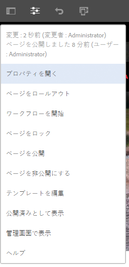
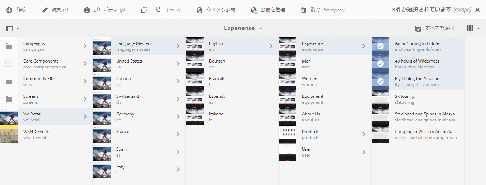
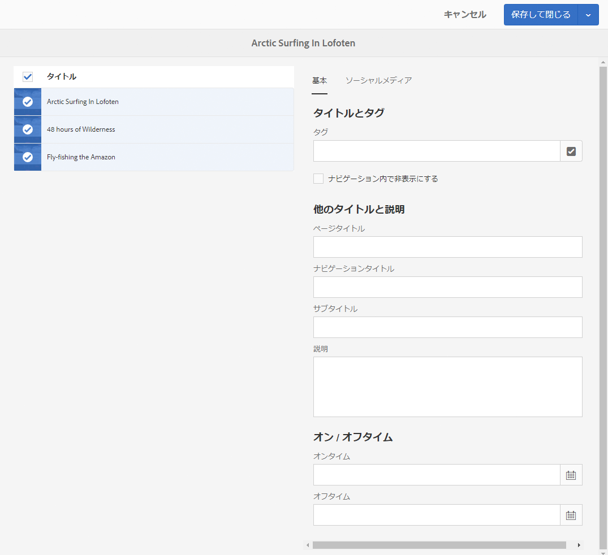

# ページプロパティの編集 {#editing-page-properties}

ページに必要なプロパティを定義できます。これらは、ページの特性に応じて異なる場合があります。例えば、一部のページがライブコピーに接続されている場合と、接続されていない場合があり、ライブコピーの情報は必要に応じて使用できるようになります。

## ページプロパティ {#page-properties}

プロパティは次のタブに分散しています。

### 基本 {#basic}

* **タイトル**

  ページのタイトルは様々な場所に表示されます。例えば、「**web サイト**」タブリストや「**サイト**」カードビュー／リストビューに表示されます。

  このフィールドは必須です。

* **タグ**

  ここでは、選択ボックスのリストを更新して、ページのタグの追加や削除をおこなうことができます。

   * タグを選択すると、選択ボックスの下に表示されます。 このリストからタグを削除するには、x を使用します。
   * 空の選択ボックスに名前を入力して、新しいタグを入力できます。

      * Enter キーを押すと、新しいタグが作成されます。
      * 新しいタグは、新しいタグであることを示す小さな星が右側に表示されます。

   * ドロップダウン機能を使用して、既存のタグから選択できます。
   * 選択ボックスのタグエントリの上にマウスポインターを合わせると、x が表示されます。この x を使用して、対象のタグをこのページから削除できます。

  タグについての詳細情報は、[タグの使用](/help/sites-authoring/tags.md)を参照してください。

* **ナビゲーション内で非表示にする**

  使用されるサイトでページがページのナビゲーションに表示されるかどうかを示します。

* **ブランディング**

  各ページタイトルにブランド見出しを追加して、ページ間で一貫したブランドアイデンティティを適用します。この機能では、[コアコンポーネント](https://experienceleague.adobe.com/docs/experience-manager-core-components/using/introduction.html?lang=ja)のリリース 2.14.0 以降に含まれているページコンポーネントを使用する必要があります。

   * **オーバーライド** - このページにブランド見出しを定義する場合にオンにします。
      * 子ページにも&#x200B;**オーバーライド**&#x200B;値が設定されている場合を除き、値はすべての子ページに継承されます。
   * **値をオーバーライド** - ページタイトルに追加するブランド見出しのテキストです。
      * この値は、「Cycling Tuscany | Always ready for the WKND」のように、ページタイトルの末尾にパイプ文字に続けて追加されます。
* **ページタイトル**

  ページで使用されるタイトルです。通常、タイトルコンポーネントで使用されます。空にした場合は、**タイトル**&#x200B;が使用されます。

* **ナビゲーションタイトル**

  ナビゲーション内で使用する別のタイトルを指定できます（より簡潔にする場合など）。空にした場合は、**タイトル**&#x200B;が使用されます。

* **サブタイトル**

  ページで使用されるサブタイトルです。

* **説明**

  ページの説明です。ページの目的や、必要に応じてその他の詳細を入力します。

* **オンタイム**

  公開されたページがアクティベートされる日時。 公開されると、このページは指定された時間まで休止状態のままです。

  即座に公開するページ（通常のシナリオ）の場合、これらのフィールドは空のままにします。

* **オフタイム**

  公開されたページがアクティベート解除された時間。

  すぐにアクションを実行する場合は、このフィールドを空のままにします。

* **バニティ URL**

  このページのバニティー URL を入力します。この URL を使用すると、より短い URL やより表現的な URL を指定できます。

  例えば、web サイト `http://example.com,` のパス `/v1.0/startpage` で特定されるページに対して、バニティー URL が `welcome` に設定されている場合、`http://example.com/content/v1.0/startpage` のバニティー URL は `http://example.com/welcome` となります。

  >[!CAUTION]
  >
  >バニティ URL は次のような特性があります。
  >
  >* 一意である必要があります。 この値が別のページでまだ使用されていないことを確認します。
  >* 正規表現パターンはサポートしていません。
  >* 既存のページには設定しないでください。
  >

  バニティー URL へのアクセスを有効にするように Dispatcher を設定します。 詳しくは、 [バニティー URL へのアクセスの有効化](https://experienceleague.adobe.com/docs/experience-manager-dispatcher/using/configuring/dispatcher-configuration.html?lang=ja#enabling-access-to-vanity-urls-vanity-urls) を参照してください。

* **バニティ URL をリダイレクト**

  ページにバニティ URL を使用するかどうかを示します。

### 詳細 {#advanced}

* **言語**

  ページの言語です。

* **言語ルート**

  ページが言語コピーのルートの場合にオンにする必要があります。

* **リダイレクト**

  このページが自動的にリダイレクトするページを示します。

* **デザイン**

  このページで使用される[デザイン](/help/sites-developing/designer.md)を示します。

* **エイリアス**

  このページで使用されるエイリアスを指定します。

   * 例えば、ページ `/content/wknd/us/en/magazine/members-only` に `private` というエイリアスを定義した場合、このページには `/content/wknd/us/en/magazine/private` を介してもアクセスできます。
   * エイリアスを作成すると、ページノードに `sling:alias` プロパティが設定されます。これは、リポジトリパスではなく、リソースにのみ影響を与えます。
   * エディターでエイリアスによってアクセスされたページは公開できません。 エディターの[「公開」オプション](/help/sites-authoring/publishing-pages.md)は、実際のパスを介してアクセスしたページでのみ使用できます。
   * 詳しくは、 [「SEO と URL 管理のベストプラクティス」のページ名のローカライズ](/help/managing/seo-and-url-management.md#localized-page-names).

* **&lt;*path*> から継承**

  ページが継承されるかどうか、およびどこから継承するかを示します。

* **クラウド設定**

  設定のパスです。

* **許可されたテンプレート**

  [使用可能なテンプレートのリストを定義します](/help/sites-authoring/templates.md#allowingatemplate) このサブブランチ内に

* **有効化**（認証要件）

  ページにアクセスできるように、認証の使用を有効（または無効）にします。

  >[!NOTE]
  >
  >ページにアクセスできるユーザーグループは、「**[権限](/help/sites-authoring/editing-page-properties.md#permissions)**」タブで定義します。

  >[!CAUTION]
  >
  >The **[権限](/help/sites-authoring/editing-page-properties.md#main-pars-procedure-949394300)** 「 」タブでは、 `granite:AuthenticationRequired` mixin. ページ権限が、 `cq:cugEnabled` プロパティの場合は、次の場所に警告メッセージが表示されます。 **認証要件** また、オプションは編集できず、 [権限](/help/sites-authoring/editing-page-properties.md#permissions) 編集可能。
  >
  >
  >そのような場合は、CUG 権限を[クラシック UI](/help/sites-classic-ui-authoring/classic-page-author-edit-page-properties.md) で編集する必要があります。

* **ログインページ**

  ログインに使用されるページです。

* **設定を書き出し**

  書き出し設定を指定します。

### サムネール {#thumbnail}

ページサムネール画像が表示されます。以下の操作を実行できます。

* **プレビューを生成**

  サムネールとして使用するページのプレビューを生成します。

* **画像をアップロード**

  サムネールとして使用する画像をアップロードします。

* **画像を選択**

  サムネールとして使用する既存のアセットを選択します。

* **元に戻す**

  このオプションは、サムネールを変更した後に使用可能になります。 変更を維持しない場合は、保存前にその変更を元に戻すことができます。

### ソーシャルメディア {#social-media}

* **ソーシャルメディア共有**

  ページで使用可能な共有オプションを定義します。使用可能なオプションをに公開します。 [コアコンポーネントの共有](https://experienceleague.adobe.com/docs/experience-manager-core-components/using/wcm-components/sharing.html?lang=en).

   * **Facebook に対してユーザー共有を有効にする**
   * **Pinterest に対してユーザー共有を有効にする**
   * **優先 XF バリエーション**
ページのメタデータの生成に使用されるエクスペリエンスフラグメントのバリエーションを定義する

### Cloud Services {#cloud-services}

* **Cloud Services**

  [クラウドサービス](/help/sites-developing/extending-cloud-config.md)用のプロパティを定義します。

### パーソナライズ機能 {#personalization}

* **ContextHub 設定**

  「[ContextHub 設定](/help/sites-developing/ch-configuring.md)」と「[セグメントのパス](/help/sites-administering/segmentation.md)」を選択します。

* **ターゲティング設定**

  [ブランドを選択してターゲット設定の範囲を指定](/help/sites-authoring/target-adobe-campaign.md)します。

  >[!NOTE]
  >このオプションを使用するには、ユーザーアカウントが `Target Adminstrators` グループに属している必要があります。

### 権限 {#permissions}

* **権限**

  このタブでは、次のことができます。

   * [権限を追加](/help/sites-administering/user-group-ac-admin.md)
   * [閉じられたユーザーグループを編集](/help/sites-administering/cug.md#applying-your-closed-user-group-to-content-pages)

   * [有効な権限](/help/sites-administering/user-group-ac-admin.md)を表示

  >[!CAUTION]
  >
  >「**権限**」タブでは、`granite:AuthenticationRequired` mixin が存在することにより、CUG 設定を編集できます。ページ権限が、 `cq:cugEnabled` プロパティの場合は、警告メッセージが表示され、CUG 権限は編集できません。また、 [詳細](/help/sites-authoring/editing-page-properties.md#advanced) タブ編集可能
  >
  >
  >そのような場合は、CUG 権限を[クラシック UI](/help/sites-classic-ui-authoring/classic-page-author-edit-page-properties.md) で編集する必要があります。

  >[!NOTE]
  >
  >「権限」タブでは、空の CUG グループの作成が許可されません。そのため、すべてのユーザーによるアクセスを拒否する簡単な方法として使用できます。これをおこなうには、CRX Explorer を使用する必要があります。 ドキュメントを見る [ユーザー、グループ、アクセス権の管理](/help/sites-administering/user-group-ac-admin.md) を参照してください。

### ブループリント {#blueprint}

* **ブループリント**

  [マルチサイト管理](/help/sites-administering/msm.md)でブループリントページのプロパティを定義します。変更がライブコピーに反映される状況を制御します。

### ライブコピー {#live-copy}

* **ライブコピー**

  [マルチサイト管理](/help/sites-administering/msm.md)でライブコピーページのプロパティを定義します。変更をブループリントから反映する状況を制御します。

### サイト構造 {#site-structure}

* サイト全体の機能を提供するページへのリンクを指定します。例： **サインアップページ**, **オフラインページ**（その他）

## ページプロパティの編集  {#editing-page-properties-1}

次の方法でページプロパティを定義できます。

* **サイト**&#x200B;コンソールから：

   * [ページの作成](/help/sites-authoring/managing-pages.md#creating-a-new-page) （プロパティのサブセット）

   * 「**プロパティ**」をクリックまたはタップします

      * 単一ページの場合
      * 複数ページの場合（まとめて編集する場合は、プロパティのサブセットのみを使用できます）

* ページエディターから、次の操作を行います。

   * 「**ページ情報**」（その後、「**プロパティを開く**」）を使用します

### サイトコンソールから - 単一のページ {#from-the-sites-console-single-page}

「**プロパティ**」をクリックまたはタップして、ページのプロパティを定義します。

1. **サイト**&#x200B;コンソールを使用して、プロパティを表示および編集するページの場所に移動します。

1. 次のいずれかを使用して、目的のページで「**プロパティ**」オプションを選択します。

   * [クイックアクション](/help/sites-authoring/basic-handling.md#quick-actions)
   * [選択モード](/help/sites-authoring/basic-handling.md#selectionmode)

   ページのプロパティは該当するタブに表示されます。

1. 必要に応じてプロパティを表示または編集します。

1. その後、 **保存** 更新を保存するには、次の手順に従います。 **閉じる** コンソールに戻ることができます。

### ページの編集中 {#when-editing-a-page}

ページの編集時に、 **ページ情報** ページプロパティを定義するには：

1. プロパティを編集するページを開きます。

1. **ページ情報**&#x200B;アイコンを選択して選択メニューを開きます。

   

1. 選択 **プロパティを開く** をクリックすると、プロパティを編集するためのダイアログボックスが開きます。プロパティは適切なタブに分類されています。 ツールバーの右側にある次のボタンも使用できます。

   * **キャンセル**
   * **保存して閉じる**

1. 「**保存して閉じる**」ボタンを使用して、変更を保存します。

### サイトコンソールから - 複数のページ {#from-the-sites-console-multiple-pages}

次から： **Sites** コンソールでは、複数のページを選択してから、 **プロパティを表示** をクリックして、ページのプロパティを表示または編集します。 これは、ページプロパティの一括編集と呼ばれます。

>[!NOTE]
>
>プロパティの一括編集はアセットに対しても使用できます。似ていますが、いくつかの点が異なります。 詳しくは、[複数のアセットのプロパティの編集](/help/assets/metadata.md)を参照してください。
>
>また、 [バルクエディター](/help/sites-administering/bulk-editor.md). このエディターを使用すると、GQL(Google Query Language) を使用して複数のページからコンテンツを検索し、元のページに対する変更を保存する前に Bulk Editor を使用して直接コンテンツを編集できます。

次の方法を含む様々な方法で、複数のページを一括編集用に選択することができます。

* **Sites** コンソールの参照時
* **検索**&#x200B;によって複数のページを特定した後

ページを選択して「**プロパティ**」オプションをクリックまたはタップすると、一括プロパティが表示されます。

一括編集ができるのは、次のようなページに限られます。

* 同じリソースタイプを共有する
* ライブコピーの一部ではない

   * いずれかのページがライブコピー中である場合、プロパティを開く際にメッセージが表示されます。

一括編集を開始したら、次の操作を実行できます。

* **表示**

  複数のページのページプロパティを表示すると、次のように表示されます。

   * 影響を受けるページのリスト

      * 必要に応じて、選択/選択解除を切り替えることができます

   * タブ

      * 単一ページのプロパティを表示する場合と同様に、プロパティがタブの下で順に並べられます。

   * プロパティのサブセット

      * 選択したすべてのページで使用できるプロパティ（および一括編集で使用できると明示的に定義されたプロパティ）が表示されます。
      * 選択するページを 1 つに減らすと、すべてのプロパティが表示されます。

   * 共通の値を持つ共通のプロパティ

      * 表示モードで表示されるのは、共通の値を持つプロパティのみです。
      * フィールドが複数値（タグなど）の場合、値は *すべて* は一般的です。 一部のみが一般的な場合は、編集時にのみ表示されます。

  一般的な値を含むプロパティがない場合は、メッセージが表示されます。

* **編集**

  複数のページのページプロパティを編集する場合は、次の点に注意してください。

   * 利用可能なフィールドの値を更新できます。

      * 新しい値は、「**完了**」を選択したときに、選択したすべてのページに適用されます。
      * フィールドが複数値（タグなど）の場合は、新しい値を追加するか、共通の値を削除できます。

   * 共通のフィールドに、ページによって異なる値が設定されている場合、そのフィールドは特別な値（テキストなど）で示されます `<Mixed Entries>`.

>[!NOTE]
>
>ページコンポーネントを設定して、一括編集が可能なフィールドを指定できます。[ページプロパティの一括編集のためのページの設定](/help/sites-developing/bulk-editing.md)を参照してください。
