# エクスペリエンスフラグメント{#experience-fragments}

Adobe Experience Manager（AEM）では、エクスペリエンスフラグメントは、ページ内で参照できるコンテンツとレイアウトを含む 1 つまたは複数のコンポーネントからなるグループです。任意のコンポーネントを含めることができます。

エクスペリエンスフラグメントは、

* エクスペリエンス（ページ）の一部です。
* （編集可能なテンプレートに基づいた）複数のページで使用できます。
* 構造とコンポーネントを定義するためのテンプレート（編集のみ可能）に基づいています。
* このテンプレートは、エクスペリエンスフラグメントの&#x200B;*ルートページ*&#x200B;の作成に使用されます。
* 段落システム内に、レイアウトを含む 1 つ以上のコンポーネントで構成されています。
* その他のエクスペリエンスフラグメントを含めることができます。
* その他のコンポーネント（その他のエクスペリエンスフラグメントを含む）と組み合わせて、完全なページ（エクスペリエンス）を形成できます。
* ルートページに基づいて、1 つ以上のバリエーションを作成できます。
* これらのバリエーションでは、コンテンツやコンポーネントを共有できます。
* フラグメントの複数のバリエーションで使用できる構築ブロックに分類できます。

エクスペリエンスフラグメントを使用できるのは、次の場合です。

* 作成者がページの一部（エクスペリエンスのフラグメント）を再利用する場合は、そのフラグメントをコピーして貼り付ける必要があります。 これらのエクスペリエンスのコピー／貼り付けの作成と管理には時間がかかり、ユーザーエラーが発生しがちです。
エクスペリエンスフラグメントは、コピー／貼り付けを不要にします。
* ヘッドレス CMS のユースケースをサポートする場合。作成者は AEM をオーサリングにのみ使用し、顧客への配信には使用しないようにします。サードパーティシステム／タッチポイントは、そのエクスペリエンスを使用してエンドユーザーに配信します。
* [マルチサイト管理（MSM）](/help/sites-administering/msm.md)を使用。エクスペリエンスフラグメントはページの一部です。これは、個々のフラグメントとその中に存在するフォルダーの両方に当てはまります。

>[!NOTE]
>
>エクスペリエンスフラグメントの書き込みアクセス権には、次のグループに登録されたユーザーアカウントが必要です。
>
>    `experience-fragments-editors`
>
>問題が発生している場合は、システム管理者にお問い合わせください。

## エクスペリエンスフラグメントを使用するタイミング？ {#when-should-you-use-experience-fragments}

エクスペリエンスフラグメントは、次の場合に使用します。

* エクスペリエンスを再利用する場合。

   * 同じコンテンツや類似のコンテンツにおけるエクスペリエンスの再利用

* AEM をサードパーティのコンテンツ配信プラットフォームとして使用する場合。

   * AEM をコンテンツ配信プラットフォームとして使用するソリューション
   * サードパーティのタッチポイントへのコンテンツの埋め込み

* 異なるバリエーションやレンディションを持つエクスペリエンスがある場合。

   * チャネル固有またはコンテキスト固有のバリエーション
   * グループに対応したエクスペリエンス（チャネル間でエクスペリエンスが異なるキャンペーンなど）

* オムニチャネルコマースを使用する場合。

   * 規模に応じた[ソーシャルメディア](/help/sites-developing/experience-fragments.md#social-variations)チャネルでのコマース関連コンテンツの共有
   * タッチポイントのトランザクション化

## エクスペリエンスフラグメントの整理 {#organizing-your-experience-fragments}

以下をお勧めします。
* フォルダーを使用してエクスペリエンスフラグメントを整理する。

* [これらのフォルダーで使用可能なテンプレートを設定する](#configure-allowed-templates-folder)。

フォルダーを作成すると、次の操作が可能になります。

* エクスペリエンスフラグメントにとって意味のある構造（例：分類に従った構造）を作成する。

  >[!NOTE]
  >
  >エクスペリエンスフラグメントの構造をサイトのページ構造に合わせる必要はありません。

* [許可されたテンプレートをフォルダーレベルで割り当てる。](#configure-allowed-templates-folder)

  >[!NOTE]
  >
  >[テンプレートエディター](/help/sites-authoring/templates.md)を使用すると、独自のテンプレートを作成できます。

WKND プロジェクトでは、`Contributors` に従って一部のエクスペリエンスフラグメントを構造化します。また、使用される構造は、マルチサイト管理（言語コピーを含む）などの他の機能の使用方法の例も示します。

以下を参照してください。

`http://localhost:4502/aem/experience-fragments.html/content/experience-fragments/wknd/language-masters/en/contributors/kumar-selveraj/master`

## エクスペリエンスフラグメントのフォルダーの作成と設定 {#creating-and-configuring-a-folder-for-your-experience-fragments}

エクスペリエンスフラグメントのフォルダーを作成および設定するには、次の操作をお勧めします。

1. [フォルダーを作成](/help/sites-authoring/managing-pages.md#creating-a-new-folder) します。

1. [そのフォルダーに使用できるエクスペリエンスフラグメントテンプレートを設定](#configure-allowed-templates-folder)します。

>[!NOTE]
>
>また、[インスタンスに使用できるテンプレート](#configure-allowed-templates-instance)を設定することもできますが、アップグレード時に値が上書きされる可能性があるので、この方法は&#x200B;**お勧めしません**。

### フォルダーに使用できるテンプレートの設定 {#configure-allowed-templates-folder}

>[!NOTE]
>
>アップグレード時に値が上書きされないので、「**許可されたテンプレート**」を指定する場合は、この方法をお勧めします。

1. 必要な&#x200B;**エクスペリエンスフラグメント**&#x200B;フォルダーに移動します。

1. フォルダーを選択してから、「**プロパティ**」を選択します。

1. 必要なテンプレートを取得するための正規表現を「**許可されたテンプレート**」フィールドに指定します。

   次に例を示します。
   `/conf/(.*)/settings/wcm/templates/experience-fragment(.*)?`

   以下を参照してください。
   `http://localhost:4502/mnt/overlay/cq/experience-fragments/content/experience-fragments/folderproperties.html/content/experience-fragments/wknd`

   

   >[!NOTE]
   >
   >詳しくは、[エクスペリエンスフラグメントのテンプレート](/help/sites-developing/experience-fragments.md#templates-for-experience-fragments)を参照してください。

1. 「**保存して閉じる**」を選択します。

### インスタンスに使用できるテンプレートの設定 {#configure-allowed-templates-instance}

>[!CAUTION]
>
>指定したテンプレートがアップグレード時に上書きされる可能性があるので、「**許可されたテンプレート**」をこの方法で変更することはお勧めしません。
>
>このダイアログボックスは、情報提供のみを目的として使用します。

1. 必要な&#x200B;**エクスペリエンスフラグメント**&#x200B;コンソールに移動します。

1. 「**設定オプション**」を選択します。

   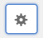

1. **エクスペリエンスフラグメントを設定**&#x200B;ダイアログで、必要なテンプレートを指定します。

   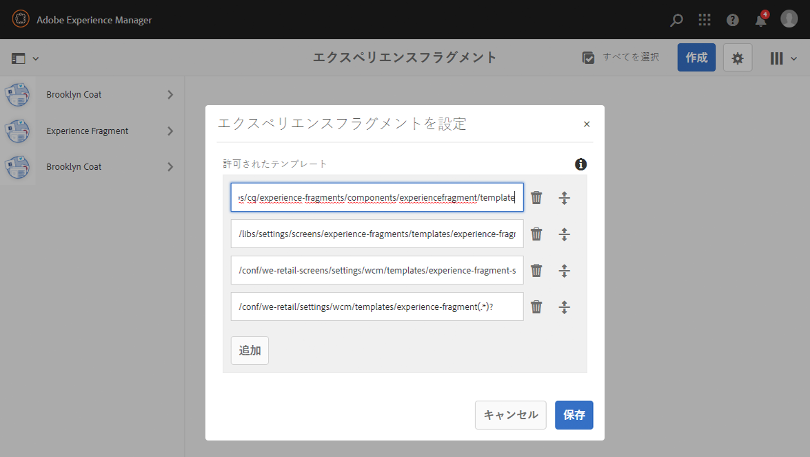

   >[!NOTE]
   >
   >詳しくは、[エクスペリエンスフラグメントのテンプレート](/help/sites-developing/experience-fragments.md#templates-for-experience-fragments)を参照してください。

1. 「**保存**」を選択します。

## エクスペリエンスフラグメントの作成 {#creating-an-experience-fragment}

エクスペリエンスフラグメントを作成するには、次の手順に従います。

1. グローバルナビゲーションから「エクスペリエンスフラグメント」を選択します。

   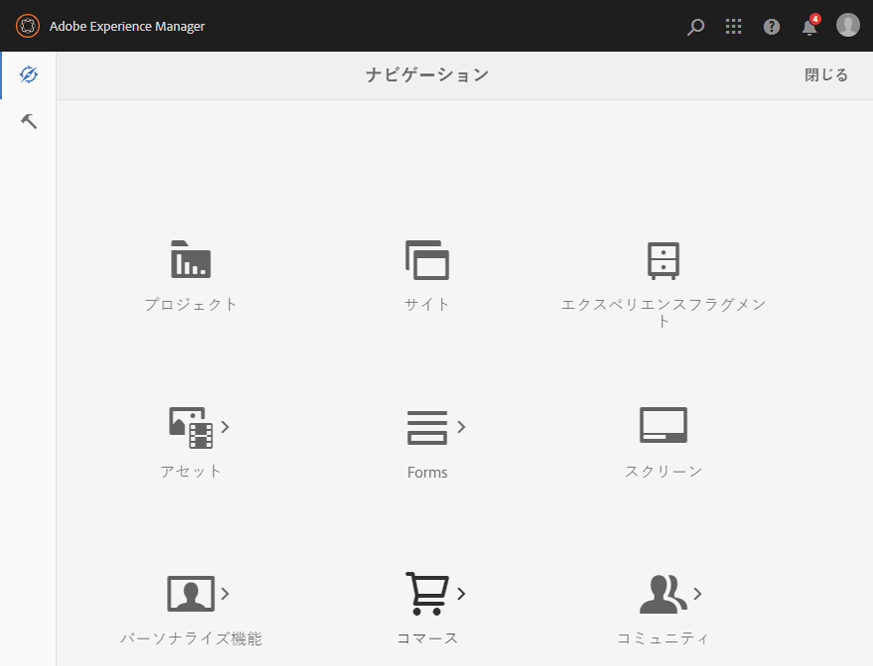

1. 目的のフォルダーに移動し、「**作成**」を選択します。

   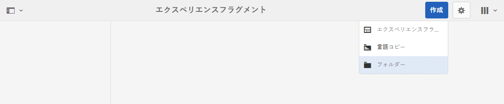

1. 「**エクスペリエンスフラグメント**」を選択して、**エクスペリエンスフラグメントを作成**&#x200B;ウィザードを開きます。

   適切な&#x200B;**テンプレート**&#x200B;を選択して、「**次へ**」を選択します。

   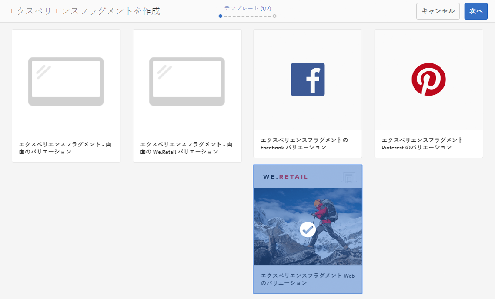

1. **エクスペリエンスフラグメント**&#x200B;の&#x200B;**プロパティ**&#x200B;を入力します。

   **タイトル**&#x200B;は必須です。**名前**&#x200B;が空欄のままの場合は、**タイトル**&#x200B;から派生します。

   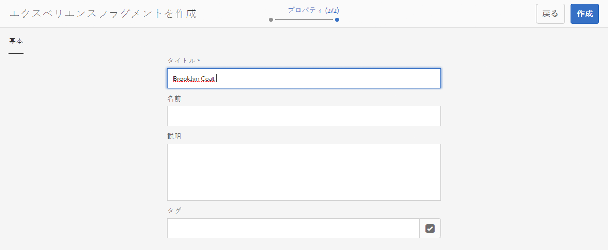

   >[!NOTE]
   >
   >エクスペリエンスフラグメントテンプレート内のタグは、このエクスペリエンスフラグメントルートページのタグとは結合されません。
   >
   >これらは完全に別個のものです。

1. 「**作成**」をクリックします。

   メッセージが表示されます。選択:

   * 「**完了**」を選択すると、コンソールに戻ります。

   * 「**開く**」を選択すると、フラグメントエディターを開きます。

## エクスペリエンスフラグメントの編集 {#editing-your-experience-fragment}

エクスペリエンスフラグメントエディターには、通常のページエディターと似た機能があります。

>[!NOTE]
>
>ページエディターの使用方法についての詳細情報は、[ページコンテンツの編集](/help/sites-authoring/editing-content.md)を参照してください。

次の手順の例では、商品のティーザーを作成する方法を示しています。

1. [コンポーネントブラウザー](/help/sites-authoring/author-environment-tools.md#components-browser)から&#x200B;**ティーザー**&#x200B;をドラッグ＆ドロップします。

   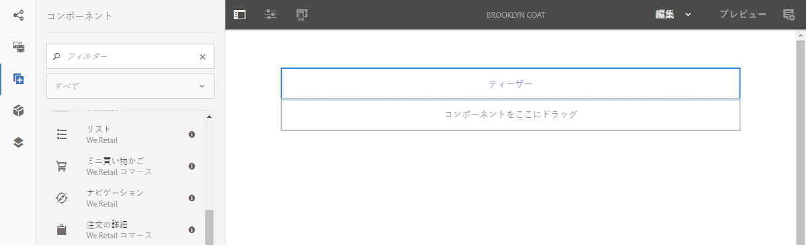

1. コンポーネントツールバーから&#x200B;**[設定](/help/sites-authoring/editing-content.md#edit-configure-copy-cut-delete-paste)**&#x200B;を選択します。
1. 必要に応じて&#x200B;**アセット**&#x200B;を追加して&#x200B;**プロパティ**&#x200B;を定義します。
1. 「**完了**」（チェックマークアイコン）をクリックして定義を確定します。
1. 必要に応じてその他のコンポーネントを追加します。

## エクスペリエンスフラグメントのバリエーションの作成 {#creating-an-experience-fragment-variation}

必要に応じて、エクスペリエンスフラグメントのバリエーションを作成できます。

1. [編集する](/help/sites-authoring/experience-fragments.md#editing-your-experience-fragment)フラグメントを開きます。
1. 「**バリエーション**」タブを開きます。

   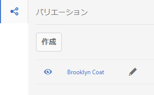

1. 「**作成**」では以下を作成できます。

   * **バリエーション**
   * **バリエーションを[ライブコピー](/help/sites-administering/msm.md#live-copies)**&#x200B;として。

     >[!NOTE]
     >
     >初期バリエーションをライブコピーとして作成すると、ライブコピーソースをプライマリバリエーションとして使用してタイトルが継承されます。

1. 必要なプロパティを定義します。

   * **テンプレート**
   * **タイトル**
   * **名前**（空欄のままの場合は、タイトルから派生）
   * **説明**
   * **バリエーションのタグ**

   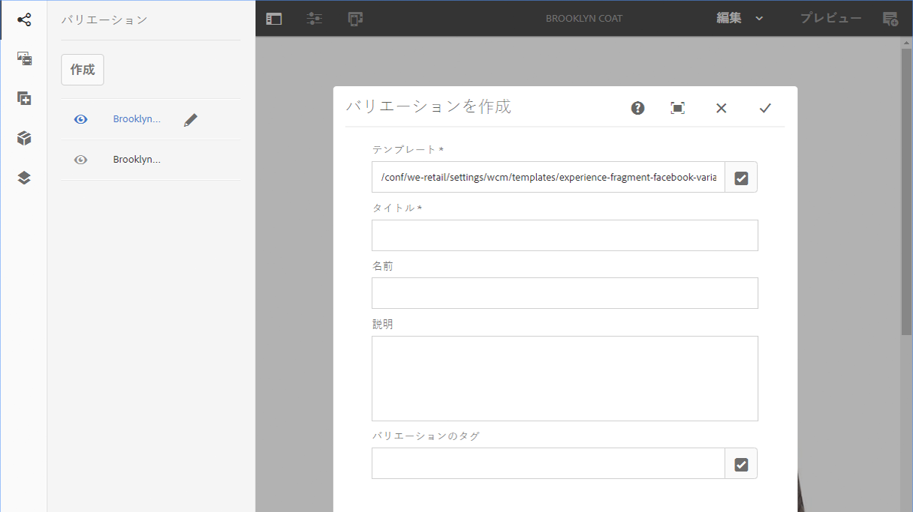

1. 「**完了**（チェックマークアイコン）」で確定すると、新しいバリエーションがパネルに表示されます。

   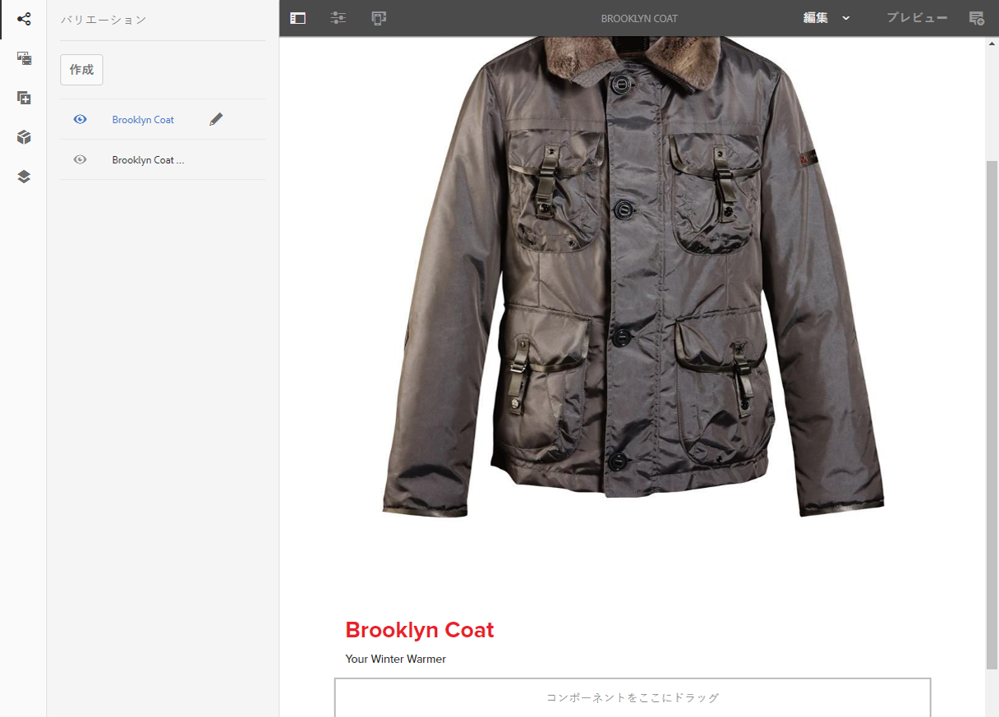

## エクスペリエンスフラグメントの使用 {#using-your-experience-fragment}

これで、ページをオーサリングする際に、エクスペリエンスフラグメントを使用できるようになりました。

1. 編集するページを開きます。

   >[!NOTE]
   >
   >ページは、編集可能なテンプレートに基づいている必要があります。

   例：[https://localhost:4502/editor.html/content/we-retail/language-masters/en/products/men.html](https://localhost:4502/editor.html/content/we-retail/language-masters/en/products/men.html)

1. コンポーネントブラウザーからページ段落システムにコンポーネントをドラッグして、エクスペリエンスフラグメントコンポーネントのインスタンスを作成します。

   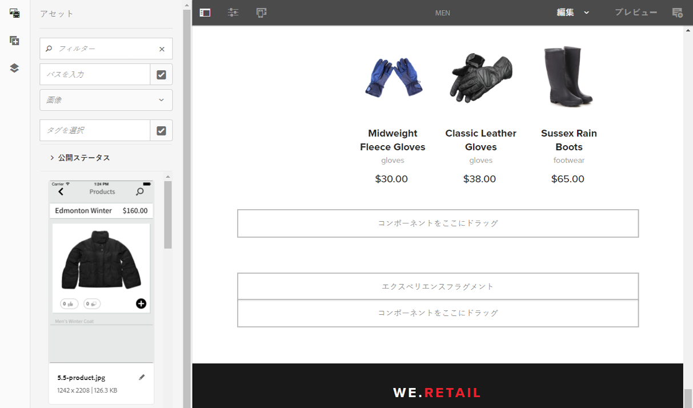

1. 次のいずれかの方法で、実際のエクスペリエンスフラグメントをコンポーネントインスタンスに追加します。

   * アセットブラウザーから必要なフラグメントをドラッグして、コンポーネントにドロップします。
   * コンポーネントツールバーから「**設定**」を選択し、使用するフラグメントを指定して「**完了**（チェックマーク）」で確定します。

   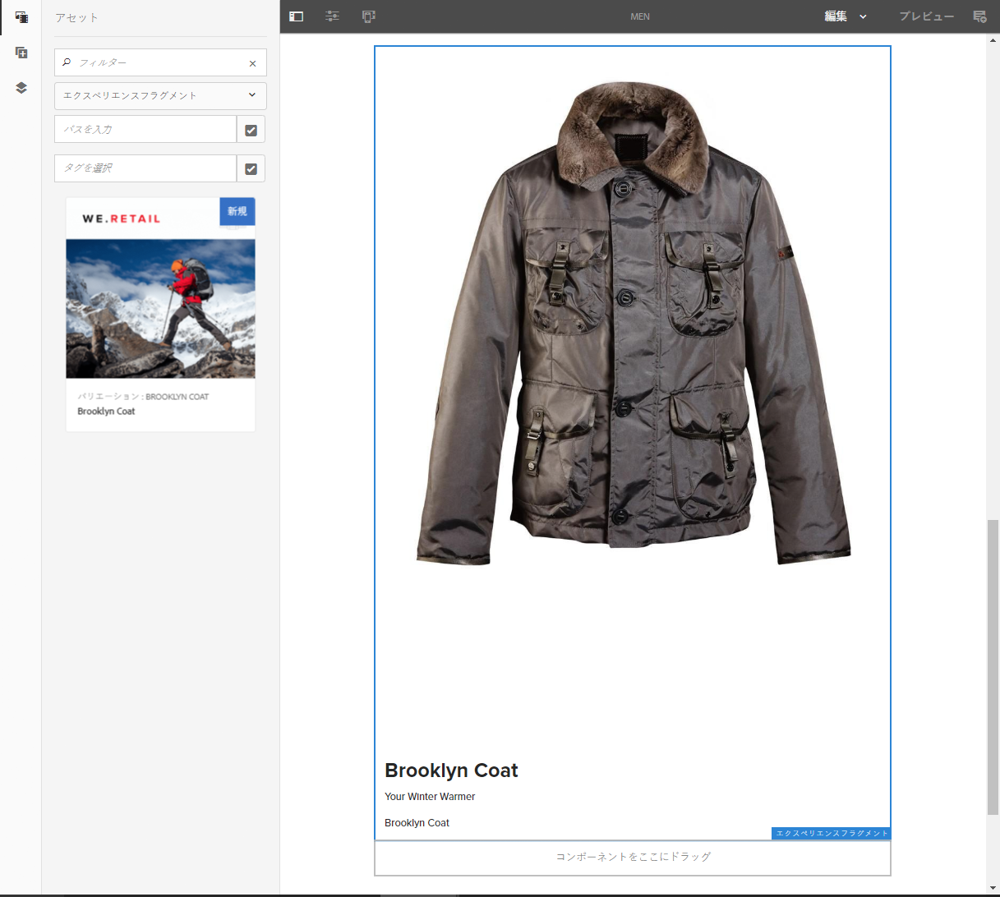

   >[!NOTE]
   >
   >コンポーネントツールバーの「編集」は、フラグメントエディターでフラグメントを開くためのショートカットとして動作します。

## 構築ブロック {#building-blocks}

1 つ以上のコンポーネントを選択して、フラグメント内で再利用するための構築ブロックを作成できます。

### 構築ブロックの作成 {#creating-a-building-block}

構築ブロックを作成するには、次の手順に従います。

1. エクスペリエンスフラグメントエディターで、再利用するコンポーネントを選択します。

   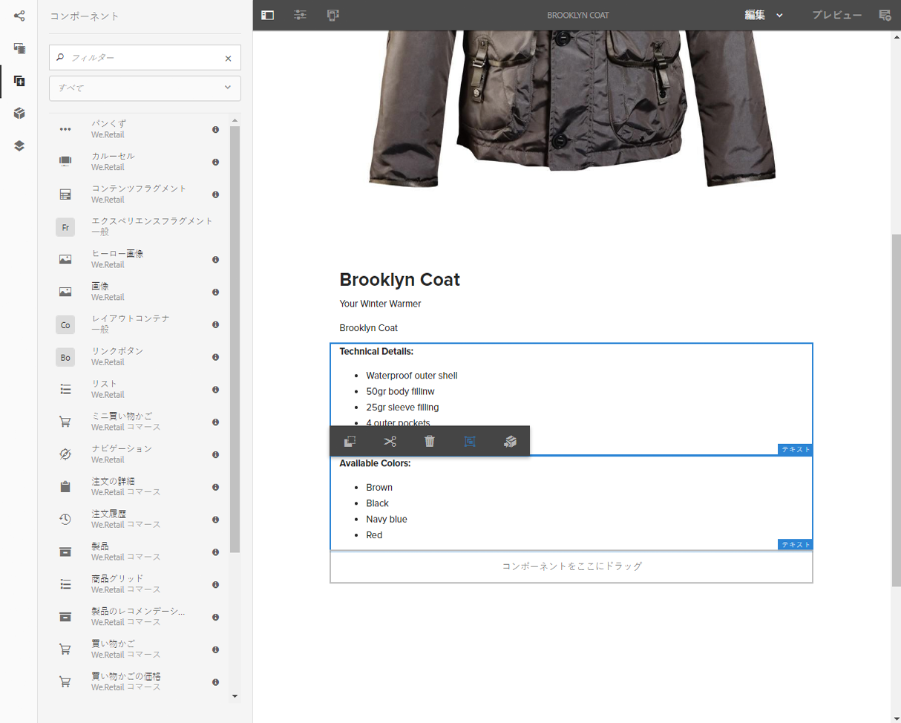

1. コンポーネントツールバーから、「**構築ブロックに変換**」を選択します。

   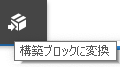

1. **構築ブロック**&#x200B;の名前を入力して、「**変換**」で確定します。

   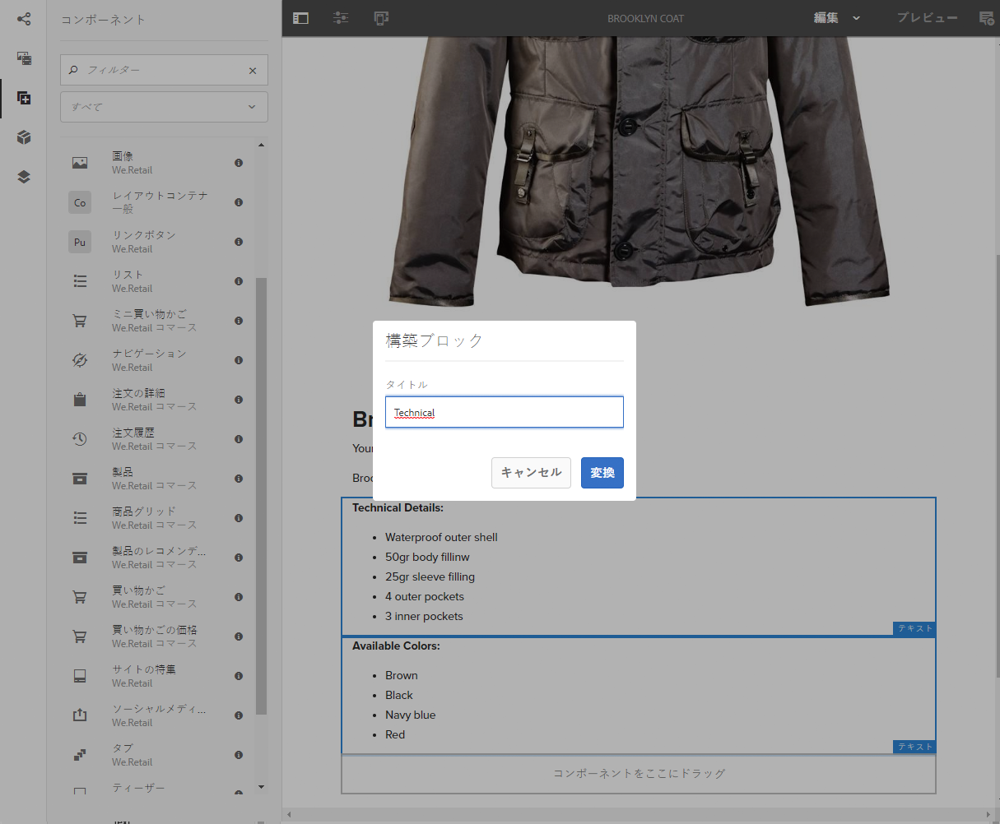

1. **構築ブロック**&#x200B;がタブに表示され、段落システムで選択できます。

   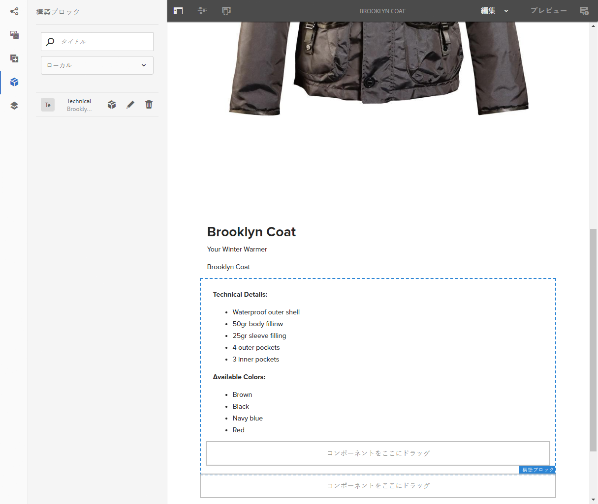

#### 構築ブロックの管理 {#managing-a-building-block}

構築ブロックは、「**構築ブロック**」タブに表示されます。各ブロックでは、次の操作を行えます。

* マスターに移動（ルートページバリエーションを新しいタブで開く）
* 名前を変更
* 削除

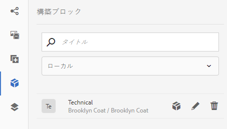

#### 構築ブロックの使用 {#using-a-building-block}

任意のコンポーネントと同様に、構築ブロックをフラグメントの段落システムにドラッグできます。

## エクスペリエンスフラグメントの詳細 {#details-of-your-experience-fragment}

フラグメントの詳細は、以下のようにして確認できます。

1. 詳細は、**エクスペリエンスフラグメント**&#x200B;コンソールのすべてのビューに表示されます。**リスト表示**&#x200B;には、[Adobe Target への書き出し](/help/sites-administering/experience-fragments-target.md)の詳細も含まれます。

   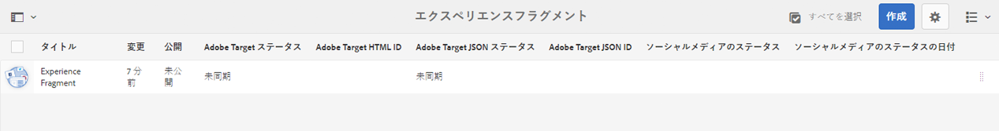

1. エクスペリエンスフラグメントの「**プロパティ**」を開くと、

   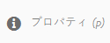

   プロパティが次のように様々なタブに表示されます。

   >[!CAUTION]
   >
   >これらのタブは、エクスペリエンスフラグメントコンソールから「**プロパティ**」を開くと表示されます。
   >
   >
   >エクスペリエンスフラグメントの編集時に&#x200B;**プロパティを開く**&#x200B;と、適切な[ページのプロパティ](/help/sites-authoring/editing-page-properties.md)が表示されます。

   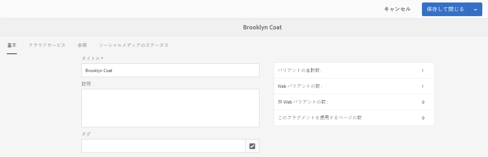

   * **基本**

      * **タイトル**（必須）

      * **説明**
      * **タグ**
      * **バリアントの合計数** - 情報提供のみ

      * **Web バリアントの数** - 情報提供のみ
      * **非 Web バリアントの数** - **情報提供のみ**

      * **このフラグメントを使用するページの数** - 情報提供のみ

   * **Cloud Services**

      * **クラウド設定**
      * **クラウドサービス設定**
      * **Facebook ページ ID**
      * **Pinterest ボード**

   * **参照**

      * 参照のリスト

   * **ソーシャルメディアのステータス**

      * ソーシャルメディアバリエーションの詳細。

## プレーン HTML レンディション {#the-plain-html-rendition}

URL の `.plain.` セレクターを使用すると、ブラウザーからプレーン HTML レンディションにアクセスできます。

>[!NOTE]
>
>ブラウザーから直接利用することもできますが、[主な目的は、他のアプリケーション（例えば、サードパーティ web アプリ、カスタムモバイル実装など）が、URL のみを使用して、エクスペリエンスフラグメントのコンテンツに直接アクセスできるようにすることです](/help/sites-developing/experience-fragments.md#the-plain-html-rendition)。

## エクスペリエンスフラグメントの書き出し {#exporting-experience-fragments}

デフォルトでは、エクスペリエンスフラグメントは HTML 形式で配信されます。AEM とサードパーティチャネルのどちらでも同じように使用できます。

Adobe Target に書き出す場合は、JSON を使用することもできます。詳しくは、[Adobe Target とエクスペリエンスフラグメントの統合](/help/sites-administering/experience-fragments-target.md)を参照してください。
