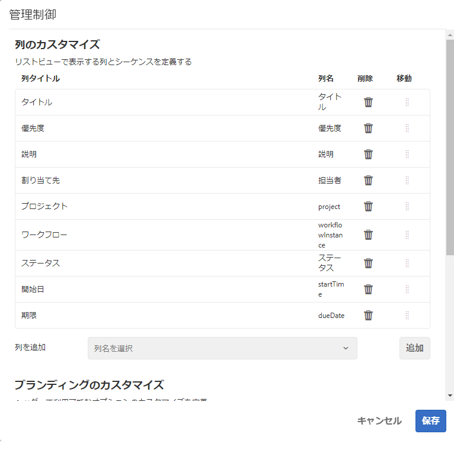

# インボックス {#your-inbox}

ワークフローやプロジェクトなど、AEM の様々な領域から次のような通知を受け取ることができます。

* タスク：

   * また、AEM UI 内の様々な場所で作成されます（例えば、**プロジェクト**）。
   * **タスクを作成**&#x200B;または&#x200B;**プロジェクトタスクを作成**&#x200B;ワークフローのステップから通知されます。

* ワークフロー：

   * ページのコンテンツに対して実行する必要があるアクションを表す作業項目。

      * **参加者**&#x200B;ワークフローのステップから通知されます。

   * 失敗した項目（管理者が失敗したステップを再試行できるようにするため）。

これらの通知は、自分のインボックスで受け取り、それらを表示してアクションを実行できます。

>[!NOTE]
>
>標準の AEM では、管理者ユーザーグループに割り当てられた管理タスクが事前に読み込まれます。詳しくは、[標準の管理タスク](#out-of-the-box-administrative-tasks)を参照してください。

>[!NOTE]
>
>項目タイプについて詳しくは、次も参照してください。
>
>* [プロジェクト](/help/sites-authoring/touch-ui-managing-projects.md)
>* [プロジェクト - タスクの操作](/help/sites-authoring/task-content.md)
>* [ワークフロー](/help/sites-authoring/workflows.md)
>* [フォーム](/help/forms/using/introduction-aem-forms.md)
>

## ヘッダー内のインボックス {#inbox-in-the-header}

どのコンソールからでも、インボックス内の現在の項目数がヘッダーに表示されます。インジケーターを開いて、アクションが必要なページに素早くアクセスしたり、インボックスにアクセスしたりすることもできます。

>[!NOTE]
>
>特定のアクションは、[適切なリソースのカード表示](/help/sites-authoring/basic-handling.md#card-view)にも表示されます。

## 標準の管理タスク  {#out-of-the-box-administrative-tasks}

標準の AEM では、管理者ユーザーグループに割り当てられた 4 つのタスクが事前に読み込まれています。

* [分析とターゲティングを設定](/help/sites-administering/opt-in.md)
* [AEM セキュリティチェックリストを適用](/help/sites-administering/security-checklist.md)
* 集計した使用状況の統計の収集を有効にする
* [HTTPS を設定](/help/sites-administering/ssl-by-default.md)

## インボックスを開く {#opening-the-inbox}

AEM 通知インボックスを開くには、次の手順に従います。

1. ツールバーのインジケーターをクリックします。

1. 「**すべて表示**」を選択します。**AEM インボックス**&#x200B;が開きます。インボックスには、ワークフロー、プロジェクトおよびタスクからの項目が表示されます。
1. デフォルトの表示は[リスト表示](#inbox-list-view)ですが、[カレンダー表示](#inbox-calendar-view)に切り替えることもできます。これは、表示セレクター（ツールバーの右上部分）を使用しておこないます。

   両方の表示について、[表示設定](#inbox-view-settings)を定義することもできます。使用可能なオプションは現在の表示によって異なります。

   

>[!NOTE]
>
>インボックスはコンソールとして機能するので、完了したら、[グローバルナビゲーション](/help/sites-authoring/basic-handling.md#global-navigation)または[検索](/help/sites-authoring/search.md)を使用して、別の場所に移動します。

### インボックス - リスト表示 {#inbox-list-view}

この表示では、すべての項目が関連情報と共に表示されます。

### インボックス - カレンダー表示 {#inbox-calendar-view}

この表示では、カレンダーの位置と選択した正確な表示に従って項目が表示されます。

以下の操作を実行できます。

* 特定の表示（**タイムライン**、**列**、**リスト**）の選択

* **スケジュール**&#x200B;に応じて表示するタスク（**すべて**、**計画済み**、**処理中**、**まもなく期限**、**期限切れ**）の指定

* 項目の詳細情報へのドリルダウン
* 表示を絞り込むための日付範囲の選択

### インボックス - 設定 {#inbox-view-settings}

両方の表示（リストおよびカレンダー）に対して、次の設定を定義できます。

* **カレンダー表示**

  **カレンダー表示**&#x200B;の場合、次を設定できます。

   * **グループ化の条件**
   * **予定**&#x200B;または&#x200B;**なし**
   * **カードサイズ**

  

* **リスト表示**

  **リスト表示**&#x200B;の場合、並べ替えメカニズムを設定できます。

   * **並べ替えフィールド**
   * **並べ替え順序**

  

### インボックス - 管理コントロール {#inbox-admin-control}

「管理コントロール」オプションでは、管理者は次の操作を実行できます。

* AEM インボックス列のカスタマイズ

* ヘッダーテキストとロゴのカスタマイズ

* ヘッダーで使用できるナビゲーションリンクの表示の制御

「管理者制御」オプションは、`administrators` または `workflow-administrators` グループのメンバーにのみ表示されます。

* **列のカスタマイズ**：AEM インボックスをカスタマイズして、列のデフォルトのタイトルの変更、列の位置の並べ替え、ワークフローのデータに基づく追加の列の表示などを行います。
   * **列の追加**：AEM インボックスに追加する列を選択します。
   * **列の編集**：列タイトルの上にマウスポインターを置き、「」アイコンを選択して列の表示名を入力します。
   * **列の削除**：「」アイコンを選択して、AEM インボックスから列を削除します。
   * **列の移動**：「」アイコンをドラッグして、AEM インボックス内の新しい位置に列を移動します。

  

* **ブランディングのカスタマイズ**

   * **ヘッダーテキストのカスタマイズ**：デフォルトの **Adobe Experience Manager** テキストを置き換えるために、ヘッダーに表示するテキストを指定します。

   * **ロゴのカスタマイズ**：ヘッダーにロゴとして表示する画像を指定します。デジタルアセット管理（DAM）に画像をアップロードし、フィールドでその画像を参照します。

* **ユーザーナビゲーション**
   * **ナビゲーションオプションを非表示にする**：ヘッダーで使用可能なナビゲーションオプションを非表示にするには、このオプションを選択します。ナビゲーションオプションには、他のソリューションへのリンク、ヘルプリンク、Adobe Experience Manager のロゴまたはテキストをタップして利用できるオーサリングオプションが含まれます。
* **保存：**&#x200B;このオプションをクリックして、設定を保存します。

## 項目に対するアクションの実行 {#taking-action-on-an-item}

>[!NOTE]
>
>複数のアイテムを選択できますが、一度に 1 つのアイテムに対してのみアクションを実行できます。

1. 項目に対してアクションを実行するには、該当する項目のサムネールを選択します。その項目に適用可能なアクションのアイコンがツールバーに表示されます。

   

   アクションは項目に対応しており、次のアクションがあります。

   * アクションの&#x200B;**完了**（例：タスクまたはワークフロー項目）。
   * 項目の&#x200B;**再割り当て**／**デリゲート**。
   * 項目を&#x200B;**開く**。項目タイプに応じて、このアクションは次の操作を実行します。

      * 項目のプロパティを表示する
      * さらなるアクションに適したダッシュボードやウィザードを開く
      * 関連するドキュメントを開く

   * 前のステップに&#x200B;**戻る**。
   * ワークフローのペイロードを表示する.
   * 項目からプロジェクトを作成する.

   >[!NOTE]
   >
   >詳しくは、次のセクションを参照してください。
   >
   >* ワークフロー項目 - [ワークフローへの参加](/help/sites-authoring/workflows-participating.md)

1. 選択した項目に応じて、次の例のようなアクションが開始されます。

   * そのアクションに適したダイアログが開きます。
   * アクションウィザードが開始されます。
   * ドキュメントページが開きます。

   例えば、「**再割り当て**」を選択するとダイアログが開きます。

   

   ダイアログ、ウィザード、ドキュメントページが開いているかどうかに応じて、次の操作をおこなうことができます。

   * 適切なアクション（再割り当てなど）を確認します。
   * アクションをキャンセルする。
   * 例えば、左向き矢印で、アクションウィザードまたはドキュメントページが開いている場合、インボックスに戻ることができます。

## タスクの作成 {#creating-a-task}

インボックスから、次のタスクを作成できます。

1. 「**作成**」を選択し、「**タスク**」を選択します。
1. 「**基本**」および「**詳細**」タブの必要なフィールドに入力します。「**タイトル**」のみが必須で、それ以外のフィールドはオプションです。

   * **基本**：

      * **タイトル**
      * **プロジェクト**
      * **割り当て先**
      * **コンテンツ**（ペイロードと似ており、タスクからリポジトリ内の場所への参照です）
      * **説明**
      * **タスクの優先度**
      * **開始日**
      * **期限**

   

   * **詳細**

      * **名前**：URL の形成に使用されます。空の場合は、**タイトル**&#x200B;に基づきます。

   

1. 「**送信**」を選択します。

## プロジェクトの作成 {#creating-a-project}

特定のタスクに対して、そのタスクに基づいて[プロジェクト](/help/sites-authoring/projects.md)を作成できます。

1. サムネールをタップまたはクリックして、適切なタスクを選択します。

   >[!NOTE]
   >
   >プロジェクトの作成に使用できるのは、**インボックス**&#x200B;の「**作成**」オプションを使用して作成されたタスクのみです。
   >
   >（ワークフローからの）作業項目はプロジェクトの作成に使用できません。

1. ツールバーの「**プロジェクトを作成**」を選択してウィザードを開きます。
1. 適切なテンプレートを選択して、「**次へ**」を選択します。
1. 必要なプロパティを指定します。

   * **基本**

      * **タイトル**
      * **説明**
      * **開始日**
      * **期限**
      * **ユーザー**&#x200B;および役割

   * **アドバンス**

      * **名前**

   >[!NOTE]
   >
   >詳しくは、[プロジェクトの作成](/help/sites-authoring/touch-ui-managing-projects.md#creating-a-project)を参照してください。

1. 「**作成**」を選択して、アクションを確定します。

## AEM インボックス内の項目のフィルター処理 {#filtering-items-in-the-aem-inbox}

リストされた項目をフィルターできます。

1. **AEM インボックス**&#x200B;を開きます。

1. フィルターセレクターを開きます。

   

1. 条件の範囲に従ってリストされる項目をフィルターできます。その多くは次のように絞り込むことができます。

   

   >[!NOTE]
   >
   >「[設定を表示](#inbox-view-settings)」では、[リスト表示](#inbox-list-view)を使用するときの並べ替え順を設定することもできます。
