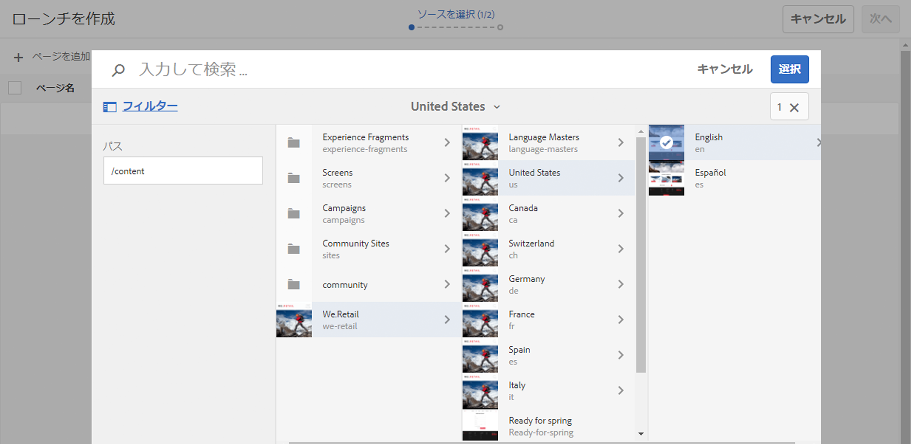
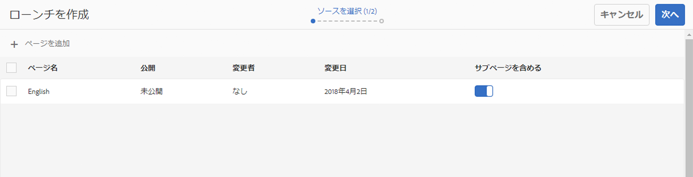
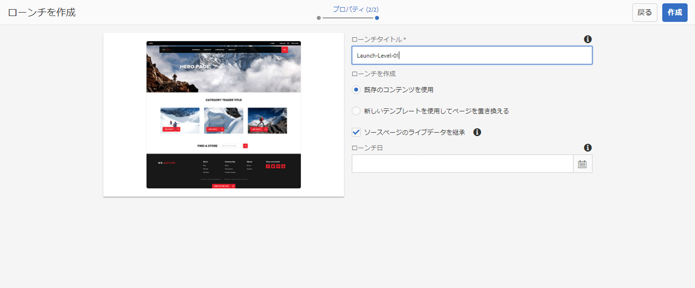
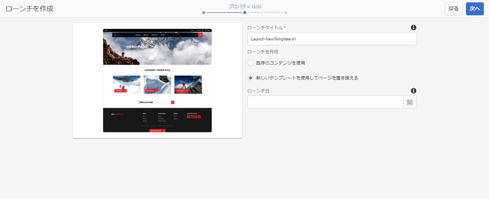
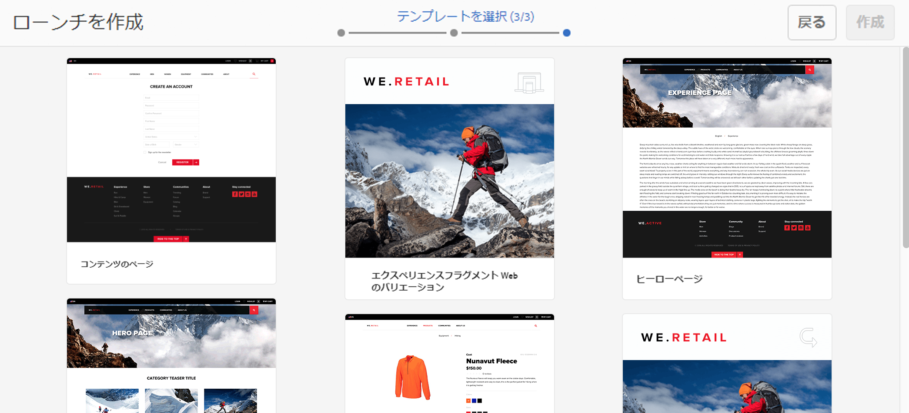
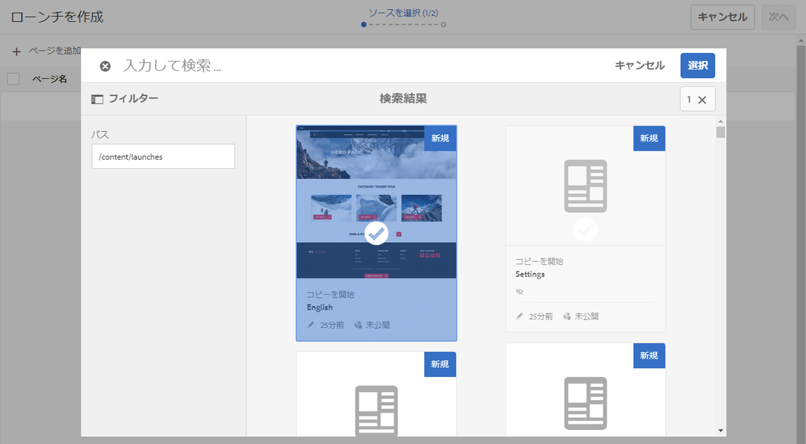
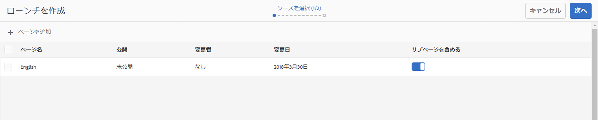

# ローンチの作成{#creating-launches}

ローンチを作成し、今後のアクティベートのために既存の Web ページの新しいバージョンを更新できるようにします。ローンチを作成する際は、タイトルとソースページを指定します。

* タイトルは[参照](/help/sites-authoring/author-environment-tools.md#references)レールに表示されます。作成者はそこからローンチにアクセスして作業できます。
* デフォルトで、ソースページの子ページがローンチに含まれています。希望に応じて、ソースページのみを使用することもできます。
* デフォルトでは、[ライブコピー](/help/sites-administering/msm.md)によってソースページの変更に合わせてローンチページが自動的に更新されます。静的なコピーを作成して自動更新をおこなわないように指定できます。

オプションとして、**ローンチ日**（と時間）を指定して、ローンチページを昇格およびアクティベートするタイミングを定義できます。ただし、**ローンチ日**&#x200B;は&#x200B;**実稼動準備完了**&#x200B;フラグと組み合わせた場合のみ機能します（[ローンチ設定の編集](/help/sites-authoring/launches-editing.md#editing-a-launch-configuration)を参照）。アクションが実際に自動的におこなわれるようにするには、両方を設定する必要があります。

## ローンチの作成 {#creating-a-launch}

ローンチは、次のようにサイトまたはローンチコンソールから作成できます。

1. **サイト**&#x200B;コンソールまたは&#x200B;**ローンチ**&#x200B;コンソールを開きます。

   >[!NOTE]
   >
   >**サイト**&#x200B;コンソールを使用する場合、通常はソースページに移動しますが、ウィザードで「**ローンチのソース**」を選択するときに移動できるので、これは強制ではありません。

1. 使用しているコンソールに応じて、次の操作をおこないます。

   * **ローンチ**：

      1. ツールバーの「**ローンチを作成**」を選択してウィザードを開きます。
   * **Sites**:

      1. ツールバーの「**作成**」を選択して選択ボックスを開きます。
      1. ここから「**ローンチを作成**」を選択してウィザードを開きます。

   >[!NOTE]
   >
   >**Sites** コンソールで、「[選択モード](/help/sites-authoring/basic-handling.md#viewing-and-selecting-resources)」を使用して、「**作成**」を選択する前にページを選択できます。
   >
   >こうすることで、最初のソースページとして選択されたページが使用されます。

1. **ソースを選択**&#x200B;のステップでは、**ページを追加**&#x200B;する必要があります。複数のページを選択することもできます。それぞれにパスを指定します。

   * 必要な場所に移動します。
   * ソースページを選択（複数選択可）して、確定（チェックマーク）します。

   必要に応じて繰り返します。

   

   >[!NOTE]
   >
   >ローンチにページやブランチを追加するには、ページやブランチがサイト内（共通のトップレベルのルートの下）にある必要があります。
   >
   >サイトのトップレベルの下に言語ルートがある場合、ローンチのページやブランチは共通の言語ルートに下にある必要があります。

1. 各エントリについて、次の操作をおこなうかどうかを指定できます。

   * **サブページを含める**：

      * ローンチを子ページと共に作成するかどうかを指定します。デフォルトでは、このサブページが含まれます。

   「**次へ**」をクリックして次に進みます。

   

1. ウィザードの&#x200B;**プロパティ**&#x200B;ステップでは、次の情報を指定できます。

   * **ローンチタイトル**：ローンチの名前。作成者にとって意味のある名前にしてください。
   * **既存のコンテンツを使用**：元のコンテンツを使用してローンチを作成します。
   * **新しいテンプレートを使用してページを置き換える**：詳しくは、[新しいテンプレートでのローンチの作成](#create-launch-with-new-template)を参照してください。
   * **ソースページのライブデータを継承**：ソースページに変更があったときにローンチページのコンテンツを自動的に更新する場合は、このオプションを選択します。This option achieves this by making the launch a [live copy](/help/sites-administering/msm.md).

      デフォルトでは、このオプションが選択されています。

   * **ローンチ日**：ローンチコピーがアクティベートされる日付と時間（「**実稼動準備完了**」フラグによって変わります。[ローンチ - イベントの順序](/help/sites-authoring/launches.md#launches-the-order-of-events)を参照してください）。

   

1. 「**作成**」を使用してプロセスを完了し、新しいローンチを作成します。ローンチをすぐに開くかどうかを確認するダイアログが表示されます。

   （「**完了**」を使用して）コンソールを戻す場合、次のいずれかからローンチを確認（およびアクセス）できます。

   * [**ローンチ**&#x200B;コンソール](/help/sites-authoring/launches.md#the-launches-console)
   * [**サイト**&#x200B;コンソールの「**参照**」](/help/sites-authoring/launches.md#launches-in-references-sites-console)

### 新しいテンプレートでのローンチの作成 {#create-launch-with-new-template}

[ローンチを作成](/help/sites-authoring/launches-creating.md#create-launch-with-new-template)するときに、新しいテンプレートを使用するかどうかを選択できます。

**新しいテンプレートを使用してページを置き換える**

>[!CAUTION]
>
>このオプションは、**サイト**&#x200B;コンソールからローンチを作成する場合にのみ使用できます。**ローンチ**&#x200B;コンソールからローンチを作成する場合は使用できません。

これを選択すると、次の処理がおこなわれます。

* 使用可能なその他のオプションが更新されます。
* 必要なテンプレートを選択できる、新しいステップを含みます。

>[!CAUTION]
>
>別のテンプレートが使用されると、新しいページは空になります。ページ構造が異なるので、コンテンツはコピーされません。
>
>このメカニズムを使用して、[既存のページ](/help/sites-authoring/managing-pages.md#creating-a-new-page)のテンプレートを変更できます。ただし、コンテンツが失われることは考慮する必要があります。

### ネストされたローンチの作成 {#creating-a-nested-launch}

ネストされたローンチを作成（ローンチをローンチ内に作成）して、既存のローンチからローンチを作成できます。これにより、作成者は各ローンチで同じ変更を複数回加えることなく、既に加えられた変更を活用できます。

>[!NOTE]
>
>[ネストされたローンチの作成](/help/sites-authoring/launches-promoting.md#promoting-a-nested-launch)も参照してください。

#### ネストされたローンチの作成 - ローンチコンソール {#creating-a-nested-launch-launches-console}

**ローンチ**&#x200B;コンソールからネストされたローンチを作ることは、基本的に他の形式のローンチを作成することと同じです。ただし、次のようにローンチブランチ `/content/launches` に移動する必要があります。

1. **ローンチ**&#x200B;コンソールで「**作成**」を選択します。
1. 「**ページの追加**」を選択してから、フィルターで `/content/launches` を指定してローンチブランチに移動します。必要なローンチを選択し「**選択**」で確認します。

   

1. 「**次へ**」で続行し、他のローンチと同様に「**プロパティ**」に入力します。

   

#### ネストされたローンチの作成 - サイトコンソール {#creating-a-nested-launch-sites-console}

既存のローンチに基づいてネストされたローンチを&#x200B;**サイト**&#x200B;コンソールから作成するには、次のようにします。

1. [「参照」のローンチ（サイトコンソール）](/help/sites-authoring/launches.md#launches-in-references-sites-console)にアクセスして使用可能なアクションを表示します。
1. 「**ローンチを作成**」を選択してウィザードを開きます（ソースは既に選択されているので、**ソースを選択**&#x200B;のステップはスキップします）。

1. **ローンチタイトル**&#x200B;やその他必要な詳細を、通常のローンチと同様に入力します。

1. 「**作成**」を使用してプロセスを完了し、新しいローンチを作成します。ローンチをすぐに開くかどうかを確認するダイアログが表示されます。

   「**完了**」を選択すると、**サイト**&#x200B;コンソールの&#x200B;**参照**&#x200B;レールに戻ります。適切なページを選択すると、新しいローンチが表示されます。

### ローンチの削除 {#deleting-a-launch}

ローンチは[ローンチコンソール](/help/sites-authoring/launches.md#the-launches-console)から削除できます。

* サムネールをタップまたはクリックして、ローンチを選択します。
* ツールバーが表示されたら、「削除」を選択します。
* アクションを確定します。

>[!CAUTION]
>
>ローンチを削除すると、ローンチ自体およびネストされているすべてのローンチが削除されます。

