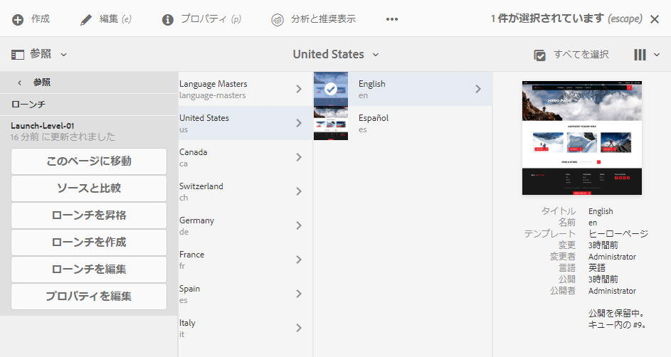
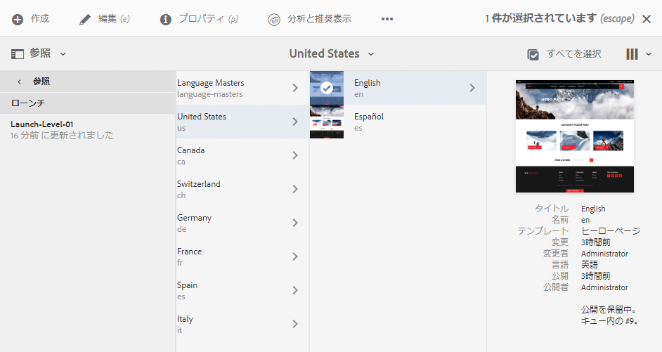

# ローンチの編集{#editing-launches}

## ローンチページの編集 {#editing-launch-pages}

ページ（またはページのセット）にローンチが作成されている場合、ページのローンチコピーのコンテンツを編集できます。

1. [「参照」のローンチ（サイトコンソール）](/help/sites-authoring/launches.md#launches-in-references-sites-console)にアクセスして使用可能なアクションを表示します。
1. 「**このページに移動**」を選択して編集するページを開きます。

### ライブコピーへのローンチページサブジェクトを編集 {#editing-launch-pages-subject-to-a-live-copy}

ローンチが[ライブコピー](/help/sites-administering/msm.md)に基づく場合は、次のようになります。

* コンポーネント（コンテンツやプロパティ）を編集するときにロック記号（小さな鍵アイコン）が表示されます。
* 「**ライブコピー**」タブが&#x200B;**ページのプロパティ**&#x200B;に表示されます。

ライブコピーは、コンテンツをソースブランチ&#x200B;*から*&#x200B;ローンチブランチ&#x200B;*に*&#x200B;同期するために使用します（ローンチを、ソースに加えられた変更を含む最新の状態に保ちます）。

標準のライブコピーを編集するのと同じ方法で変更することができます。例えば次のようにします。

* 閉じられた鍵アイコンをクリックするとこの同期が解除され、ローンチのコンテンツを新たに更新できるようになります。一度ロックを解除する（鍵アイコンを開く）と、ソースブランチ内の同じ場所に対して加えられた変更により、ユーザーが加えた変更が上書きされることがなくなります。
* 特定のページの継承を&#x200B;**一時停止**（および&#x200B;**再開**）します。

詳しくは、「[ライブコピーのコンテンツの変更](/help/sites-administering/msm-livecopy.md#changing-live-copy-content)」を参照してください。

## ローンチページとそのソースページの比較 {#comparing-a-launch-page-to-its-source-page}

おこなった変更を追跡するために、ローンチを&#x200B;**参照**&#x200B;で表示して、ローンチページをそのソースページと比較することができます。

1. **サイト**&#x200B;コンソールで、[ローンチのソースページに移動してそれを選択します](/help/sites-authoring/basic-handling.md#viewingandselectingyourresources)。
1. **[参照](/help/sites-authoring/basic-handling.md#references)**&#x200B;パネルを開いて、「**ローンチ**」を選択します。
1. 特定のローンチを選択してから、次のように&#x200B;**ソースと比較します**。

   

1. 2 つのページ（ローンチページとソースページ）が左右に並んで開きます。

   この機能の使用方法について詳しくは、[ページの差分](/help/sites-authoring/page-diff.md)を参照してください。

## 使用するソースページの変更 {#changing-the-source-pages-used}

ローンチのソースページの範囲に対して、任意のタイミングでページを追加または削除できます。

1. 次のいずれかの方法を使用して、ローンチにアクセスして選択します。

   * [ローンチコンソール](/help/sites-authoring/launches.md#the-launches-console)：

      * 「**編集**」を選択します。
   * [「参照」（サイトコンソール）](/help/sites-authoring/launches.md#launches-in-references-sites-console)：使用可能なアクションを表示します。

      * 「**ローンチを編集**」を選択します。

   ソースページが表示されます。

1. 必要な変更を加え、「**保存**」で確定します。

   >[!NOTE]
   >
   >ローンチにページを追加するには、ページが共通の言語ルートの下（単一のサイト内）にある必要があります。

## ローンチの設定の編集 {#editing-a-launch-configuration}

ローンチのプロパティは、任意のタイミングで編集できます。

1. 次のいずれかの方法を使用して、ローンチにアクセスして選択します。

   * [ローンチコンソール](/help/sites-authoring/launches.md#the-launches-console)：

      * 「**プロパティ**」を選択します。
   * [「参照」（サイトコンソール）](/help/sites-authoring/launches.md#launches-in-references-sites-console)：使用可能なアクションを表示します。

      * 「**プロパティを編集**」を選択します。

   詳細が表示されます。

1. 必要な変更を加え、「**保存**」で確定します。

   「**ローンチ日**」フィールドと「**実稼動準備完了**」フィールドの目的とインタラクションについて詳しくは、[ローンチ - イベントの順序](/help/sites-authoring/launches.md#launches-the-order-of-events)を参照してください。

## ページのローンチステータスの確認 {#discovering-the-launch-status-of-a-page}

「参照」タブから特定のローンチを選択すると、ステータスが表示されます（[「参照」のローンチ（サイトコンソール）](/help/sites-authoring/launches.md#launches-in-references-sites-console)を参照）。

