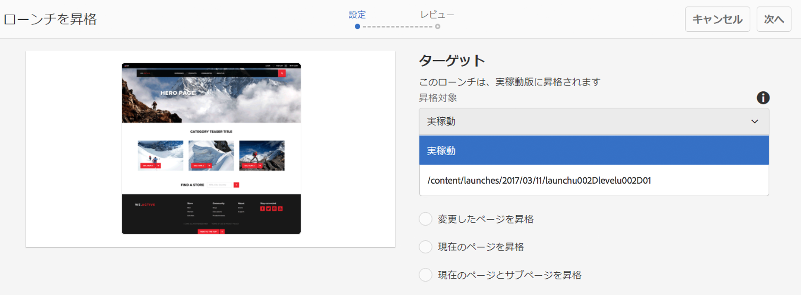

# ローンチの昇格{#promoting-launches}

公開する前に、ローンチページを昇格して、コンテンツをソース（実稼動）に戻す必要があります。 ローンチページが昇格されると、ソースページの対応するページが、昇格されたページのコンテンツに置き換えられます。 ローンチページを昇格させるときには、次のオプションを使用できます。

* 現在のページのみを昇格させるか、ローンチ全体を昇格させるかを指定します。
* 現在のページの子ページを昇格させるかどうか。
* すべてのローンチを昇格させるか、変更されたページのみを昇格させるか。
* 昇格後にローンチを削除するかどうか。

>[!NOTE]
>
>ローンチページをターゲットに昇格 (**実稼動**) を有効にすると、 **実稼動** ページをエンティティとして（処理を迅速にするために）追加します。 ページをワークフローパッケージに追加し、ページのパッケージをアクティベートするワークフローのペイロードとして使用します。 ローンチを昇格する前に、ワークフローパッケージを作成する必要があります。 詳しくは、 [AEM Workflow を使用した昇格済みページの処理](#processing-promoted-pages-using-aem-workflow).

>[!CAUTION]
>
>1 つのローンチを同時に昇格することはできません。 つまり、同じローンチで 2 つの昇格アクションを同時に実行すると、「`Launch could not be promoted`」というエラー（と共にログに競合エラー）が発生することがあります。

>[!CAUTION]
>
>*変更した*&#x200B;ページのローンチを昇格させる場合は、ソースブランチとローンチブランチの両方での変更が考慮されます。

## ローンチページの昇格 {#promoting-launch-pages}

>[!NOTE]
>
>ここでは、1 つのローンチレベルのみの場合に、ローンチページを昇格させる手動のアクションについて説明します。 次のページを参照してください。
>
>* [ネストされたローンチの昇格](#promoting-a-nested-launch) 構造に複数のローンチがある場合。
>* [ローンチ — イベントの順序](/help/sites-authoring/launches.md#launches-the-order-of-events) 」を参照してください。
>

ローンチは、 **サイト** コンソールまたは **起動回数** コンソール：

1. 次を開きます。

   * の **サイト** コンソール：

      1. [参照レール](/help/sites-authoring/author-environment-tools.md#showingpagereferences)を開き、[選択モード](/help/sites-authoring/basic-handling.md)を使用して必要なソースページを選択します（または参照レールを選択して開きます。順序はどちらでもかまいません）。すべての参照が表示されます。

      1. 選択 **起動回数** ( 例：ローンチ (1)) を使用して、特定のローンチのリストを表示します。
      1. 特定のローンチを選択して、使用可能なアクションを表示します。
      1. 「**ローンチを昇格**」を選択してウィザードを開きます。
   * **ローンチ**&#x200B;コンソール:

      1. 対象のローンチを選択（サムネールをタップまたはクリック）します。
      1. 選択 **昇格**.

1. 最初の手順では、次を指定できます。

   * **ターゲット**

      * **昇格後にローンチを削除**
   * **対象範囲**

      * **すべてのローンチを昇格**
      * **変更したページを昇格**
      * **現在のページを昇格**
      * **現在のページとサブページを昇格**

   例えば、変更したページのみを昇格させるには、次のように選択します。

   

   >[!NOTE]
   >
   >ここでは、1 つのローンチについて説明します。ネストされたローンチがある場合は、 [ネストされたローンチの昇格](#promoting-a-nested-launch).

1. 選択 **次へ** をクリックして続行します。
1. 昇格させるページを確認できます。これは、選択したページの範囲によって変わります。

   

1. 選択 **昇格**.

## 編集時のローンチページの昇格 {#promoting-launch-pages-when-editing}

ローンチページの編集中、**ローンチを昇格**&#x200B;アクションは「**ページ情報**」からも実行できます。これによりウィザードが開き、必要な情報が収集されます。

>[!NOTE]
>
>これは、とで 1 つで使用できます。 [ネストされたローンチ](#promoting-a-nested-launch).

## ネストされたローンチの昇格 {#promoting-a-nested-launch}

ネストされたローンチを作成後、任意のソース（ルートソース（実稼動）を含む）に戻して昇格させることができます。

1. [ネストされたローンチを作成](#creatinganestedlaunchlaunchwithinalaunch)するときと同様に、**ローンチ**&#x200B;コンソールまたは&#x200B;**参照**&#x200B;レールのいずれかで必要なローンチに移動して選択します。
1. 「**ローンチを昇格**」を選択してウィザードを開きます。

1. 次の必要な詳細を入力します。

   * **ターゲット**

      * **昇格対象**
任意のソースに昇格させることができます。

      * **昇格後にローンチを削除**
昇格後に、選択したローンチと、その中にネストされているすべてのローンチが削除されます。
   * **範囲**
ここでは、すべてのローンチを昇格させるか、実際に編集したページのみを昇格させるかを選択できます。後者の場合は、サブページを含めるか除外するかを選択できます。 デフォルトの設定では、現在のページのページ変更のみを昇格します。

      * **すべてのローンチを昇格**
      * **変更したページを昇格**
      * **現在のページを昇格**
      * **現在のページとサブページを昇格**

   

1. 「**次へ**」を選択します。
1. 「**昇格**」を選択する前に、次の昇格の詳細を確認します。

   

   >[!NOTE]
   >
   >リストされるページは、 **範囲** 定義済みで、場合によっては実際に編集されたページも含まれます。

1. 変更が昇格され、 **起動回数** コンソール：

   

## AEM ワークフローを使用した昇格済みページの処理 {#processing-promoted-pages-using-aem-workflow}

ワークフローモデルを使用して、昇格済みローンチページの一括処理を実行します。

1. ワークフローパッケージを作成します。
1. 作成者がローンチページを昇格すると、ローンチはワークフローパッケージに保存されます。
1. パッケージをペイロードとして使用し、ワークフローモデルを開始します。

ページが昇格されたときにワークフローを自動的に開始するには [ワークフローランチャーの設定](/help/sites-administering/workflows-starting.md#workflows-launchers) パッケージノード用。

例えば、作成者がローンチページを昇格したときに、ページアクティベーションリクエストを自動的に生成できます。 パッケージノードが変更されたときにリクエストアクティベーションワークフローを開始するように、ワークフローランチャーを設定します。

