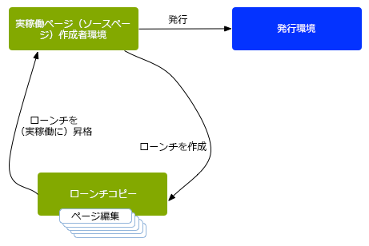
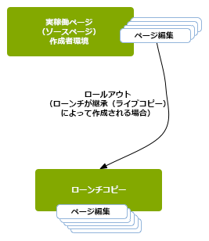
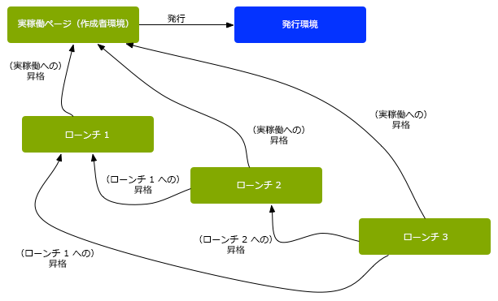
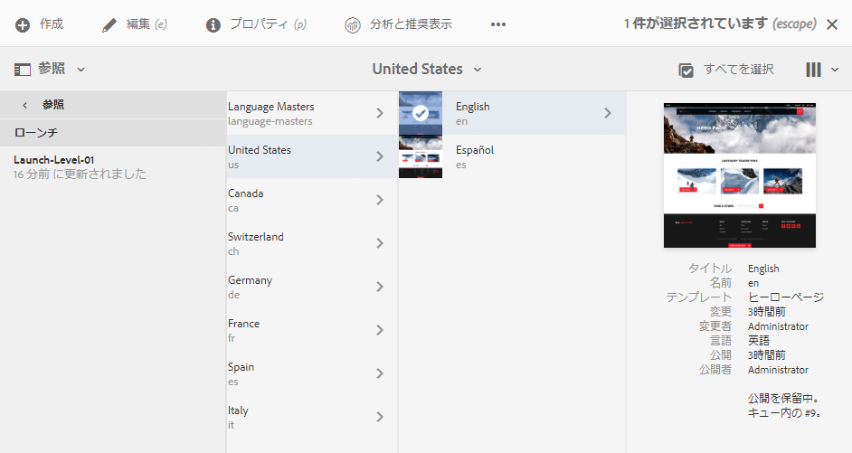
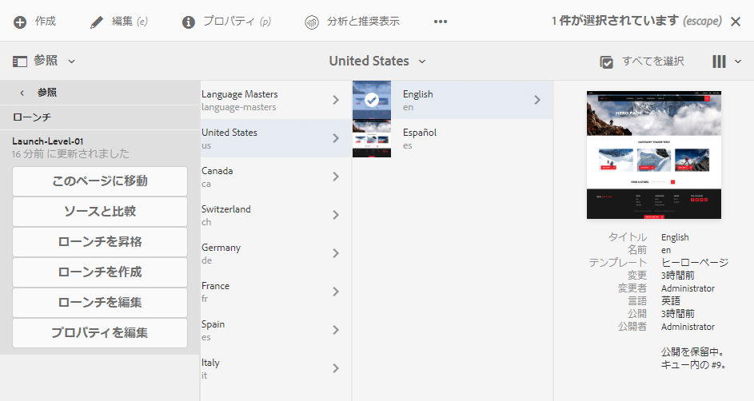

# ローンチ {#launches}

ローンチを使用すると、将来のリリース用にコンテンツを効率的に開発できます。

ローンチが作成され、（現在のページを維持しながら）将来のパブリッシュに合わせて変更を加えることができます。 ローンチページを編集および更新した後、それらを元のソースに昇格させ、ソースページ（トップレベル）をアクティベートします。 昇格により、ローンチコンテンツを複製してソースページに戻します。これは、手動または自動で行うことができます（ローンチを作成および編集するときに設定されるフィールドに依存します）。

例えば、オンラインストアの季節商品ページは、季節に合わせて四半期ごとに更新されます。 次の四半期の更新に備えて、適切な Web ページのローンチを作成できます。 四半期を通じて、次の変更がローンチコピーに蓄積されます。

* ソースページに対して、通常の管理タスクの結果として行われた変更。これらの変更は、ローンチページに自動的に複製されます。
* 次の四半期に備えて、ローンチページで直接行われた編集。

次の四半期が始まるとき、ローンチページを昇格させて（更新されたコンテンツを保持している）ソースページを公開できます。すべてのページを昇格させるか、変更したページのみを昇格させることができます。

ローンチには、次のものもあります。

* 複数のルートブランチ用に作成されました。 サイト全体のローンチを作成し（そこで変更を行う）ことはできますが、サイト全体をコピーする必要があるので、これは実用的ではありません。 数百ページまたは数千ページに及ぶページが含まれる場合、コピー操作と後でプロモーションタスクに必要な比較の両方によって、システム要件とパフォーマンスが影響を受けます。
* ネストされた（ローンチ内のローンチ）。既存のローンチからローンチを作成して、作成者が各ローンチに同じ変更を複数回加える必要なく、既に加えられた変更を活用できるようにします。

この節では、（必要に応じて）を作成、編集、昇格する方法について説明します [削除](/help/sites-authoring/launches-creating.md#deleting-a-launch)) サイトコンソール内からページを起動するか、 [ローンチコンソール](#the-launches-console):

* [ローンチの作成](/help/sites-authoring/launches-creating.md)
* [ローンチの編集](/help/sites-authoring/launches-editing.md)
* [ローンチの昇格](/help/sites-authoring/launches-promoting.md)

## ローンチ - イベントの順序 {#launches-the-order-of-events}

ローンチを使用すると、アクティベートされた 1 つ以上の Web ページの将来のリリース用にコンテンツを効率的に開発できます。

ローンチでは、次のことが可能です。

* ソースページのコピーを作成できます。

   * コピーがローンチになります。
   * トップレベルのソースページは、「**実稼働**」と呼ばれます。

      * ソースページは、複数の（別々の）ブランチから取得できます。

   

* ローンチの設定を編集できます。

   * ローンチに対して、ページやブランチを追加または削除します。
   * 「**タイトル**」、「**ローンチ日**」、「**実稼動準備完了**」フラグなどのローンチプロパティを編集します。

* コンテンツは、手動または自動で昇格および公開できます。

   * 手動:

      * ローンチのコンテンツを **ターゲット** （ソースページ）を作成します。
      * （戻るページを昇格した後に）ソースページからコンテンツを公開します。
      * すべてのページ、または変更したページのみを昇格させます。
   * 自動 - これには次の要素が関与します。

      * 「**ローンチ日**（**ライブ日付**）」**フィールド**：ローンチを作成または編集するときに設定できます。

      * この **実稼動準備完了** フラグ：これは、ローンチの編集時にのみ設定できます。
      * 「**実稼動準備完了**」フラグが設定されると、ローンチは指定の「**ローンチ** **日**（**ライブ日付**）」に実稼動ページに自動的に昇格されます。昇格後、実稼働ページは自動的に公開されます。\
         日付が設定されていない場合、フラグの効果はありません。

* ソースの更新とページのローンチを並行して行うことができます。

   * ソースページに対する変更は、ローンチコピーに自動的に反映されます（ライブコピーなど、継承するように設定されている場合）。
   * ローンチコピーに対する変更は、ソースコピーの自動更新を中断することなく行うことができます。

   

* [ネストされたローンチの作成](/help/sites-authoring/launches-creating.md#creating-a-nested-launch)  — ローンチ内のローンチ：

   * ソースは既存のローンチです。
   * 以下が可能です。 [ネストされたローンチを昇格](/help/sites-authoring/launches-promoting.md#promoting-a-nested-launch) 任意のターゲットに対して親ローンチまたはトップレベルのソースページ（実稼動）を指定できます。

   

   >[!CAUTION]
   >
   >ローンチを削除すると、ローンチ自体およびネストされているすべてのローンチが削除されます。

>[!NOTE]
>
>ローンチを作成および編集するには、デフォルトグループ `content-authors` と同様に、`/content/launches` へのアクセス権限が必要です。
>
>問題が発生している場合は、システム管理者にお問い合わせください。

>[!CAUTION]
>
>ローンチページでのコンポーネントの並べ替えはサポートされていません。
>
>ページが昇格されると、コンテンツの変更は反映されますが、コンポーネントの位置は変更されません。

### ローンチコンソール {#the-launches-console}

ローンチコンソールを使用すると、ローンチの概要を確認し、リストされたローンチに対してアクションを実行できます。コンソールは次の方法でアクセスできます。

* **ツール**&#x200B;コンソールで、**ツール**／**サイト**／**ローンチ**&#x200B;と選択します。

* または、[ に直接アクセスします。https://localhost:4502/libs/launches/content/launches.html](https://localhost:4502/libs/launches/content/launches.html)

## 「参照」のローンチ（サイトコンソール） {#launches-in-references-sites-console}

1. 内 **サイト** コンソールで、ローンチのソースに移動します。
1. を開きます。 **参照** をパネルして、ソースページを選択します。
1. 選択 **起動回数**&#x200B;に設定すると、既存のローンチがリストに表示されます。

   

1. 適切なローンチをタップまたはクリックすると、使用可能なアクションのリストが表示されます。

   
