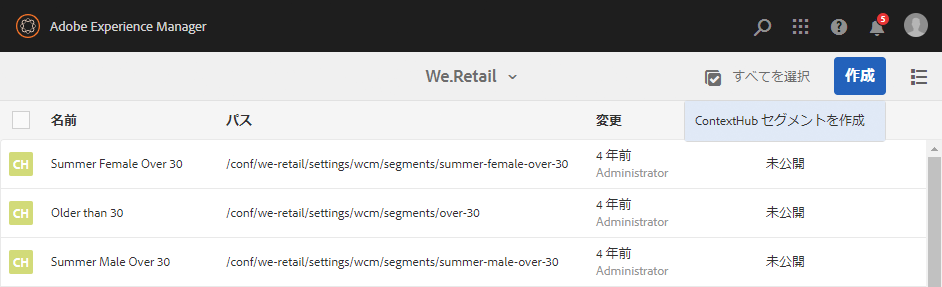
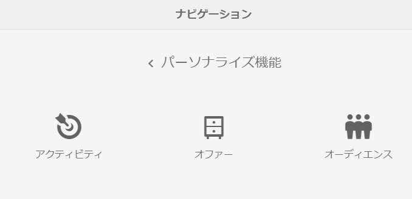
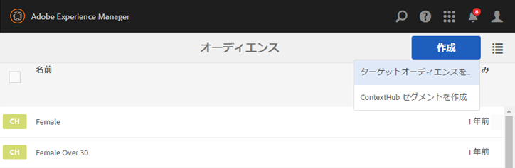

# オーディエンスの管理{#managing-audiences}

オーディエンスコンソールを使用して、Adobe Target アカウント用のオーディエンスを作成、整理および管理したり、ContextHub または ClientContext 用のセグメントを管理したりできます。次のことができます。

* オーディエンス（Adobe Target オーディエンスまたは ContextHub セグメント）の追加
* オーディエンスの管理

An Audience, called *segment* in ContextHub and Client Context, is a class of visitors defined by specific criteria, which then determines who sees a targeted activity. アクティビティにターゲットを設定すると、ターゲット設定プロセスで直接オーディエンスを選択したり、オーディエンスコンソールで新しいオーディエンスを作成したりできます。

オーディエンスコンソールでは、オーディエンスはブランド別に整理されます。

Audiences are available in Targeting mode for [authoring targeted content](/help/sites-authoring/content-targeting-touch.md), where you can also create audiences (but you need to create Adobe Target audiences in the Audiences console). ターゲット設定モードで作成したオーディエンスは、オーディエンスコンソールに表示されます。

オーディエンスは、定義されているオーディエンスの種類を示すラベルと共に表示されます。

* CH - ContextHub セグメント
* CC - ClientContext セグメント
* AT - Adobe Target オーディエンス

## オーディエンスコンソールでの ContextHub セグメントの作成 {#creating-a-contexthub-segment-in-the-audiences-console}

ContextHub セグメントは、オーディエンスコンソールまたはターゲット設定プロセスで作成できます。

オーディエンスコンソールで ContextHub セグメントを作成するには：

1. ナビゲーションコンソールで、「**パーソナライズ機能**」をクリックまたはタップします。Click or tap **Audiences**.
1. 「**ContextHub セグメントを作成**」をタップまたはクリックします。

   

1. **新しい ContextHub セグメント**&#x200B;ダイアログボックスで、タイトルを入力し、ブーストを調整して、「**作成**」をクリックします。新しいContextHubセグメントがオーディエンスリストに表示されます。

   >[!NOTE]
   >
   >You can sort the modified list by tapping or clicking **Modified** to sort by descending order to see any newly created audiences.

ContextHub を使用するセグメント作成の詳細については、「[ContextHub によるセグメンテーション設定](/help/sites-administering/segmentation.md)」ドキュメントを参照してください。

## オーディエンスコンソールを使用した Adobe Target オーディエンスの作成 {#creating-an-adobe-target-audience-using-the-audience-console}

オーディエンスコンソールを使用して、AEM で直接 Adobe Target オーディエンスを作成できます。

オーディエンスは、誰がターゲットアクティビティに含まれるかを決定するルールによって定義されます。オーディエンス定義には複数のルールを含めることができ、各ルールには複数のパラメーターを含めることができます。

複数のルールを指定した場合は、ルールがブール演算式 AND で結合されます。つまり、定義済みの条件をすべて満たす場合にのみ、潜在的なオーディエンスメンバーがアクティビティに含められます。例えば、AND を使用して OS ルールとブラウザールールを定義すると、定義された OS と定義されたブラウザーの両方を使用している訪問者のみ、アクティビティに含められます。

>[!NOTE]
>
>If you do not see **Create Target Audience **in the **Create** menu, you do not have the necessary permissions to create an audience. You need write permissions under **/etc/segmentation** to be able to create audiences. グループのcontent-authorsには、デフォルトで書き込み権限があります。

Adobe Target オーディエンスを作成するには：

1. ナビゲーションコンソールで、「**パーソナライズ機能**」をクリックまたはタップします。Click or tap **Audiences**.

   

1. In the Audiences console, tap or click **Create** and then** Create Target Audience**.

   

1. **Adobe Target 設定**&#x200B;ダイアログボックスで、Target 設定を選択し、「**OK**」をタップまたはクリックします。
1. ルール #1 領域で、属性タイプをタップまたはクリックし、表示されるフィールドに属性情報を入力します。終了したら、属性の右側のチェックマークを選択して保存します。使用可能な属性については、[属性とそのオプション](#attributes-and-their-options)を参照してください。
1. 「**ルールを追加**」をクリックして、別のルールを追加します。必要な数だけルールを入力します。複数のルールを指定した場合は、ルールがブール演算子 AND で結合されます。これは、各ルールの要件をすべて満たすオーディエンスだけが、そのアクティビティの対象になるということです。
1. 「**次へ**」をタップまたはクリックします。
1. オーディエンス名を入力し、「**保存**」をタップまたはクリックします。
1. 「**保存**」をタップまたはクリックします。オーディエンスが「オーディエンス」リストに表示されます。

### 属性とそのオプション {#attributes-and-their-options}

以下の属性ごとに、ターゲット設定ルールを作成できます。

| **属性** | **説明** | **その他の情報** |
|---|---|---|
| **モバイル** | モバイルデバイス、デバイスの種類、デバイスのベンダー、画面の寸法（ピクセル単位）などのパラメーターに基づく Target モバイルデバイスです。 | Adobe Target で[モバイルに関するドキュメント](https://marketing.adobe.com/resources/help/en_US/target/target/c_mobile.html)を参照してください。 |
| **カスタム** | カスタムパラメーターはmboxパラメーターです。 mbox に対して mbox パラメーターを渡した場合、または targetPageParams 関数を使用した場合、それらのパラメーターはここに表示され、オーディエンスで使用できます。 | Adobe Target で[カスタムパラメーターに関するドキュメント](https://marketing.adobe.com/resources/help/en_US/target/target/c_custom_parameters.html)を参照してください。 |
| **OS** | 特定のオペレーティングシステムを使用している訪問者をターゲットに設定することができます。 | Linux、Macintosh または Windows を使用している Target ユーザーです。 |
| **サイトページ** | 指定したページを閲覧している、または指定した mbox パラメーターが設定されている訪問者をターゲットにします。 | See [Site Pages documentation](https://marketing.adobe.com/resources/help/en_US/target/target/c_site_pages.html) at Adobe Target. |
| **ブラウザー** | ページの訪問時に特定のブラウザーまたは特定のブラウザーオプションを使用しているユーザーをターゲットに設定することができます。 | See [Browser options documentation](https://marketing.adobe.com/resources/help/en_US/target/target/c_browser_options.html)at Adobe Target. |
| **訪問者プロファイル** | 特定のプロファイルパラメーターに一致する訪問者をターゲット設定します。 | See [Visitor Profile documentation](https://marketing.adobe.com/resources/help/en_US/target/target/c_visitor_profile.html) at Adobe Target. |
| **トラフィックソース** | サイトに導いた検索エンジンやランディングページに基づいて訪問者をターゲット設定します。 | See [Traffic Sources documentation](https://marketing.adobe.com/resources/help/en_US/target/target/c_traffic_sources.html) at Adobe Target. |

## オーディエンスコンソールでのオーディエンスの変更 {#modifying-an-audience-in-the-audiences-console}

>[!NOTE]
>
>編集している AEM インスタンスと同じ AEM インスタンスで作成された Adobe Target オーディエンスのみ編集できます。異なる AEM 環境で作成された Target オーディエンスは編集できません。

ContextHub オーディエンスまたは ClientContext オーディエンスは、オーディエンスコンソールから編集できます。次のように Adobe Target オーディエンスも編集できますが、AEM で作成された Adobe Target オーディエンスのみです。

1. ナビゲーションコンソールで、「**パーソナライズ機能**」をクリックまたはタップします。Click or tap **Audiences**.
1. 編集する ContextHub セグメントまたは ClientContext セグメントの横のアイコンをタップまたはクリックして、「**編集**」をタップまたはクリックします。
1. セグメントエディターで編集をおこないます。[ClientContext](/help/sites-administering/campaign-segmentation.md) または [ContextHub](/help/sites-administering/contexthub-config.md) に関するドキュメントを参照してください。
