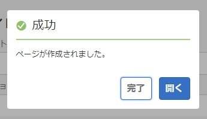

# ページの作成と整理{#creating-and-organizing-pages}

このセクションでは、Adobe Experience Manager（AEM）でページを作成および管理しそれらのページ上で[コンテンツを作成](/help/sites-authoring/editing-content.md)する方法について説明します。

>[!NOTE]
>
>[適切なアクセス権](/help/sites-administering/security.md)と、ページに対するアクション（作成、コピー、移動、編集、削除など）を実行するための[権限](/help/sites-administering/security.md#permissions)を持つアカウントが必要です。
>
>問題が発生した場合は、システム管理者にお問い合わせください。

>[!NOTE]
>
>Web サイトコンソールから使用できる[キーボードショートカット](/help/sites-authoring/keyboard-shortcuts.md)が多数あり、ページをより効率的に整理できます。

## Web サイトの整理 {#organizing-your-website}

作成者は、AEM 内で Web サイトを構成する必要があります。この作業中に、次の目的でコンテンツページを作成して名前を付けます。

* 作成者がオーサー環境でコンテンツページを容易に検索できるようにする
* サイトへの訪問者がパブリッシュ環境でコンテンツページを容易に閲覧できるようにする

コンテンツの整理に役立つ[フォルダー](#creating-a-new-folder)を使用することもできます。

Web サイトの構造は、コンテンツページを保持する「ツリー構造」と見なすことができます。これらのコンテンツページの名前は、URL の形成に使用されます。一方でタイトルは、ページコンテンツを表示したときに表示されます。

The following shows an example from the We.Retail site, where a hiking shorts page ( `desert-sky-shorts`) is accessed:

* 作成者環境
   `https://localhost:4502/editor.html/content/we-retail/us/en/products/equipment/hiking/desert-sky-shorts.html`

* 発行環境
   `https://localhost:4503/content/we-retail/us/en/products/equipment/hiking/desert-sky-shorts.html`

Depending on the configuration of your instance, use of `/content` might be optional on the publish environment.

```xml
 /content
 /we-retail
  /us
   /en
    /products
     /equipment
      /hiking
       /desert-sky-shorts
       /hiking-poles
       /...
      /running...
      /surfing...
      /...
     /seasonal...
     /...
    /about-us
    /experience
    /...
   /es...
  /de...
  /fr...
  /...
 /...
```

この構造は&#x200B;**サイト**&#x200B;コンソールから表示でき、[Web サイトのページ間を移動したり](/help/sites-authoring/basic-handling.md#navigating)、ページ上でアクションを実行したりできます。新しいサイトや[新しいページ](#creating-a-new-page)を作成することもできます。

どの地点からでも、ヘッダーバーのパンくず（経路表示）から上位のブランチを確認できます。


### ページ命名規則 {#page-naming-conventions}

新しいページを作成する際の主要なフィールドは 2 つあります。

* **[タイトル](#title)**：

   * これはコンソール内のユーザーに、編集中のページコンテンツの上部に表示されます。
   * このフィールドは必須です。

* **[名前](#name)**：

   * これは URI の生成に使用されます。
   * このフィールドへの入力はオプションです。指定しない場合、名前はタイトルから派生します。詳しくは、次の節、[ページ名の制限事項とベストプラクティス](/help/sites-authoring/managing-pages.md#page-name-restrictions-and-best-practices)を参照してください。

#### ページ名の制限事項とベストプラクティス {#page-name-restrictions-and-best-practices}

ページの&#x200B;**タイトル**&#x200B;と&#x200B;**名前**&#x200B;は個別に作成できますが、次のように関連しています。

* ページを作成するときは、「**タイトル**」フィールドのみ必要です。ページ作成時に&#x200B;**名前**&#x200B;が指定されない場合は、タイトルの最初の 64 文字から名前が生成されます（以下で設定する条件に従う）。ページ名を短くするというベストプラクティスに対応するため、最初の 64 文字のみ使用されます。

* 作成者がページ名を手動で指定する場合は、64 文字の制限は適用されませんが、ページ名の長さに関するその他の技術的制限が適用されることがあります。

>[!NOTE]
>
>ページ名を定義するときは、ページ名をできるだけ簡潔にしつつ、読者がわかりやすいようにできるだけ表現力のある覚えやすいものにすることをお勧めします。詳しくは、[ 要素の ](https://www.w3.org/Provider/Style/TITLE.html)W3C スタイルガイド`title`を参照してください。

>また、一部のブラウザー（IE の旧バージョンなど）では、特定の長さまでの URL しか受け付けないので、ページ名を短くしておく技術的な理由もあります。
>
新しいページを作成するとき、AEM では AEM と JCR によって課された[規則に基づいてページ名が検証](/help/sites-developing/naming-conventions.md)されます。

使用できる最低限の文字は次のとおりです。

* &#39;a&#39; から &#39;z&#39;
* &#39;A&#39; から &#39;Z&#39;
* &#39;0&#39; から &#39;9&#39;
* `_`（アンダースコア）
* `-`（ハイフン／マイナス記号）

許可されるすべての文字について詳しくは、[命名規則](/help/sites-developing/naming-conventions.md)を参照してください。

>[!NOTE]
AEM が [MongoMK 永続性マネージャーのデプロイメント](/help/sites-deploying/recommended-deploys.md)で実行されている場合、ページ名は 150 文字に制限されます。

#### タイトル {#title}

新しいページを作成するときにページの&#x200B;**タイトル**&#x200B;のみを指定した場合、AEM ではページの&#x200B;**名前**[がこの文字列から派生され、AEM と JCR によって課された規則に基づいてページ名が検証されます。](/help/sites-developing/naming-conventions.md)A **Title** field containing invalid characters will be accepted, but the name derived will have the invalid characters subsituted. 次に例を示します。

| タイトル | 派生された名前 |
|---|---|
| Schön | schoen.html |
| SC%&amp;*ç+ | sc---c-.html |

#### 名前 {#name}

新しいページを作成するときにページの&#x200B;**名前**&#x200B;を指定すると、AEM では AEM と JCR によって課された規則に基づいてページ名が検証されます。[](/help/sites-developing/naming-conventions.md)「**名前**」フィールドに無効な文字は指定できません。AEM で無効な文字が検出されると、フィールドが強調表示され、説明メッセージが表示されます。


>[!NOTE]
ISO-639-1 で定義されている 2 文字コードをページ名として使用することは避けてください（言語ルートの場合を除く）。
詳しくは、[翻訳するコンテンツの準備](/help/sites-administering/tc-prep.md)を参照してください。

### テンプレート {#templates}

AEM では、テンプレートはページの特殊なタイプを指定するものです。テンプレートは、作成中のあらゆる新規ページの基礎として使用されます。

テンプレートによって、サムネール画像やその他のプロパティなど、ページの構造が定義されます。例えば、商品ページ、サイトマップおよび問い合わせ先に、それぞれ別のテンプレートを使用することができます。テンプレートは、[コンポーネント](#components)で構成されています。

AEM では、複数のテンプレートが標準提供されています。使用可能なテンプレートは個々の Web サイトによって異なります。主なフィールドは次のとおりです。

* **タイトル**：生成される Web ページに表示されるタイトルです。

* **名前**：ページに名前を付ける際に使用されます。

* **テンプレート**：新しいページを生成する際に使用できるテンプレートのリストです。

>[!NOTE]
お使いのインスタンスで設定すると、[テンプレートの作成者はテンプレートエディターを使用してテンプレートを作成できます](/help/sites-authoring/templates.md)。

### コンポーネント {#components}

Components are the elements provided by AEM so that you can add specific types of content. AEM comes with a range of [out-of-the-box components](/help/sites-authoring/default-components-console.md) that provide comprehensive functionality. These include:

* テキスト
* 画像
* スライドショー
* ビデオ
* およびその他のコンポーネント

ページを作成して開いたら、[コンポーネントブラウザー](/help/sites-authoring/author-environment-tools.md#componentbrowser)から取得できる[コンポーネントを使用してコンテンツを追加](/help/sites-authoring/editing-content.md#insertinganewparagraph)できます。

>[!NOTE]
[コンポーネントコンソール](/help/sites-authoring/default-components-console.md)は、インスタンス上のコンポーネントの概要を示します。

## ページの管理 {#managing-pages}

### 新しいページの作成 {#creating-a-new-page}

コンテンツの作成を開始する前に、事前に各ページが作成されていない場合は、ページを作成する必要があります。

1. Open the Sites console (for example, [https://localhost:4502/sites.html/content](https://localhost:4502/sites.html/content)).
1. 新しいページを作成する場所に移動します。
1. ツールバーの「**作成**」を使用してドロップダウンセレクターを開き、リストから「**ページ**」を選択します。

   

1. ウィザードの最初のステージで、次のいずれかを実行できます。

   * 新しいページの作成時に使用するテンプレートを選択し、「**次へ**」をクリックまたはタップして次に進みます。

   * 「**キャンセル**」を使用してプロセスを中止します。
   

1. ウィザードの最後のステージで、次のいずれかを実行できます。

   * 3 つのタブを使用して、新しいページに割り当てる[ページプロパティ](/help/sites-authoring/editing-page-properties.md)を入力し、「**作成**」をクリックまたはタップしてページを実際に作成します。

   * 「**戻る**」を使用してテンプレートの選択に戻ります。
   主なフィールドは次のとおりです。

   * **タイトル**：

      * ユーザーに表示される必須のフィールドです。
   * **名前**：

      * これは URI の生成に使用されます。指定しない場合、名前はタイトルから派生します。
      * 新しいページを作成するときにページの&#x200B;**名前**&#x200B;を指定すると、AEM では AEM と JCR によって課された[規則に基づいてページ名が検証](/help/sites-developing/naming-conventions.md)されます。

      * 「**名前**」フィールドに&#x200B;**無効な文字は指定できません**。AEM で無効な文字が検出されると、そのフィールドは強調表示され、対象の文字を削除または置換する必要があることを示す説明メッセージが表示されます。
   >[!NOTE]
   [ページ命名規則](#page-naming-conventions)を参照してください。

   新しいページの作成に必要となる最小限の情報は、「**タイトル**」です。

   

1. 「**作成**」を使用してプロセスを完了し、新しいページを作成します。ページをすぐに「**開く**」かコンソールに戻る（「**完了**」する）かを確認するダイアログが表示されます。

   

   >[!NOTE]
   ページの作成先に同名のページが既に存在する場合は、その名前のバリエーションが数字を付加して自動的に生成されます。例えば、`winter` が既に存在する場合、新しいページは `winter0` になります。

1. コンソールに戻ると、新しいページが表示されます。

   

>[!CAUTION]
作成済みのページのテンプレートは変更できません。ただし、[新しいテンプレートでローンチを作成](/help/sites-authoring/launches-creating.md#create-launch-with-new-template)する場合を除きます。ただしその場合、既存のコンテンツはすべて失われます。

### ページを開いて編集 {#opening-a-page-for-editing}

ページを作成するか、既存ページ（コンソール内）に移動した後、そのページを開いて編集できます。

1. **サイト**&#x200B;コンソールを開きます。
1. 編集対象のページが表示されるまで移動します。
1. 次のいずれかを使用してページを選択します。

   * [クイックアクション](/help/sites-authoring/basic-handling.md#quick-actions)
   * [選択モード](/help/sites-authoring/basic-handling.md#navigatingandselectionmode)とツールバー
   その後、「**編集**」アイコンを選択します。

   

1. ページが開き、必要に応じて[編集](/help/sites-authoring/editing-content.md#touchoptimizedui)できるようになります。

>[!NOTE]
ページエディターから他のページへの移動は、編集モードではリンクがアクティブにならないので、プレビューモードでのみ実行できます。

### ページのコピーと貼り付け {#copying-and-pasting-a-page}

ページとそのすべてのサブページを新しい場所にコピーできます。

1. **サイト**&#x200B;コンソールで、コピー対象のページが表示されるまで移動します。
1. 次のいずれかを使用してページを選択します。

   * [クイックアクション](/help/sites-authoring/basic-handling.md#quick-actions)
   * [選択モード](/help/sites-authoring/basic-handling.md#navigatingandselectionmode)とツールバー
   「**コピー**」ページアイコンを選択します。

   

   >[!NOTE]
   選択モードの場合は、ページのコピー後に選択モードが自動的に終了します。

1. ページの新しいコピーを配置する場所に移動します。
1. 「 **貼り付け** 」アイコンは、右にドロップダウン矢印を付けて使用できます。

   

   次のいずれかを実行できます。
   * ページを **貼り付け** アイコン自体を選択します。 元のページと子ページのコピーがこの場所に作成されます。
   * ドロップダウン矢印を選択すると、「子なしで **貼り付け** 」オプションが表示されます。 元のページのコピーがこの場所に作成されます。 子ページはコピーされません。
   >[!NOTE]
   「 **子なしで** 貼り付け [」オプションは、](https://helpx.adobe.com/experience-manager/update-releases-roadmap.html) AEM 6.5 Service Pack 5以降で使用できます。

   >[!NOTE]
   ページのコピー先に同名のページが既に存在する場合は、その名前のバリエーションが数字を付加して自動的に生成されます。例えば、`winter` が既に存在する場合、`winter` は `winter1` になります。

### ページの移動または名前の変更 {#moving-or-renaming-a-page}

>[!NOTE]
ページ名の変更で新しいページ名を指定する際にも、[ページ命名規則](#page-naming-conventions)に従います。

>[!NOTE]
ページは、ページが基にしているテンプレートが許可される場所にのみ移動できます。See [Template Availability](/help/sites-developing/templates.md#template-availability) for more information.

ページの移動手順と名前の変更手順は基本的に同じで、同じウィザードで処理します。このウィザードでは、次の操作をおこなうことができます。

* ページを移動せずに名前変更する.
* ページを名前変更せずに移動する.
* 移動と名前変更を同時におこなう.

AEM では、名前変更または移動がおこなわれるページへの内部リンクを更新する機能が用意されています。この機能はページ単位で実行できるので、非常に柔軟性があります。

1. 移動対象のページが表示されるまで移動します。
1. 次のいずれかを使用してページを選択します。

   * [クイックアクション](/help/sites-authoring/basic-handling.md#quick-actions)
   * [選択モード](/help/sites-authoring/basic-handling.md#navigatingandselectionmode)とツールバー
   「**移動**」ページアイコンをクリックします。

   

   これにより、ページを移動ウィザードが開きます。

1. ウィザードの&#x200B;**名前を変更**&#x200B;ステージで、次のいずれかを実行できます。

   * 移動後にページに付ける名前を指定し、「**次へ**」をクリックまたはタップして次に進みます。

   * 「**キャンセル**」を使用してプロセスを中止します。
   

   ページを移動するだけの場合は、ページ名はそのままにできます。

   >[!NOTE]
   ページの移動先に同名のページが既に存在する場合は、その名前のバリエーションが数字を付加して自動的に生成されます。例えば、`winter` が既に存在する場合、`winter` は `winter1` になります。

1. ウィザードの&#x200B;**宛先を選択**&#x200B;ステージで、次のいずれかを実行できます。

   * [列表示](/help/sites-authoring/basic-handling.md#column-view)を使用して、ページの新しい場所に移動します。

      * 移動先のサムネールをクリックして、移動先を選択します。
      * 「**次へ**」をクリックして次に進みます。
   * 「**戻る**」を使用してページ名の指定に戻ります。
   >[!NOTE]
   デフォルトでは、移動または名前変更するページの親が、移動先として選択されます。

   

   >[!NOTE]
   ページの移動先に同名のページが既に存在する場合は、その名前のバリエーションが数字を付加して自動的に生成されます。例えば、`winter` が既に存在する場合、`winter` は `winter1` になります。

1. ページがリンクまたは参照されている場合、またはページが公開されている場合は、詳細が&#x200B;**調整 / 再公開**&#x200B;ステップで一覧表示されます。

   調整または再公開するページを適宜指定できます。

   >[!NOTE]
   ページがリンクも参照もされていない場合は、このステップは使用できません。

   

1. 「**移動**」を選択すると、プロセスが完了し、ページの移動または名前変更が適宜確定されます。

>[!NOTE]
ページが既に公開されている場合、ページを移動すると自動的に非公開になります。デフォルトでは、移動が完了すると再公開されますが、**調整 / 再公開**&#x200B;ステップの「**再公開**」フィールドをオフにすることによって変更できます。

>[!NOTE]
ページが参照されていない場合は、**調整 / 再公開**&#x200B;手順がスキップされます。

### ページの削除 {#deleting-a-page}

1. 削除対象のページが表示されるまで移動します。
1. [選択モード](/help/sites-authoring/basic-handling.md#viewing-and-selecting-resources)を使用して必要なページを選択してから、ツールバーの「**削除**」を使用します。

   

   >[!NOTE]
   セキュリティ対策のため、**削除**&#x200B;ページアイコンはクイックアクションとしては使用できません。

1. 確認ダイアログで、次のいずれかを使用します。

   * **キャンセル**：アクションを停止します。
   * **削除**：アクションの実行を確定します。

      * ページに参照がない場合は、ページが削除されます。
      * ページに参照がある場合は、メッセージボックスに「**1 つ以上のページが参照されています。**」と表示されます。「**削除を強制**」または「**キャンセル**」を選択できます。

>[!NOTE]
ページが既に公開されている場合は、削除する前に自動的に非公開になります。

### ページのロック {#locking-a-page}

コンソールから、または個々のページの編集時に[ページをロック／ロック解除](/help/sites-authoring/editing-content.md#locking-a-page)できます。ページがロックされているかどうかに関する情報も、両方の場所で示されます。

 

### 新しいフォルダーの作成 {#creating-a-new-folder}

ファイルやページの整理に役立つフォルダーを作成できます。

>[!NOTE]
フォルダーに新しいフォルダー名を指定する際にも、[ページ命名規則](#page-naming-conventions)に従います。

>[!CAUTION]
* フォルダーは、**サイト**&#x200B;直下か、他のフォルダーの下にのみ作成できます。ページの下には作成できません。
* 標準のアクション（移動、コピー、貼り付け、削除、公開、非公開、プロパティの表示／編集）は、フォルダーに対して実行できます。
* ライブコピー内ではフォルダーを選択できません。


1. **サイト**&#x200B;コンソールを開いて、必要な場所まで移動します。
1. オプションリストを開くには、ツールバーの「**作成**」を選択します。
1. 「**フォルダー**」を選択してダイアログを開きます。ここで、「**名前**」と「**タイトル**」を入力できます。

   

1. 「**作成**」を選択してフォルダーを作成します。
