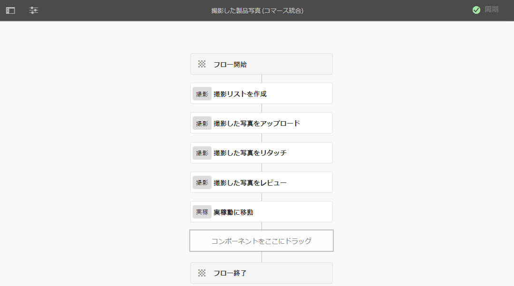
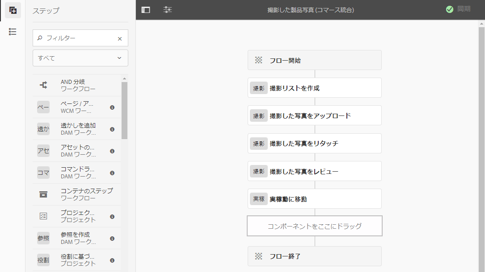
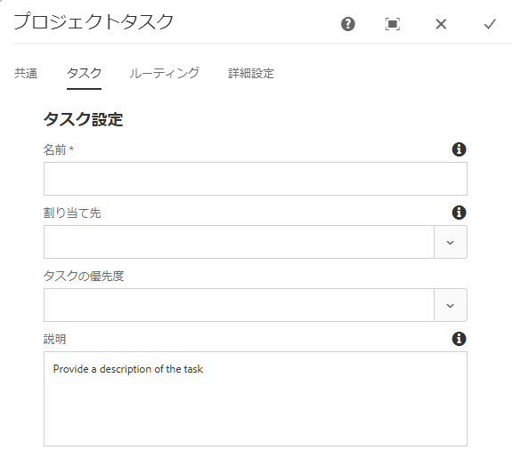
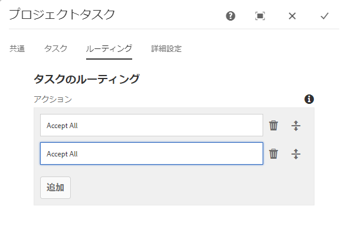
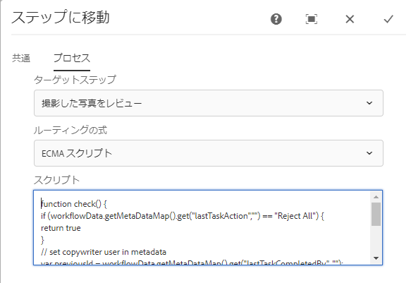

# クリエイティブプロジェクトと PIM 統合 {#creative-project-and-pim-integration}

マーケターやクリエイティブ専門家の場合、Adobe Experience Manager（AEM）のクリエイティブプロジェクトツールを使用して、eコマース関連の製品写真および組織内の関連するクリエイティブプロセスを管理できます。

クリエイティブプロジェクトを使用して、写真撮影ワークフローの以下のタスクを合理化できます。

* 写真撮影リクエストの生成
* 撮影した写真のアップロード
* 写真撮影での共同作業
* 承認されたアセットのパッケージ化

>[!NOTE]
>
>ユーザーの役割とワークフローの特定のユーザータイプへの割り当てについては、[プロジェクトユーザーの役割](/help/sites-authoring/projects.md#user-roles-in-a-project)を参照してください。

## 製品撮影ワークフロー  {#exploring-product-photo-shoot-workflows}

クリエイティブプロジェクトでは、多様なプロジェクト要件に応じた多様なプロジェクトテンプレートが用意されています。**製品写真撮影プロジェクト**&#x200B;テンプレートは、すぐに使用できます。このテンプレートは、製品撮影リクエストを開始し、管理できる写真撮影ワークフローを含みます。適切なレビューおよび承認プロセスを通じて、製品のデジタル画像を取得できる一連のタスクも含まれます。

## 製品撮影プロジェクトを作成 {#create-a-product-photo-shoot-project}

1. **プロジェクト**&#x200B;コンソールで「**作成**」をクリックし、リストから「**プロジェクトを作成**」を選択します。

   

1. **プロジェクトを作成**&#x200B;ページで、**製品撮影プロジェクト**&#x200B;テンプレートを選択し、「**次へ**」をクリックします。

   

1. タイトル、説明、期限などプロジェクトの詳細を入力します。ユーザーを追加し、様々な役割を割り当てます。また、カタログのサムネール画像を追加できます。

   

1. 「**作成**」をクリックします。プロジェクトが作成されたことを示す確認メッセージが表示されます。
1. 「**完了**」をクリックして、**プロジェクト**&#x200B;コンソールに戻ります。または、「**開く**」をクリックして、プロジェクト内のアセットを表示します。

## 製品撮影プロジェクトのワークの開始 {#starting-work-in-a-product-photo-shoot-project}

写真撮影リクエストを開始するには、プロジェクトをクリックし、プロジェクトの詳細ページ内で「**ワークを追加**」をクリックして、ワークフローを開始します。


**製品撮影プロジェクト**&#x200B;には、以下の既製のワークフローが含まれています。

* **撮影した製品写真（コマース統合）ワークフロー**：このワークフローでは、製品情報管理（PIM）システムとのコマース統合を利用し、選択した製品（階層）に基づいて撮影リストを自動的に生成します。ワークフローの完了後、製品データをアセットメタデータの一部として表示できます。
* **撮影した製品写真ワークフロー**：このワークフローでは、コマース統合を利用する代わりに、プロジェクトマネージャーが撮影リストを提供します。これにより、アップロードされた画像をプロジェクトアセットフォルダー内の CSV ファイルにマップします。

**撮影した製品写真撮影（コマース統合）**&#x200B;ワークフローは、AEM の製品に画像アセットをマッピングするときに使用します。このワークフローでは、コマース統合を利用して、承認された画像を `/etc/commerce` にある既存の製品データにリンクします。

**撮影した製品写真撮影（コマース統合）**&#x200B;ワークフローには、以下のタスクが含まれます。

* 撮影リストを作成
* 撮影した写真をアップロード
* 撮影した写真をリタッチ
* レビューおよび承認
* 実稼動に移動タスク

AEM で製品情報が利用できない場合は、**撮影した製品写真撮影**&#x200B;ワークフローを使用して、CSV ファイルでアップロードする詳細に基づいて、製品に画像アセットをマッピングします。CSV ファイルには、製品 ID、カテゴリ、説明など、製品の基本情報を含める必要があります。このワークフローでは、製品の承認されたアセットを取得します。

このワークフローには、以下のタスクが含まれます。

* 撮影リストをアップロード
* 撮影した写真をアップロード
* 撮影した写真をリタッチ
* レビューおよび承認
* 実稼動に移動タスク

ワークフロー設定オプションを使用して、このワークフローをカスタマイズできます。

どちらのワークフローにも、製品とその承認されたアセットをリンクするステップが含まれます。各ワークフローには、以下のステップが含まれます。

* ワークフロー設定：ワークフローをカスタマイズするためのオプションを記述します。
* プロジェクトワークフローの開始：撮影した製品写真ワークフローを開始する方法を説明します。
* ワークフロータスクの詳細：ワークフローで使用可能なタスクの詳細を指定します。

## プロジェクトの進行状況のトラッキング {#tracking-project-progress}

プロジェクト内のアクティブなタスクまたは完了したタスクを監視することによって、プロジェクトの進行状況を追跡できます。

以下のものを使用して、プロジェクトの進行状況を監視します。

* タスクカード
* タスクリスト

タスクカードは、プロジェクト全体の進行状況を表示します。プロジェクトに関連タスクがある場合のみ、プロジェクトの詳細ページにタスクカードが表示されます。タスクカードは、完了したタスク数に基づいて、プロジェクトの現在の完了ステータスを表示します。今後のタスクは含まれません。

タスクカードには以下の詳細が表示されます。

* アクティブなタスクの割合
* 完了したタスクの割合


タスクリストには、プロジェクトの現在アクティブなワークフロータスクに関わる詳細情報が表示されます。リストを表示するには、タスクカードをクリックします。タスクカードには、タスクの開始日、終了日、割り当て先、優先度、ステータスなどのメタデータも表示されます。


## ワークフロー設定 {#workflow-configuration}

このタスクでは、役割に基づいてユーザーにワークフローのステップを割り当てます。

**撮影した製品写真**&#x200B;ワークフローを設定するには：

1. **ツール**／**ワークフロー**&#x200B;に移動し、「**モデル**」タイルを選択して、**ワークフローモデル**&#x200B;ページを開きます。
1. **製品写真撮影**&#x200B;ワークフローを選択して、ツールバーの「**編集**」アイコンを選択して、編集モードで開きます。

   

1. **製品写真撮影ワークフロー**&#x200B;ページで、プロジェクトタスクを開きます。例えば、**撮影リストをアップロード**&#x200B;タスクを開きます。

   

1. 「**タスク**」タブをクリックして、以下の項目を設定します。

   * タスクの名前
   * タスクを受信するデフォルトのユーザー（役割）
   * ユーザーのタスクリストに表示される、タスクのデフォルトの優先度
   * 担当者がタスクを開いたときに表示されるタスクの説明
   * タスクが開始された時間に基づいて計算されるタスクの期限

1. 「**OK**」をクリックし、設定を保存します。

同様に、**撮影した製品写真**&#x200B;ワークフローに対しても追加のタスクを設定できます。

同様の手順を実行して、**製品写真撮影（Commerce 統合）ワークフロー**&#x200B;でタスクを設定します。

## プロジェクトワークフローの開始 {#starting-a-project-workflow}

このセクションでは、製品情報管理とクリエイティブプロジェクトを統合する方法について説明します。

1. 製品撮影プロジェクトに移動して、**ワークフロー**&#x200B;カードの&#x200B;**作業の追加**&#x200B;アイコンをクリックします。
1. **製品写真撮影（Commerce 統合）**&#x200B;ワークフローカードを選択して、**製品写真撮影（Commerce 統合）**&#x200B;ワークフローを開始します。製品情報が `/etc/commerce` の下で利用できない場合は、**撮影した製品写真**&#x200B;ワークフローを選択して、**撮影した製品写真**&#x200B;ワークフローを開始します。

   

1. 「**次へ**」をクリックして、プロジェクト内でワークフローを開始します。
1. 各ワークフローについては、次のページで詳しく説明します。

   

1. 「**送信**」をクリックして、写真撮影ワークフローを開始します。写真撮影プロジェクトのプロジェクトの詳細ページが表示されます。

   

### ワークフロータスクの詳細 {#workflow-tasks-details}

写真撮影ワークフローには、複数のタスクが含まれています。各タスクは、そのタスク用に定義された設定に基づいて、ユーザーグループに割り当てられます。

#### 撮影リストの作成タスク {#create-shot-list-task}

**撮影リストの作成**&#x200B;タスクを使用して、プロジェクト所有者が画像を必要とする製品を選択できます。ユーザーが選択したオプションに基づいて、製品の基本情報を含む CSV ファイルが生成されます。

1. プロジェクトフォルダーで、[タスクカード](#tracking-project-progress)の右下の省略記号ボタンをクリックして、ワークフローの中のタスク項目を表示します。

   

1. 「**撮影リストを作成**」タスクを選択して、ツールバーの「**開く**」アイコンをクリックします。

   

1. タスク詳細を確認してから、「**撮影リストを作成**」ボタンをクリックします。

   

1. 製品データに画像が関連付けられていない製品を選択します。

   

1. 「**撮影リストに追加**」ボタンをクリックして、これらすべての製品のリストを含む CSV ファイルを作成します。選択された製品で撮影リストが作成されたことを確認するメッセージが表示されます。「**閉じる**」をクリックして、ワークフローを完了します。

1. 撮影リストを作成すると、「**撮影リストを表示**」リンクが表示されます。撮影リストにさらに製品を追加するには、「**撮影リストに追加**」をクリックします。この場合、最初に作成された撮影リストにデータが追加されます。

   

1. 「**撮影リストを表示**」をクリックして、新しい撮影リストを表示します。

   

   既存のデータを編集または新しいデータを追加するには、ツールバーから「**編集**」をクリックします。「製品」フィールドと「**説明**」フィールドのみ編集可能です。

   

   ファイルを更新したら、ツールバーの「**保存**」をクリックしてファイルを保存します。

1. 製品を追加したら、**撮影リストを作成**&#x200B;タスクの詳細ページの「**完了**」アイコンをクリックして、タスクを「完了」としてマークします。オプションでコメントを追加できます。

タスクが完了すると、プロジェクト内で以下の変更が行われます。

* 製品階層に対応するアセットが、ワークフローのタイトルと同じ名前を持つフォルダー内に作成されます。
* 画像がフォトグラファーから提供される前でも、アセットコンソールを使用してアセットのメタデータを編集できるようになります。
* フォトグラファーから提供された画像を保存する写真撮影フォルダーが作成されます。写真撮影フォルダーには、撮影リストの製品エントリごとのサブフォルダーが含まれます。

### 撮影リストのアップロードタスク {#upload-shot-list-task}

このタスクは、製品写真撮影ワークフローの一部です。製品情報が AEM で使用できない場合に、このタスクを実行できます。この場合は、画像アセットが必要な製品のリストを CSV ファイルでアップロードします。CSV ファイルの詳細に基づいて、画像アセットを製品にマップします。ファイルは、`shotlist.csv` という名前の CSV ファイルにする必要があります。

前の手順のプロジェクトカードの下の「**撮影リストを表示**」リンクを使用して、サンプルの CSV ファイルをダウンロードします。サンプルファイルを確認して、CSV ファイルの通常の内容を理解してください。

製品リストまたは CSV ファイルには、「**カテゴリ、製品 ID、説明**」および「**パス**」などのフィールドを含めることができます。「**ID**」フィールドは必須で、製品 ID が格納されます。その他のフィールドはオプションです。

製品は、特定のカテゴリに属することができます。製品カテゴリは、CSV ファイルの「**カテゴリ**」列に表示することができます。「**製品**」フィールドには製品名が格納されます。「**説明**」フィールドに、製品の説明またはフォトグラファーに対する指示を入力します。

1. プロジェクトフォルダーで、[タスクカード](#tracking-project-progress)の右下の省略記号ボタンをクリックし、ワークフロー内のタスクのリストを表示します。
1. 「**撮影リストをアップロード**」タスクを選択してから、ツールバーの「**開く**」アイコンをクリックします。

   

1. タスク詳細を確認してから「**撮影リストをアップロード**」ボタンをクリックします。

   

1. 「**撮影リストをアップロード**」ボタンをクリックして、CSV ファイルをアップロードします。このファイルは、次のタスクで製品データを抽出するためのソースとして使用されます。
1. 適切な形式の製品情報を含む CSV ファイルをアップロードします。CSV ファイルをアップロードすると、カードの下に、「**アップロードされたアセットを表示**」リンクが表示されます。

   

   「**完了**」アイコンをクリックして、タスクを完了します。

1. 「**完了**」アイコンをクリックして、タスクを完了します。

### 撮影した写真のアップロードタスク {#upload-photo-shoot-task}

編集者の場合は、前のタスクで作成またはアップロードされた **shotlist.csv**&#x200B;ファイルにリストされている製品の写真をアップロードできます。

アップロードする画像の名前は、「`<ProductId_>`」で始める必要があります。`ProductId` は、`shotlist.csv` ファイルの「**ID**」フィールドから参照されます。例えば、撮影リストの **ID** が `397122` の製品に対しては、`397122_highcontrast.jpg` または `397122_lowlight.png` などの名前のファイルをアップロードできます。

画像を直接アップロードすることも、画像を含む ZIP ファイルをアップロードすることもできます。画像はそれぞれの名前に基づいて、写真撮影フォルダー内の製品フォルダーに配置されます。

1. プロジェクトフォルダーで[タスクカード](#tracking-project-progress)の右下の省略記号ボタンをクリックして、ワークフローの中のタスク項目を表示します。
1. 「**撮影した写真をアップロード**」タスクを選択してから、ツールバーから「**開く**」アイコンをクリックします。

   

1. 「**撮影した写真をアップロード**」をクリックして、撮影した写真の画像をアップロードします。
1. ツールバーの「**完了**」アイコンをクリックして、タスクを完了します。

### 撮影した写真のリタッチタスク {#retouch-photo-shoot-task}

権限がある場合は、**撮影した写真をリタッチ**&#x200B;タスクを実行して、写真撮影フォルダーにアップロードされた画像を編集します。

1. プロジェクトフォルダーで[タスクカード](#tracking-project-progress)の右下の省略記号ボタンをクリックして、ワークフローの中のタスク項目を表示します。
1. 「**撮影した写真をリタッチ**」タスクを選択してから、ツールバーの「**開く**」アイコンをクリックします。

   

1. **撮影した写真をリタッチ**&#x200B;ページで「**アップロードされたアセットを表示**」リンクをクリックして、アップロードされた画像を参照します。

   

   必要に応じて、Adobe Creative Cloud アプリケーションを使用して画像を編集します。

   

1. ツールバーの「**完了**」アイコンをクリックして、タスクを完了します。

### レビューおよび承認タスク {#review-and-approve-task}

このタスクで、フォトグラファーがアップロードした写真画像をレビューし、使用が承認されたものとして画像にマークを付けます。

1. プロジェクトフォルダーで[タスクカード](#tracking-project-progress)の右下の省略記号ボタンをクリックして、ワークフローの中のタスク項目を表示します。
1. 「**レビューおよび承認**」タスクを選択してから、ツールバーの「**開く**」アイコンをクリックします。

   

1. **レビューおよび承認**&#x200B;ページで、レビュータスクを役割に割り当て、「**レビュー**」をクリックして、アップロードされた製品画像のレビューを開始します。

   

1. 製品画像を選択して、ツールバーの「**承認**」アイコンをクリックして、それに承認済みマークを付けます。画像を承認したら、承認済みバナーがその上に表示されます。

   

1. 「**完了**」をクリックします。承認された画像が、作成済みの空のアセットとリンクされます。

製品を画像なしのままにすることもできます。後でこのタスクを見直し、完了後に「完了」としてマークできます。

Assets UI を使用してプロジェクトアセットに移動し、承認された画像を確認することができます。

次のレベルをクリックして、製品データ階層どおりに製品を表示します。

クリエイティブプロジェクトは、承認されたアセットと参照されている製品を関連付けます。アセットメタデータは、「AEM Asset メタデータ」セクションに表示される、アセットプロパティの「**製品データ**」タブの製品リファレンスと基本情報を使用して更新されます。

>[!NOTE]
>
>**撮影した製品写真ワークフロー**（コマース統合なし）では、承認された画像は製品と関連付けられていません。

### 実稼動に移動タスク {#move-to-production-task}

このタスクによって、承認済みアセットが実稼動準備フォルダーに移動し、利用できるようになります。

1. プロジェクトフォルダーで[タスクカード](#tracking-project-progress)の右下の省略記号ボタンをクリックして、ワークフローの中のタスク項目を表示します。
1. 「**実稼動に移動**」タスクを選択してから、ツールバーから「**開く**」アイコンをクリックします。

   

1. 実稼動準備フォルダーに移動する前に、撮影した写真の承認済みアセットを表示するには、**実稼動に移動**&#x200B;タスクページのプロジェクトのサムネールの下にある「**承認済みアセットを表示**」リンクをクリックします。

   

1. 実稼動準備フォルダーのパスを「**移動先**」フィールドに入力します。

   

1. 「**実稼動に移動**」をクリックします。確認メッセージを閉じます。アセットが前述のパスに移動し、フォルダー階層に基づいて、各製品の承認済みアセット用のスピンセットが自動作成されます。

1. ツールバーの「**完了**」アイコンをクリックします。最後のステップが「完了」とマークされると、ワークフローが完了します。

## DAM アセットメタデータの表示 {#viewing-dam-asset-metadata}

アセットを承認すると、そのアセットが対応する製品にリンクされます。承認されたアセットの[プロパティページ](/help/assets/manage-assets.md#editing-properties)には、「**製品データ**」（リンクされた製品の情報）タブが追加されています。このタブには、製品の詳細、SKU 番号およびアセットにリンクしているその他の製品に関連する詳細が表示されます。アセットのプロパティを更新するには、「**編集**」アイコンをクリックします。製品関連情報は、読み取り専用のままです。

リンクをクリックすると、アセットが関連付けられている製品コンソール内の製品詳細ページが表示されます。

## プロジェクト撮影ワークフローのカスタマイズ {#customizing-the-project-photo-shoot-workflows}

要件に基づいて、**プロジェクト撮影**&#x200B;ワークフローをカスタマイズできます。これは、役割に基づくオプションのタスクであり、プロジェクト内の変数の値を設定するために実行します。後で、この設定値を判断に使用することができます。

1. AEM のロゴをクリックし、**ツール**／**ワークフロー**／**モデル**&#x200B;に移動して、**ワークフローのモデル**&#x200B;ページを開きます。
1. **製品写真撮影（Commerce 統合）**&#x200B;ワークフローまたは&#x200B;**製品写真撮影**&#x200B;ワークフローを選択し、ツールバーから「**編集**」をクリックして、ワークフローを編集モードで開きます。
1. サイドパネルを開き、**役割に基づくプロジェクトタスクを作成**&#x200B;ステップを見つけてワークフローにドラッグします。

   

1. **役割に基づくタスク**&#x200B;ステップを開きます。
1. 「**タスク**」タブで、タスクリストに表示されるタスクの名前を指定します。タスクを役割に割り当て、デフォルトの優先度を設定し、説明を入力し、タスクが期限切れになる時間を指定することもできます。

   

1. 「**ルーティング**」タブで、タスクのアクションを指定します。複数のアクションを追加するには、「**項目を追加**」リンクをクリックします。

   

1. オプションを追加したら、「**OK**」をクリックして変更をステップに追加します。

1. **ワークフローモデル**&#x200B;ウィンドウに戻り、「**同期**」をクリックしてワークフロー全体の変更を保存します。ステップの「**OK**」をタップまたはクリックしても、ワークフローの変更は保存されません。ワークフロー内の変更を保存するには、「**同期**」をクリックします。

1. サイドパネルを開き、**移動ステップ**&#x200B;ワークフローを見つけてワークフローにドラッグします。

1. **移動**&#x200B;タスクを開き、「**プロセス**」タブをクリックします。

1. 「**ターゲットステップ**」を選択して移動し、**ルーティング式**&#x200B;が ECMA スクリプトであることを指定します。次のコードを「**スクリプト**」フィールドに入力します。

   ```javascript
   function check() {
   
   if (workflowData.getMetaDataMap().get("lastTaskAction","") == "Reject All") {
   
   return true
   
   }
   
   // set copywriter user in metadata
   
   var previousId = workflowData.getMetaDataMap().get("lastTaskCompletedBy", "");
   
   workflowData.getMetaDataMap().put("copywriter", previousId);
   
   return false;
   
   }
   ```

   >[!TIP]
   >
   >ワークフローステップのスクリプトについて詳しくは、[OR 分岐用のルールの定義](/help/sites-developing/workflows-models.md)を参照してください。

   

1. 「**OK**」をクリックします。

1. 「**同期**」をクリックしてワークフローを保存します。

[実稼動への移動タスク](#move-to-production-task)が完了し、所有者に割り当てられたら、新しいタスクが表示されます。

**所有者**&#x200B;の役割を持つユーザーは、タスクを完了し、コメントポップアップのリスト（ワークフローステップ設定で追加されたアクションのリスト）からアクションを選択できます。

>[!NOTE]
>
>サーバーを起動すると、プロジェクトタスクリストのサーブレットが、`/libs/cq/core/content/projects/tasktypes`で定義される、タスクタイプと URL のマッピングをキャッシュします。その後、通常のオーバーレイを実行し、`/apps/cq/core/content/projects/tasktypes` の下に配置することによって、カスタムタスクタイプを追加できます。
