# クリエイティブプロジェクトと PIM 統合{#creative-project-and-pim-integration}

マーケティング担当者またはクリエイティブプロフェッショナルの場合は、Adobe Experience Manager(AEM)のクリエイティブプロジェクトツールを使用して、eコマース関連の製品の写真や関連するクリエイティブプロセスを組織内で管理できます。

特に、クリエイティブプロジェクトを使用して、写真撮影ワークフローの以下のタスクを合理化できます。

* 写真撮影リクエストの生成
* 撮影した写真のアップロード
* 写真撮影での共同作業
* 承認されたアセットのパッケージ化

>[!NOTE]
>
>ユーザーの役割とワークフローの特定のユーザータイプへの割り当てについては、[プロジェクトユーザーの役割](/help/sites-authoring/projects.md#user-roles-in-a-project)を参照してください。

## 撮影した製品写真ワークフローの詳細  {#exploring-product-photo-shoot-workflows}

クリエイティブプロジェクトでは、多様なプロジェクト要件に応じた多様なプロジェクトテンプレートが用意されています。**製品撮影プロジェクト**&#x200B;テンプレートは、すぐに使用できます。このテンプレートは、製品撮影リクエストを開始し、管理できる写真撮影ワークフローを含みます。適切なレビューおよび承認プロセスを通じて、製品のデジタル画像を取得できる一連のタスクも含まれます。

このテンプレートには、以下のワークフローが含まれます。

* **撮影した製品写真（コマース統合）ワークフロー**：このワークフローでは、製品情報管理（PIM）システムとのコマース統合を利用し、選択した製品（階層）に基づいて撮影リストを自動的に生成します。ワークフローの完了後、製品データをアセットメタデータの一部として表示できます。
* **撮影した製品写真ワークフロー**：このワークフローでは、コマース統合を利用する代わりに、プロジェクトマネージャーが撮影リストを提供しますこれにより、アップロードされた画像をプロジェクトアセットフォルダー内の CSV ファイルにマップします。

>[!NOTE]
>
>撮影した製品写真ワークフローの「撮影リストをアップロード」タスクでアップロードする CSV ファイルのファイル名は shotlist.csv にしてください。

## 製品撮影プロジェクトを作成 {#create-a-product-photo-shoot-project}

1. In the **Projects** console, tap/click **Create** and then choose **Create Project** from the list.

   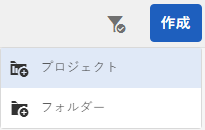

1. **プロジェクトを作成**&#x200B;ページで、写真撮影プロジェクトテンプレートを選択し、「**次へ**」をクリックします。

   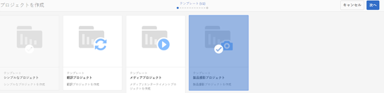

1. タイトル、説明、期限などプロジェクトの詳細を入力します。ユーザーを追加し、様々な役割を割り当てます。また、プロジェクトのサムネイル画像を追加できます。

   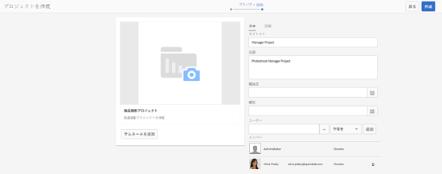

1. 「**作成**」をタップまたはクリックします。プロジェクトが作成されたことを示す確認メッセージが表示されます。
1. Tap/click **Done** to return to the **Projects** console. Alternatively, tap/click **Open** to view the assets within the photoshoot project.

## 製品撮影プロジェクトのワークの開始 {#starting-work-in-a-product-photo-shoot-project}

写真撮影リクエストを開始するには、プロジェクトをクリックまたはタップし、プロジェクトの詳細ページ内で「**ワークを追加**」をクリックまたはタップして、ワークフローを開始します。

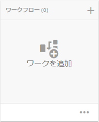

製品撮影プロジェクトには、以下の既製のワークフローが含まれています。

* 撮影した製品写真（コマース統合）ワークフロー
* 撮影した製品写真ワークフロー

撮影した製品写真（コマース統合）ワークフローは、画像アセットを AEM の中の製品にマップするときに使用します。このワークフローでは、コマース統合を利用して、承認された画像を */etc/commerce* にある既存の製品データにリンクします。

製品の写真撮影（コマース統合）ワークフローには、次のタスクが含まれます。

* 撮影リストを作成
* 撮影した写真をアップロード
* 撮影した写真をリタッチ
* レビューおよび承認
* 実稼動に移動タスク

AEM で製品情報が利用できない場合は、製品写真撮影ワークフローを使用して、CSV ファイルでアップロードする詳細に基づいて、画像アセットを製品にマップします。CSV ファイルには、製品 ID、カテゴリ、説明など、製品の基本情報を含める必要があります。このワークフローでは、製品の承認されたアセットを取得します。

このワークフローには、以下のタスクが含まれます。

* 撮影リストをアップロード
* 撮影した写真をアップロード
* 撮影した写真をリタッチ
* レビューおよび承認
* 実稼動に移動タスク

ワークフロー設定オプションを使用して、このワークフローをカスタマイズできます。

どちらのワークフローにも、製品とその承認されたアセットをリンクするステップが含まれます。各ワークフローには、以下のステップが含まれます。

* ワークフロー設定：ワークフローをカスタマイズするためのオプションを記述します。
* プロジェクトワークフローの開始：撮影した製品写真ワークフローを開始する方法を説明します。
* ワークフロータスクの詳細：ワークフローで使用可能なタスクの詳細を指定します。

## プロジェクトの進行状況の追跡 {#tracking-project-progress}

プロジェクト内のアクティブなタスクまたは完了したタスクを監視することによって、プロジェクトの進行状況を追跡できます。

以下のものを使用して、プロジェクトの進行状況を監視します。

* **タスクカード**

* **タスクリスト**

タスクカードは、プロジェクトの全体的な進行状況を示します。 プロジェクトに関連タスクがある場合のみ、プロジェクトの詳細ページにタスクカードが表示されます。タスクカードは、完了したタスク数に基づいて、プロジェクトの現在の完了ステータスを表示します。今後のタスクは含まれません。

タスクカードには以下の詳細が表示されます。

* アクティブなタスクの割合
* 完了したタスクの割合

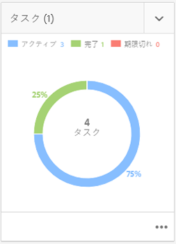

タスクリストには、プロジェクトの現在アクティブなワークフロータスクにかかわる詳細情報が表示されます。リストを表示するには、タスクカードをタップまたはクリックします。タスクカードには、タスクの開始日、終了日、割り当て先、優先度、ステータスなどのメタデータも表示されます。

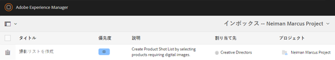

## ワークフロー設定 {#workflow-configuration}

このタスクでは、役割に基づいてユーザーにワークフローのステップを割り当てます。

**撮影した製品写真**&#x200B;ワークフローを設定するには：

1. **ツール** / **ワークフロー**&#x200B;に移動し、「 **モデル」タイルをタップして、「****** ワークフローモデル」ページを開きます。
1. Select the **Product Photo Shoot** workflow, and the tap the **Edit** icon from the toolbar to open it in edit mode.

   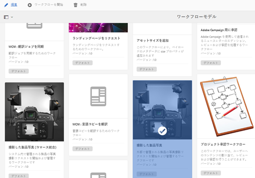

1. In the **Product Photo Shoot Workflow** page, open a project task. 例えば、「**撮影リストをアップロード**」タスクを開きます。

   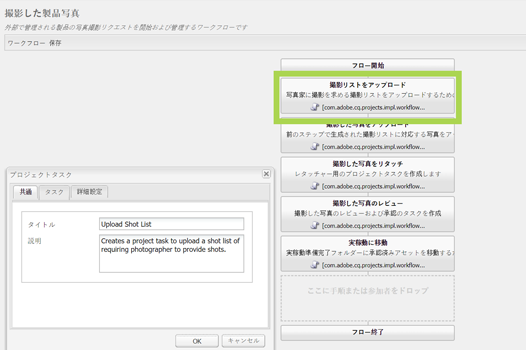

1. 「**タスク**」タブをクリックして、以下の項目を設定します。

   * タスクの名前
   * タスクを受信するデフォルトのユーザー（役割）
   * ユーザーのタスクリストに表示される、タスクのデフォルトの優先度
   * 担当者がタスクを開いたときに表示されるタスクの説明
   * タスクが開始された時間に基づいて計算されるタスクの期限

1. 「**OK**」をクリックし、設定を保存します。

   同様に、**撮影した製品写真**&#x200B;ワークフローに対しても以下のタスクを設定できます。

   * 撮影した写真をアップロード
   * 撮影した製品写真をリタッチ
   * 撮影した写真のレビュー
   * 実稼動に移動

   Perform a similar procedure to configure the tasks in the **Product Photo Shoot (Commerce Integration) workflow**.

このセクションでは、製品情報管理とクリエイティブプロジェクトを統合する方法について説明します。

## プロジェクトワークフローの開始 {#starting-a-project-workflow}

1. Navigate to a Product Photo Shoot project, and tap/click the **Add Work** icon on the **Workflows** card.
1. **撮影した製品写真（コマース統合）**&#x200B;ワークフローカードを選択して、撮影した製品写真（コマース統合）ワークフローを開始します。If the product information isn&#39;t available under /etc/commerce, select the **Product Photo Shoot** workflow and start the Product Photo Shoot workflow.

   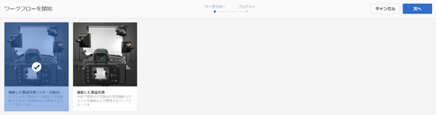

1. 「**次へ**」をタップまたはクリックして、プロジェクトでワークフローを開始します。
1. 各ワークフローについては、次のページで詳しく説明します。

   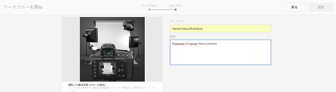

   「**送信**」をクリックして、写真撮影ワークフローを開始します。写真撮影プロジェクトのプロジェクトの詳細ページが表示されます。

   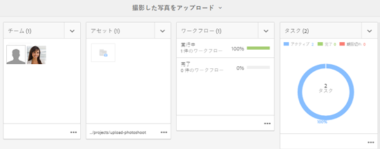

### ワークフロータスクの詳細 {#workflow-tasks-details}

写真撮影ワークフローには、複数のタスクが含まれています。各タスクは、そのタスク用に定義された設定に基づいて、ユーザーグループに割り当てられます。

#### 撮影リストの作成タスク {#create-shot-list-task}

**撮影リストの作成**&#x200B;タスクを使用して、プロジェクト所有者が画像を必要とする製品を選択できます。ユーザーが選択したオプションに基づいて、製品の基本情報を含む CSV ファイルが生成されます。

1. In the project folder, tap/click the ellipses in the [Tasks Card](#tracking-project-progress) to view the task item in the workflow.

   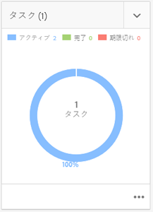

1. Select the **Create Shot List** task, and then tap/click the **Open** icon from the toolbar.

   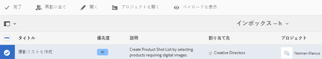

1. タスク詳細をプレビューしてから、「**撮影リストを作成**」ボタンをタップまたはクリックします。

   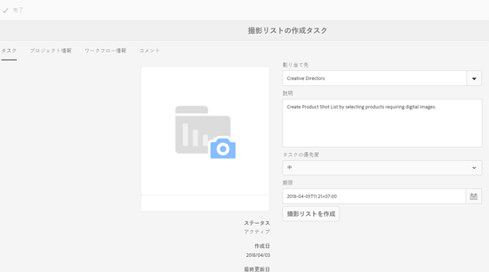

1. 製品データに画像が関連付けられていない製品を選択します。

   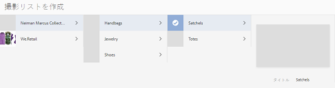

1. Tap/click the **Add To Shotlist** icon to create a CSV file that contains a list of all such products. 選択された製品で撮影リストが作成されたことを確認するメッセージが表示されます。「**閉じる**」をクリックして、ワークフローを完了します。
1. 撮影リストを作成すると、「**撮影リストを表示**」リンクが表示されます。To add more products to the shot list, tap/click **Add to Shot List**. この場合、最初に作成された撮影リストにデータが追加されます。

   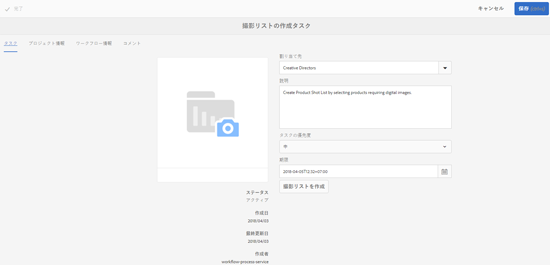

1. 「**撮影リストを表示**」をタップまたはクリックして、新しい撮影リストを表示します。

   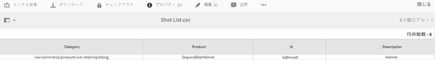

   既存のデータを編集または新しいデータを追加するには、ツールバーの「**編集**」をタップまたはクリックします。Only the **Product **and **Description** fields are editable.

   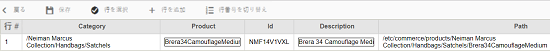

   After you update the file, tap/click **Save** on toolbar to save the file.

1. After adding the products, tap/click the **Complete** icon on the **Create Shot List **task details page to mark the task as completed. オプションでコメントを追加できます。

   タスクが完了すると、プロジェクト内で以下の変更がおこなわれます。

   * 製品階層に対応するアセットが、ワークフローのタイトルと同じ名前を持つフォルダー内に作成されます。
   * 画像がフォトグラファーから提供される前でも、アセットコンソールを使用してアセットのメタデータを編集できるようになります。
   * フォトグラファーから提供された画像を保存する Photo Shoot フォルダーが作成されます。Photo Shoot フォルダーには、撮影リストの製品エントリごとのサブフォルダーが含まれます。

   撮影した製品写真（コマース統合なし）ワークフローの場合は、撮影リストのアップロードが最初のタスクです。「**撮影リストをアップロード**」をタップまたはクリックして、**shotlist.csv** ファイルをアップロードします。CSV ファイルには、製品 ID を含める必要があります。その他のフィールドはオプションです。オプションのフィールドを使用して、アセットを製品にマップできます。

### 撮影リストのアップロードタスク {#upload-shot-list-task}

このタスクは、製品写真撮影ワークフローの一部です。製品情報が AEM で使用できない場合に、このタスクを実行できます。この場合は、画像アセットが必要な製品のリストを CSV ファイルでアップロードします。CSVファイル内の詳細に基づいて、画像アセットを製品にマッピングします。

前の手順のプロジェクトカードの下の「**撮影リストを表示**」リンクを使用して、サンプルの CSV ファイルをダウンロードします。サンプルファイルをレビューして、CSV ファイルの通常の内容を理解してください。

製品リストまたは CSV ファイルには、**カテゴリ、製品 ID、説明**&#x200B;および&#x200B;**パス**&#x200B;などのフィールドを含めることができます。「**ID**」フィールドは必須で、製品 ID が格納されます。その他のフィールドはオプションです。

製品は、特定のカテゴリに属することができます。製品カテゴリは、CSV ファイルの「**カテゴリ**」列に表示することができます。「**製品**」フィールドには製品名が格納されます。「**説明**」フィールドに、製品の説明またはフォトグラファーに対する指示を入力します。

>[!NOTE]
>
>The name of images to be uploaded should start with &quot;**&lt;ProductId>_&quot;** where Product ID is referenced from the **Id** field in the *shotlist.csv* file. For example, for a product in the shot list with **Id 397122**, you can upload files with names **397122_highcontrast.jpg**, **397122_lowlight.png**, and so on.

1. In the project folder, tap/click the ellipses in the [Tasks Card](#tracking-project-progress) to view the list of tasks in the workflow.
1. Select the **Upload Shot List** task, and then tap/click the **Open** icon from the toolbar.

   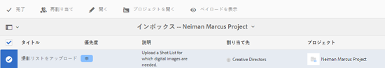

1. Review the task details and then tap/click the **Upload Shot List** button.

   

1. Tap/click the **Upload Shot List** button to upload the CSV file with filename shotlist.csv. このファイルは、次のタスクで製品データを抽出するためのソースとして使用されます。
1. 適切な形式の製品情報を含む CSV ファイルをアップロードします。The **View Uploaded Assets** link appears under the card after the CSV file is uploaded.

   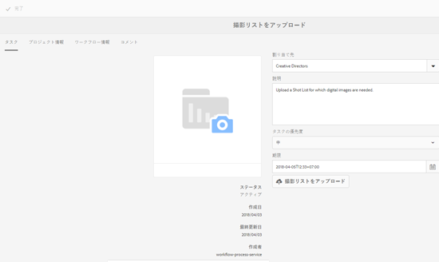

   「**完了**」アイコンをクリックして、タスクを完了します。

1. Tap/click the **Complete** icon to complete the task.

### 撮影した写真のアップロードタスク {#upload-photo-shoot-task}

If you are an Editor, you can upload shots for the products listed in the **shotlist.csv** file that is created or uploaded in the previous task.

The name of images to be uploaded should begin with **&quot;&lt;productId>_&quot;** where Product ID is referenced from the **Id** field in the **shotlist.csv** file. 例えば、撮影リストに含まれている **ID 397122** の製品について、**397122_highcontrast.jpg** や **397122_lowlight.png** といった名前の画像ファイルをアップロードできます。

画像を直接アップロードすることも、画像を含む ZIP ファイルをアップロードすることもできます。画像はそれぞれの名前に基づいて、**Photo Shoot** フォルダー内の製品フォルダーに配置されます。

1. Under the project folder, tap/click the ellipses in the [Task Card](#tracking-project-progress) to view the task item in the workflow.
1. Select the **Upload Photo Shoot** task, and then tap/click the **Open** icon from the toolbar.

   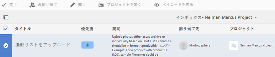

1. Tap/click **Upload Photo Shoot** and upload the photo shoot images.
1. ツールバーの「**完了**」アイコンをタップまたはクリックして、タスクを完了します。

### 撮影した写真のリタッチタスク {#retouch-photo-shoot-task}

権限がある場合は、撮影した写真のリタッチタスクを実行して、撮影した写真フォルダーにアップロードされた画像を編集します。

1. Under the project folder, tap/click the ellipses in the [Task Card](#tracking-project-progress) to view the task item in the workflow.
1. Select the **Retouch Photo Shoot** task, and then tap/click the **Open** icon from the toolbar.

   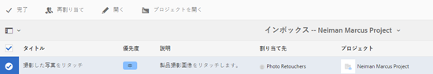

1. Tap/click the **View Uploaded Assets** link in the **Retouch Photo Shoot** page to browse the uploaded images.

   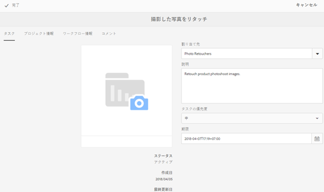

   必要に応じて、Adobe Creative Cloud アプリケーションを使用して画像を編集します。

   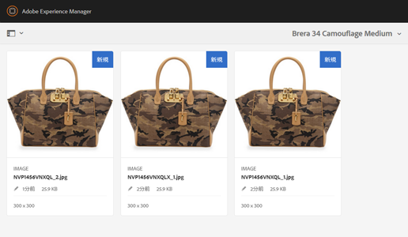

1. ツールバーの「**完了**」アイコンをタップまたはクリックして、タスクを完了します。

### レビューおよび承認タスク {#review-and-approve-task}

このタスクで、フォトグラファーがアップロードした写真画像をレビューし、使用が承認されたものとして画像にマークを付けます。

1. Under the project folder, tap/click the ellipses in the [Task Card](#tracking-project-progress) to view the task item in the workflow.
1. Select the **Review &amp; Approve** task, and then tap/click the **Open** icon from the toolbar.

   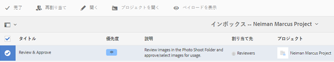

1. In the **Review &amp; Approve** page, assign the review task to role, for example Reviewers, and then tap/click **Review **to start reviewing the uploaded product images.

   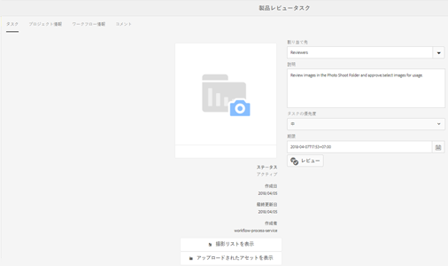

1. 製品画像を選択して、ツールバーの「承認」アイコンをタップまたはクリックして、それに承認済みマークを付けます。

   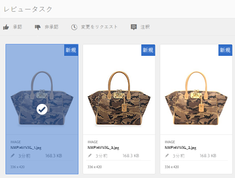

   画像を承認したら、承認済みバナーがその上に表示されます。

   >[!NOTE]
   製品を画像なしのままにすることもできます。後でこのタスクを再訪問し、完了後に「完了」としてマークできます。

1. 「**完了**」をタップまたはクリックします。承認された画像が、作成済みの空のアセットとリンクされます。

アセット UI を使用してプロジェクトアセットに移動し、承認された画像を確認することができます。

次のレベルをタップまたはクリックして、製品データ階層どおりに製品を表示します。

クリエイティブプロジェクトは、承認されたアセットと参照されている製品を関連付けます。アセットメタデータは、「**製品データ**」タブの製品リファレンスと基本情報を使用して、「AEM アセットメタデータ」セクションに表示されるアセットプロパティの下で更新されます。

>[!NOTE]
撮影した製品写真ワークフロー（コマース統合なし）では、承認された画像は製品と関連付けられていません。

### 実稼動に移動タスク {#move-to-production-task}

このタスクによって、承認されたアセットが実稼動用フォルダーに移動し、利用できるようになります。

1. Under the project folder, tap/click the ellipses in the [Task Card](#tracking-project-progress) to view the task item in the workflow.
1. Select the **Move to Production** task, and then tap/click the **Open** icon from the toolbar.

   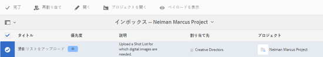

1. 実稼動用フォルダーに移動する前に、撮影した写真の承認されたアセットを表示するには、**実稼動に移動**&#x200B;タスクページのプロジェクトのサムネイルの下にある「**承認されたアセットを表示**」リンクをクリックします。

   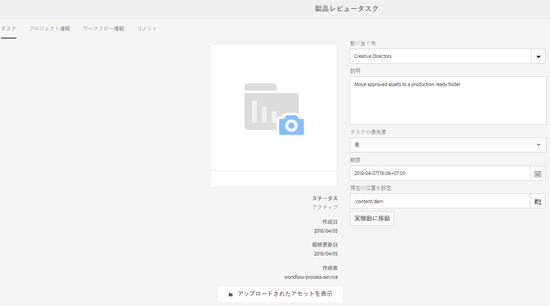

1. Enter the path of the production-ready folder in the **Move To** field.

   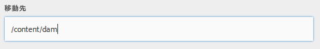

   Tap/click **Move to Production**. 確認メッセージを閉じます。アセットが前述のパスに移動し、フォルダー階層に基づいて、各製品の承認されたアセット用のスピンセットが自動的に作成されます。

1. ツールバーの「**完了**」アイコンをタップまたはクリックします。最後のステップが「完了」とマークされると、ワークフローが完了します。

## DAM アセットメタデータの表示 {#viewing-dam-asset-metadata}

アセットを承認すると、そのアセットが対応する製品にリンクされます。承認されたアセットの[プロパティページ](/help/assets/manage-assets.md#editing-properties)には、「**製品データ**」（リンクされた製品の情報）タブが追加されています。このタブには、製品の詳細、SKU 番号およびアセットにリンクしているその他の製品に関連する詳細が表示されます。「**編集**」アイコンをタップまたはクリックして、アセットプロパティを更新します。製品関連情報は、読み取り専用のままです。

表示されるリンクをタップまたはクリックして、アセットが関連付けられている、製品コンソールの中の適切な製品詳細ページに移動します。

## プロジェクト撮影ワークフローのカスタマイズ {#customizing-the-project-photo-shoot-workflows}

要件に基づいて、プロジェクト撮影ワークフローをカスタマイズできます。これは、役割に基づくオプションのタスクであり、プロジェクト内の変数の値を設定するために実行します。後で、この設定値を判断に使用することができます。

1. Click/tap the AEM logo, and then navigate to **Tools** > **Workflow** > **Models** to open the Workflow Models page.
1. **撮影した製品写真（コマース統合）**&#x200B;ワークフローまたは&#x200B;**撮影した製品写真**&#x200B;ワークフローを選択し、ツールバーから「**編集**」をクリックまたはタップして、ワークフローを編集モードで開きます。
1. サイドキックで&#x200B;**プロジェクト**&#x200B;タスクを開き、**役割に基づくプロジェクトタスクを作成**&#x200B;ステップをワークフローにドラッグします。

   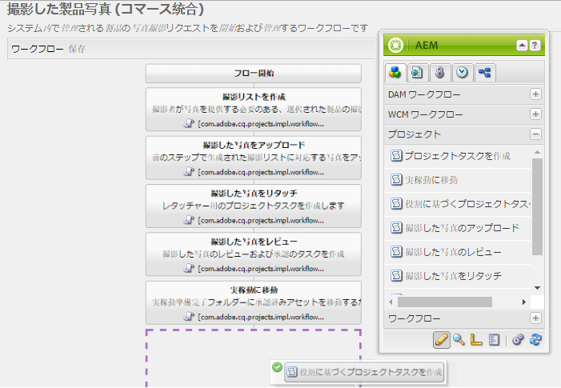

1. Open the **Role Based Task** step.
1. 「**タスク**」タブで、**タスク**&#x200B;リストに表示されるタスクの名前を指定します。また、ロールへのタスクの割り当て、デフォルトの優先度の設定、説明の入力、タスク期限の指定を行うこともできます。

   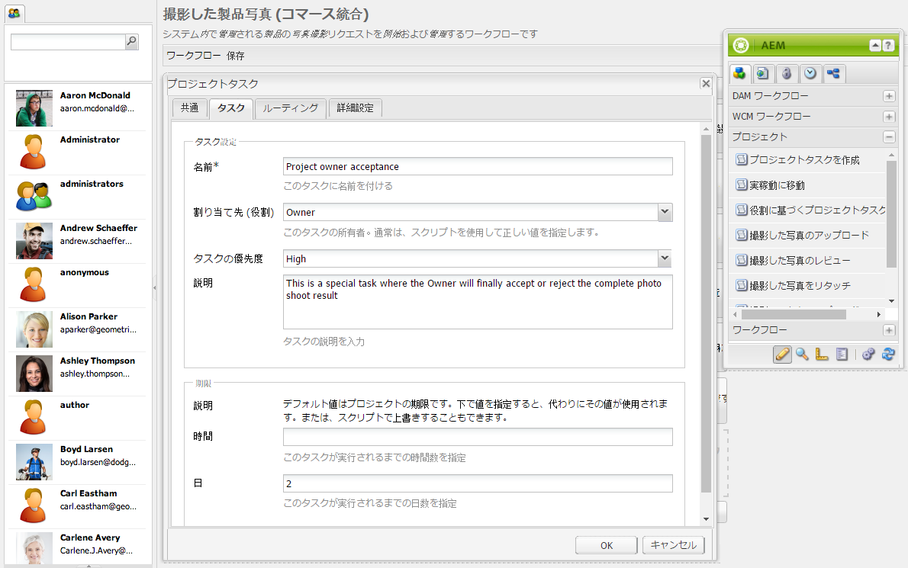

1. 「**ルーティング**」タブで、タスクのアクションを指定します。複数のアクションを追加するには、「**追加項目**」リンクをタップまたはクリックします。

   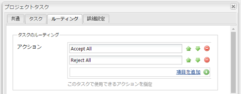

1. After adding the options click **OK** to add the changes to the step.

   >[!NOTE]
   Tapping/clicking **OK** does not save the changes in the workflow. To save changes in the workflow, tap/click **Save**.

1. Open the **Workflow** tasks from side kick, and add a **Goto** task.
1. **移動**&#x200B;タスクを開き、「**プロセス**」タブをクリックします。
1. 「**スクリプト**」ボックスに次のコードを指定します。

```
   function check() {

   if (workflowData.getMetaDataMap().get("lastTaskAction","") == "Reject All") {

   return true

   }

   // set copywriter user in metadata

   var previousId = workflowData.getMetaDataMap().get("lastTaskCompletedBy", "");

   workflowData.getMetaDataMap().put("copywriter", previousId);

   return false;

   }
```

>[!NOTE]
For details around scripting in workflow steps, see [Defining a Rule for an OR Split](/help/sites-developing/workflows-models.md).

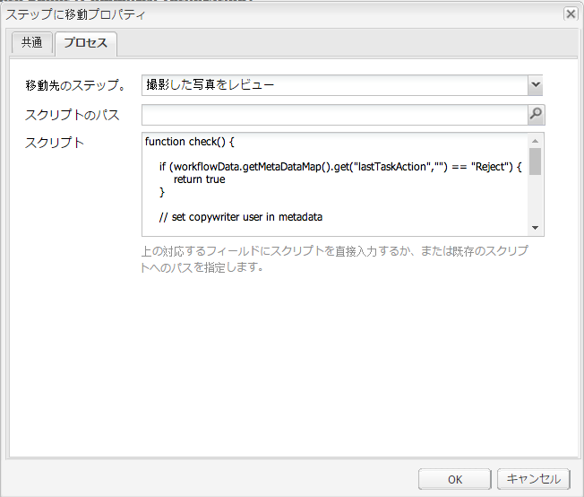

1. 「**OK**」をタップまたはクリックします。

1. Tap/click **Save** to save the workflow.

   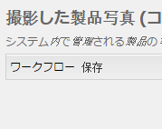

1. A new Project owner acceptance task now comes up after the [Move to Production task](#move-to-production-task) is completed and is assigned to the owner.

   所有者の役割を持つユーザーは、タスクを完了し、コメントポップアップのリストから（ワークフローステップ設定で追加されたアクションのリストから）アクションを選択できます。

   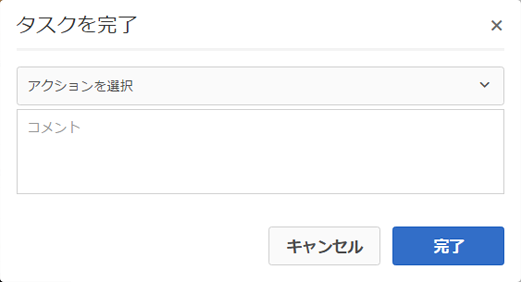

   適切なオプションを選択し、「**完了**」をクリックして、ワークフロー内の&#x200B;**移動ステップ**&#x200B;を実行します。

>[!NOTE]
When you start a server, the Project task list servlet caches the mappings between task types and URLs defined under `/libs/cq/core/content/projects/tasktypes`. You can then perform the usual overlay and add custom task types by placing them under `/apps/cq/core/content/projects/tasktypes`.

