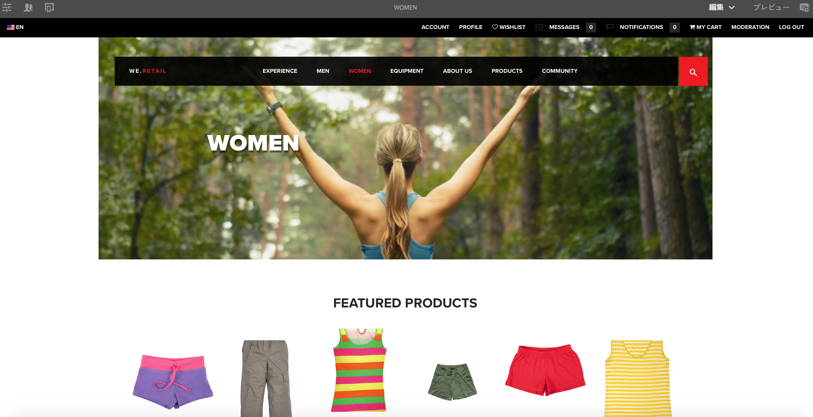

# モバイルデバイス用のページのオーサリング{#authoring-a-page-for-mobile-devices}

モバイルページをオーサリングする場合、ページはモバイルデバイスをエミュレートする方法で表示されます。ページのオーサリング時に、いくつかのエミュレーターを切り替えて、エンドユーザーがページにアクセスしたときの表示を確認できます。

ページをレンダリングするデバイスの機能に従って、デバイスはカテゴリ機能、スマートおよびタッチにグループ分けされます。エンドユーザーがモバイルページにアクセスするときは、AEM はデバイスを検出して、そのデバイスグループに対応する表現を送信します。

>[!NOTE]
>
>既存の標準サイトに基づいたモバイルサイトを作成するには、標準サイトのライブコピーを作成します。(See [Creating a Live Copy for Different Channels](/help/sites-administering/msm-livecopy.md).)
>
>AEM 開発者は、新しいデバイスグループを作成できます。(See [Creating Device Group Filters](/help/sites-developing/groupfilters.md).)

次の手順を使用して、モバイルページをオーサリングします。

1. グローバルナビゲーションから&#x200B;**サイト**&#x200B;コンソールを開きます。
1. Open the page **We.Retail** -> **United States** -> **English**.

1. **プレビューモードに切り替えます** 。
1. ページ上部のデバイスアイコンをクリックして、必要なエミュレーターに切り替えます。
1. コンポーネントをコンポーネントブラウザーからページにドラッグ&amp;ドロップします。

ページは次のようになります。

>[!NOTE]
>
>オーサーインスタンスのページがモバイルデバイスから要求されると、エミュレーターは無効になります。

