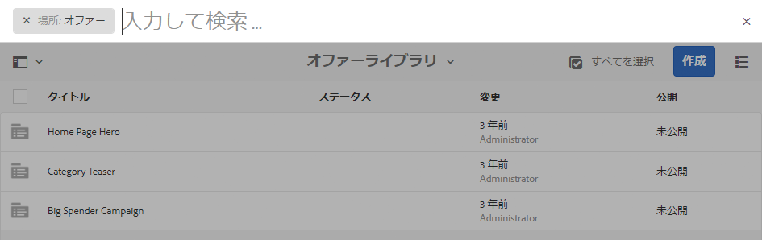

# オファーの作成と管理 {#creating-and-managing-offers}

[アクティビティエクスペリエンスで使用する](/help/sites-authoring/content-targeting-touch.md)オファーを作成するには、オファーコンソールを使用します。複数のエクスペリエンスが同じオファーを必要とする場合は、オファーコンソールでオファーを作成すると時間の短縮になります。

* ライブラリ内で 1 回作成したオファーを、ブランドアクティビティの複数のエクスペリエンスで使用します。
* ライブラリ内のオファーを変更すると、そのオファーを使用するすべてのエクスペリエンスに影響が及びます。

オファーコンソールでは、オファーがブランド別に整理されます。各ブランドには、ブランドのエクスペリエンスで使用できるオファーのライブラリが含まれます。フォルダーを使用して、各ライブラリ内のオファーを整理するための階層構造を定義します。 作成者は、論理フォルダー構造をたどって容易にオファーを探すことができます。タグ付けと検索ツールを使用してオファーを探すこともできます。

## オファーコンソールを使用したブランドの追加 {#add-a-brand-using-the-offers-console}

オファーを関連付けるブランドを作成します。オファーコンソールでブランドを開き、フォルダーとオファーを作成できるオファーライブラリにアクセスします。

オファーコンソールを使用してブランドを作成すると、[アクティビティコンソール](/help/sites-authoring/activitylib.md)にもブランドが表示されます。アクティビティコンソールでは、ブランド用のアクティビティを追加および管理できます。

1. ナビゲーションコンソールで、 **パーソナライズ** > **オファー**.

   

1. クリック **作成** その後 **作成** **ブランド**.
1. ブランドテンプレートを選択し、「 **次へ**.
1. オファーコンソールとアクティビティコンソールに表示するブランドのタイトルを入力します。必要に応じて、ブランドに関連付ける 1 つ以上のタグを入力または選択します。
1. 「**作成**」をクリックします。

## フォルダーをオファーライブラリに追加 {#add-a-folder-to-an-offer-library}

フォルダーをブランドのオファーライブラリに追加して、オファーを整理し、保存します。フォルダーは、そのブランドの下または他のフォルダーの下に作成できます。

1. オファーコンソールで、フォルダーを作成する場所を開きます。例えば、最上位フォルダーを作成するブランドを開くか、ライブラリ内の別のフォルダーを開きます。
1. クリック **作成** > **フォルダーまたはオファーを作成**.

   

1. 「**フォルダー**」を選択し、「**次へ**」をクリックします。
1. オファーライブラリに表示するフォルダーのタイトルを入力し、タグを入力または選択します。

   

1. 「**作成**」をクリックします。

## オファーをオファーライブラリに追加 {#add-an-offer-to-an-offer-library}

オファーをブランドのオファーライブラリに追加して、ブランドのエクスペリエンスに追加できるようにします。オファーを追加する際に、タイトルを指定します。検索性を高めるために、オファーに 1 つ以上のタグを関連付けることもできます。

オファーを作成したら、開いてコンテンツを作成できます。

1. オファーコンソールで、オファーを作成する場所を開きます。例えば、最上位オファーを作成するブランドを開くか、ライブラリ内のフォルダーを開きます。
1. クリック **作成** > **フォルダーまたはオファーを作成**.

   

1. を選択します。 **オファーページ** テンプレートを選択し、「 **次へ**.
1. オファーのタイトルを入力し、必要に応じて、オファーに関連付ける 1 つ以上のタグを選択または入力して、「 **作成**.
1. 確認ダイアログボックスで、オファーを編集用に開くには、をクリックします。 **ページを開く**.

## オファーの編集 {#editing-an-offer}

オファーを開き、オファーを使用するエクスペリエンスに表示するコンテンツを編集します。いずれかのエクスペリエンスで使用されているオファーを編集すると、変更がそのエクスペリエンス内に適用されます。

オファーは、オファーライブラリ内のフォルダーから、または検索結果から開くことができます。オファーを使用しているエクスペリエンスから、そのオファーを開くこともできます。

1. オファーコンソールで、オファーの横のアイコンをクリックし、 **編集**.
1. コンポーネントをオファーに追加して、通常どおりにコンポーネントの内容を編集します。

## オファーの削除 {#deleting-an-offer}

不要になったらオファーを削除します。エクスペリエンス内で使用されているオファーを削除しようとすると、削除を確認するように求められます。確認すると、オファーが削除され、エクスペリエンスから除去されます。

オファーライブラリ内のフォルダーコンテンツまたは検索結果を表示している状態で、オファーを削除できます。

1. オファーコンソールで、オファーの横のアイコンをクリックし、 **削除**.

   オファーを選択し、 **削除**.

1. 表示されるダイアログボックスで、 **削除** をクリックして削除を確定します。
1. オファーが 1 つ以上のエクスペリエンス内で使用されている場合、このオファーが参照されていることを示すダイアログボックスが表示されます。

   * オファーを削除してエクスペリエンスから削除するには、 **削除を強制**.
   * オファーを保持するには、 **キャンセル**.

## オファーの検索 {#searching-for-offers}

タイトルの照合にキーワードを使用して、ブランドのオファーを検索します。

現在の検索条件が検索結果の横に表示されます。検索結果を列ごとに昇順または降順に並べ替えることもできます。すべてのオファーライブラリのすべてのフォルダーから検索を実行できます。現在のフォルダーがどれであっても、検索結果は同じになります。

オファーを検索するには：

1. オファーコンソールの上部で、虫眼鏡アイコンをクリックします。 デフォルトでは、検索対象はオファーに限定されます。
1. オファーを検索するためのキーワードを入力します。結果から選択します。
