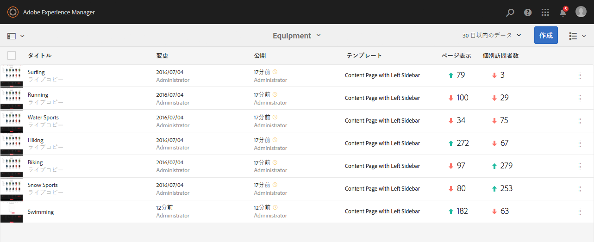
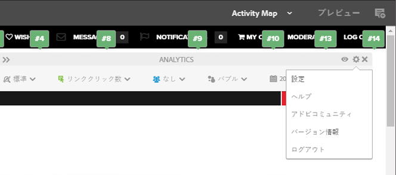
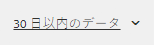
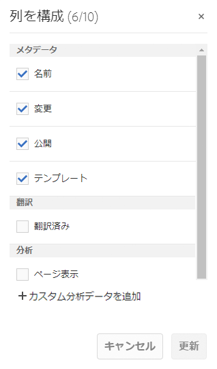
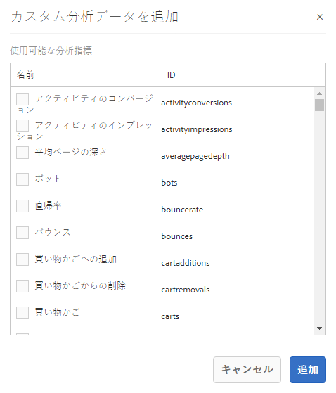
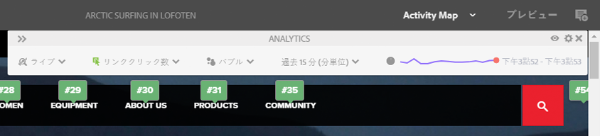
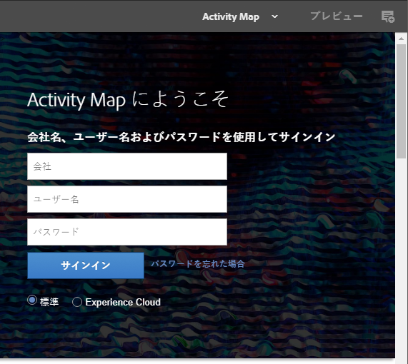
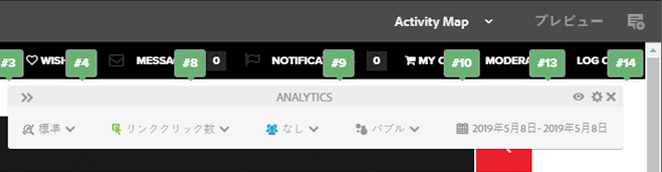
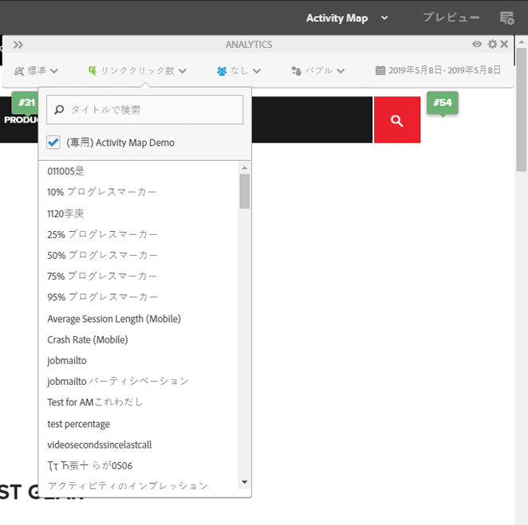
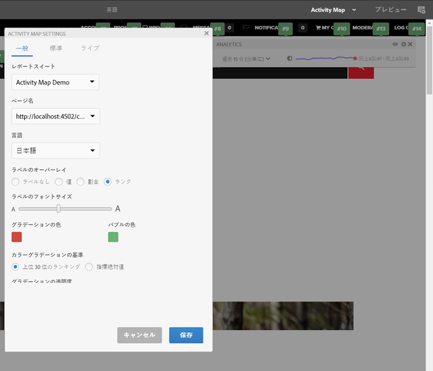

# ページ分析データの表示{#seeing-page-analytics-data}

ページ分析データを使用すると、ページコンテンツの効果を測定できます。

## コンソールに表示できる分析結果 {#analytics-visible-from-the-console}

ページ分析データはサイトコンソールの[リスト表示](/help/sites-authoring/basic-handling.md#list-view)に表示されます。ページがリスト形式で表示されているとき、デフォルトでは次の列が表示されます。

* ページ表示
* 個別訪問者数
* ページ滞在時間

各列には現在のレポート期間の値が表示され、前回のレポート期間と比較して値が増加したか減少したかも示されます。表示されるデータは 12 時間ごとに更新されます。

>[!NOTE]
>
>更新期間を変更するには、[読み込み間隔を設定](/help/sites-administering/adobeanalytics-connect.md#configuring-the-import-interval)します。

1. **サイト**&#x200B;コンソールを開きます（例：[http://localhost:4502/sites.html/content](http://localhost:4502/sites.html/content)）。
1. ツールバーの右端（右上隅）で、アイコンをクリックまたはタップして、「**リスト表示**」（表示されるアイコンは、[現在の表示](/help/sites-authoring/basic-handling.md#viewing-and-selecting-resources)によって異なる）を選択します。

1. もう一度、ツールバーの右端（右上隅）で、アイコンをクリックまたはタップして、「**設定を表示**」を選択します。**列を構成**&#x200B;ダイアログが開きます。必要な変更を加えて、「**更新**」で確定します。

   

### レポート期間の選択 {#selecting-the-reporting-period}

サイトコンソールに表示される分析データのレポート期間を次の中から選択します。

* 過去 30 日間 データ
* 過去 90 日間のデータ
* 今年のデータ

現在のレポート期間がサイトコンソールのツールバー（上部のツールバーの右側）に表示されます。ドロップダウンを使用して、必要なレポート期間を選択します。

### 利用できるデータ列の設定 {#configuring-available-data-columns}

analytics-administrators ユーザーグループのメンバーは、作成者が追加の分析列を確認できるようにサイトコンソールを設定できます。

>[!NOTE]
>
>ページのツリーに異なる Adobe Analytics のクラウド設定に関連付けられている子ページがある場合は、そのページで利用できるデータ列を設定できません。

1. In List View, use the view selectors (right of toolbar), select **View Settings** and then **Add Custom Analytics Data**.

   

1. サイトコンソールで作成者に表示する指標を選択し、「**追加**」をクリックします。

   表示される列は、Adobe Analyticsから取得されます。

   

### サイトからコンテンツインサイトを開く {#opening-content-insights-from-sites}

Open [Content Insight](/help/sites-authoring/content-insights.md) from the Sites console to further investigate page effectiveness.

1. サイトコンソールで、コンテンツインサイトを表示するページを選択します。
1. ツールバーで、分析と推奨表示アイコンをクリックします。

   

## ページエディターに表示できる分析結果（Activity Map） {#analytics-visible-from-the-page-editor-activity-map}

>[!NOTE]
>
>これは、[Activity Map が Web サイト用に設定](/help/sites-administering/adobeanalytics-connect.md#configuring-for-the-activity-map)されている場合に表示されます。

>[!NOTE]
>
>Activity Map のデータは Adobe Analytics から取得されます。

Web サイトが [Adobe Analytics 用に設定されている](/help/sites-administering/adobeanalytics-connect.md)場合は、[Activity Map モード](/help/sites-authoring/author-environment-tools.md#page-modes)を使用して関連データを表示できます。次に例を示します。

### Activity Map へのアクセス {#accessing-the-activity-map}

[Activity Map](/help/sites-authoring/author-environment-tools.md#page-modes) モードを選択すると、Adobe Analytics のログイン情報を入力するように求められます。

**Analytics** のフローティングツールバーが表示されます。ここでは以下をおこなえます。

* 二重矢印（**>>**）を使用してツールバー形式を変更する
* ページの詳細を切り替える（目のアイコン）
* Activity Map を設定する（歯車アイコン）
* 表示する分析を選択する（種々のドロップダウンリスト）
* Activity Map を終了し、ツールバーを閉じる（x）

### 表示する分析の選択 {#selecting-the-analytics-to-show}

表示する分析データを選択できます。また、以下の様々な条件を使用して、表示方法も選択できます。

* **標準**／**ライブ**

* イベントタイプ
* ユーザーグループ
* **バブル**／**グラデーション**／**勝者と敗者**／**オフ**

* 表示期間

### Activity Map の設定 {#configuring-the-activity-map}

「**設定を表示**」アイコンを使用して、**Activity Map 設定**&#x200B;ダイアログを開きます。

**Activity Map 設定**&#x200B;ダイアログでは、次の 3 つのタブに様々なオプションが用意されています。

* 一般

   * レポートスイート
   * ページ名
   * 言葉遣い
   * ラベルのオーバーレイ
   * ラベルのフォントサイズ
   * グラデーションカラー
   * バブルカラー
   * カラーグラデーションの基準
   * グラデーションの透明度

* 標準

   * 表示（タイプとリンク数）
   * ヒットのなかったリンクのオーバーレイを非表示

* ライブ

   * 上に表示（勝者または敗者）
   * 下位を除外（％）
   * 自動更新（データと期間）

