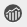

# ページ分析データの表示 {#seeing-page-analytics-data}

ページ分析データを使用して、ページコンテンツの効果を測定します。

## Analytics はコンソールから表示 {#analytics-visible-from-the-console}

ページ分析データは、 [リスト表示](/help/sites-authoring/basic-handling.md#list-view) 」をクリックします。 ページがリスト形式で表示される場合、次の列がデフォルトで使用可能です。

* ページ表示
* 個別訪問者数
* ページ滞在時間

各列には、現在のレポート期間の値が表示され、値が前のレポート期間以降に増加または減少したかどうかも示されます。 表示されるデータは 12 時間ごとに更新されます。

>[!NOTE]
>
>更新期間を変更するには、次の手順に従います。 [インポート間隔の設定](/help/sites-administering/adobeanalytics-connect.md#configuring-the-import-interval).

1. **Sites** コンソールを開きます（例：[http://localhost:4502/sites.html/content](http://localhost:4502/sites.html/content)）。
1. ツールバーの右端（右上隅）で、アイコンをクリックまたはタップして、「**リスト表示**」（表示されるアイコンは、[現在の表示](/help/sites-authoring/basic-handling.md#viewing-and-selecting-resources)によって異なる）を選択します。

1. ツールバーの右端（右上隅）にあるアイコンをクリックまたはタップし、「 **設定を表示**. この **列の構成** ダイアログが開きます。 必要な変更を加えて、「**更新**」で確定します。

   

### レポート期間の選択 {#selecting-the-reporting-period}

Analytics データがサイトコンソールに表示されるレポート期間を選択します。

* 過去 30 日間のデータ
* 過去 90 日間のデータ
* 今年のデータ

Sites コンソールのツールバー（上部のツールバーの右側）に現在のレポート期間が表示されます。ドロップダウンを使用して、必要なレポート期間を選択します。

### 使用可能なデータ列の設定 {#configuring-available-data-columns}

analytics-administrators ユーザーグループのメンバーは、サイトコンソールを設定して、作成者が追加の Analytics 列を表示できるようにします。

>[!NOTE]
>
>ページのツリーに様々なAdobe Analyticsクラウド設定に関連付けられている子が含まれている場合、そのページで使用可能なデータ列を設定することはできません。

1. リスト表示で、表示セレクター（ツールバーの右側）を使用し、「**表示設定**」、「**カスタム Analytics データを追加**」の順に選択します。

   

1. Sites コンソールで作成者に表示する指標を選択し、「**追加**」をクリックします。

   表示される列は Adobe Analytics から取得されます。

   

### Sites からコンテンツインサイトを開く {#opening-content-insights-from-sites}

Sites コンソールから「[コンテンツインサイト](/help/sites-authoring/content-insights.md)」を開き、ページの効果をさらに分析できます。

1. サイトコンソールで、コンテンツインサイトを表示するページを選択します。
1. ツールバーで、 Analytics とRecommendationsアイコンをクリックします。

   

## Analytics がページエディターから表示される (Activity Map) {#analytics-visible-from-the-page-editor-activity-map}

>[!NOTE]
>
>これは、[Activity Map が web サイト用に設定](/help/sites-administering/adobeanalytics-connect.md#configuring-for-the-activity-map)されている場合に表示されます。

>[!NOTE]
>
>Activity Map のデータは Adobe Analytics から取得されます。

Web サイトが [Adobe Analytics 用に設定されている](/help/sites-administering/adobeanalytics-connect.md)場合は、[Activity Map モード](/help/sites-authoring/author-environment-tools.md#page-modes)を使用して関連データを表示できます。次に例を示します。

### Activity Map へのアクセス {#accessing-the-activity-map}

[Activity Map](/help/sites-authoring/author-environment-tools.md#page-modes) モードを選択すると、Adobe Analytics の認証情報を入力するよう求められます。

この **Analytics** フローティングツールバーが表示されます。次の操作を実行できます。

* 二重矢印 (**>>**)
* ページの詳細を切り替える（目のアイコン）
* Activity Map を設定する（歯車アイコン）
* 表示する分析を選択する（様々なドロップダウンセレクター）
* Activity Map を終了し、ツールバーを閉じる（x）

### 表示する分析の選択 {#selecting-the-analytics-to-show}

次の各種基準を使用して、表示する解析データとその表示方法を選択できます。

* **標準**/**ライブ**

* イベントタイプ
* ユーザーグループ
* **バブル**/**グラデーション**/**勝者および敗者**/**オフ**

* 表示期間

### Activity Map {#configuring-the-activity-map}

以下を使用： **設定を表示** アイコンをクリックして開きます。 **Activity Map設定** ダイアログ。

**Activity Map 設定**&#x200B;ダイアログでは、次の 3 つのタブに様々なオプションが用意されています。

* 一般

   * レポートスイート
   * ページ名
   * 言語
   * ラベルのオーバーレイ
   * ラベルのフォントサイズ
   * グラデーションの色
   * バブルの色
   * カラーグラデーションの基準
   * グラデーションの透明度

* 標準

   * 表示（タイプとリンク数）
   * ヒットのなかったリンクのオーバーレイを非表示にします

* ライブ

   * 上位を表示（勝者または敗者）
   * 下位を除外%
   * 自動更新（データと期間）
