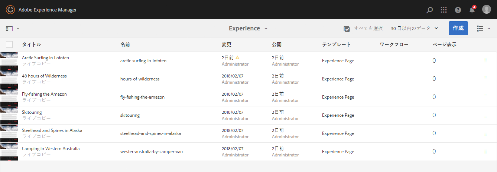
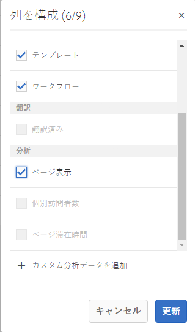
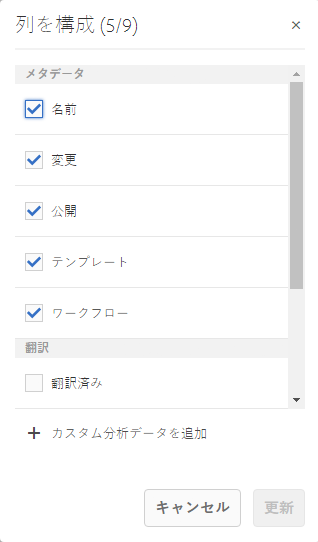

# ページ分析データの表示 {#seeing-page-analytics-data}

ページ分析データを使用して、ページコンテンツの効果を測定します。

## コンソールに表示できる分析結果 {#analytics-visible-from-the-console}

ページ分析データは、Sites コンソールの[リスト表示](/help/sites-authoring/basic-handling.md#list-view)に表示されます。ページがリスト形式で表示されている場合、デフォルトで次の列が表示されます。

* ページ表示
* 個別訪問者数
* ページ滞在時間

各列には現在のレポート期間の値が表示され、その値が前のレポート期間以降に増加したか減少したかも示されます。表示されるデータは 12 時間ごとに更新されます。

>[!NOTE]
>
>更新期間を変更するには、[読み込み間隔を設定](/help/sites-administering/adobeanalytics-connect.md#configuring-the-import-interval)します。

1. **Sites** コンソールを開きます（例：[https://localhost:4502/sites.html/content](https://localhost:4502/sites.html/content)）。
1. ツールバーの右端（右上隅）で、アイコンをクリックまたはタップして、「**リスト表示**」（表示されるアイコンは、[現在の表示](/help/sites-authoring/basic-handling.md#viewing-and-selecting-resources)によって異なる）を選択します。

1. もう一度、ツールバーの右端（右上隅）でアイコンをクリックまたはタップして、「**表示設定**」を選択します。**列を構成**&#x200B;ダイアログが開きます。必要な変更を加えて、「**更新**」で確定します。

   

### レポート期間の選択 {#selecting-the-reporting-period}

Sites コンソールに表示される分析データのレポート期間を次の中から選択します。

* 過去 30 日間のデータ
* 過去 90 日間のデータ
* 今年のデータ

現在のレポート期間が Sites コンソールのツールバー（上部のツールバーの右側）に表示されます。ドロップダウンを使用して、必要なレポート期間を選択します。

### 表示可能なデータ列の設定 {#configuring-available-data-columns}

analytics-administrators ユーザーグループのメンバーは、作成者に追加の分析列が表示されるように Sites コンソールを設定することができます。

>[!NOTE]
>
>様々な Adobe Analytics クラウド設定に関連付けられている子がページのツリーに含まれている場合、そのページで表示できるデータ列を設定することはできません。

1. リスト表示で、表示セレクター（ツールバーの右側）を使用し、「**表示設定**」、「**カスタム Analytics データを追加**」の順に選択します。

   

1. Sites コンソールで作成者に表示する指標を選択し、「**追加**」をクリックします。

   表示される列は Adobe Analytics から取得されます。

   

### Sites からコンテンツインサイトを開く {#opening-content-insights-from-sites}

Sites コンソールから「[コンテンツインサイト](/help/sites-authoring/content-insights.md)」を開き、ページの効果をさらに分析できます。

1. コンテンツインサイトを表示するページを Sites コンソールで選択します。
1. ツールバーで、Analytics と Recommendations アイコンをクリックします。

   

## ページエディターに表示できる分析結果（Activity Map） {#analytics-visible-from-the-page-editor-activity-map}

>[!CAUTION]
>
>Adobe Analytics API 内のセキュリティの変更により、AEM に含まれているバージョンの Activity Map は使用できなくなりました。
>
>[Adobe Analytics で提供される ActivityMap プラグイン](https://experienceleague.adobe.com/docs/analytics/analyze/activity-map/getting-started/get-started-users/activitymap-install.html?lang=ja)を今すぐ使用する必要があります。
