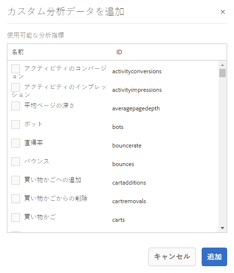

# ページ分析データの表示 {#seeing-page-analytics-data}

ページ分析データを使用すると、ページコンテンツの効果を測定できます。

## コンソールに表示できる分析結果 {#analytics-visible-from-the-console}

ページ分析データはサイトコンソールの[リスト表示](/help/sites-authoring/basic-handling.md#list-view)に表示されます。ページがリスト形式で表示されているとき、デフォルトでは次の列が表示されます。

* ページ表示
* 個別訪問者数
* ページ滞在時間

各列には現在のレポート期間の値が表示され、前回のレポート期間と比較して値が増加したか減少したかも示されます。表示されるデータは 12 時間ごとに更新されます。

>[!NOTE]
>
>更新期間を変更するには、[読み込み間隔を設定](/help/sites-administering/adobeanalytics-connect.md#configuring-the-import-interval)します。

1. **Sites** コンソールを開きます（例：[https://localhost:4502/sites.html/content](https://localhost:4502/sites.html/content)）。
1. ツールバーの右端（右上隅）で、アイコンをクリックまたはタップして、「**リスト表示**」（表示されるアイコンは、[現在の表示](/help/sites-authoring/basic-handling.md#viewing-and-selecting-resources)によって異なる）を選択します。

1. もう一度、ツールバーの右端（右上隅）で、アイコンをクリックまたはタップして、「**設定を表示**」を選択します。**列を構成**&#x200B;ダイアログが開きます。必要な変更を加えて、「**更新**」で確定します。

   

### レポート期間の選択 {#selecting-the-reporting-period}

サイトコンソールに表示される分析データのレポート期間を次の中から選択します。

* 過去 30 日間のデータ
* 過去 90 日間のデータ
* 今年のデータ

現在のレポート期間が Sites コンソールのツールバー（上部のツールバーの右側）に表示されます。ドロップダウンを使用して、必要なレポート期間を選択します。

### 利用できるデータ列の設定 {#configuring-available-data-columns}

analytics-administrators ユーザーグループのメンバーは、作成者が追加の分析列を確認できるようにサイトコンソールを設定できます。

>[!NOTE]
>
>ページのツリーに異なる Adobe Analytics のクラウド設定に関連付けられている子ページがある場合は、そのページで利用できるデータ列を設定できません。

1. リストビューで、ビューセレクター（ツールバーの右側）を使用し、「**表示設定**」、「**カスタム Analytics データを追加**」の順に選択します。

   

1. Sites コンソールで作成者に表示する指標を選択し、「**追加**」をクリックします。

   表示される列は Adobe Analytics から取得されます。

   

### Sites からコンテンツインサイトを開く {#opening-content-insights-from-sites}

Sites コンソールから「[コンテンツインサイト](/help/sites-authoring/content-insights.md)」を開き、ページの効果をさらに分析できます。

1. サイトコンソールで、コンテンツインサイトを表示するページを選択します。
1. ツールバーで、分析と推奨表示アイコンをクリックします。

   

## ページエディターに表示できる分析結果（Activity Map） {#analytics-visible-from-the-page-editor-activity-map}

>[!CAUTION]
>
>Adobe Analytics API 内のセキュリティの変更により、AEM に含まれているバージョンの Activity Map は使用できなくなりました。
>
>[Adobe Analytics で提供される ActivityMap プラグイン](https://experienceleague.adobe.com/docs/analytics/analyze/activity-map/getting-started/get-started-users/activitymap-install.html?lang=ja)を今すぐ使用する必要があります。
