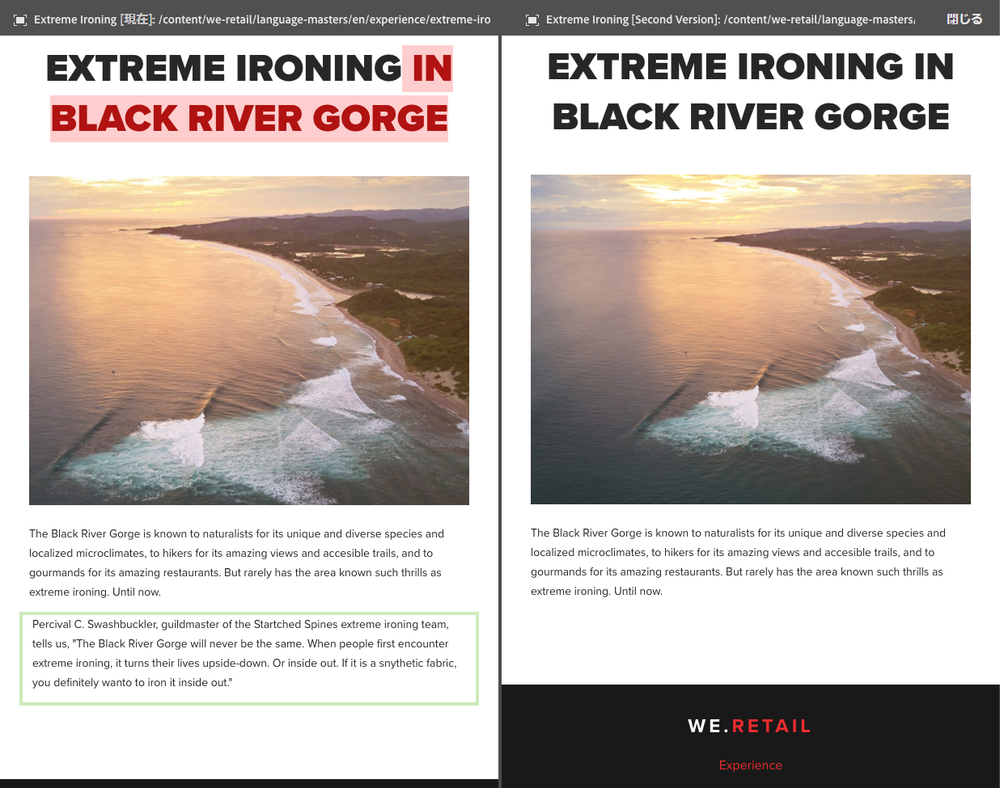
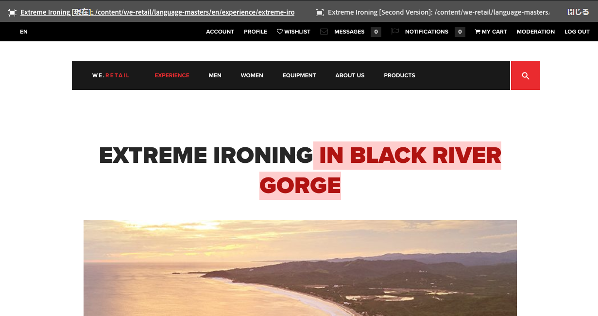

# ページの差分 {#page-diff}

## はじめに {#introduction}

コンテンツの作成は反復的なプロセスです。効率的に作成するには、ある反復から別の反復へと何が変わったかを確認できることが必要です。あるページバージョンを見てから別のページバージョンを見るのは非効率的であり、エラーが発生しやすくなります。作成者は、現在のページを他のバージョンと並べて簡単に比較できることを望みます。

ページの差分表示を使用すると、2 つのページを並べて比較し、差分をハイライト表示できます。

>[!TIP]
>
>この機能の技術的詳細については、[開発とページの差分](/help/sites-developing/pagediff.md#operation-details)を参照してください。

## 使用方法 {#use}

並列比較による差分表示では、次のものを比較できます。

* [バージョン](/help/sites-authoring/working-with-page-versions.md#comparing-a-version-with-current-page) - ページの以前のバージョンとその現在の状態
* [ライブコピー](/help/sites-administering/msm-livecopy.md#comparing-a-live-copy-page-with-a-blueprint-page) - ライブコピーとそのブループリント
* [ローンチ](/help/sites-authoring/launches-editing.md#comparing-a-launch-page-to-its-source-page) - ローンチとそのソース
* [言語コピー](/help/sites-administering/tc-manage.md#comparing-language-copies) - （再）翻訳前と（再）翻訳後のページ

これらのコンテキスト内で差分を開始する方法について詳しくは、それぞれのトピックを参照してください。

### 差分の表示 {#presentation-of-differences}

比較するコンテンツに関係なく、差分の表示は同じです。

* 差分を開始する際に選択したコンテンツは、左側（差分エントリポイント）に表示されます。
* 比較対象のコンテンツは、右側に表示されます（選択したコンテンツとの比較対象）。

例えば、バージョンを比較する場合、現在のバージョンが左側に、以前のバージョンが右側に表示されます。

両方のページのソースは、ブラウザーウィンドウ上部のヘッダーバーにはっきりと表示されます。

差分表示では、コンポーネントおよび HTML レベルでの変更が検出されます。変更された項目は、異なるカラーでハイライト表示されます。

**コンポーネントの変更点**

* ライトグリーン - 追加されたコンポーネント
* ピンク - 削除されたコンポーネント

**HTML の変更点**

* ダークグリーン - 追加された HTML
* 赤 - 削除された HTML

>[!NOTE]
>
>言語コピーを比較する場合は、翻訳ですべてが変更され、強調表示をしても意味がないので、強調表示は無効になります。

### 全画面表示および終了 {#fullscreen-and-exiting}

特定のコンテンツに集中するには、並列比較による差分表示のいずれかの「サイド」の全画面表示アイコンをクリックすると、ブラウザーの全画面に拡大できます。

選択されたサイドが画面全体に表示されますが、バーは上部に残るので、2 枚のページを切り替えることができます。

また全画面表示を終了するアイコンをクリックして、全画面表示を閉じることができます。

ヘッダーの「閉じる」ボタンをクリックすることで、並列比較による差分表示はいつでも終了することができます。

## 制限事項 {#limitations}

ページの差分によって、期待どおりに差分が検出されない場合があります。

* バージョンおよびローンチが異なる場合、差分は、パンくずリスト、メニュー、製品リストまたはロゴ（コンテンツのレンダリングでサイト構造に依存するコンポーネント）などの動的コンポーネントは考慮されません。
* バージョンの差分表示では、アクセスコントロールポリシーおよびライブコピー関係は再現されません。
* ページを移動すると、移動前に作成したバージョンとの差分を実行できなくなります。

   * 差分で問題が発生した場合は、ページの[タイムライン](/help/sites-authoring/basic-handling.md#timeline)を調べて、ページを移動したかどうかを確認します。

>[!NOTE]
>
>古いバージョン同士を比較することはできません。比較できるのは、現在のバージョンと古いバージョンの組み合わせだけです。変更の強調表示は、必ず現在のバージョンに対しておこなわれます。

>[!NOTE]
>
>ページの差分操作の仕組みおよびページの差分に影響を与える可能性のある制限事項について詳しくは、この機能の[開発者向けドキュメント](/help/sites-developing/pagediff.md)を参照してください。
