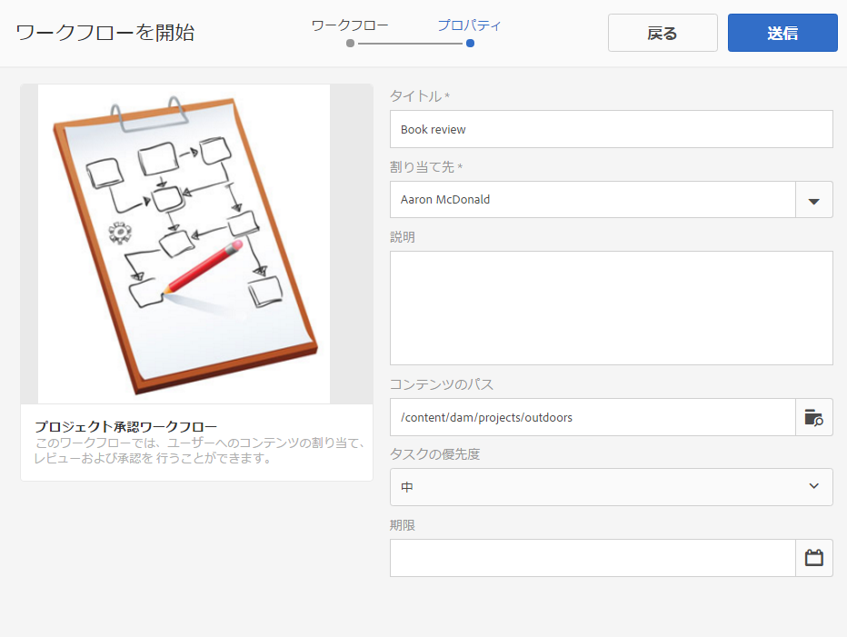
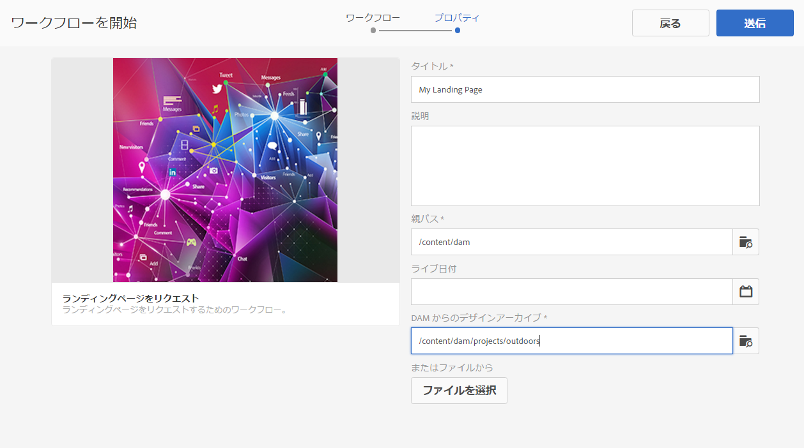

# プロジェクトワークフローの操作{#working-with-project-workflows}

すぐに使用可能なプロジェクトワークフローには、次のものがあります。

* **プロジェクト承認ワークフロー** - ユーザーへのコンテンツの割り当て、レビューおよび承認をおこなうことができます。
* **ローンチをリクエスト** - ローンチをリクエストするワークフローです。
* **ランディングページをリクエスト** - ランディングページをリクエストするワークフローです。
* **電子メールをリクエスト** - 電子メールをリクエストするワークフローです。
* **撮影した製品写真および撮影した製品写真（コマース）** - アセットを製品にマップします。
* **DAM 言語コピー作成／翻訳および DAM 言語コピーを作成** - アセットおよびフォルダー用に翻訳されたバイナリ、メタデータ、タグを作成します。

選択するプロジェクトテンプレートに応じて、以下の特定のワークフローが使用可能です。

|  | **シンプルなプロジェクト** | **メディアプロジェクト** | **製品撮影プロジェクト** | **翻訳プロジェクト** |
|---|:-:|:-:|:-:|:-:|
| コピーをリクエスト |  | x |  |  |
| 撮影した製品写真 |  | x | x |  |
| 撮影した製品写真 (Commerce) |  |  | x |  |
| プロジェクト承認 | x |  |  |  |
| ローンチをリクエスト | x |  |  |  |
| ランディングページをリクエスト | x |  |  |  |
| 電子メールをリクエスト | x |  |  |  |
| DAM 言語コピーを作成&amp;ast; |  |  |  | x |
| DAM 言語コピー作成／翻訳&amp;ast; |  |  |  | x |

>[!NOTE]
>
>&amp;ast; これらのワークフローは、プロジェクトの&#x200B;**ワークフロー**&#x200B;タイルからは開始できません。[アセットの言語コピーの作成](/help/sites-administering/tc-manage.md)を参照してください。

ワークフローを開始および完了する手順は、どのワークフローを選択した場合も同じです。手順が変わるだけです。

ワークフローは、プロジェクト内で直接開始します（「DAM 言語コピーを作成」または「DAM 言語コピー作成／翻訳」を除く）。プロジェクト内の未処理のタスクに関する情報は、**タスク**&#x200B;タイルに表示されます。完了する必要があるタスクに関する通知は、ユーザーアイコンの横に表示されます。

AEM でのワークフローの操作について詳しくは、以下を参照してください。

* [ワークフローへの参加](/help/sites-authoring/workflows-participating.md)
* [ページへのワークフローの適用](/help/sites-authoring/workflows-applying.md)
* [ワークフローの設定](/help/sites-administering/workflows.md)

このセクションでは、プロジェクトに使用可能なワークフローについて説明します。

## コピーをリクエストワークフロー {#request-copy-workflow}

このワークフローでは、ユーザーの原稿をリクエストし、承認することができます。コピーをリクエストワークフローを開始するには：

1. メディアプロジェクトで&#x200B;**ワークフロー**&#x200B;タイルの「**+**」記号を選択し、「**コピーをリクエストワークフロー**」を選択します。
1. 原稿のタイトルと、リクエストするものの簡単な概要を入力します。必要に応じて、ターゲットの単語数、タスクの優先度および期限を入力します。

   

1. 「**作成**」をクリックします。ワークフローが開始されます。タスクが&#x200B;**タスク**&#x200B;タイルに表示されます。

   

## 撮影した製品写真ワークフロー {#product-photo-shoot-workflow}

撮影した製品写真ワークフロー（コマースありとコマースなしの両方）については、[クリエイティブプロジェクト](/help/sites-authoring/managing-product-information.md)で詳しく説明します。

## プロジェクト承認ワークフロー {#project-approval-workflow}

プロジェクト承認ワークフローでは、コンテンツをユーザーに割り当て、レビューし、コンテンツを承認します。

1. シンプルなプロジェクトで&#x200B;**ワークフロー**&#x200B;タイルの「**`+`**」記号を選択し、「**プロジェクト承認ワークフロー**」を選択します。
1. タイトルを入力し、チームリストから割り当て先を選択します。必要に応じて、説明、コンテンツのパス、タスクの優先度および期限を入力します。

   

1. 「**作成**」をクリックします。ワークフローが開始されます。タスクが&#x200B;**タスク**&#x200B;タイルに表示されます。

   

## 「ローンチをリクエスト」ワークフロー {#request-launch-workflow}

このワークフローでは、ローンチをリクエストできます。

1. シンプルなプロジェクトで&#x200B;**ワークフロー**&#x200B;タイルの「**+**」記号を選択し、「**ローンチをリクエストワークフロー**」を選択します。
1. ローンチのタイトルを入力し、ローンチのソースパスを指定します。必要に応じて、説明とライブ日付も追加できます。希望するローンチの動作に応じて「ソースページのライブデータを継承」または「サブページを除外」を選択します。

   

1. 「**作成**」をクリックします。ワークフローが開始されます。ワークフローが&#x200B;**ワークフロー**&#x200B;リストに表示されます（このリストにアクセスするには、**ワークフロー**&#x200B;タイルの省略記号「**...**」をクリックします）。

## ランディングページをリクエストワークフロー {#request-landing-page-workflow}

このワークフローでは、ランディングページをリクエストできます。

1. シンプルなプロジェクトで&#x200B;**ワークフロー**&#x200B;タイルの「**+**」記号を選択し、「ランディングページをリクエストワークフロー」を選択します。
1. ランディングページのタイトルと親パスを入力します。必要に応じて、ライブ日付を入力するか、ランディングページのファイルを選択します。

   

1. 「**作成**」をクリックします。ワークフローが開始されます。タスクが&#x200B;**タスク**&#x200B;タイルに表示されます。

## 電子メールをリクエストワークフロー {#request-email-workflow}

このワークフローでは、電子メールをリクエストできます。これは、**電子メール**&#x200B;タイルに表示されるワークフローと同じです。

1. メディアプロジェクトまたはシンプルなプロジェクトで&#x200B;**ワークフロー**&#x200B;タイルの「**+**」記号を選択し、「**電子メールをリクエストワークフロー**」を選択します。
1. 電子メールタイトルと、キャンペーンおよびテンプレートパスを入力します。さらに、名前、説明、ライブ日付を指定できます。

   

1. 「**作成**」をクリックします。ワークフローが開始されます。タスクが&#x200B;**タスク**&#x200B;タイルに表示されます。

   

## アセットの言語コピー作成（および翻訳）ワークフロー {#create-and-translate-language-copy-workflow-for-assets}

**言語コピーを作成**&#x200B;ワークフローおよび&#x200B;**言語コピー作成／翻訳**&#x200B;ワークフローについて詳しくは、[アセットの言語コピーの作成](/help/assets/translation-projects.md)を参照してください。
