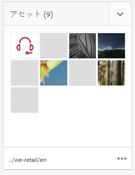
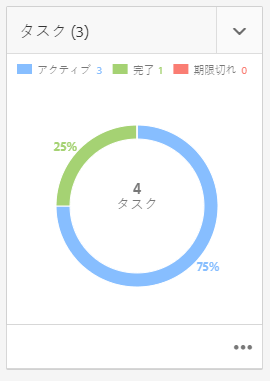

# プロジェクト {#projects}

プロジェクトを使用すると、リソースを 1 つのエンティティにグループ化できます。共通の共有環境で、プロジェクトを簡単に管理できます。プロジェクトに関連付けることができるリソースのタイプは、AEM ではタイルと呼ばれます。タイルには、プロジェクトとチームの情報、アセット、ワークフローおよびその他のタイプの情報を含めることができます。詳しくは、[プロジェクトタイル](#project-tiles)を参照してください。

ユーザーは、次の操作を実行できます。

* プロジェクトの作成と削除
* プロジェクトへのコンテンツフォルダーおよびアセットフォルダーの関連付け
* コンテンツリンクのプロジェクトからの削除

## アクセス要件 {#access-requirements}

標準のAEM機能をプロジェクトするので、追加の設定は必要ありません。

ただし、プロジェクトのユーザーがプロジェクトの作成、タスク/ワークフローの作成、チームの表示と管理など、プロジェクトの使用中に他のユーザー/グループを表示するには、ユーザーが `/home/users` および `/home/groups`.

これを行う最も簡単な方法は、 **projects-users** グループへの読み取りアクセス `/home/users` および `/home/groups`.

## プロジェクトコンソール {#projects-console}

プロジェクトコンソールで、AEM 内のプロジェクトにアクセスし、管理します。

プロジェクトコンソールは、AEMの他のコンソールと似ており、個々のプロジェクトに対して様々なアクションを実行したり、プロジェクトの表示を調整したりできます。

### モードを切り替え {#modes}

パネルセレクターを使用して、コンソールモードを切り替えることができます。

#### コンテンツのみ {#content-only}

コンソールを開く際のデフォルトのモードは「コンテンツのみ」です。 すべてのプロジェクトが表示されます。

#### タイムライン {#timeline}

タイムライン表示を使用すると、個々のプロジェクトを選択し、そのプロジェクトに関するアクティビティを表示できます。 レールセレクターまたはホットキーを使用する `alt+1` をクリックして、このビューに変更します。

### 表示を切り替え {#views}

表示セレクターを使用して、プロジェクトを大きなタイル（デフォルト）で表示するか、リストとして表示するか、カレンダーで表示するかを変更できます。

### 表示をフィルター {#filter}

フィルターを使用して、すべてのプロジェクトとアクティブなプロジェクトのみを切り替えることができます。

### プロジェクトの選択と表示 {#selecting}

プロジェクトタイルにマウスを移動し、チェックマークをクリックして、プロジェクトを選択します。

プロジェクトの詳細を表示するには、プロジェクトをクリックして詳細を表示します。

### 新規プロジェクトの作成 {#creating}

クリック **作成** をクリックして、新しいプロジェクトを追加します。

## プロジェクトタイル {#project-tiles}

プロジェクトは、一緒に管理したい様々なタイプの情報で構成されています。 この情報は、 **タイル**.

以下のタイルをプロジェクトと関連付けることができます。

* [Assets](#assets)
* [アセットコレクション](#asset-collections)
* [エクスペリエンス](#experiences)
* [リンク](#links)
* [プロジェクト情報](#project-info)
* [チーム](#team)
* [ランディングページ](#landing-pages)
* [電子メール](#emails)
* [ワークフロー](#workflows)
* [ローンチ](#launches)
* [タスク](#tasks)

任意のタイルの右上にあるドロップダウンメニューをクリックして、タイルにデータを追加します。

タイルの右下にある省略記号ボタンをクリックすると、関連するコンソールでタイルのデータが開きます。

### Assets {#assets}

**Assets** タイルでは、特定のプロジェクトに使用するすべてのアセットを集めることができます。

タイル内でアセットを直接アップロードします。

### アセットコレクション {#asset-collections}

アセットと同様に、[アセットコレクション](/help/assets/manage-collections.md)をプロジェクトに直接追加できます。アセット内にコレクションを定義します。

コレクションを追加するには、「**コレクションを追加**」をクリックし、適切なコレクションをリストから選択します。

### エクスペリエンス {#experiences}

この **エクスペリエンス** タイルを使用すると、モバイルアプリ、Web サイトまたはパブリケーションをプロジェクトに追加できます。

アイコンは、どの種類のエクスペリエンスを表すかを示します。

* Web サイト
* モバイルアプリ

### リンク {#links}

この **リンク** タイルを使用すると、外部リンクをプロジェクトに関連付けることができます。

リンクにわかりやすい名前を付けたり、サムネールを変更したりできます。

### プロジェクト情報 {#project-info}

この **プロジェクト情報** タイルには、説明、プロジェクトのステータス（非アクティブまたはアクティブ）、期限、メンバーなど、プロジェクトに関する一般情報が表示されます。 さらに、メインのプロジェクトページに表示されるプロジェクトサムネールを追加できます。

### 翻訳ジョブ {#translation-job}

この **翻訳ジョブ** タイルでは、翻訳を開始したり、翻訳のステータスを表示したりできます。

翻訳を設定するには、ドキュメントを参照してください。 [翻訳プロジェクトを作成します。](/help/assets/translation-projects.md)

### チーム {#team}

このタイルでは、プロジェクトチームのメンバーを指定できます。編集時に、チームメンバー名を入力して、ユーザーの役割を割り当てることができます。

チームメンバーをチームに追加したり、チームから削除したりできます。さらに、チームメンバーに割り当てられている[ユーザーの役割](#userroles)を編集できます。

### ランディングページ {#landing-pages}

****&#x200B;ランディングページタイルでは、新しいランディングページをリクエストできます。

このワークフローについては、ドキュメントを参照してください[ランディングページワークフローを作成します。](/help/sites-authoring/projects-with-workflows.md#request-landing-page-workflow)

### 電子メール {#emails}

**電子メール**&#x200B;タイルを使用して、電子メールのリクエストを管理できます。これは、 **メールのリクエスト** ワークフロー。

詳しくは、[電子メールをリクエストワークフロー](/help/sites-authoring/projects-with-workflows.md#request-email-workflow)で説明します。

### ワークフロー {#workflows}

プロジェクトのワークフローを開始できます。 実行中のワークフローがある場合は、そのステータスが **ワークフロー** タイル。

作成するプロジェクトに応じて、使用できるワークフローは異なります。

使用可能なワークフローについては、[プロジェクトワークフローの操作](/help/sites-authoring/projects-with-workflows.md)で説明します。

### ローンチ {#launches}

この **起動回数** タイルには、 [ローンチをリクエストワークフロー。](/help/sites-authoring/projects-with-workflows.md)

### タスク {#tasks}

タスクを使用して、ワークフローを含む、すべてのプロジェクト関連タスクのステータスを監視できます。タスクについて詳しくは、[タスクの操作](/help/sites-authoring/task-content.md)を参照してください。

## プロジェクトテンプレート {#project-templates}

テンプレートは、プロジェクトを開始するための基礎となります。 AEMには、これらの標準的なプロジェクトテンプレートが用意されています。

* **メディアプロジェクト**  — これは、メディア関連のアクティビティ用のリファレンスサンプルプロジェクトです。 メディア関連の複数のプロジェクトの役割が含まれ、メディアコンテンツに関連するワークフローも含まれます。
* **[製品撮影プロジェクト](/help/sites-authoring/managing-product-information.md)** - e コマース関連の製品写真を管理するためのリファレンスサンプルです。
* **[翻訳プロジェクト](/help/sites-administering/translation.md)**  — これは、翻訳関連のアクティビティを管理するためのリファレンスサンプルです。 基本的な役割を含み、翻訳を管理するためのワークフローが含まれます。
* **単純なプロジェクト**  — これは、他のカテゴリに適合しないプロジェクトのリファレンスサンプルです。 これには、3 つの基本的な役割と 4 つの一般的なAEMワークフローが含まれます。

選択したテンプレートに基づいて、提供されるユーザーの役割やワークフローなど、プロジェクト内で使用できる様々なオプションがあります。

## プロジェクト内のユーザーの役割 {#user-roles-in-a-project}

様々なユーザーの役割がプロジェクトテンプレートで定義され、次の 2 つの主な理由で使用されます。

1. 権限：ユーザーの役割は、次の 3 つのカテゴリのいずれかに分類されます。監視者、編集者、所有者。 例えば、フォトグラファーやコピーライターは、エディターと同じ権限を持ちます。 権限によって、ユーザーがプロジェクト内のコンテンツに何を行えるかが決定されます。
1. ワークフロー：ワークフローは、プロジェクト内のタスクを割り当てるユーザーを決定します。 タスクは、プロジェクトの役割と関連付けることができます。例えば、フォトグラファーにタスクを割り当てて、フォトグラファーの役割を持つすべてのチームメンバーがタスクを受け取るようにできます。

セキュリティの管理と権限の制御を行うために、すべてのプロジェクトで次のデフォルトの役割がサポートされています。

| 役割 | 説明 | 権限 | グループのメンバーシップ |
|---|---|---|---|
| 監視者 | この役割のユーザーは、プロジェクトステータスなどプロジェクトの詳細を表示できます。 | プロジェクトに対する読み取り専用権限 | `workflow-users` グループ |
| 編集者 | この役割のユーザーは、プロジェクトのコンテンツをアップロードおよび編集できます。 | プロジェクト、関連メタデータおよび関連アセットに対する読み取り/書き込みアクセス権 撮影リスト、撮影した写真をアップロードし、アセットを確認および承認する権限 に対する書き込み権限 `/etc/commerce` 特定のプロジェクトに対する権限を変更する | `workflow-users` グループ |
| 所有者 | この役割のユーザーは、プロジェクトの作成、プロジェクトでの作業の開始、および承認されたアセットの実稼動フォルダーへの移動をおこなうことができます。 所有者は、プロジェクト内のその他すべてのタスクも表示および実行できます。 | `/etc/commerce` に対する書き込み権限 | `dam-users` プロジェクトを作成できるグループ `project-administrators` プロジェクトの作成とアセットの移動が可能なグループ |

クリエイティブプロジェクトの場合は、フォトグラファーなどの追加の役割も提供されます。 これらの役割を使用して、特定のプロジェクト用のカスタム役割を派生させることができます。

### グループの自動作成 {#auto-group-creation}

プロジェクトを作成してユーザーを様々な役割に追加すると、関連する権限を管理するため、プロジェクトに関連付けられたグループが自動的に作成されます。

例えば、「Myproject」というプロジェクトには **Myproject Owners**、**Myproject Editors**、**Myproject Observers** という 3 つのグループがあります。

プロジェクトを削除すると、適切なオプションを選択した場合にのみ、これらのグループが削除されます [プロジェクトの削除時。](/help/sites-authoring/touch-ui-managing-projects.md#deleting-a-project) 管理者は、 **ツール** > **セキュリティ** > **グループ**.

## その他のリソース {#additional-resources}

プロジェクトの使用の詳細については、次の追加ドキュメントを参照してください。

* [プロジェクトの管理 ](/help/sites-authoring/touch-ui-managing-projects.md)
* [タスクの操作](/help/sites-authoring/task-content.md)
* [プロジェクトワークフローの操作 ](/help/sites-authoring/projects-with-workflows.md)
* [クリエイティブプロジェクトと PIM 統合](/help/sites-authoring/managing-product-information.md)
