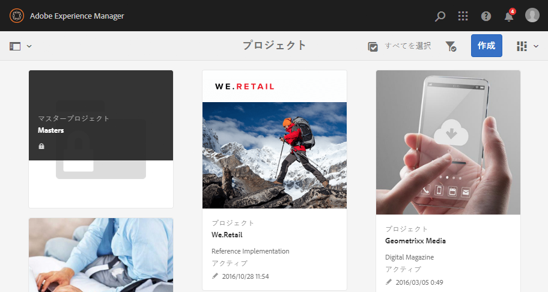
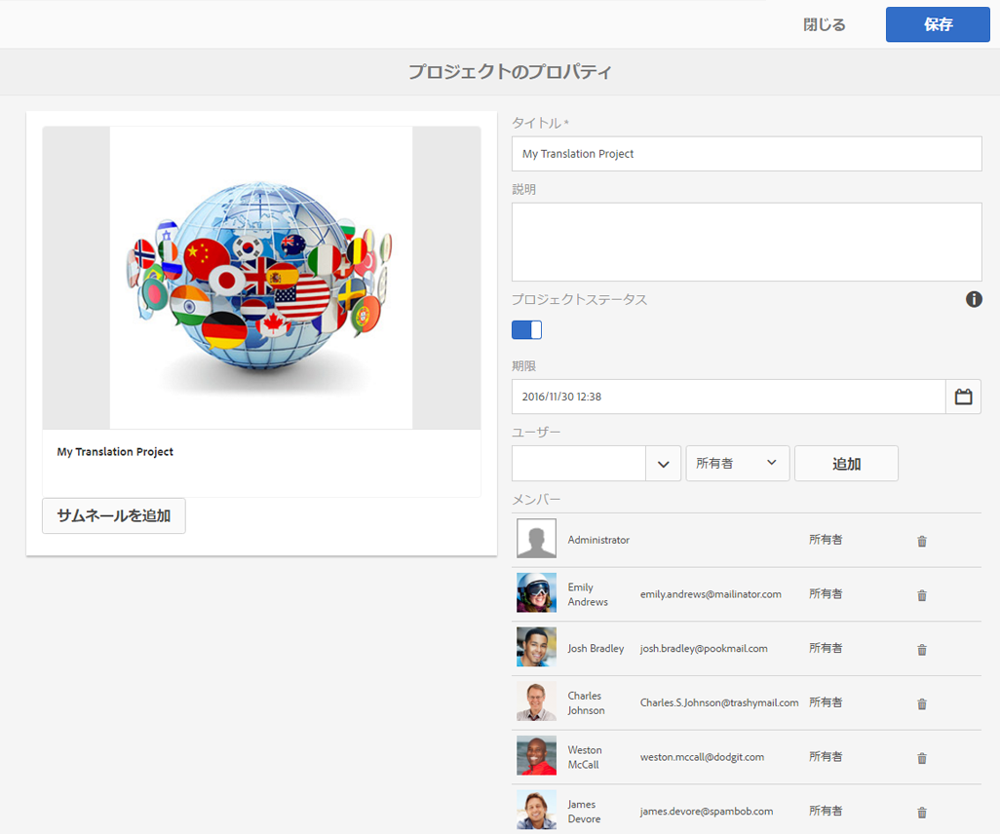
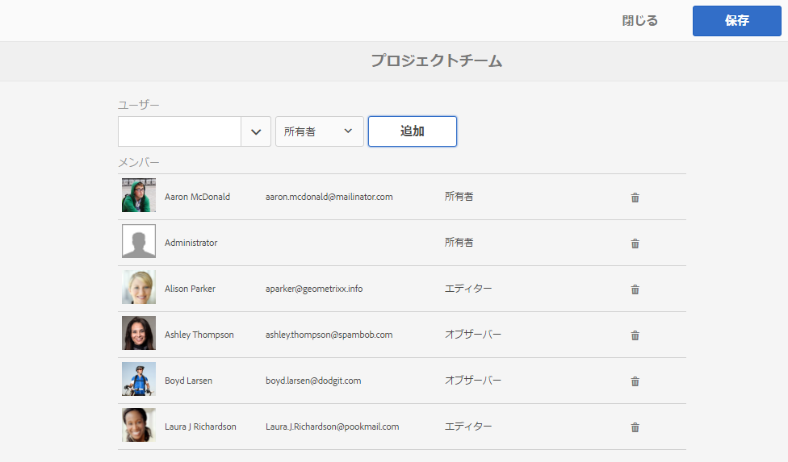

# プロジェクト{#projects}

プロジェクトを使用すると、リソースを 1 つのエンティティにグループ化できます。共通の共有環境で、プロジェクトを簡単に管理できます。プロジェクトに関連付けることができるリソースのタイプは、AEM ではタイルと呼ばれます。タイルには、プロジェクトとチームの情報、アセット、ワークフローおよびその他のタイプの情報を含めることができます。詳しくは、[プロジェクトタイル](#project-tiles)を参照してください。

>[!CAUTION]
>
>For users in projects to see other users/groups while using Projects functionality like creating projects, creating tasks/workflows, seeing and managing the team, those users need to have read access on **/home/users** and **/home/groups**. The easiest way to implement this is to give the **projects-users** group read access to **/home/users** and**/home/groups**.

次の操作をおこなうことができます。

* プロジェクトの作成
* プロジェクトへのコンテンツフォルダーおよびアセットフォルダーの関連付け
* プロジェクトの削除
* コンテンツリンクのプロジェクトからの削除

次の追加トピックを参照してください。

* [プロジェクトの管理](/help/sites-authoring/touch-ui-managing-projects.md)
* [タスクの操作](/help/sites-authoring/task-content.md)
* [プロジェクトワークフローの操作](/help/sites-authoring/projects-with-workflows.md)
* [クリエイティブプロジェクトと PIM 統合](/help/sites-authoring/managing-product-information.md)

## プロジェクトコンソール {#projects-console}

プロジェクトコンソールで、AEM 内のプロジェクトにアクセスし、管理します。

* 「**タイムライン**」を選択してからプロジェクトを選択すると、プロジェクトのタイムラインが表示されます。
* 「**選択**」をクリックまたはタップすると、選択モードに入ります。
* 「**作成**」をクリックして、プロジェクトを追加します。
* 「**アクティブなプロジェクトを切り替え**」を使用して、すべてのプロジェクトとアクティブなプロジェクトのみを切り替えることができます。
* 「**統計ビューを表示**」を使用して、タスクの完了に関するプロジェクト統計を表示できます。

## プロジェクトタイル {#project-tiles}

プロジェクトを使用して、様々なタイプの情報とプロジェクトを関連付けることができます。このような情報は&#x200B;**タイル**&#x200B;と呼ばれます。各タイルと含まれる情報の種類について、この節で説明します。

以下のタイルをプロジェクトと関連付けることができます。それぞれについては、以降の節で説明します。

* アセットおよびアセットコレクション
* エクスペリエンス
* リンク
* プロジェクト情報
* チーム
* ランディングページ
* 電子メール
* ワークフロー
* ローンチ
* タスク

### Assets {#assets}

**アセット**&#x200B;タイルでは、特定のプロジェクトに使用するすべてのアセットを集めることができます。

タイル内でアセットを直接アップロードします。さらに、Dynamic Media のアドオンがある場合は、画像セット、スピンセットまたは混在メディアセットを作成できます。

### アセットコレクション {#asset-collections}

アセットと同様に、[アセットコレクション](/help/assets/managing-collections-touch-ui.md)をプロジェクトに直接追加できます。アセット内にコレクションを定義します。

コレクションを追加するには、「**コレクションを追加**」をクリックし、適切なコレクションをリストから選択します。

### エクスペリエンス {#experiences}

**エクスペリエンス**&#x200B;タイルでは、モバイルアプリ、Web サイトまたは公開物をプロジェクトに追加できます。

アイコンは、エクスペリエンスの種類（Web サイト、モバイルアプリケーションまたは公開物）を示します。エクスペリエンスを追加するには、「+」記号をクリックするか、「**エクスペリエンスを追加**」をクリックして、エクスペリエンスの種類を選択します。

サムネールのパスを選択し、必要に応じてエクスペリエンスのサムネールを変更します。エクスペリエンスは、**エクスペリエンス**&#x200B;タイル内にグループ化されます。

### リンク {#links}

リンクタイルでは、外部リンクとプロジェクトを関連付けることができます。

リンクにわかりやすい名前を付けたり、サムネールを変更したりできます。

### プロジェクト情報 {#project-info}

プロジェクト情報タイルには、説明、プロジェクトステータス（非アクティブまたはアクティブ）、期限、メンバーなどプロジェクトに関する一般的な情報が表示されます。さらに、メインのプロジェクトページに表示されるプロジェクトサムネールを追加できます。

チームタイルと同様に、このタイルからチームメンバーを割り当てたり、削除したり（または役割を変更したり）できます。

### 翻訳ジョブ {#translation-job}

翻訳ジョブタイルでは、翻訳を開始したり、翻訳のステータスを表示したりもできます。翻訳を設定するには、[翻訳プロジェクトの作成](/help/assets/translation-projects.md)を参照してください。

翻訳ワークフロー内のアセットを表示するには、**翻訳ジョブ**&#x200B;カードの下部にある省略記号をクリックします。翻訳ジョブリストには、アセットのメタデータとタグのエントリも表示されます。これらのエントリは、アセットのメタデータとタグも翻訳されることを意味します。

### チーム {#team}

このタイルでは、プロジェクトチームのメンバーを指定できます。編集時に、チームメンバー名を入力して、ユーザーの役割を割り当てることができます。

チームメンバーをチームに追加したり、チームから削除したりできます。さらに、チームメンバーに割り当てられている[ユーザーの役割](#userroles)を編集できます。

### ランディングページ {#landing-pages}

**ランディングページ**&#x200B;タイルでは、新しいランディングページをリクエストできます。

このワークフローについては、[ランディングページを作成ワークフロー](/help/sites-authoring/projects-with-workflows.md#request-landing-page-workflow)で説明します。

### 電子メール {#emails}

**電子メール**&#x200B;タイルを使用して、電子メールのリクエストを管理できます。このタイルで、電子メールをリクエストワークフローを開始します。

詳しくは、[電子メールをリクエストワークフロー](/help/sites-authoring/projects-with-workflows.md#request-email-workflow)で説明します。

### ワークフロー {#workflows}

特定のワークフローに従うように、プロジェクトを割り当てることができます。動作しているワークフローがある場合、そのステータスがプロジェクトの&#x200B;**ワークフロー**&#x200B;タイルに表示されます。

特定のワークフローに従うように、プロジェクトを割り当てることができます。選択したプロジェクトに応じて、使用可能なワークフローは異なります。

使用可能なワークフローについては、[プロジェクトワークフローの操作](/help/sites-authoring/projects-with-workflows.md)で説明します。

### ローンチ {#launches}

ローンチタイルには、[ローンチをリクエストワークフロー](/help/sites-authoring/projects-with-workflows.md)を使用してリクエストされたローンチがすべて表示されます。

### タスク {#tasks}

タスクを使用して、ワークフローを含む、すべてのプロジェクト関連タスクのステータスを監視できます。タスクについて詳しくは、[タスクの操作](/help/sites-authoring/task-content.md)を参照してください。

## プロジェクトテンプレート {#project-templates}

AEM には、次の 3 種類の既製のテンプレートが付属しています。

* シンプルなプロジェクト - 他のカテゴリに適合しない、あらゆるプロジェクト用のリファレンスサンプルです（キャッチオール）。3 つの基本的な役割（所有者、エディター、監視者）と 4 つのワークフロー（プロジェクト承認、ローンチをリクエスト、ランディングページをリクエスト、電子メールをリクエスト）が含まれます。
* メディアプロジェクト - メディア関連アクティビティ用のリファレンスサンプルプロジェクトです。いくつかのメディア関連プロジェクトの役割（フォトグラファー、エディター、コピーライター、デザイナー、所有者、監視者）が含まれます。メディアコンテンツに関連する 2 つのワークフロー（コピーをリクエスト（テキストのリクエストおよびレビュー用）と撮影した製品写真（製品に関連する写真の管理用））も含まれます。
* [製品の写真撮影プロジェクト](/help/sites-authoring/managing-product-information.md) - eコマース関連の製品の写真を管理するためのリファレンスサンプル。 写真家、編集者、写真再読者、所有者、クリエイティブディレクター、ソーシャルメディアマーケティング担当者、マーケティングマネージャー、レビュー担当者、オブザーバーの役割が含まれます。
* [翻訳プロジェクト](/help/sites-administering/translation.md) - 翻訳関連アクティビティを管理するためのリファレンスサンプルです。3 つの基本的な役割（所有者、エディター、監視者）が含まれます。ワークフローユーザーインターフェイスでアクセスする 2 つのワークフローが含まれます。

選択したテンプレートに基づいて、特にユーザーの役割とワークフローに関して使用可能なオプションは異なります。

## プロジェクト内のユーザーの役割 {#user-roles-in-a-project}

プロジェクトテンプレートでは様々なユーザーの役割を設定します。これらの役割は、主に次の目的に使用されます。

1. 権限。ユーザーの役割は、監視者、エディター、所有者という 3 つのカテゴリのいずれかに分類されます。例えば、フォトグラファーまたはコピーライターは、エディターと同じ特権を持ちます。権限によって、ユーザーがプロジェクト内のコンテンツに何をおこなえるかが決定されます。
1. ワークフロー. ワークフローによって、プロジェクト内のタスクに誰を割り当てるかが決定されます。タスクは、プロジェクトの役割と関連付けることができます。例えば、タスクをフォトグラファーに割り当てると、フォトグラファーの役割を持つすべてのチームメンバーがそのタスクを取得します。

セキュリティと権限を管理するために、すべてのプロジェクトが以下のデフォルトの役割をサポートしています。

<table>
 <tbody>
  <tr>
   <td>
<strong>役割</strong>
 </td>
   <td>
<strong>説明</strong>
 </td>
   <td>
<strong>権限</strong>
 </td>
   <td>
<strong>グループのメンバーシップ</strong>
 </td>
  </tr>
  <tr>
   <td>
監視者
 </td>
   <td>
この役割のユーザーは、プロジェクトステータスなどプロジェクトの詳細を表示できます。
 </td>
   <td>
プロジェクトに対する読み取り専用権限
 </td>
   <td>
workflow-users グループ
 </td>
  </tr>
  <tr>
   <td>
編集者
 </td>
   <td>
この役割のユーザーは、プロジェクトのコンテンツをアップロードおよび編集できます。
 
 
 </td>
   <td>
    <ul>
     <li>プロジェクト、関連メタデータ、関連アセットに対する読み取りおよび書き込みアクセス権</li>
     <li>撮影リストや撮影した写真をアップロードし、アセットをレビューおよび承認するための権限</li>
     <li>/etc/commerce に対する書き込み権限</li>
     <li>特定のプロジェクトに対する変更権限</li>
    </ul> </td>
   <td>
workflow-users グループ
 </td>
  </tr>
  <tr>
   <td>
所有者
 </td>
   <td>
この役割のユーザーは、プロジェクトを開始できます。所有者は、プロジェクトを作成し、プロジェクト内で作業を開始し、承認されたアセットを実稼動フォルダに移動することができます。 所有者は、プロジェクト内のその他すべてのタスクも表示および実行できます。
 </td>
   <td>
    <ul>
     <li>/etc/commerce に対する書き込み権限</li>
    </ul> </td>
   <td>
    <ul>
     <li>DAMユーザーグループ（プロジェクトを作成できる）</li>
     <li>プロジェクト管理者グループ（アセットを移動できる）</li>
    </ul> </td>
  </tr>
 </tbody>
</table>

クリエイティブプロジェクトの場合、追加の役割（フォトグラファーなど）もあります。これらの役割を使用して、特定のプロジェクト用のカスタム役割を派生させることができます。

>[!NOTE]
>
>プロジェクトを作成してユーザーを様々な役割に追加すると、関連する権限を管理するため、プロジェクトに関連付けられたグループが自動的に作成されます。例えば、「Myproject」というプロジェクトには **Myproject Owners**、**Myproject Editors**、**Myproject Observers** という 3 つのグループがあります。ただし、プロジェクトを削除しても、これらのグループは自動的には削除されません。管理者は、**ツール**／**セキュリティ**／**グループ**&#x200B;から、手動でグループを削除する必要があります。
