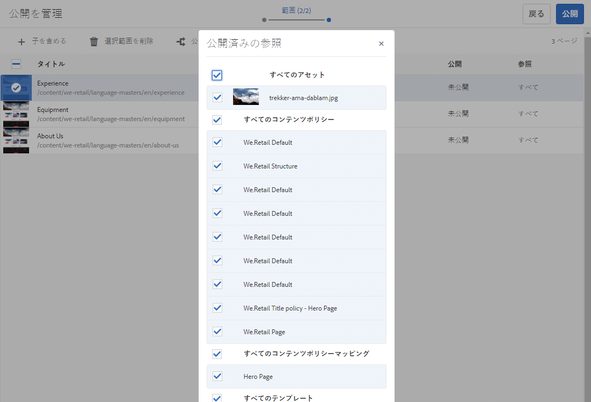
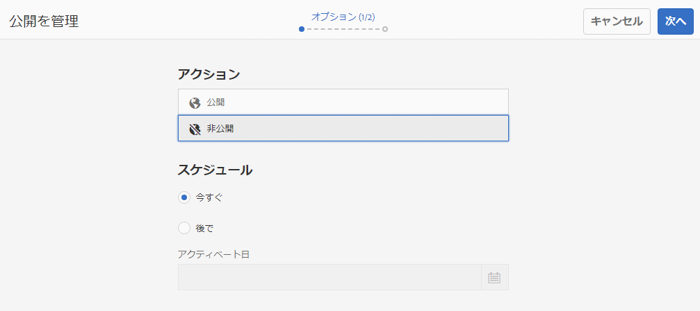

# ページの公開  {#publishing-pages}

オーサー環境でコンテンツを作成およびレビューした後、 [公開 Web サイトで利用できるようにする](/help/sites-authoring/author.md#concept-of-authoring-and-publishing) （パブリッシュ環境）。

これは、ページの公開と呼ばれます。 パブリッシュ環境からページを削除する場合は、ページの非公開と呼ばれます。ページの公開と非公開を行う場合、ページを削除するまで、オーサー環境では引き続き変更を加えることができます。

また、ページの公開/非公開は、即座におこなうことも、後で事前定義済みの日時におこなうこともできます。

>[!NOTE]
>
>公開に関連する特定の用語が混同される場合があります。
>
>* **公開／非公開**
   >  環境でコンテンツを公開する（または非公開にする）アクションに対して主に使用される用語です。
>
>* **アクティブ化／非アクティブ化**
   >  公開／非公開と同義です。
>
>* **レプリケート／レプリケーション**
   >  公開やユーザーコメントのリバースレプリケーションの際などに行われる、環境間でのデータ（ページコンテンツ、ファイル、コード、ユーザーコメントなど）の移動を表す技術用語です。
>

>[!NOTE]
>
>特定のページを公開するために必要な特権がない場合。
>
>* ワークフローがトリガーされ、適切なユーザーに公開リクエストが通知されます。
>* この [ワークフローはカスタマイズされている可能性があります](/help/sites-developing/workflows-models.md#main-pars-procedure-6fe6) 開発チームによって。
>* ワークフローがトリガーされたことを通知するメッセージが少しの間表示されます。
>

## ページの公開  {#publishing-pages-1}

場所に応じて、次から公開できます。

* [ページエディターから](/help/sites-authoring/publishing-pages.md#publishing-from-the-editor)
* [サイトコンソールから](/help/sites-authoring/publishing-pages.md#publishing-from-the-console)

### エディターからの公開 {#publishing-from-the-editor}

ページを編集している場合、エディターから直接公開できます。

1. **ページ情報**&#x200B;アイコンを選択してメニューを開き、「**ページを公開**」オプションを選択します。

   

1. 公開が必要な参照がページに含まれているかどうかに応じて、次の操作を行います。

   * 公開する参照がない場合、ページが直接公開されます。
   * 公開が必要な参照がページに含まれている場合は、それらのリストが&#x200B;**公開**&#x200B;ウィザードに表示され、ウィザードで次のいずれかを実行できます。

      * ページと一緒に公開するアセットやタグなどを指定し、「**公開**」を使用してプロセスを完了します。

      * 「**キャンセル**」を使用してアクションを中止します。

   

1. 「**公開**」を選択して、パブリッシュ環境にページをレプリケートします。ページエディターに、公開アクションを確認する情報バナーが表示されます。

   

   コンソールで同じページを表示すると、更新された公開ステータスが表示されます。

   

>[!NOTE]
>
>エディターからの公開は、浅い公開です。つまり、選択したページだけが公開され、子ページは公開されません。

>[!NOTE]
>
>エディターで[エイリアス](/help/sites-authoring/editing-page-properties.md#advanced)を使用してアクセスしたページは公開できません。エディターの「公開」オプションは、実際のパスからアクセスするページでのみ使用できます。

### コンソールからの公開 {#publishing-from-the-console}

サイトコンソールには、2 つの公開オプションがあります。

* [クイック公開](/help/sites-authoring/publishing-pages.md#quick-publish)
* [公開を管理](/help/sites-authoring/publishing-pages.md#manage-publication)

#### クイック公開 {#quick-publish}

**クイック公開** は単純な場合に使用し、選択したページを直ちに公開します。操作は必要ありません。 このため、非公開の参照も自動的に公開されます。

クイック公開でページを公開するには：

1. サイトコンソールで 1 つ以上のページを選択し、「**クイック公開**」ボタンをクリックします。

   

1. クイック公開ダイアログで、「**公開**」をクリックして公開を確認するか、「**キャンセル**」をクリックしてキャンセルします。すべての非公開の参照も自動的に公開されることに注意してください。

   

1. ページが公開されると、公開を確認するアラートが表示されます。

>[!NOTE]
>
>クイック公開は、浅い公開です。つまり、選択したページ（複数可）のみが公開され、子ページは公開されません。

#### 公開を管理 {#manage-publication}

**公開を管理**&#x200B;には、クイック公開よりも多くのオプションがあります。子ページを含めたり、参照をカスタマイズしたり、使用可能なワークフローを開始したり、後日公開するためのオプションを提供したりします。

「公開を管理」を使用してページを公開または非公開にするには：

1. サイトコンソールで 1 つ以上のページを選択し、 **公開を管理** 」ボタンをクリックします。

   

1. **公開を管理**&#x200B;ウィザードが起動します。最初のステップは **オプション**&#x200B;を使用すると、次のことができます。

   * 選択したページの公開または非公開を選択する。
   * 今すぐ実行するか、後日実行するかを選択します。

   後で公開すると、選択したページを指定した時間に公開するワークフローが開始されます。 逆に、後で非公開にすると、特定の時間に選択したページを非公開にするワークフローが開始されます。

   公開／非公開を後からキャンセルする場合は、[ワークフローコンソール](/help/sites-administering/workflows.md)に移動して、対応するワークフローを終了します。

   

   「**次へ**」をクリックして次に進みます。

1. 公開を管理ウィザードの次の手順の&#x200B;**範囲**&#x200B;では、子ページを含めたり、参照を含めたりするなど、公開／非公開の範囲を定義できます。

   

   公開を管理ウィザードを開始する前に選択し忘れた場合は、「**コンテンツを追加**」ボタンを使用して、公開するページのリストにページを追加できます。

   「コンテンツを追加」ボタンをクリックすると、[パスブラウザー](/help/sites-authoring/author-environment-tools.md#path-browser)が開き、コンテンツを選択できます。

   必要なページを選択し、「**選択**」をクリックしてコンテンツをウィザードに追加するか、「キャンセル」をクリックして選択をキャンセルして、ウィザードに戻ります。

   ウィザードに戻ると、リスト内の項目を選択して、次のようなその他のオプションを設定できます。

   * 子を含めます。
   * 選択範囲から削除します。
   * 公開済みの参照を管理します。

   

   クリック **子を含める** ダイアログが開き、次の操作が可能になります。

   * 直近の子のみを含める。
   * 変更されたページのみを含める。
   * 既に公開済みのページのみを含める。

   クリック **追加** をクリックし、選択オプションに基づいて、公開または非公開にするページのリストに子ページを追加します。 「**キャンセル**」をクリックすると、選択がキャンセルされ、ウィザードに戻ります。

   

   ウィザードに戻ると、子を含めるダイアログでのオプションの選択に基づいて追加されたページが表示されます。

   ページを選択して「**公開済みの参照**」ボタンをクリックすると、ページに対して公開または非公開にする参照を表示および変更できます。

   

   この **公開済みの参照** ダイアログには、選択したコンテンツの参照が表示されます。 デフォルトでは、これらはすべて選択され、公開/非公開にされますが、「 」をオフにして選択を解除し、アクションに含めないようにすることができます。

   クリック **完了** 変更を保存するか、 **キャンセル** をクリックして選択をキャンセルし、ウィザードに戻ります。

   ウィザードに戻ると、「**参照**」列が更新されて、公開または非公開にする参照の選択が反映されます。

   

1. 「**公開**」をクリックして完了します。

   サイトコンソールに戻ると、公開を確認する通知メッセージが表示されます。

1. 公開したページがワークフローに関連付けられている場合、公開ウィザードの最後の&#x200B;**ワークフロー**&#x200B;ステップに表示されます。

   >[!NOTE]
   >
   >**ワークフロー**&#x200B;手順は、ユーザーの権限に基づいて表示されます。詳しくは、公開権限に関する[このページの前述の注意事項](/help/sites-authoring/publishing-pages.md#main-pars-note-0-ejsjqg-refd)、[ワークフローへのアクセスの管理](/help/sites-administering/workflows-managing.md)および[ページへのワークフローの適用](/help/sites-authoring/workflows-applying.md#main-pars-text-5-bvhbkh-refd)を参照してください。

   リソースは、トリガーされたワークフローによってグループ化され、次の各オプションが提供されます。

   * ワークフローのタイトルを定義します。
   * ワークフローに含まれる場合、ワークフローパッケージを維持する [マルチリソースサポート](/help/sites-developing/workflows-models.md#configuring-a-workflow-for-multi-resource-support).
   * ワークフローパッケージを維持するオプションが選択されている場合、ワークフローパッケージのタイトルを定義する。

   「**公開**」または「**後で公開する**」をクリックして、公開を完了します。

   

## ページを非公開にする {#unpublishing-pages}

ページを非公開にすると、そのページがパブリッシュ環境から削除され、読者に公開されなくなります。

[公開と同様の方法](/help/sites-authoring/publishing-pages.md#publishing-pages)で、1 つ以上のページを非公開にすることができます。

* [ページエディターから](/help/sites-authoring/publishing-pages.md#unpublishing-from-the-editor)
* [サイトコンソールから](/help/sites-authoring/publishing-pages.md#unpublishing-from-the-console)

### エディターから非公開にする {#unpublishing-from-the-editor}

ページの編集時に、そのページを非公開にする場合は、「 **ページを非公開にする** 内 **ページ情報** メニューは、 [ページを公開](/help/sites-authoring/publishing-pages.md#publishing-from-the-editor).

>[!NOTE]
>
>エディターで[エイリアス](/help/sites-authoring/editing-page-properties.md#advanced)を使用してアクセスしたページは、非公開にすることができません。エディターの「公開」オプションは、実際のパスからアクセスするページでのみ使用できます。

### コンソールから非公開にする {#unpublishing-from-the-console}

[「公開を管理」オプションを使用して公開する](/help/sites-authoring/publishing-pages.md#manage-publication)場合と同様に、「公開を管理」オプションを使用して非公開にできます。

1. サイトコンソールで 1 つ以上のページを選択し、 **公開を管理** 」ボタンをクリックします。
1. **公開を管理**&#x200B;ウィザードが起動します。最初の手順の&#x200B;**オプション**&#x200B;で、デフォルトオプションの&#x200B;**公開**&#x200B;の代わりに&#x200B;**非公開**&#x200B;を選択します。

   

   後で公開することを選択するとこのバージョンのページを公開するワークフローが指定した時間に開始されるのと同じように、後でアクティベートを解除することを選択すると、選択したページを非公開にするワークフローが特定の時間に開始されます。

   公開／非公開を後からキャンセルする場合は、[ワークフローコンソール](/help/sites-administering/workflows.md)に移動して、対応するワークフローを終了します。

1. 非公開の操作を完了するには、ウィザードを続行します。 [ページを公開](/help/sites-authoring/publishing-pages.md#manage-publication).

## ツリーの公開と非公開 {#publishing-and-unpublishing-a-tree}

多数のコンテンツページを入力または更新した場合（すべて同じルートページの下に存在）、ツリー全体を 1 回の操作で簡単に公開できます。

サイトコンソールにある「[公開を管理](/help/sites-authoring/publishing-pages.md#manage-publication)」オプションを使用すると、これを行うことができます。

1. サイトコンソールで、公開または非公開にするツリーのルートページを選択し、「 」を選択します **公開を管理**.
1. **公開を管理**&#x200B;ウィザードが起動します。公開または非公開にするタイミングと、実行するタイミングを選択して、 **次へ** をクリックして続行します。
1. 内 **範囲** ステップで、ルートページを選択し、 **子を含める**.

   

1. 内 **子を含める** ダイアログで、次のオプションをオフにします。

   * 直近の子のみを含める
   * 既に公開済みのページのみを含める

   これらのオプションはデフォルトで選択されているので、忘れずに選択を解除する必要があります。 クリック **追加** をクリックして、コンテンツを公開/非公開に追加します。

   

1. この **公開を管理** ウィザードは、レビュー用にツリーの内容をリストします。 追加のページを追加したり、選択したページを削除したりして、選択をさらにカスタマイズできます。

   

   「**公開済みの参照**」オプションを使用して、公開する参照を確認することもできます。

1. [通常どおりに公開を管理ウィザードを続行](#manage-publication)して、ツリーの公開または非公開を完了します。

## 公開ステータスの判別 {#determining-publication-status}

ページの公開ステータスを次のように決定できます。

* [サイトコンソールのリソースの概要情報](/help/sites-authoring/basic-handling.md#viewing-and-selecting-resources)

   

   公開ステータスは、サイトコンソールの[カード](/help/sites-authoring/basic-handling.md#card-view)、[列](/help/sites-authoring/basic-handling.md#column-view)および[リスト](/help/sites-authoring/basic-handling.md#list-view)表示に表示されます。

* [タイムライン](/help/sites-authoring/basic-handling.md#timeline)

   

* （ページ編集時の）[ページ情報メニュー](/help/sites-authoring/author-environment-tools.md#page-information)

   
