# ページのオーサリングのクイックガイド{#quick-guide-to-authoring-pages}

ここでは、AEM でページコンテンツをオーサリングする際の主なアクションについて、概要レベルのクイックガイドとなる手順を示します。

このクイックガイドの特徴は次のとおりです。

* すべての内容を網羅しているわけではありません。
* 詳細を示すドキュメントへのリンクが用意されています。

AEM によるオーサリングについて詳しくは、以下を参照してください。

* [作成者が行う最初の手順](/help/sites-authoring/first-steps.md)
* [ページのオーサリング](/help/sites-authoring/page-authoring.md)

## クイックヒント {#a-few-quick-hints}

具体的な事例の概要を取り上げる前に、覚えておく価値のある一般的なヒントを紹介します。

### サイトコンソール {#sites-console}

* **作成**

   * このボタンは多くのコンソールで使用できます。表示されるオプションはコンテキストに依存するので、シナリオによって変わることがあります。

* フォルダー内のページの並べ替え

   * これは[リスト表示](/help/sites-authoring/basic-handling.md#list-view)でおこなえます。変更内容は他の表示にも反映されます。

#### ページオーサリング {#page-authoring}

* リンクのナビゲーション

   * **編集**&#x200B;モードでは&#x200B;***リンクを使用して移動できません***。リンクを使用して移動するには、次のいずれかを使用して[ページをプレビュー](/help/sites-authoring/editing-content.md#previewing-pages)する必要があります。

      * [プレビューモード](/help/sites-authoring/editing-content.md#preview-mode)
      * [公開済みとして表示](/help/sites-authoring/editing-content.md#view-as-published)

* バージョンは、ページエディターで開始または作成されるわけではありません。（選択したリソースの「**作成**」または「[タイムライン](/help/sites-authoring/basic-handling.md#timeline)」を通じて）サイトコンソールでおこなわれるようになりました。

>[!NOTE]
>
>オーサリング作業をより簡単にできる多くのキーボードショートカットがあります。
>
>* [ページ編集時のキーボードショートカット](/help/sites-authoring/page-authoring-keyboard-shortcuts.md)
>* [コンソールのキーボードショートカット](/help/sites-authoring/keyboard-shortcuts.md)

>

### ページの検索 {#finding-your-page}

ページの検索には様々な特徴があります。移動や検索をおこなうには、次のようにします。

1. （**グローバルナビゲーション**&#x200B;の「**サイト**」オプションを使用して）[サイト](/help/sites-authoring/basic-handling.md#global-navigation)コンソールを開きます。これは、Adobe Experience Manager リンク（左上）を選択するとトリガー（ドロップダウン）されます。

1. 適切なページをタップまたはクリックしてツリーの下方向に移動します。ページリソースがどのように表されるかは、使用している表示（[カード、リスト、列](/help/sites-authoring/basic-handling.md#viewing-and-selecting-resources)）によって異なります。

   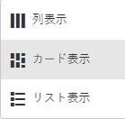

1. [ヘッダーのパンくず](/help/sites-authoring/basic-handling.md#theheaderwithbreadcrumbs)を使用してツリーの上に移動します。これにより、選択した場所に戻ることができます。

   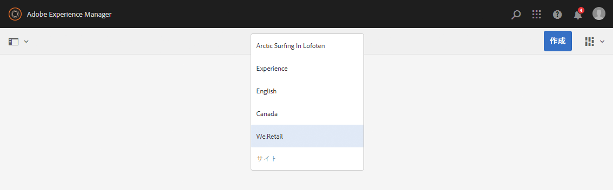

1. また、ページを[検索](/help/sites-authoring/search.md)することもできます。表示された結果からページを選択できます。

   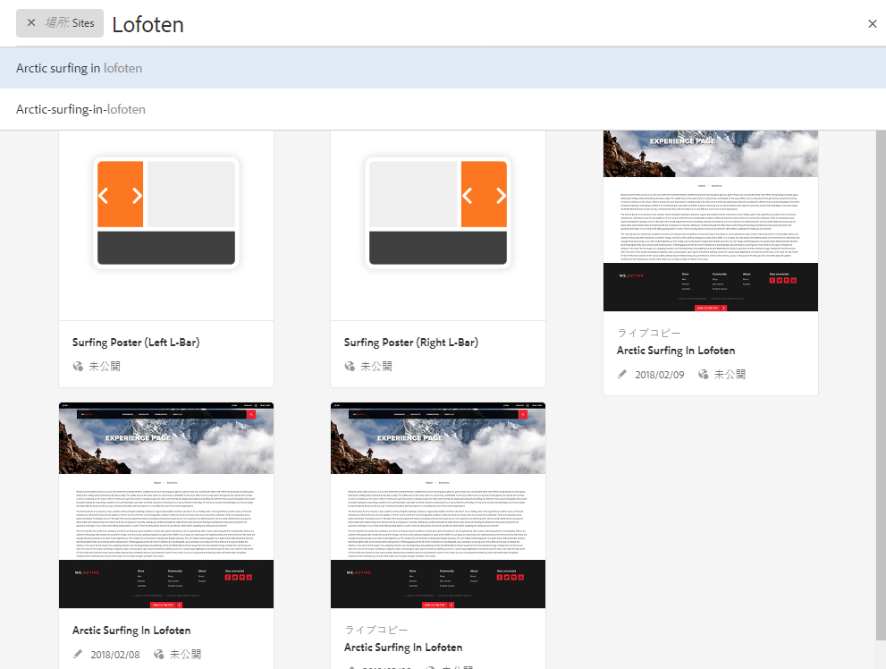

### 新しいページの作成 {#creating-a-new-page}

[新しいページを作成](/help/sites-authoring/managing-pages.md#creating-a-new-page)するには：

1. [新しいページを作成する場所に移動します。](#finding-your-page)
1. 「**作成**」アイコンを使用して、リストから「**ページ**」を選択します。

   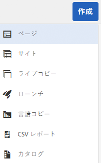

1. [新しいページの作成](/help/sites-authoring/managing-pages.md#creating-a-new-page)に必要な情報を収集するためのウィザードが開きます。画面に表示される手順に従ってください。

### その他のアクションを実行するページの選択 {#selecting-your-page-for-further-action}

アクションを実行するページを選択できます。ページを選択するとツールバーが自動的に更新され、そのリソースに関連するアクションが表示されます。

ページを選択する方法は、コンソールで使用している表示によって異なります。

1. 列表示：

   * 必要なリソースのサムネールをタップまたはクリックします。サムネールが選択されていることを示すために、サムネールにチェックマークが付けられます。

1. リスト表示：

   * 必要なリソースのサムネールをタップまたはクリックします。サムネールが選択されていることを示すために、サムネールにチェックマークが付けられます。

1. カード表示：

   * [必要なリソースを選択](/help/sites-authoring/basic-handling.md#viewingandselectingyourresources)して選択モードに入ります。次のように選択します。

      * モバイルデバイス：タップ＆ホールドする
      * デスクトップ：[クイックアクション](/help/sites-authoring/basic-handling.md#quick-actions) - チェックマークアイコン

   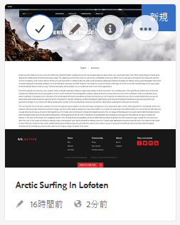

   * ページが選択されていることを示すために、カードにチェックマークが付けられます。
   >[!NOTE]
   >
   >選択モードを開始すると、**選択**&#x200B;アイコン（チェックマーク）が&#x200B;**選択を解除**&#x200B;アイコン（バツマーク）に変わります。

### クイックアクション（カード表示／デスクトップのみ） {#quick-actions-card-view-desktop-only}

次のようにして、[クイックアクション](/help/sites-authoring/basic-handling.md#quick-actions)を使用できます。

1. アクションを実行する[ページに移動](#finding-your-page)します。
1. 必要なリソースを表すカードの上にマウスポインターを置きます。クイックアクションが表示されます。

   

### ページコンテンツの編集 {#editing-your-page-content}

ページを編集するには：

1. 編集する[ページに移動します。](#finding-your-page)
1. 編集（鉛筆）アイコンを使用して、[編集するページを開きます](/help/sites-authoring/managing-pages.md#opening-a-page-for-editing)。

   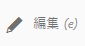

   このアイコンには、次の場所からアクセスできます。

   * 該当するリソースの[クイックアクション（カード表示／デスクトップのみ）](#quick-actions-card-view-desktop-only)
   * ツールバー（[ページが選択されている](#selectiingyourpageforfurtheraction)場合）

1. エディターが開くと、次の操作を実行できます。

   * 次の方法を使用して、[新しいコンポーネントをページに追加](/help/sites-authoring/editing-content.md#inserting-a-component)します。

      * サイドパネルを開く。
      * 「コンポーネント」タブを選択する（[コンポーネントブラウザー](/help/sites-authoring/author-environment-tools.md#components-browser)）。
      * 必要なコンポーネントをページにドラッグする。

      サイドパネルは、次のアイコンで開く（および閉じる）ことができます。
   

   * ページ上の[既存のコンポーネントのコンテンツを編集](/help/sites-authoring/editing-content.md#edit-configure-copy-cut-delete-paste)します。

      * タップまたはクリックしてコンポーネントツールバーを開きます。ダイアログを開くには、**編集**（鉛筆）アイコンを使用します。
      * タップ＆ホールドを使用するか、またはゆっくりダブルクリックして、コンポーネント用のインプレースエディターを開きます。使用可能なアクションが表示されます（一部のコンポーネントでは、このアクションが限定されます）。
      * 実行できるすべてのアクションを表示するには、次のアイコンを使用して全画面表示モードに切り替えます。

   

   * [既存のコンポーネントのプロパティを設定します。](/help/sites-authoring/editing-content.md#component-edit-dialog)

      * タップまたはクリックしてコンポーネントツールバーを開きます。ダイアログを開くには、**設定**（スパナ）アイコンを使用します。
   * 次のいずれかの方法で[コンポーネントを移動します。](/help/sites-authoring/editing-content.md#moving-a-component)

      * 必要なコンポーネントを新しい位置までドラッグします。
      * タップまたはクリックしてコンポーネントツールバーを開きます。必要に応じて、**切り取り**&#x200B;アイコン、続いて&#x200B;**貼り付け**&#x200B;アイコンを使用します。
   * コンポーネントを[コピー（および貼り付け）](/help/sites-authoring/editing-content.md#edit-configure-copy-cut-delete-paste)します。

      * タップまたはクリックしてコンポーネントツールバーを開きます。必要に応じて、**コピー**&#x200B;アイコン、続いて&#x200B;**貼り付け**&#x200B;アイコンを使用します。
   >[!NOTE]
   >
   >同じページ、または別のページにコンポーネントを&#x200B;**貼り付ける**&#x200B;ことができます。切り取り／コピー操作を実行する前に開かれていたページに貼り付けるには、そのページを更新する必要があります。

   * コンポーネントを[削除します。](/help/sites-authoring/editing-content.md#edit-configure-copy-cut-delete-paste)

      * タップまたはクリックしてコンポーネントツールバーを開き、**削除**&#x200B;アイコンを使用します。
   * ページに[注釈を追加](/help/sites-authoring/annotations.md#annotations)します。

      * **注釈**&#x200B;モード（吹き出しアイコン）を選択します。**注釈を追加**（プラス）アイコンを使用して注釈を追加します。右上の X を使用して注釈モードを終了します。

   

   * [ページをプレビューします](/help/sites-authoring/editing-content.md#preview-mode)（パブリッシュ環境での表示方法を確認します）。

      * ツールバーから「**プレビュー**」を選択します。
   * 「**編集**」ドロップダウンセレクターを使用して、編集モードに戻ります（またはその他のモードを選択します）。

   >[!NOTE]
   >
   >コンテンツのリンクを使用して移動するには、[プレビューモード](/help/sites-authoring/editing-content.md#preview-mode)を使用する必要があります。

### ページプロパティの編集 {#editing-the-page-properties}

[ページプロパティを編集する](/help/sites-authoring/editing-page-properties.md)には、（主に）以下の 2 つの方法があります。

* **サイト**&#x200B;コンソールから：

   1. 公開する[ページに移動します。](#finding-your-page)
   1. 次のいずれかで「**プロパティ**」アイコンを選択します。

      * 該当するリソースの[クイックアクション（カード表示／デスクトップのみ）](#quick-actions-card-view-desktop-only)
      * ツールバー（[ページが選択されている](#selectiingyourpageforfurtheraction)場合）

   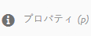

   1. ページのプロパティが表示されます。必要に応じて変更を加え、「保存」を使用してそれらを保持します。

* [ページの編集](#editing-your-page-content)中に次の操作を実行します。

   1. **ページ情報**&#x200B;メニューを開きます。
   1. 「**プロパティを開く**」を選択して、プロパティを編集するためのダイアログを開きます。

   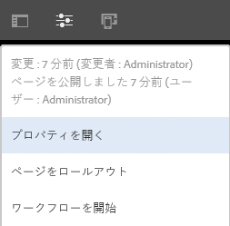

### ページの公開（または非公開） {#publishing-your-page-or-unpublishing}

[ページを公開する](/help/sites-authoring/publishing-pages.md)（および非公開にする）には、主に 2 つの方法があります。

* **サイト**&#x200B;コンソールから：

   1. 公開する[ページに移動します。](#finding-your-page)
   1. 次のいずれかで「**クイック公開**」アイコンをクリックします。

      * 該当するリソースの[クイックアクション（カード表示／デスクトップのみ）](#quick-actions-card-view-desktop-only)
      * （[ページが選択されている](#selectiingyourpageforfurtheraction)場合）ツールバー（「[後で公開する](/help/sites-authoring/publishing-pages.md#main-pars-title-12)」にアクセスすることもできます）

   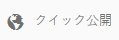

* [ページの編集](#editing-your-page-content)中に次の操作を実行します。

   1. **ページ情報**&#x200B;メニューを開きます。
   1. 「**ページを公開**」を選択します。

   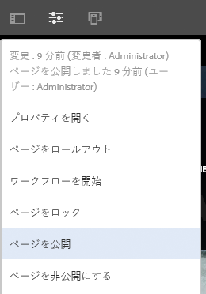

* コンソールからページを非公開にする場合は、「**公開を管理**」オプションからのみおこなうことができます。このオプションは、ツールバーでのみ使用できます（クイックアクションからは使用できません）。

   「**ページを非公開にする**」オプションは、エディターの&#x200B;**ページ情報**&#x200B;メニューから引き続き使用できます。

   

   詳しくは、[ページの公開](/help/sites-authoring/publishing-pages.md#unpublishing-pages)を参照してください。

### ページの移動、コピー、貼り付けまたは削除 {#move-copy-and-paste-or-delete-your-page}

これらのアクションはすべて次の操作で実行できます。

1. 移動、コピー、貼り付けまたは削除をおこなう[ページに移動します。](#finding-your-page)
1. 必要に応じて、次のいずれかを使用して、コピー（続いて貼り付け）、移動または削除のアイコンを選択します。

   * 必要なリソースの[クイックアクション（カード表示／デスクトップのみ）。](#quick-actions-card-view-desktop-only)
   * ツールバー（[ページが選択されている](#selecting-your-page-for-further-action)場合）

   以降の操作は、アクションに応じて、次のようになります。

   * コピー：

      * 新しい場所に移動して、貼り付けをおこなう必要があります。
   * 移動：

      * ページの移動に必要な情報を収集するためのウィザードが開きます。画面に表示される手順に従ってください。
   * 削除：

      * この操作の確認が求められます。
   >[!NOTE]
   >
   >削除は、クイックアクションでは使用できません。

### ページのロック（およびロック解除） {#locking-your-page-then-unlocking}

[ページのロック](/help/sites-authoring/editing-content.md#locking-a-page)によって、自分の作業中に他の作成者が作業するのを防ぐことができます。ロック（およびロック解除）アイコン／ボタンは次の場所にあります。

* ツールバー（[ページが選択されている](#selecting-your-page-for-further-action)場合）
* （ページの編集時）[ページ情報ドロップダウンメニュー](#editing-the-page-properties)
* （ページの編集時）ページツールバー（ページがロックされている場合）

例えば、「ロック」アイコンは次のように表示されます。

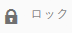

### ページ参照へのアクセス {#accessing-page-references}

参照レールでは、ページへの（またはページからの）[参照に対するクイックアクセスを使用](/help/sites-authoring/author-environment-tools.md#references)できます。

1. （**ページ選択**&#x200B;の前または後に）ツールバーアイコンを使用して「[参照](#selecting-your-page-for-further-action)」を選択します。

   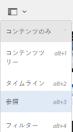

   参照のタイプのリストが表示されます。

   

1. 詳細を表示して適宜その他のアクションを実行するには、必要なタイプの参照をタップまたはクリックします。

### ページのバージョンの作成 {#creating-a-version-of-your-page}

ページの[バージョン](/help/sites-authoring/working-with-page-versions.md)を作成するには：

1. タイムラインレールを開くには、（**[ページ選択](/help/sites-authoring/basic-handling.md#timeline)**&#x200B;の前または後に）ツールバーアイコンを使用して「[タイムライン](#selecting-your-page-for-further-action)」を選択します。

   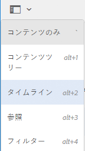

1. 「タイムライン」列の右下にある上向き矢印をタップまたはクリックし、その他のボタン（「**バージョンとして保存**」など）を表示します。

   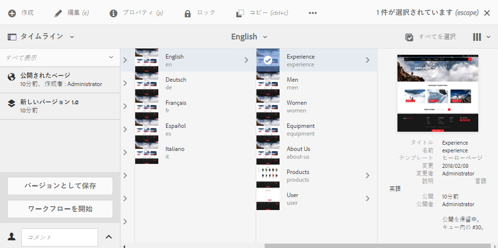

1. 「**保存するバージョン**」を選択し、「**作成**」を選択します。

### ページのバージョンの復元と比較 {#restoring-comparing-a-version-of-your-page}

ページのバージョンの復元と比較では、使用する基本的なメカニズムは同じです。

1. （**[ページ選択](/help/sites-authoring/basic-handling.md#timeline)**&#x200B;の前または後に）ツールバーアイコンを使用して「[タイムライン](#selecting-your-page-for-further-action)」を選択します。

   

   ページのバージョンが既に保存されている場合、そのバージョンがタイムラインに表示されます。

1. 復元するバージョンをタップまたはクリックします。これにより、追加のアクションボタンが表示されます。

   * **このバージョンに戻る**

      * このバージョンが復元されます。
   * **違いを表示**

      * （2 つのバージョン間の）違いが強調表示されたページが開きます。
