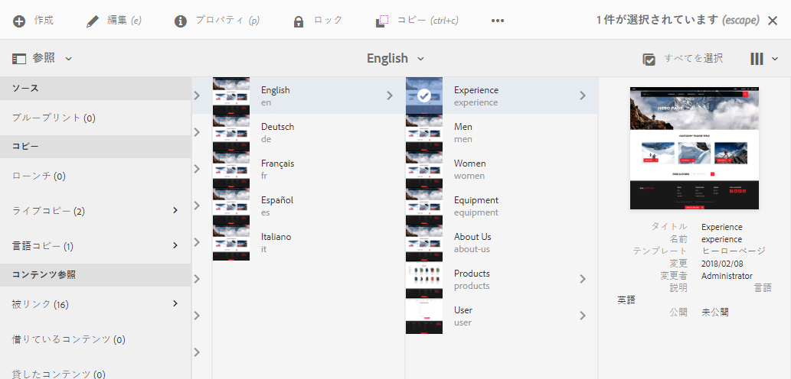

# ページオーサリングのクイックガイド{#quick-guide-to-authoring-pages}

これらの手順は、AEMでページコンテンツをオーサリングする際の主なアクションに関するクイックガイド（概要レベル）として用意されています。

開発者は、次の作業を行います。

* 包括的な対象とはなりません。
* 詳細なドキュメントへのリンクを提供します。

AEM によるオーサリングについて詳しくは、以下を参照してください。

* [作成者が行う最初の手順](/help/sites-authoring/first-steps.md)
* [ページのオーサリング](/help/sites-authoring/page-authoring.md)

## クイックヒント {#a-few-quick-hints}

具体的な概要を説明する前に、以下に、覚えておく価値のある一般的なヒントとヒントの小さなコレクションを示します。

### Sites コンソール {#sites-console}

* **作成**

   * このボタンは多くのコンソールで使用できます。表示されるオプションはコンテキストに依存するので、シナリオによって異なる場合があります。

* フォルダー内のページの並べ替え

   * これは、で実行できます。 [リスト表示](/help/sites-authoring/basic-handling.md#list-view). 変更が適用され、他のビューに表示されます。

#### ページオーサリング {#page-authoring}

* リンクのナビゲーション

   * ***リンクはナビゲーションに使用できません*** いつ **編集** モード。 リンクを使用して移動するには、次の操作が必要です。 [ページをプレビュー](/help/sites-authoring/editing-content.md#previewing-pages) 次のいずれかを使用します。

      * [プレビューモード](/help/sites-authoring/editing-content.md#preview-mode)
      * [公開済みとして表示](/help/sites-authoring/editing-content.md#view-as-published)

* バージョンは、ページエディターから開始または作成されません。これは、サイトコンソールから ( **作成** または [タイムライン](/help/sites-authoring/basic-handling.md#timeline) （選択したリソース）。

>[!NOTE]
>
>オーサリングをより簡単にするためのキーボードショートカットがいくつか用意されています。
>
>* [ページ編集時のキーボードショートカット](/help/sites-authoring/page-authoring-keyboard-shortcuts.md)
>* [コンソールのキーボードショートカット](/help/sites-authoring/keyboard-shortcuts.md)
>

### ページの検索 {#finding-your-page}

ページの検索には様々な特徴があります。移動や検索をおこなうには、次のようにします。

1. を開きます。 **サイト** コンソール ( **サイト** オプション [グローバルナビゲーション](/help/sites-authoring/basic-handling.md#global-navigation)) - Adobe Experience Managerリンク（左上）を選択するとトリガー（ドロップダウン）されます。

1. 適切なページをタップまたはクリックしてツリーの下方向に移動します。ページリソースがどのように表されるかは、使用している表示（[カード、リスト、列](/help/sites-authoring/basic-handling.md#viewing-and-selecting-resources)）によって異なります。

   

1. [ヘッダーのパンくず](/help/sites-authoring/basic-handling.md#theheaderwithbreadcrumbs)を使用してツリーの上に移動します。これにより、選択した場所に戻ることができます。

   

1. また、 [検索](/help/sites-authoring/search.md) ページの 表示された結果からページを選択できます。

   

### 新しいページの作成 {#creating-a-new-page}

宛先 [ページの作成](/help/sites-authoring/managing-pages.md#creating-a-new-page):

1. [場所に移動します。](#finding-your-page) ページを作成する場所です。
1. 以下を使用： **作成** アイコンをクリックし、 **ページ** リストから：

   

1. ウィザードが開き、必要な情報の収集方法が示されます。 [新しいページの作成](/help/sites-authoring/managing-pages.md#creating-a-new-page). 画面に表示される指示に従います。

### 追加のアクションを実行するページの選択 {#selecting-your-page-for-further-action}

ページを選択してアクションを実行できます。 ページを選択すると、ツールバーが自動的に更新され、そのリソースに関連するアクションが表示されます。

ページの選択方法は、コンソールで使用している表示によって異なります。

1. 列表示：

   * 必要なリソースのサムネールをタップまたはクリックします。サムネールが選択されていることを示すために、サムネールにチェックマークが付けられます。

1. リスト表示：

   * 必要なリソースのサムネールをタップまたはクリックします。サムネールが選択されていることを示すために、サムネールにチェックマークが付けられます。

1. カード表示：

   * 次の条件で選択モードを入力 [必要なリソースの選択](/help/sites-authoring/basic-handling.md#viewingandselectingyourresources) 次を使用：

      * モバイルデバイス：タップ&amp;ホールド
      * デスクトップ：[クイックアクション](/help/sites-authoring/basic-handling.md#quick-actions) - チェックマークアイコン

   

   * ページが選択されていることを示すために、カードにチェックマークが付けられます。

   >[!NOTE]
   >
   >選択モードを開始すると、**選択**&#x200B;アイコン（チェックマーク）が&#x200B;**選択を解除**&#x200B;アイコン（バツマーク）に変わります。

### クイックアクション（カード表示／デスクトップのみ） {#quick-actions-card-view-desktop-only}

次のようにして、[クイックアクション](/help/sites-authoring/basic-handling.md#quick-actions)を使用できます。

1. アクションを実行する[ページに移動](#finding-your-page)します。
1. 必要なリソースを表すカードの上にマウスポインターを置きます。クイックアクションが表示されます。

   

### ページコンテンツの編集 {#editing-your-page-content}

1. 編集する[ページに移動します。](#finding-your-page)
1. 編集（鉛筆）アイコンを使用して、[編集するページを開きます](/help/sites-authoring/managing-pages.md#opening-a-page-for-editing)。

   

   このアイコンには、次の場所からアクセスできます。

   * 該当するリソースの[クイックアクション（カード表示／デスクトップのみ）](#quick-actions-card-view-desktop-only)
   * ツールバー（[ページが選択されている](#selectiingyourpageforfurtheraction)場合）

1. エディターが開いたら、次の操作を実行できます。

   * 次の方法を使用して、[新しいコンポーネントをページに追加](/help/sites-authoring/editing-content.md#inserting-a-component)します。

      * サイドパネルを開く
      * 「コンポーネント」タブを選択する ( [コンポーネントブラウザー](/help/sites-authoring/author-environment-tools.md#components-browser))
      * 必要なコンポーネントをページにドラッグします。

     サイドパネルは、次のアイコンで開く（および閉じる）ことができます。

     

   * [既存のコンポーネントのコンテンツを編集](/help/sites-authoring/editing-content.md#edit-configure-copy-cut-delete-paste) ページ上：

      * タップまたはクリックしてコンポーネントツールバーを開きます。以下を使用： **編集** （鉛筆）アイコンをクリックして、ダイアログを開きます。
      * タップ&amp;ホールドまたはダブルスロークリックで、コンポーネントのインプレースエディターを開きます。 使用可能なアクションが表示されます（一部のコンポーネントでは、選択は制限されています）。
      * 使用可能なすべてのアクションを表示するには、次を使用してフルスクリーンモードに入ります。

     

   * [既存のコンポーネントのプロパティを設定します。](/help/sites-authoring/editing-content.md#component-edit-dialog)

      * タップまたはクリックしてコンポーネントツールバーを開きます。以下を使用： **設定** （レンチ）アイコンを使用して、ダイアログを開きます。

   * [コンポーネントの移動](/help/sites-authoring/editing-content.md#moving-a-component) 次のいずれか：

      * 必要なコンポーネントを新しい場所にドラッグします。
      * タップまたはクリックしてコンポーネントツールバーを開きます。必要に応じて、**切り取り**&#x200B;アイコン、続いて&#x200B;**貼り付け**&#x200B;アイコンを使用します。

   * [コピー（および貼り付け）](/help/sites-authoring/editing-content.md#edit-configure-copy-cut-delete-paste) 1 つのコンポーネント：

      * タップまたはクリックしてコンポーネントツールバーを開きます。必要に応じて、**コピー**&#x200B;アイコン、続いて&#x200B;**貼り付け**&#x200B;アイコンを使用します。

   >[!NOTE]
   >
   >同じページ、または別のページにコンポーネントを&#x200B;**貼り付ける**&#x200B;ことができます。切り取り／コピー操作を実行する前に開かれていたページに貼り付けるには、そのページを更新する必要があります。

   * コンポーネントを[削除します。](/help/sites-authoring/editing-content.md#edit-configure-copy-cut-delete-paste)

      * タップまたはクリックしてコンポーネントツールバーを開き、**削除**&#x200B;アイコンを使用します。

   * [注釈の追加](/help/sites-authoring/annotations.md#annotations) を次のページに追加します。

      * を選択します。 **注釈** モード（吹き出しアイコン） を使用した注釈の追加 **注釈を追加** （プラス）アイコン 右上の X を使用して注釈モードを終了します。

     

   * [ページのプレビュー](/help/sites-authoring/editing-content.md#preview-mode) （パブリッシュ環境での表示方法を確認するため）

      * 選択 **プレビュー** をクリックします。

   * を使用して編集モードに戻る（または別のモードを選択する） **編集** ドロップダウンセレクター

   >[!NOTE]
   >
   >コンテンツ内のリンクを使用して移動するには、 [プレビューモード](/help/sites-authoring/editing-content.md#preview-mode).

### ページプロパティの編集 {#editing-the-page-properties}

主に次の 2 つの方法があります。 [ページプロパティの編集](/help/sites-authoring/editing-page-properties.md):

* **サイト**&#x200B;コンソールから：

   1. [ページに移動します。](#finding-your-page) を公開します。
   1. を選択します。 **プロパティ** アイコン：

      * 該当するリソースの[クイックアクション（カード表示／デスクトップのみ）](#quick-actions-card-view-desktop-only)
      * ツールバー（[ページが選択されている](#selectiingyourpageforfurtheraction)場合）

  

   1. ページのプロパティが表示されます。必要に応じて変更を加え、「保存」を使用してそれらを保持します。

* 条件 [ページの編集](#editing-your-page-content):

   1. を開きます。 **ページ情報** メニュー
   1. 選択 **プロパティを開く** をクリックして、プロパティを編集するためのダイアログを開きます。

  

### ページの公開（または非公開） {#publishing-your-page-or-unpublishing}

主に次の 2 つの方法があります。 [ページのパブリッシュ](/help/sites-authoring/publishing-pages.md) （および非公開の場合も）:

* **サイト**&#x200B;コンソールから：

   1. [ページに移動します。](#finding-your-page) を公開します。
   1. 次のいずれかで「**クイック公開**」アイコンをクリックします。

      * 該当するリソースの[クイックアクション（カード表示／デスクトップのみ）](#quick-actions-card-view-desktop-only)
      * （[ページが選択されている](#selectiingyourpageforfurtheraction)場合）ツールバー（「[後で公開する](/help/sites-authoring/publishing-pages.md#main-pars-title-12)」にアクセスすることもできます）

  

* 条件 [ページの編集](#editing-your-page-content):

   1. を開きます。 **ページ情報** メニュー
   1. 選択 **ページを公開**.

  

* コンソールからページを非公開にする場合は、「**公開を管理**」オプションからのみ行うことができます。このオプションは、ツールバーでのみ使用できます（クイックアクションからは使用できません）。

  この **ページを非公開にする** オプションは、 **ページ情報** 」メニューが表示されます。

  

  詳しくは、 [ページの公開](/help/sites-authoring/publishing-pages.md#unpublishing-pages) を参照してください。

### ページの移動、コピー、貼り付け、削除 {#move-copy-and-paste-or-delete-your-page}

これらのアクションは、すべて次の方法でトリガーできます。

1. [ページに移動します。](#finding-your-page) 移動、コピー&amp;ペースト、または削除する
1. 必要に応じて、次のいずれかを使用して、コピー（続いて貼り付け）、移動または削除のアイコンを選択します。

   * [クイックアクション（カード表示/デスクトップのみ）](#quick-actions-card-view-desktop-only) 必要なリソースの
   * ツールバー（[ページが選択されている](#selecting-your-page-for-further-action)場合）

   以降の操作は、アクションに応じて、次のようになります。

   * コピー：

      * 新しい場所に移動して、貼り付けます。

   * 移動：

      * ページの移動に必要な情報を収集するためのウィザードが開きます。 画面に表示される指示に従います。

   * 削除：

      * アクションの確認を求められます。

   >[!NOTE]
   >
   >削除は、クイックアクションでは使用できません。

### ページのロック（およびロック解除） {#locking-your-page-then-unlocking}

[ページのロック](/help/sites-authoring/editing-content.md#locking-a-page)によって、自分の作業中に他の作成者が作業するのを防ぐことができます。ロック（およびロック解除）アイコン／ボタンは次の場所にあります。

* ツールバー（[ページが選択されている](#selecting-your-page-for-further-action)場合）
* この [ページ情報ドロップダウンメニュー](#editing-the-page-properties) （ページの編集時）
* （ページの編集時）ページツールバー（ページがロックされている場合）

例えば、「ロック」アイコンは次のように表示されます。

### ページ参照へのアクセス {#accessing-page-references}

[参照へのクイックアクセス](/help/sites-authoring/author-environment-tools.md#references) 参照レールで、ページに、またはページからを使用できます。

1. （**ページ選択**&#x200B;の前または後に）ツールバーアイコンを使用して「[参照](#selecting-your-page-for-further-action)」を選択します。

   

   参照のタイプのリストが表示されます。

   

1. 必要な参照タイプをタップまたはクリックして詳細を表示し、（必要に応じて）追加のアクションを実行します。

### ページのバージョンの作成 {#creating-a-version-of-your-page}

ページの[バージョン](/help/sites-authoring/working-with-page-versions.md)を作成するには：

1. タイムラインレールを開くには、（**[ページ選択](/help/sites-authoring/basic-handling.md#timeline)**&#x200B;の前または後に）ツールバーアイコンを使用して「[タイムライン](#selecting-your-page-for-further-action)」を選択します。

   

1. 「タイムライン」列の右下にある上向き矢印をタップまたはクリックし、その他のボタン（「**バージョンとして保存**」など）を表示します。

   

1. 「**バージョンとして保存**」を選択し、「**作成**」を選択します。

### ページのバージョンの復元と比較 {#restoring-comparing-a-version-of-your-page}

ページのバージョンの復元と比較では、使用する基本的なメカニズムは同じです。

1. （**[ページ選択](/help/sites-authoring/basic-handling.md#timeline)**&#x200B;の前または後に）ツールバーアイコンを使用して「[タイムライン](#selecting-your-page-for-further-action)」を選択します。

   

   ページのバージョンが既に保存されている場合は、そのバージョンがタイムラインに表示されます。

1. 復元するバージョンをタップまたはクリックします。これにより、追加のアクションボタンが表示されます。

   * **このバージョンに戻る**

      * バージョンが復元されます。

   * **違いを表示**

      * ページが開き、（2 つのバージョン間の）違いがハイライト表示されます。
