# レスポンシブレイアウト{#responsive-layout}

AEM では、**レイアウトコンテナ**&#x200B;コンポーネントを使用して、ページのレスポンシブレイアウトを作成できます。

レスポンシブグリッド内にコンポーネントを配置できる段落システムを提供します。このグリッドでは、デバイスやウィンドウのサイズおよび形式に従ってレイアウトを再編成できます。The component is used in conjunction with the [**Layout **mode](/help/sites-authoring/responsive-layout.md#defining-layouts-layout-mode), which allows you to create and edit your responsive layout dependent on device.

レイアウトコンテナには、次の特徴があります。

* 水平方向のスナップをグリッドに提供します。また、コンポーネントをグリッドに並べて配置して、折りたたみやリフローのタイミングを定義できます。
* 事前定義済みのブレークポイント（電話、タブレット用など）を使用して、関連するデバイスまたは向きのコンテンツに必要な動作を定義できます。

   * 例えば、コンポーネントのサイズや、特定のデバイスでコンポーネントを表示するかどうかをカスタマイズできます。

* ネストして、列を制御できます。

その後、エミュレーターを使用して、特定のデバイスのコンテンツのレンダリング方法を確認できます。

>[!CAUTION]
>
>レイアウトコンテナコンポーネントは、クラシック UI でも使用できます。ただし、完全な機能がサポートされ、使用できるのは、タッチ対応 UI の場合のみです。

AEM は、次のメカニズムを組み合わせて使用することにより、ページのレスポンシブレイアウトを実現します。

* [**Layout Containerコンポーネント&#x200B;**](#adding-a-layout-container-and-its-content-edit-mode)

   This component is available in the [component browser](/help/sites-authoring/author-environment-tools.md#components-browser) and provides a grid-paragraph system to allow you to add and position components within a responsive grid. ページ上のデフォルトの段落システムとしても設定できます。

* [**レイアウトモード&#x200B;**](/help/sites-authoring/responsive-layout.md#defining-layouts-layout-mode)

   Once the layout container is positioned on your page you can use the **Layout** mode to position content within the responsive grid.

* [**エミュレーター&#x200B;**](#selecting-a-device-to-emulate)コンポーネントをインタラクティブにサイズ変更することによってデバイスやウィンドウのサイズに従ってレイアウトを再編成する、レスポンシブ Web サイトを作成および編集できます。その後、エミュレーターを使用して、コンテンツのレンダリング方法を確認できます。

これらのレスポンシブグリッドメカニズムを使用すると、次のことが可能になります。

* ブレークポイントを使用して、（デバイスのタイプと向きを基準とした）デバイスの幅に基づいて異なるコンテンツのレイアウトを定義する。
* これらの同じブレークポイントとコンテンツのレイアウトを使用して、デスクトップ上のブラウザーウィンドウのサイズに応じたコンテンツを作成する。
* グリッドに対して水平方向のスナップを使用し、グリッドにコンポーネントを配置し、必要に応じてサイズ変更し、横方向や上限／下限方向への折たたみや折り返しのタイミングを定義する。
* 特定のデバイスレイアウトのコンポーネントを非表示にする。
* 列の制御を実現する。

プロジェクトに応じて、レイアウトコンテナは、ページのデフォルトの段落システムとして、またはコンポーネントブラウザ（またはその両方）を介してページに追加できるコンポーネントとして使用できます。

>[!NOTE]
>
>Adobe provides [GitHub documentation](https://adobe-marketing-cloud.github.io/aem-responsivegrid/) of the responsive layout as a reference that can be given to front-end developers allowing them to use the AEM grid outside of AEM, for example when creating static HTML mock-ups for a future AEM site.

>[!NOTE]
>
>前述のメカニズムの使用は、テンプレートでの設定によって有効になります。See [Configuring Responsive Layout](/help/sites-administering/configuring-responsive-layout.md) for further information.

## レイアウトの定義、デバイスのエミュレーションおよびブレークポイント {#layout-definitions-device-emulation-and-breakpoints}

Web サイトのコンテンツを作成する場合は、使用するデバイスに適した方法でコンテンツが表示されるようにする必要があります。

AEM では、デバイスの幅に依存するレイアウトを定義できます。

* エミュレーターを使用すると、これらのレイアウトを様々なデバイスに基づいてエミュレートできます。In addition to the device type, the orientation, selected by the **Rotate device** option, can impact the breakpoint selected as the width changes.
* ブレークポイントとは、レイアウトの定義を区切るポイントのことです。

   * ブレークポイントでは、専用のレイアウトを使用するあらゆるデバイスの最大幅を（ピクセル単位で）効果的に定義します。
   * ブレークポイントは通常、デバイスのディスプレイの幅に応じて、様々なデバイスに使用できます。
   * ブレークポイントの範囲は、次のブレークポイントまで、左側に広がります。
   * ブレークポイントを具体的に選択することはできず、デバイスと向きの選択によって、適切なブレークポイントが自動的に選択されます。

**デスクトップ**&#x200B;デバイスには、特定の幅がなく、デフォルトのブレークポイントに関連します（つまり、すべてが最後に設定したブレークポイントを上回る）。

>[!NOTE]
>
>個別のデバイスごとにブレークポイントを定義するという方法も考えられますが、そうするとレイアウトの定義とメンテナンスに必要となる作業が大幅に増加することになります。

エミュレーターを使用してエミュレーションおよびレイアウト定義用の特定のデバイスを選択すると、関連するブレークポイントもハイライト表示されます。レイアウト変更は、ブレークポイントが適用される他のデバイス（アクティブなブレークポイントマーカーの左側で、次のブレークポイントマーカーの前に位置するすべてのデバイス）にも適用できます。

例えば、エミュレーションとレイアウトのためにデバイス **iPhone 6 Plus**（幅の定義は 540 ピクセル）を選択した場合、ブレークポイント&#x200B;**電話**（768 ピクセルで定義）もアクティブ化されます。**iPhone 6** へのレイアウト変更は、**電話**&#x200B;ブレークポイントの下の他のデバイス（**iPhone 5**（320 ピクセルで定義）など）に適用できます。

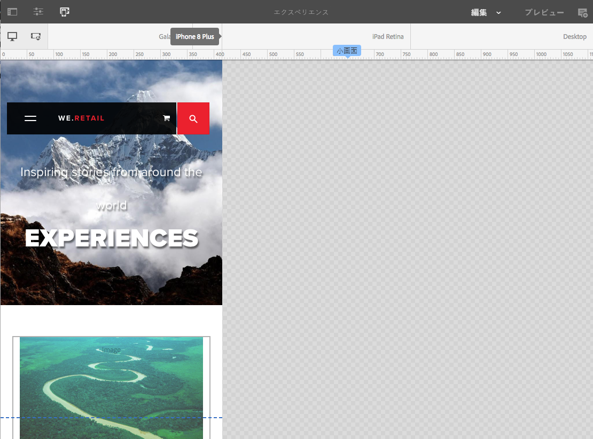

## エミュレートするデバイスの選択 {#selecting-a-device-to-emulate}

1. 必要なページを編集用に開きます。次に例を示します。

   `http://localhost:4502/editor.html/content/we-retail/us/en/experience.html`

1. 上部のツールバーから&#x200B;**エミュレーター**&#x200B;アイコンを選択します。

   

1. エミュレーターツールバーが開きます。

   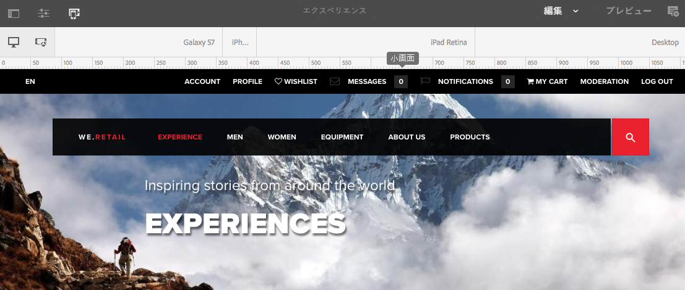

   エミュレーターツールバーに追加のレイアウトオプションが表示されます。

   * **デバイスを回転** - 垂直方向（縦）から水平方向（横）に（またはその逆に）デバイスを回転できます。
    

   * **デバイスを選択** - エミュレートする特定のデバイスをリストから定義します（詳しくは次のステップを参照）。
   

1. エミュレートするデバイスを選択するには、次のどちらかの方法を使用できます。

   * デバイスを選択アイコンを使用して、ドロップダウンセレクターから選択します。
   * エミュレーターツールバーのデバイスのインジケーターをタップまたはクリックする。
   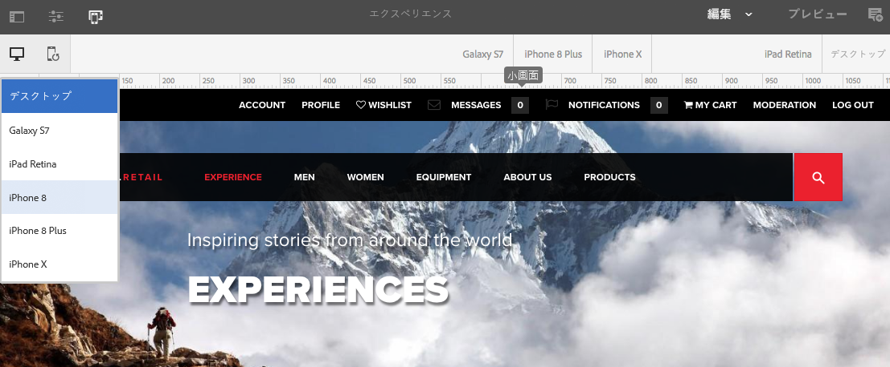

1. 特定のデバイスを選択すると、次のことができます。

   * See the active marker for the selected device, such as **iPad.**
   * See the active marker for the appropriate [breakpoint](/help/sites-authoring/responsive-layout.md#layout-definitions-device-emulation-and-breakpoints) such as **Tablet.**
   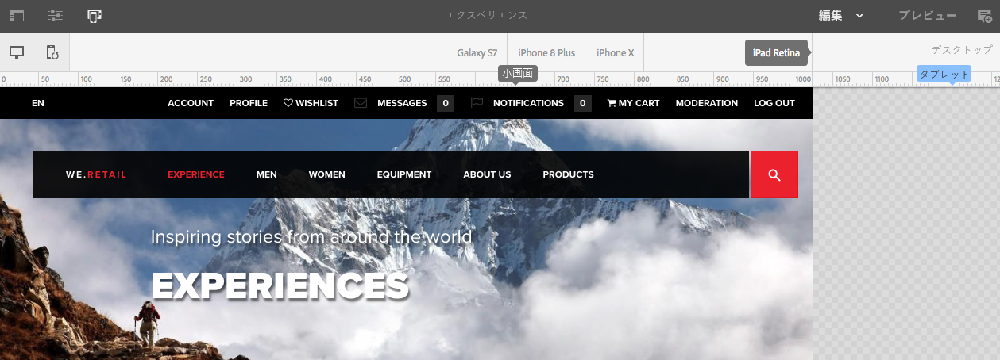

   * 青い点線は、選択したデバイスの&#x200B;*フォールド*&#x200B;を表します（ここでは **iPhone 6**）。
   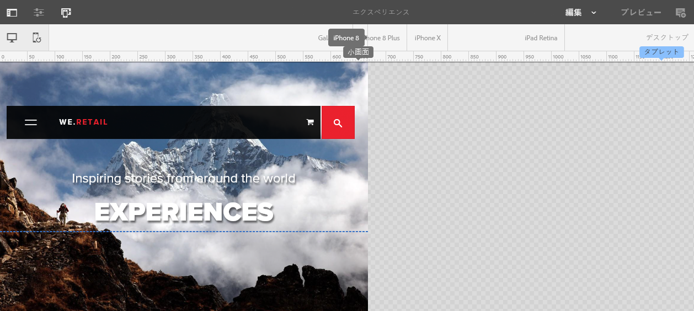

   * フォールドは、コンテンツのページの改行と見なすこともできます（[ブレークポイント](/help/sites-authoring/responsive-layout.md#layout-definitions-device-emulation-and-breakpoints)と混同しないでください）。これは、デバイスでスクロールする前にユーザーに表示されるコンテンツの部分を確認するために表示されます。
   * エミュレートしているデバイスの高さが画面サイズより高い場合、フォールドの線は表示されません。
   * フォールドは、作成者の利便性のために表示されます。公開されたページには表示されません。

## Adding a Layout Container and its Content (Edit mode) {#adding-a-layout-container-and-its-content-edit-mode}

**レイアウトコンテナ**&#x200B;は、次の特徴を持つ段落システムです。

* 他のコンポーネントを含む。
* レイアウトを定義する。
* 変更に応答する。

>[!NOTE]
>
>まだ使用可能になっていない場合は、**レイアウトコンテナ**&#x200B;を明示的に[段落システムまたはページ用にアクティベート](/help/sites-administering/configuring-responsive-layout.md)する必要があります（[**デザイン&#x200B;**モードを使用するなどの方法があります）。](/help/sites-authoring/default-components-designmode.md)

1. **レイアウトコンテナ**&#x200B;は、[コンポーネントブラウザー](/help/sites-authoring/author-environment-tools.md#components-browser)で標準コンポーネントとして使用できます。ここから、ページ上の必要な場所へドラッグできます。そうすると、「**コンポーネントをここにドラッグ**」プレースホルダーが表示されます。
1. その後、コンポーネントをレイアウトコンテナに追加できます。これらのコンポーネントには実際のコンテンツが含まれます。

   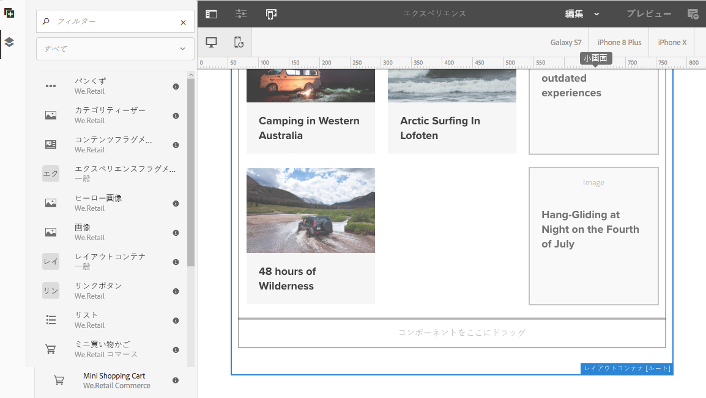

## Selecting and Taking Action on a Layout Container (Edit mode) {#selecting-and-taking-action-on-a-layout-container-edit-mode}

他のコンポーネントと同様に、レイアウトコンテナは、選択してからアクション（切り取り、コピー、削除）を実行できます（**編集**&#x200B;モードのとき）。

>[!CAUTION]
>
>レイアウトコンテナは段落システムなので、このコンポーネントを削除すると、レイアウトグリッドに加えて、そのコンテナ内にあるすべてのコンポーネント（およびそのコンテンツ）も削除されます。

1. グリッドのプレースホルダーの上にマウスを移動するか、タップすると、アクションメニューが表示されます。

   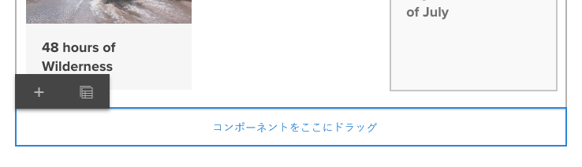

   You need to select the **Parent** option.

   

1. レイアウトコンポーネントがネストされている場合は、**親**&#x200B;オプションを選択するとドロップダウンに選択肢が表示され、ネストしたレイアウトコンテナまたはその親を選択できます。

   ドロップダウンのコンテナ名の上にマウスを移動すると、アウトラインがページに表示されます。

   * ネストの一番下のレベルのレイアウトコンテナは、黒色で描画されます。
   * ネストの次のレベルのレイアウトコンテナは、濃灰色です。
   * それ以上のコンテナは明るい灰色です。
   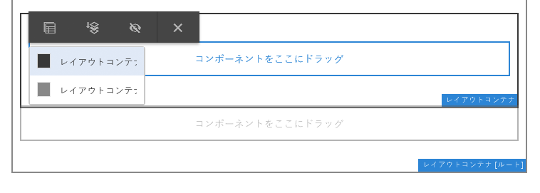

1. グリッド全体が、コンテンツも含めて強調表示されます。The action toolbar will be shown, from where you can select an action such as **Delete.**

   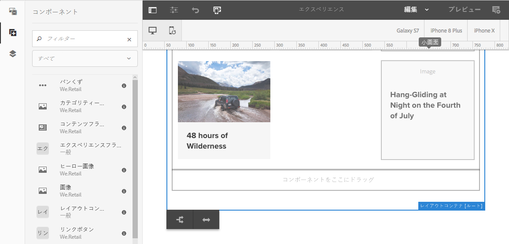

## Defining Layouts (Layout mode) {#defining-layouts-layout-mode}

>[!NOTE]
>
>[ブレークポイント](#layout-definitions-device-emulation-and-breakpoints)ごとに別々のレイアウトを定義できます（エミュレートされたデバイスのタイプと向きによって決定）。

To configure the layout of a responsive grid implemented with the Layout Container you need to use the **Layout** mode.

**レイアウト**&#x200B;モードは 2 つの方法で開始できます。

* By using the [mode menu in the toolbar](/help/sites-authoring/author-environment-tools.md#page-modes) and choosing **Layout** mode

   * Select the **Layout** mode just as you would switch to **Edit** mode or **Targeting** mode.
   * **レイアウト** モードは永続的なままで、モードセレクターを使用して別のモ **** ードを選択するまで、レイアウトモードを終了しません。

* [個別のコンポーネントを編集する](/help/sites-authoring/editing-content.md#edit-component-layout)場合。

   * コンポーネントのクイックアクションメニューの「**レイアウト**」オプションを使用すると、**レイアウト**&#x200B;モードに切り替えることができます。
   * **レイアウト**&#x200B;モードはコンポーネントを編集している間持続し、フォーカスが別のコンポーネントに移ると&#x200B;**編集**&#x200B;モードに戻ります。

レイアウトモードでは、グリッドに対して様々なアクションを実行できます。

* 青いドットを使用して、コンテンツのコンポーネントのサイズを変更します。サイズ変更は常にグリッドにスナップされます。背景のサイズを変更する際には、次のように位置揃えを補助するためのグリッドが表示されます。

   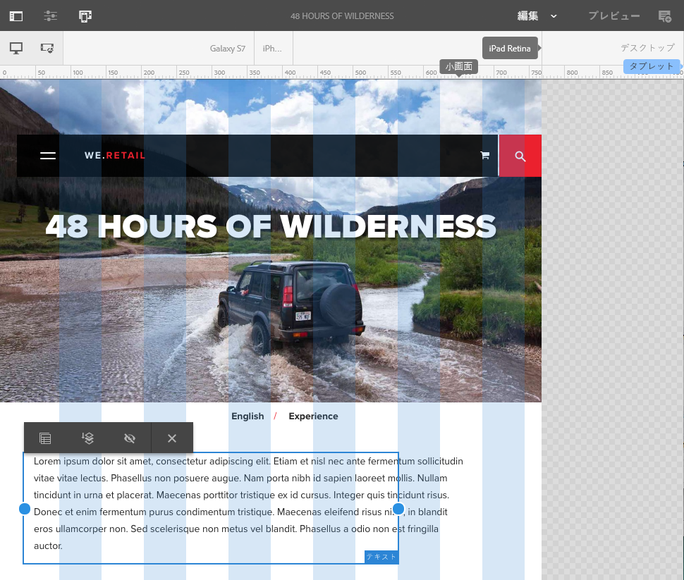

   >[!NOTE]
   >
   >コンポーネント（**画像**&#x200B;など）のサイズが変更されても、割合と比率は維持されます。

* コンテンツコンポーネントをクリックまたはタップします。ツールバーで次の操作を実行できます。

   * **親**

      レイアウトコンテナコンポーネント全体を選択して、全体に対してアクションを実行できます。

   * **新規行にフロート**

      コンポーネントは、グリッド内で使用可能なスペースに応じて、新しい線に移動します。

   * **コンポーネントを非表示**

      コンポーネントは非表示になります（レイアウトコンテナのツールバーから元に戻すことができます）。
   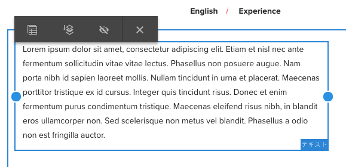

* In **Layout** mode you can tap/click on the **Drag components here** to select the entire component. そうすると、このモードのツールバーが表示されます。

   ツールバーには、レイアウトコンポーネントの状態やそれに属するコンポーネントに応じて異なるオプションが表示されます。次に例を示します。

   * **親** — 親コンポーネントを選択します。
   

   * **非表示のコンポーネントを表示** — すべてのまたは個々のコンポーネントを表示します。 数字は、現在の非表示のコンポーネントの数を示します。カウンターは、非表示のコンポーネントの数を示します。
   

   * **ブレークポイントのレイアウトを元に戻す** — デフォルトのレイアウトに戻します。つまり、カスタマイズされたレイアウトは適用されません。
   

   * **Float to new line** — 間隔が許される場合は、コンポーネントを上に移動します。
   

   * **Hide component** — 現在のコンポーネントを非表示にします。
   

   >[!NOTE]
   >
   >上記の例では、フロートと非表示のアクションが使用可能になっています。これは、このレイアウトコンテナが親レイアウトコンテナ内にネストされているからです。

   * **コンポーネントを表示**&#x200B;親コンポーネントを選択して、「**非表示のコンポーネントを表示**」オプションを含むアクションツールバーを表示します。この例では、2 つのコンポーネントが非表示にされています。
   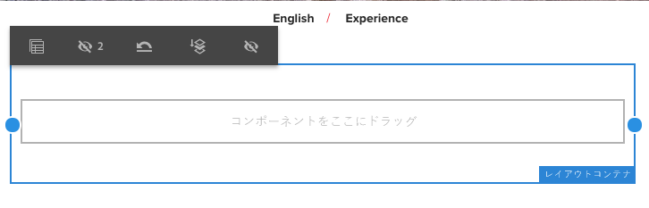

   「**非表示のコンポーネントを表示**」オプションを選択すると、現在非表示のコンポーネントが元の場所で青色で表示されます。

   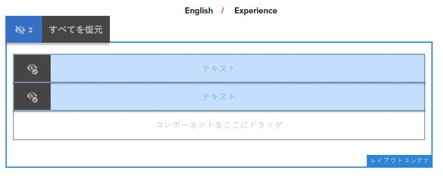

   「**すべてを復元**」を選択すると、非表示のすべてのコンポーネントが表示されます。

