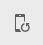

# レスポンシブレイアウト{#responsive-layout}

AEM では、**レイアウトコンテナ**&#x200B;コンポーネントを使用することで、ページのレスポンシブレイアウトを作成できます。

これにより、レスポンシブグリッド内にコンポーネントを配置できる段落システムが提供されます。このグリッドでは、デバイスやウィンドウのサイズと形式に応じてレイアウトを並べ替えることができます。[**レイアウト**&#x200B;モード](/help/sites-authoring/responsive-layout.md#defining-layouts-layout-mode)と組み合わせてこのコンポーネントを使用すると、デバイスに依存するレスポンシブレイアウトを作成および編集できます。

レイアウトコンテナには、次の特徴があります。

* グリッドに対して水平方向のスナップを提供します。また、グリッドにコンポーネントを並べて配置し、折りたたみや折り返しのタイミングを定義できます。
* 事前定義済みのブレークポイント（電話、タブレットなど）を使用して、関連するデバイスや向きで必要とされるコンテンツの動作を定義できます。

   * 例えば、コンポーネントのサイズや、特定のデバイスでコンポーネントを表示できるかどうかをカスタマイズできます。

* ネストして、列を制御できます。

次に、エミュレーターを使用して、特定のデバイス向けにコンテンツがどのようにレンダリングされるかを確認できます。

>[!CAUTION]
>
>レイアウトコンテナコンポーネントはクラシック UI で使用できますが、完全な機能はタッチ操作対応 UI でのみ使用でき、サポートされています。

AEM は、次のメカニズムを組み合わせて使用することにより、ページのレスポンシブレイアウトを実現します。

* [**レイアウトコンテナ**](#adding-a-layout-container-and-its-content-edit-mode)&#x200B;コンポーネント

  このコンポーネントは、[コンポーネントブラウザー](/help/sites-authoring/author-environment-tools.md#components-browser)で使用でき、レスポンシブグリッド内にコンポーネントを追加および配置できるグリッド段落システムを提供します。ページ上のデフォルトの段落システムとしても設定できます。

* [**レイアウトモード**](/help/sites-authoring/responsive-layout.md#defining-layouts-layout-mode)

  レイアウトコンテナをページに配置したら、**レイアウト**&#x200B;モードを使用して、レスポンシブグリッド内にコンテンツを配置できます。

* [**エミュレーター**](#selecting-a-device-to-emulate)
これにより、コンポーネントのサイズをインタラクティブに変更することで、デバイスやウィンドウのサイズに従ってレイアウトを並べ替えるレスポンシブ web サイトを作成および編集できます。ユーザーはエミュレーターを使用して、コンテンツがどのようにレンダリングされるかを確認できます。

これらのレスポンシブグリッドのメカニズムを使用すると、次のことができます。

* ブレークポイントを使用して、（デバイスのタイプと向きに関連した）デバイスの幅に基づいて異なるコンテンツレイアウトを定義する。
* これらの同じブレークポイントとコンテンツのレイアウトを使用して、デスクトップ上のブラウザーウィンドウのサイズに応じたコンテンツを作成する。
* グリッドに対して水平方向のスナップを使用し、グリッドにコンポーネントを配置し、必要に応じてサイズ変更し、横方向や上限／下限方向への折たたみや折り返しのタイミングを定義する。
* 特定のデバイスレイアウトのコンポーネントを非表示にする。
* 列の制御を実現する。

プロジェクトに応じて、レイアウトコンテナはページのデフォルトの段落システム、またはコンポーネントブラウザーを使用してページに追加できるコンポーネント（またはその両方）として使用できます。

>[!NOTE]
>
>アドビはフロントエンド開発者用にレスポンシブレイアウトの [GitHub ドキュメント](https://adobe-marketing-cloud.github.io/aem-responsivegrid/)をリファレンスとして提供しており、フロントエンド開発者は AEM の外部で AEM グリッドを使用できます（例えば、今後の AEM サイトの静的 HTML モックアップを作成する場合）。

>[!NOTE]
>
>前述のメカニズムの使用は、テンプレートでの設定によって有効になります。詳しくは、[レスポンシブレイアウトの設定](/help/sites-administering/configuring-responsive-layout.md)を参照してください。

## レイアウトの定義、デバイスのエミュレーションおよびブレークポイント {#layout-definitions-device-emulation-and-breakpoints}

Web サイトのコンテンツを作成する場合は、使用するデバイスに適した方法でコンテンツが表示されるようにする必要があります。

AEM では、デバイスの幅に応じたレイアウトを定義できます。

* エミュレーターを使用すると、これらの様々なデバイス上のレイアウトをエミュレートできます。デバイスタイプに加えて、**回転デバイス**&#x200B;オプションによって選択した方向も、幅の変更として選択されるブレークポイントに影響する場合があります。
* ブレークポイントとは、レイアウトの定義を区切るポイントのことです。

   * ブレークポイントでは、専用のレイアウトを使用するあらゆるデバイスの最大幅を（ピクセル単位で）効果的に定義します。
   * ブレークポイントは通常、デバイスのディスプレイの幅に応じて、様々なデバイスに使用できます。
   * ブレークポイントの範囲は、次のブレークポイントまで、左側に広がります。
   * ブレークポイントを具体的に選択することはできず、デバイスと向きの選択によって、適切なブレークポイントが自動的に選択されます。

**デスクトップ**&#x200B;デバイスには、特定の幅がなく、デフォルトのブレークポイントに関連します（つまり、すべてが最後に設定したブレークポイントを上回ります）。

>[!NOTE]
>
>個別のデバイスごとにブレークポイントを定義するという方法も考えられますが、そうするとレイアウトの定義とメンテナンスに必要となる作業が大幅に増加することになります。

エミュレーターを使用する場合、エミュレーションとレイアウトの定義用の特定のデバイスを選択すると、関連するブレークポイントもハイライト表示されます。レイアウトの変更は、ブレークポイントが適用される他のデバイス（アクティブなブレークポイントマーカーの左側で、次のブレークポイントマーカーの前に位置するデバイスなど）にも適用できます。

例えば、エミュレーションとレイアウトのためにデバイス「**iPhone 6 Plus**」（幅の定義は 540 ピクセル）を選択した場合、ブレークポイント「**電話**」（768 ピクセルで定義）もアクティブ化されます。**iPhone 6** へのレイアウト変更は、**電話**&#x200B;ブレークポイント下の他のデバイス（**iPhone 5**（320 ピクセルで定義）など）に適用されます。

## エミュレートするデバイスの選択 {#selecting-a-device-to-emulate}

1. 必要なページを編集用に開きます。次に例を示します。

   `http://localhost:4502/editor.html/content/we-retail/us/en/experience.html`

1. 上部のツールバーから&#x200B;**エミュレーター**&#x200B;アイコンを選択します。

   

1. エミュレーターツールバーが開きます。

   

   エミュレーターツールバーに追加のレイアウトオプションが表示されます。

   * **デバイスを回転** - 垂直方向（縦）から水平方向（横）およびその逆に、デバイスを回転できます。

      

   * **デバイスを選択** - エミュレートする具体的なデバイスをリストから定義します（詳しくは次のステップを参照してください）。

     

1. エミュレートする特定のデバイスを選択するには、次のいずれかを実行します。

   * デバイスを選択アイコンを使用して、ドロップダウンセレクターから選択する。
   * エミュレーターツールバーのデバイスのインジケーターをクリックします。

   

1. 特定のデバイスを選択すると、次のことができます。

   * 選択したデバイス（**iPad** など）のアクティブマーカーを確認する。
   * 該当する[ブレークポイント](/help/sites-authoring/responsive-layout.md#layout-definitions-device-emulation-and-breakpoints)（**タブレット**&#x200B;など）のアクティブマーカーを確認する。

   

   * 青い点線は、選択したデバイスの&#x200B;*フォールド*&#x200B;を表します（ここでは **iPhone 6**）。

   

   * 折りたたみは、コンテンツの改ページと見なすこともできます（[ブレークポイント](/help/sites-authoring/responsive-layout.md#layout-definitions-device-emulation-and-breakpoints)と混同しないように）。これは、スクロールする前にデバイス上でユーザーに表示されるコンテンツの部分を確認するのに便利です。
   * エミュレートしているデバイスの高さが画面サイズより高い場合、折りたたみの線は表示されません。
   * フォールドは、作成者の利便性のために表示されます。公開されたページには表示されません。

## レイアウトコンテナとそのコンテンツの追加（編集モード） {#adding-a-layout-container-and-its-content-edit-mode}

**レイアウトコンテナ**&#x200B;は、次の特徴を持つ段落システムです。

* 他のコンポーネントを含む。
* レイアウトを定義します。
* 変更に応答します。

>[!NOTE]
>
>まだ使用可能になっていない場合は、**レイアウトコンテナ**&#x200B;を明示的に[段落システムまたはページ用にアクティベート](/help/sites-administering/configuring-responsive-layout.md)する必要があります（[**デザイン**&#x200B;モード](/help/sites-authoring/default-components-designmode.md)を使用するなどの方法があります）。

1. **レイアウトコンテナ**&#x200B;は、[コンポーネントブラウザー](/help/sites-authoring/author-environment-tools.md#components-browser)で標準コンポーネントとして使用できます。ここから、ページ上の必要な場所へドラッグできます。そうすると、「**コンポーネントをここにドラッグ**」プレースホルダーが表示されます。
1. その後、レイアウトコンテナにコンポーネントを追加できます。これらのコンポーネントには、実際のコンテンツが格納されます。

   

## レイアウトコンテナでの選択およびアクションの実行（編集モード） {#selecting-and-taking-action-on-a-layout-container-edit-mode}

他のコンポーネントと同様に、レイアウトコンテナは、選択してからアクション（切り取り、コピー、削除）を実行できます（**編集**&#x200B;モードのとき）。

>[!CAUTION]
>
>レイアウトコンテナは段落システムです。コンポーネントを削除すると、レイアウトグリッドと、コンテナ内に保持されているすべてのコンポーネント（およびそのコンテンツ）の両方が削除されます。

1. グリッドのプレースホルダーにマウスポインターを置くか選択すると、アクションメニューが表示されます。

   

   **親**&#x200B;オプションを選択する必要があります。

   

1. レイアウトコンポーネントがネストされている場合は、「**親**」オプションを選択するとドロップダウンに選択肢が表示され、ネストされたレイアウトコンテナまたはその親を選択できます。

   ドロップダウンのコンテナ名にマウスを移動すると、そのアウトラインがページに表示されます。

   * ネストの一番下のレベルのレイアウトコンテナは、黒色で描画されます。
   * ネストの次のレベルのレイアウトコンテナは、濃い灰色で表示されます。
   * それより上のコンテナは、明るい灰色で表示されます。

   

1. グリッド全体が、コンテンツも含めて強調表示されます。アクションツールバーが表示され、ここから、「**削除**」などのアクションを選択できます。

   

## レイアウトの定義（レイアウトモード） {#defining-layouts-layout-mode}

>[!NOTE]
>
>[ブレークポイント](#layout-definitions-device-emulation-and-breakpoints)ごとに別々のレイアウトを定義できます（エミュレートされたデバイスのタイプと向きによって決定）。

レイアウトコンテナと共に実装されているレスポンシブグリッドのレイアウトを設定するには、**レイアウト**&#x200B;モードを使用する必要があります。

**レイアウト**&#x200B;モードは 2 つの方法で開始できます。

* [ツールバーのモードメニュー](/help/sites-authoring/author-environment-tools.md#page-modes)を使用して&#x200B;**レイアウト**&#x200B;モードを選択する。

   * **編集**&#x200B;モードまたは&#x200B;**ターゲット設定**&#x200B;モードに切り替える場合と同様に、**レイアウト**&#x200B;モードを選択します。
   * **レイアウト**&#x200B;モードは持続され、モードセレクターで別のモードを選択するまで、**レイアウト**&#x200B;モードのままです。

* [個別のコンポーネントを編集する](/help/sites-authoring/editing-content.md#edit-component-layout)。

   * コンポーネントのクイックアクションメニューの「**レイアウト**」オプションを使用すると、**レイアウト**&#x200B;モードに切り替えることができます。
   * コンポーネントを編集している間は&#x200B;**レイアウト**&#x200B;モードが維持され、別のコンポーネントにフォーカスが移ると&#x200B;**編集**&#x200B;モードに戻ります。

レイアウトモードでは、グリッドに対して様々なアクションを実行できます。

* 青いドットを使用して、コンテンツのコンポーネントのサイズを変更します。サイズ変更は、常にグリッドにスナップされます。背景のサイズを変更する際には、次のように位置揃えを補助するためのグリッドが表示されます。

  

  >[!NOTE]
  >
  >コンポーネント（**画像**&#x200B;など）のサイズが変更されても、割合と比率は維持されます。

* コンテンツコンポーネントをクリックします。ツールバーで次の操作を実行できます。

   * **親**

     レイアウトコンテナコンポーネント全体を選択して、全体に対してアクションを実行できます。

   * **新しい行にフロート**

     コンポーネントが、グリッド内の空きスペースに応じて、新しい行に移動します。

   * **コンポーネントを非表示**

     コンポーネントが非表示になります（レイアウトコンテナのツールバーから復元できます）。

  

* **レイアウト**&#x200B;モードでは、「**コンポーネントをここにドラッグ**」をクリックすると、コンポーネント全体を選択できます。これにより、このモードのツールバーが表示されます。

  ツールバーには、レイアウトコンポーネントの状態やそれに属するコンポーネントに応じて異なるオプションが表示されます。例：

   * **親** - 親コンポーネントを-選択します。

     

   * **非表示のコンポーネントを表示** - すべてのコンポーネントまたは個々のコンポーネントを表示します。数字は、現在非表示のコンポーネントの数を示しています。

     

   * **ブレークポイントレイアウトを元に戻す** - デフォルトのレイアウトに戻します。カスタマイズされたレイアウトが適用されなくなります。

     

   * **新しい行にフロート** - コンポーネントの位置を上に移動します（間隔がある場合）。

     

   * **コンポーネントを非表示** - 現在のコンポーネントを非表示にします。

     

     >[!NOTE]
     >
     >上記の例では、フロートと非表示のアクションが使用可能になっています。これは、このレイアウトコンテナが親レイアウトコンテナ内にネストされているからです。

   * **コンポーネントを表示**&#x200B;親コンポーネントを選択して、「**非表示のコンポーネントを表示**」オプションを含むアクションツールバーを表示します。この例では、2 つのコンポーネントが非表示になっています。

     

  「**非表示のコンポーネントを表示**」オプションを選択すると、現在非表示のコンポーネントが元の場所で青色で表示されます。

  

  「**すべてを復元**」を選択すると、非表示のすべてのコンポーネントが表示されます。
