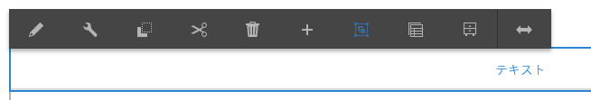
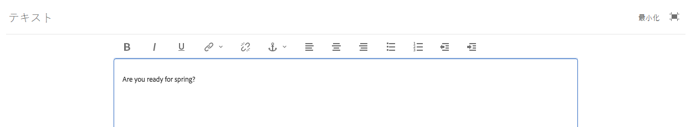

# リッチテキストエディターを使用したコンテンツのオーサリング {#use-rich-text-editor-to-author-content}

リッチテキストエディター（RTE）は、AEM にテキストコンテンツを入力するための基本的な構成要素です。様々なコンポーネントの基礎となります。、次を含みます。

* テキスト
* テキスト画像
* テーブル

## インプレース編集 {#in-place-editing}

シングルタップまたはクリックでテキストベースのコンポーネントを選択すると、あらゆるコンポーネントと同様に、[コンポーネントツールバー](/help/sites-authoring/editing-content.md#edit-configure-copy-cut-delete-paste)が表示されます。

もう一度タップ／クリックするか、最初にコンポーネントをゆっくり 2 回タップ／クリックして選択すると、独自のツールバーを持つインプレース編集が表示されます。ここで、コンテンツの編集や、基本的な書式変更ができます。

このツールバーには、次のオプションがあります。

* **フォーマット**：太字、斜体および下線を設定できます。
* **リスト**：箇条書きリストまたは番号付きリストを作成したり、インデントを設定したりすることができます。
* **ハイパーリンク**
* **リンク解除**
* **フルスクリーン**
* **閉じる**
* **保存**

## フルスクリーン編集 {#full-screen-editing}

For text-based components, tapping the full-screen mode from the toolbar  opens the rich text editor and hides the rest of the page content.

フルスクリーンモードでは、オーサリングに使用できる設定済みのすべてのオプションが表示されます。 The availability is options [depends on the configuration](/help/sites-administering/rich-text-editor.md).

その他のリッチテキストエディターオプションを次に示します。

* **アンカー**：テキストにアンカーを作成し、後でそのアンカーへのリンクや参照を設定できます。
* **テキストを左揃え**
* **テキストを中央揃え**
* **テキストを右揃え**

「最小化」アイコンをクリックして、フルスクリーンモードを閉じます。

>[!NOTE]
>
>ネストされたリストをMicrosoft WordからRTEにコピーすると、結果が一貫しなくなり、RTE内でテキストを貼り付けた後に手動で調整する必要が生じる場合があります。
