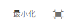

# リッチテキストエディターを使用したコンテンツのオーサリング {#use-rich-text-editor-to-author-content}

リッチテキストエディター（RTE）は、AEM にテキストコンテンツを入力するための基本的な構成要素です。以下を含む、様々なコンポーネントの基礎となります。

* テキスト
* テキスト画像
* テーブル

## インプレース編集 {#in-place-editing}

Selecting a text-based component with a single tap or click will reveal the [component toolbar](/help/sites-authoring/editing-content.md#editmovecopypastedeletetouchoptimizedui) as with any component.

もう一度タップ／クリックするか、最初にコンポーネントをゆっくり 2 回タップ／クリックして選択すると、独自のツールバーを持つインプレース編集が表示されます。ここで、コンテンツの編集や、基本的な書式変更ができます。

このツールバーには、次のオプションがあります。

* **形式**:太字、斜体、下線を設定できます。
* **リスト**:これにより、箇条書きリストや番号付きリストを作成したり、インデントを設定したりできます。
* **ハイパーリンク**
* **リンク解除**
* **フルスクリーン**
* **閉じる**
* **保存**

## フルスクリーン編集 {#full-screen-editing}

For text-based components, tapping the full screen mode from the [toolbar](#componenttoolbar)  opens the rich text editor and hides the rest of the page content.

フルスクリーンモードでは、オーサリングに使用できる設定済みのオプションがすべて表示されます。 使用可能なオプションは、 [設定によって異なります](/help/sites-administering/rich-text-editor.md)。

その他のリッチテキストエディターオプションを次に示します。

* **アンカー**:後でリンク/参照できるテキストにアンカーを作成します。
* **テキストを左揃え**
* **テキストを中央揃え**
* **テキストを右揃え**

「最小化」アイコンをクリックして、フルスクリーンモードを閉じます。

>[!NOTE]
>
>Microsoft wordからRTEにネストされたリストをコピーすると、結果が一貫せず、RTEにテキストを貼り付けた後に手動で調整する必要がある場合があります。
