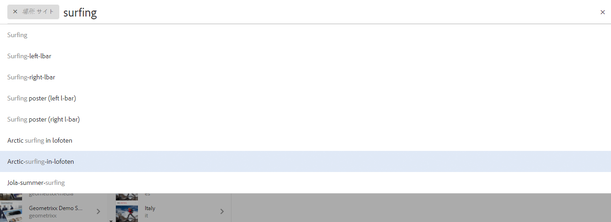
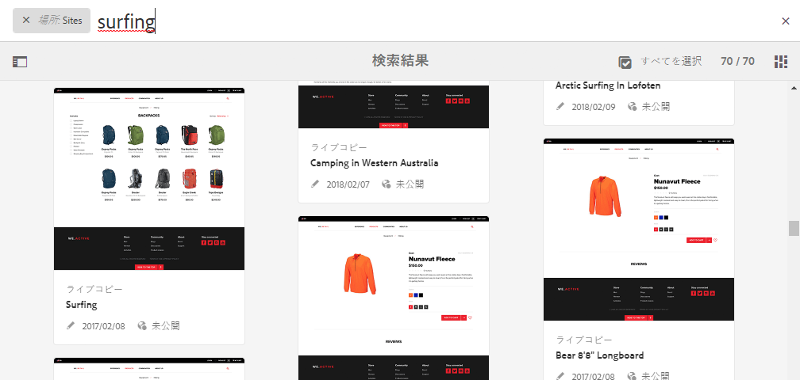
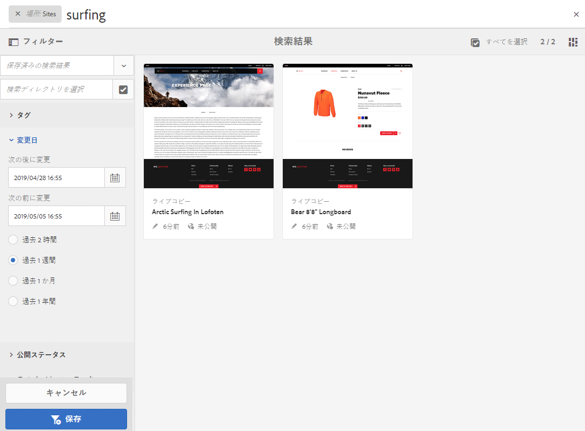
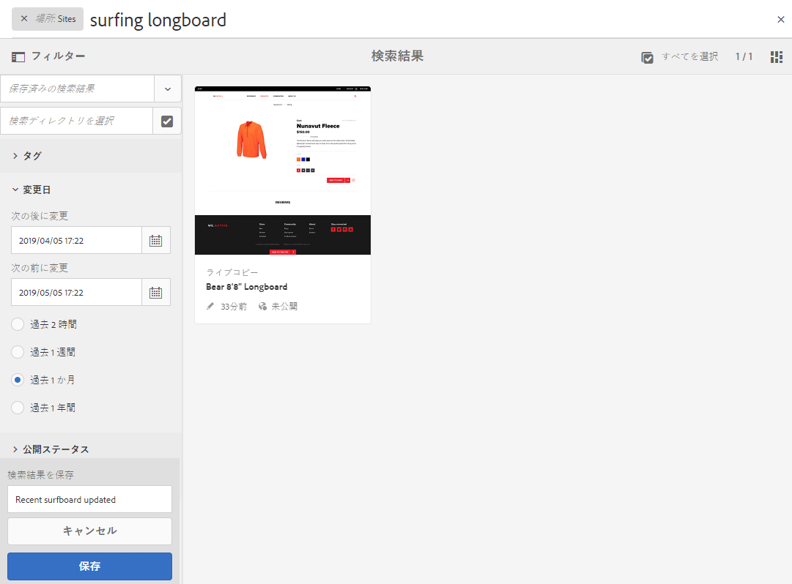
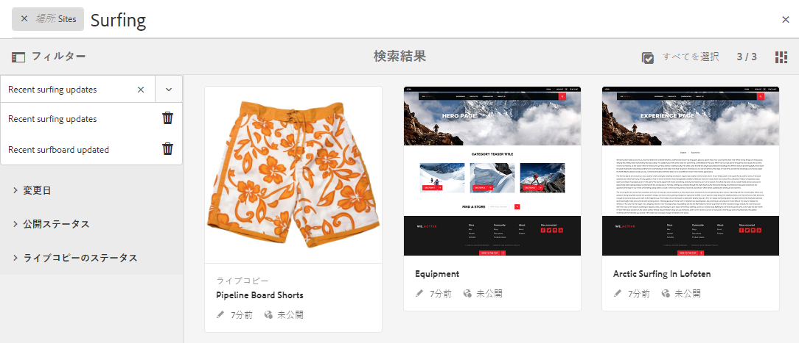
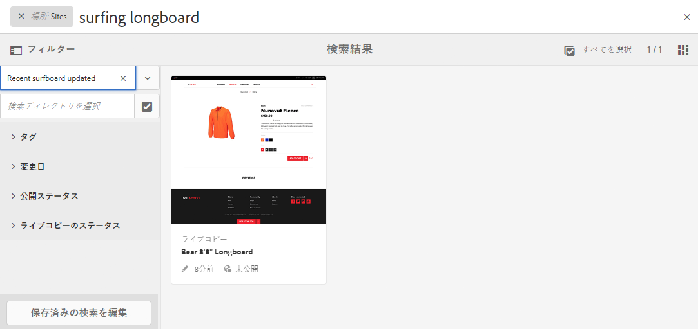

# 検索 {#searching}

AEM のオーサー環境は、リソースタイプに応じて、コンテンツを検索するための様々なメカニズムを提供します。

>[!NOTE]
>
>オーサー環境外では、[Query Builder](/help/sites-developing/querybuilder-api.md) や [CRXDE Lite](/help/sites-developing/developing-with-crxde-lite.md) など、他の検索メカニズムも使用できます。

## 検索の基本 {#search-basics}

検索は上部のツールバーから使用できます。

検索レールでは、次の操作を実行できます。

* 特定のキーワード、パス、タグを検索する。
* リソース固有の条件（変更日、ページのステータス、ファイルサイズなど）に基づいてフィルタリングします。
* 上記の条件に基づいて、[保存済みの検索結果](#saved-searches)を定義して使用する.

>[!NOTE]
>
>検索レールが表示されていれば、ホットキー `/`（スラッシュ）を使用して検索を呼び出すこともできます。

## 検索とフィルター {#search-and-filter}

リソースを検索およびフィルターするには、次のようにします。

1. （ツールバーの虫眼鏡アイコンを使用して）**検索**&#x200B;を開き、検索語を入力します。候補が表示され、その中から選択できます。

   

   デフォルトでは、検索結果は現在の場所（コンソールと関連するリソースタイプ）に限定されます。

   

1. 必要に応じて、ロケーションフィルターを削除できます (「 **X** （削除するフィルター）を使用して、すべてのコンソール/リソースタイプを検索できます。
1. 検索結果は、コンソールや関連するリソースタイプに基づいてグループ化されて表示されます。

   特定のリソースを選択してさらにアクションを実行するか、必要なリソースタイプを選択してドリルダウンできます。例： **すべてのサイトを表示**:

   

1. さらにドリルダウンするには、レール記号（左上）を選択して&#x200B;**フィルターおよびオプション**&#x200B;のサイドパネルを開きます。

   

   検索には、リソースタイプに応じて、検索／フィルター条件の定義済みの選択項目が表示されます。

   サイドパネルでは、次の要素を選択できます。

   * 保存済みの検索結果
   * 検索ディレクトリ
   * タグ
   * 検索基準（更新日、公開ステータス、LiveCopy ステータスなど）。

   >[!NOTE]
   >
   >検索条件は、次の場合に変わる可能性があります。
   >
   >
   >
   >    * 選択したリソースタイプによって。例えば、アセットとコミュニティの条件はわかりやすく細分化されています。
   >    * [検索フォーム](/help/sites-administering/search-forms.md)としてのインスタンスは（AEM 内の場所に合わせて）カスタマイズできます。
   >
   >

   

1. 検索用語を追加することもできます。

   

1. **検索**&#x200B;を閉じるには **X**（右上）を使用します。

>[!NOTE]
>
>検索結果で項目を選択すると、検索条件が保持されます。
>
>検索結果ページの項目を選択する際に、ブラウザーの戻るボタンを使用した後で検索ページに戻ると、検索条件が保持されます。

## 保存済みの検索結果 {#saved-searches}

様々なファセットで検索するだけでなく、特定の検索設定を保存して、後で取得して使用することもできます。

1. 検索条件を定義して、「**保存**」を選択します。

   

1. 名前を割り当ててから、「**保存**」を使用して確認します。

   

1. 保存済みの検索は、次回検索パネルにアクセスするときにセレクターで選択できます。

   

1. 保存すると、次の操作を実行できます。

   * （保存済みの検索結果の名前に対して）**x** を使用して、新しいクエリを開始する（保存済みの検索結果自体は削除されません）。
   * **保存済みの検索を編集**&#x200B;し、検索条件を変更して、もう一度&#x200B;**保存**&#x200B;する。

保存済みの検索結果を変更するには、保存済みの検索結果を選択して、検索パネルの下部にある「**保存済みの検索を編集**」をクリックします。

